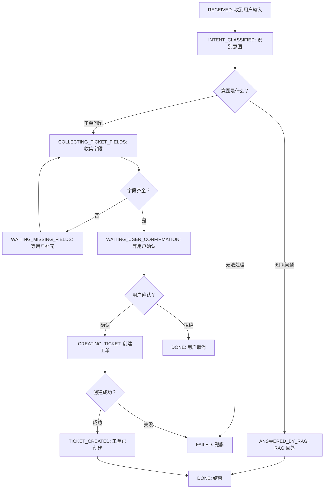

# 阶段 5 第 3 节：Agent 流程和状态机基础

## 本节定位

前两节我们已经建立了两个基础判断：

```text
第 1 节：LangGraph 是什么，为什么现在才学
第 2 节：普通函数 / LangChain / LangGraph 分别负责什么
```

这一节继续往下走，但仍然先不急着写 LangGraph 代码。

原因很简单：

```text
LangGraph 的代码形式是 StateGraph、node、edge、conditional edge。
LangGraph 的思想基础是“流程”和“状态机”。
```

如果不懂状态机，后面看到这些东西时容易变成背 API：

```text
State
node
edge
conditional edge
START
END
checkpoint
interrupt
thread_id
```

如果懂了状态机，你会发现这些概念其实是在描述同一件事：

```text
一个 Agent 当前处于什么状态？
它收到什么输入或事件？
它下一步应该去哪里？
它执行完之后状态怎么变化？
它什么时候结束？
它什么时候暂停等待用户？
```

本节的核心目标是：

```text
把 Agent 看成一个会在多个状态之间流转的业务流程。
```

## 本节学习目标

学完这一节，你应该能做到：

1. 解释什么是流程。
2. 解释什么是状态。
3. 解释什么是状态机。
4. 解释状态、事件、转移、动作、初始状态、终止状态分别是什么。
5. 解释为什么多轮 Agent 不是普通一问一答。
6. 解释为什么 HTTP 请求本身是无状态的，但 Agent 业务是有状态的。
7. 解释智能工单 Agent 里可能有哪些业务状态。
8. 解释“图的位置”和“业务状态字段”的区别。
9. 能画出智能工单 Agent 的基础状态流转。
10. 能说明状态机为什么能减少大函数、大 prompt 和混乱 if/else。
11. 能理解 LangGraph 后面为什么会用 StateGraph 表达 Agent 流程。

## 本节先不学什么

为了把基础打稳，本节暂时不做这些事：

1. 不安装 `langgraph`。
2. 不新增 `projects/ai-service` 的运行时代码。
3. 不实现 `StateGraph` 最小图。
4. 不讲 reducer 的具体写法。
5. 不讲 `MessagesState` 的具体实现。
6. 不讲 checkpoint 的存储实现。
7. 不讲 `interrupt()` 代码细节。
8. 不调用真实模型。
9. 不启动 Qdrant 或 Milvus。

这些内容后面都会按阶段推进。

本节只解决一个底层问题：

```text
Agent 流程为什么适合用状态机思维来理解？
```

## 一、基础知识铺垫

### 1. 先从最普通的流程说起

流程就是一件事由多个步骤组成。

例如你去买一杯饮料：

```text
选择饮料
-> 付款
-> 等待制作
-> 取饮料
-> 完成
```

写程序也是一样。

一个订单查询流程可能是：

```text
接收订单号
-> 校验订单号
-> 调用订单接口
-> 解析接口结果
-> 返回给用户
```

一个 RAG 问答流程可能是：

```text
接收问题
-> 检索知识库
-> 过滤低相关结果
-> 组织上下文
-> 调用模型回答
-> 返回引用来源
```

一个智能工单流程会更复杂：

```text
接收用户问题
-> 判断意图
-> 如果能知识库回答，就 RAG 回答
-> 如果需要工单，就提取工单字段
-> 如果字段缺失，就追问用户
-> 如果字段齐全，就请求用户确认
-> 用户确认后，调用 Java mock 创建工单
-> 返回工单结果
```

你会发现：

```text
流程越长，越需要知道“现在走到哪一步了”。
```

这就是状态出现的原因。

### 2. 什么是状态

状态就是某个对象、流程或系统在某个时刻的情况。

状态不是一个神秘概念。

生活里到处都是状态：

```text
订单状态：待支付、已支付、已发货、已完成、已取消
工单状态：待补充、待确认、处理中、已创建、已关闭
登录状态：未登录、已登录、登录过期
支付状态：未支付、支付中、支付成功、支付失败
```

程序里也一样。

例如一个工单流程可能有这些状态：

```text
用户刚发来问题
已经识别出意图
正在收集工单字段
等待用户确认
正在创建工单
工单创建成功
流程失败
```

状态回答的是：

```text
当前流程处于什么阶段？
现在已经知道了什么？
下一步能做什么？
哪些动作还不能做？
```

### 3. 状态和数据有什么区别

状态一定是数据，但不是所有数据都值得叫“状态”。

普通数据可能只是临时变量：

```python
tmp = message.strip()
```

状态通常是会影响后续流程的数据：

```text
intent = "create_ticket"
missing_fields = ["priority"]
confirmation_status = "waiting"
ticket_id = "T-1001"
```

判断一个数据是否应该成为状态，可以问自己：

```text
后面的步骤还需要它吗？
用户下一轮回复时还需要它吗？
出错恢复时还需要它吗？
测试时需要构造它来覆盖某个分支吗？
日志排查时需要看到它吗？
```

如果答案是“需要”，它就很可能应该进入 state。

如果它只是某个节点内部临时计算出来的文本，就不一定要存。

### 4. 什么是状态机

状态机可以先这样理解：

```text
状态机 = 一套规则，用来描述系统如何在不同状态之间切换。
```

它包含几个核心元素：

```text
状态：当前处于哪里
事件：发生了什么输入或触发
转移：从一个状态切到另一个状态
动作：转移过程中要执行什么事情
初始状态：流程从哪里开始
终止状态：流程在哪里结束
```

例如一个最简单的登录状态机：

```text
未登录
  -- 输入正确账号密码 -->
已登录

已登录
  -- 点击退出 -->
未登录

已登录
  -- token 过期 -->
登录过期

登录过期
  -- 重新登录成功 -->
已登录
```

你可以看到，状态机关注的不是单个函数怎么写，而是：

```text
什么情况下从 A 进入 B？
什么情况下不能进入 B？
进入 B 时要做什么？
什么时候结束？
```

这和 Agent 流程非常像。

### 5. 状态机的五个核心概念

#### 状态

状态表示当前阶段。

例如：

```text
WAITING_USER_INPUT
INTENT_CLASSIFIED
COLLECTING_TICKET_FIELDS
WAITING_USER_CONFIRMATION
CREATING_TICKET
DONE
FAILED
```

状态不是随便取名。

一个好状态名应该能回答：

```text
流程现在正在等什么？
下一步允许做什么？
```

#### 事件

事件表示发生了什么。

例如：

```text
用户发送消息
模型识别出意图
RAG 找到答案
字段缺失
字段齐全
用户确认
用户拒绝
Java API 调用成功
Java API 调用失败
```

事件会触发状态变化。

#### 转移

转移表示从一个状态进入另一个状态。

例如：

```text
COLLECTING_TICKET_FIELDS
  -- 字段齐全 -->
WAITING_USER_CONFIRMATION
```

或者：

```text
WAITING_USER_CONFIRMATION
  -- 用户确认 -->
CREATING_TICKET
```

#### 动作

动作是在某个状态或转移中执行的事情。

例如：

```text
调用模型识别意图
调用 RAG 检索
调用 Java API 创建工单
生成追问话术
记录日志
返回用户响应
```

动作可能是纯计算，也可能是外部副作用。

其中“创建工单”这种写操作尤其需要谨慎。

#### 初始状态和终止状态

初始状态是流程开始的地方。

终止状态是流程结束的地方。

在 LangGraph 里，后面我们会看到两个特殊标记：

```text
START
END
```

它们不是业务状态，而是图执行的入口和出口。

### 6. 什么是 guard condition

guard condition 可以理解为“守卫条件”。

它决定某个状态转移能不能发生。

例如：

```text
只有用户确认后，才能创建工单。
```

这句话就可以变成守卫条件：

```text
confirmation_status == "confirmed"
```

再例如：

```text
只有字段齐全，才能进入确认。
```

守卫条件就是：

```text
missing_fields 为空
```

守卫条件很重要。

因为它让业务安全边界从“靠模型自觉”变成“由代码判断”。

在智能工单 Agent 里，守卫条件会保护这些事情：

```text
没订单号不能查订单
字段不齐不能确认
用户未确认不能创建工单
权限不足不能执行敏感动作
低相关 RAG 结果不能强答
```

### 7. 什么是副作用

副作用是指程序影响了外部世界。

例如：

```text
写数据库
创建工单
发送邮件
扣库存
退款
调用第三方 API 修改数据
```

副作用和普通计算不同。

普通计算可以重复执行很多次：

```text
把字符串转小写
校验字段是否为空
计算列表长度
```

但副作用不能随便重复。

例如：

```text
创建工单执行两次，可能真的创建两个工单。
退款执行两次，可能真的退两次钱。
```

所以在 Agent 流程里，副作用节点要特别清楚：

```text
什么时候执行？
执行前是否确认？
失败后是否重试？
重复执行如何避免？
是否需要幂等键？
日志如何记录？
```

这也是我们之前学“用户确认机制”和“幂等性”的原因。

### 8. 什么是确定性转移

确定性转移就是根据明确规则决定下一步。

例如：

```python
if missing_fields:
    next_step = "ask_missing_fields"
else:
    next_step = "ask_confirmation"
```

这个转移不需要模型。

因为字段是否缺失是明确规则。

确定性转移适合交给代码。

### 9. 什么是模型参与的转移

有些转移需要模型参与理解。

例如用户说：

```text
这个订单怎么还没动静？
```

代码很难只靠固定关键词判断它到底是：

```text
查订单
催发货
投诉
创建工单
```

这时可以让模型做意图识别。

但注意：

```text
模型可以参与判断。
最终能不能执行敏感动作，仍然要由代码守卫。
```

这就是受控 Agent 的思想。

### 10. 为什么多轮对话一定涉及状态

单轮对话像这样：

```text
用户：订单 1001 发货了吗？
AI：订单 1001 还未发货。
```

这很简单。

多轮对话会变成：

```text
用户：订单 1001 一直没发货，帮我处理一下。
AI：我可以帮你创建工单，请确认是否创建？
用户：确认。
AI：已创建工单 T-2026-001。
```

第二轮用户只说了：

```text
确认
```

如果系统没有保存状态，就不知道用户确认的是什么。

它需要记得：

```text
上一次要创建的是哪个工单？
字段是什么？
当前停在等待确认状态吗？
用户确认后下一步是 create_ticket 吗？
```

所以多轮 Agent 不是简单的一问一答。

它是一个跨多次请求持续推进的状态流程。

### 11. HTTP 是无状态的，Agent 是有状态的

这是后面做 FastAPI + LangGraph 时必须理解的基础。

HTTP 请求本身是无状态的。

意思是：

```text
每次请求从协议层看都是独立的。
```

例如：

```text
POST /agent/chat
body: {"message": "订单 1001 没发货"}
```

下一次请求：

```text
POST /agent/chat
body: {"message": "确认"}
```

HTTP 协议本身不会自动知道这两次请求属于同一个流程。

所以我们需要额外机制把它们关联起来：

```text
conversation_id
session_id
thread_id
user_id
trace_id
checkpoint
```

在 LangGraph 里，后面我们会重点学 `thread_id` 和 checkpoint。

先记住一句话：

```text
HTTP 每次请求是独立的，但 Agent 业务流程需要跨请求保存状态。
```

### 12. 为什么不能只靠聊天历史

有人可能会想：

```text
多轮对话我把历史 messages 都传给模型不就行了吗？
```

聊天历史确实有用，但它不等于可靠状态。

例如历史里可能有：

```text
AI：请确认是否创建工单，标题是“订单未发货”。
用户：确认。
```

模型也许能理解。

但业务系统不能只靠模型重新读聊天历史来决定是否创建工单。

更可靠的状态应该是结构化的：

```json
{
  "current_status": "waiting_user_confirmation",
  "ticket_fields": {
    "title": "订单未发货",
    "description": "订单 1001 一直未发货",
    "priority": "normal"
  },
  "confirmation_status": "waiting"
}
```

这样代码可以明确判断：

```text
当前确实处于等待确认状态。
用户本轮表达了确认。
字段已经齐全。
所以可以进入 create_ticket。
```

聊天历史适合给模型理解上下文。

结构化 state 适合给系统做可靠控制。

### 13. 状态机为什么适合业务系统

很多业务系统本质上都是状态机。

订单系统：

```text
待支付 -> 已支付 -> 已发货 -> 已完成
```

工单系统：

```text
待受理 -> 处理中 -> 待用户补充 -> 已解决 -> 已关闭
```

审批系统：

```text
草稿 -> 已提交 -> 待审批 -> 已通过 / 已驳回
```

Agent 系统也是一样。

只不过 Agent 里多了模型参与：

```text
模型理解用户输入
模型提取字段
模型生成自然语言回答
模型可能建议下一步
```

但业务流程本身仍然需要状态机来约束。

### 14. 状态机解决什么问题

状态机主要解决这些问题：

```text
流程现在在哪里
下一步能去哪
什么条件下能转移
哪些状态是终态
哪些动作会产生副作用
失败后怎么兜底
用户下一轮输入接到哪里
测试要覆盖哪些路径
```

如果没有状态机思维，代码很容易变成：

```text
一个巨大 if/else
一个巨大 prompt
一堆布尔变量
一堆散落的临时字段
```

状态机能把这些东西整理成清晰的结构。

## 二、本节主题系统讲解

### 1. Agent 为什么不是普通函数调用

普通函数调用通常是一次性的：

```text
输入 -> 处理 -> 输出
```

例如：

```python
def add(a: int, b: int) -> int:
    return a + b
```

Agent 流程更像：

```text
输入
-> 判断当前状态
-> 执行某个节点
-> 更新状态
-> 判断下一步
-> 可能调用工具
-> 可能追问用户
-> 可能暂停
-> 下一轮继续
-> 最终结束
```

也就是说，Agent 不只是函数。

Agent 更像一个正在办理业务的人：

```text
他知道当前办到哪一步。
他知道还缺什么材料。
他知道什么动作需要确认。
他知道什么时候可以结束。
```

这就是状态机视角。

### 2. Agent 流程的三个层次

可以把 Agent 流程拆成三层：

```text
业务状态层：当前业务处于什么阶段
执行节点层：当前要执行哪个动作
数据状态层：当前已经收集了哪些信息
```

例如智能工单 Agent：

```text
业务状态层：
  waiting_user_message
  classifying_intent
  collecting_ticket_fields
  waiting_user_confirmation
  creating_ticket
  done

执行节点层：
  classify_intent
  rag_answer
  extract_ticket_fields
  ask_missing_fields
  ask_user_confirmation
  create_ticket

数据状态层：
  message
  intent
  ticket_fields
  missing_fields
  confirmation_status
  ticket_id
```

这三层不是完全分开的文件或代码。

它们是你理解 Agent 的三个角度。

后面在 LangGraph 里：

```text
业务状态和数据状态会放进 State。
执行节点会变成 node。
节点之间的流转会变成 edge / conditional edge。
```

### 3. 智能工单 Agent 的基础状态

为了先建立直觉，我们可以设计一组基础业务状态。

```text
RECEIVED
INTENT_CLASSIFIED
ANSWERED_BY_RAG
COLLECTING_TICKET_FIELDS
WAITING_MISSING_FIELDS
WAITING_USER_CONFIRMATION
CREATING_TICKET
TICKET_CREATED
DONE
FAILED
```

这些名字不是最终代码。

本节先用它们帮助理解。

每个状态代表的含义：

| 状态 | 含义 | 下一步可能是什么 |
| --- | --- | --- |
| RECEIVED | 收到用户输入 | 识别意图 |
| INTENT_CLASSIFIED | 已识别用户意图 | 路由到 RAG、工单或兜底 |
| ANSWERED_BY_RAG | 已生成知识库回答 | 结束 |
| COLLECTING_TICKET_FIELDS | 正在收集工单字段 | 检查字段是否齐全 |
| WAITING_MISSING_FIELDS | 等用户补充字段 | 下一轮继续提取 |
| WAITING_USER_CONFIRMATION | 等用户确认创建工单 | 确认后创建，拒绝则结束 |
| CREATING_TICKET | 正在调用 Java mock 创建工单 | 成功或失败 |
| TICKET_CREATED | 工单已创建 | 返回结果并结束 |
| DONE | 流程正常结束 | 无 |
| FAILED | 流程失败或兜底 | 无或人工处理 |

### 4. 智能工单 Agent 的状态流转图

可以先用一张图理解：



这张图表达的是业务流程。

后面用 LangGraph 时，我们不会照搬这些名字一比一写成代码。

但这张图能帮你理解：

```text
Agent 不是一个回答函数。
Agent 是一条可分支、可暂停、可恢复的状态流转链路。
```

### 5. 状态机表比流程图更适合做开发

流程图适合理解。

真正开发和测试时，状态机表更实用。

例如：

| 当前状态 | 事件 / 条件 | 动作 | 下一个状态 |
| --- | --- | --- | --- |
| RECEIVED | 收到用户消息 | 调用意图识别 | INTENT_CLASSIFIED |
| INTENT_CLASSIFIED | intent = faq_question | 调用 RAG 回答 | ANSWERED_BY_RAG |
| INTENT_CLASSIFIED | intent = create_ticket | 提取工单字段 | COLLECTING_TICKET_FIELDS |
| COLLECTING_TICKET_FIELDS | missing_fields 不为空 | 生成追问 | WAITING_MISSING_FIELDS |
| COLLECTING_TICKET_FIELDS | missing_fields 为空 | 生成确认文本 | WAITING_USER_CONFIRMATION |
| WAITING_USER_CONFIRMATION | 用户确认 | 调用 Java API | CREATING_TICKET |
| WAITING_USER_CONFIRMATION | 用户拒绝 | 返回取消说明 | DONE |
| CREATING_TICKET | Java API 成功 | 保存 ticket_id | TICKET_CREATED |
| CREATING_TICKET | Java API 失败 | 记录错误并兜底 | FAILED |

状态机表有三个好处：

1. 能帮助你发现漏掉的分支。
2. 能帮助你写测试用例。
3. 能帮助你跟别人解释系统为什么可靠。

### 6. LangGraph 里的“图位置”和“业务状态字段”

这是一个很重要但容易混淆的点。

在 LangGraph 里，流程当前走到哪个 node，运行时本身是知道的。

例如：

```text
当前正在执行 extract_ticket_fields 节点
下一步可能是 ask_missing_fields 或 ask_user_confirmation
```

这叫图执行位置。

但我们仍然可能在 state 里保存一个业务状态字段：

```text
current_status = "waiting_user_confirmation"
```

这叫业务状态。

两者不完全一样。

图执行位置更偏技术运行时：

```text
当前图运行到了哪个节点。
```

业务状态更偏业务表达：

```text
这个客服流程现在正在等用户确认。
```

为什么业务状态仍然有用？

因为它可以：

```text
给前端展示
给日志和排查使用
给测试断言使用
给业务人员理解
在流程恢复时辅助判断
```

后面我们写代码时，不会一开始就乱加很多 status。

但你要先知道这两个层次：

```text
LangGraph runtime 知道节点位置。
业务 state 可以记录业务状态。
```

### 7. 状态字段应该怎么设计

一个 Agent state 不是把所有东西都塞进去。

状态字段应该围绕后续流程需要来设计。

智能工单 Agent 可能需要：

```text
user_message：用户本轮消息
messages：多轮对话消息
intent：用户意图
rag_answer：RAG 回答
retrieved_sources：检索来源
ticket_fields：已提取的工单字段
missing_fields：缺失字段
confirmation_status：确认状态
ticket_id：创建成功后的工单 ID
error：错误信息
trace_id：请求追踪 ID
```

不应该随便存：

```text
完整 prompt 字符串
可以随时重新计算的格式化文本
临时变量
无后续用途的中间字符串
重复表达同一件事的多个字段
```

官方文档里也强调过类似原则：

```text
state 里尽量存原始数据，不要存已经格式化好的 prompt。
```

原因是：

```text
同一份原始数据可以给不同节点用不同方式格式化。
prompt 改了，不应该破坏 state schema。
调试时看原始数据更清楚。
```

### 8. 状态机里哪些动作适合做 node

不是每一个小函数都要变成 node。

通常适合变成 node 的动作有这些：

```text
需要单独观察的动作
可能失败并需要单独处理的动作
需要调用模型的动作
需要调用外部服务的动作
会决定下一步路由的动作
会产生重要业务状态变化的动作
可能暂停等待用户的动作
```

例如：

```text
classify_intent：适合做节点，因为模型判断会影响路由
rag_answer：适合做节点，因为它调用 RAG 并生成最终回答
extract_ticket_fields：适合做节点，因为它调用模型结构化输出
ask_user_confirmation：适合做节点，因为它是人工确认边界
create_ticket：适合做节点，因为它调用 Java API，有副作用
```

不一定适合做节点的动作：

```text
字符串 strip
字段名映射
一个小的 bool 判断
把错误对象转成错误码
简单格式化日期
```

这些更适合留在普通函数或 service 里。

### 9. 状态机里最危险的是写操作

在智能工单 Agent 里，最需要谨慎的是：

```text
create_ticket
```

因为它不是单纯查询。

它会改变业务系统。

所以它应该满足这些条件后才能执行：

```text
意图确认为创建工单
字段已经齐全
用户已经明确确认
权限允许
幂等信息可用
trace_id 已记录
```

状态机可以把这些条件表达清楚：

```text
只有 WAITING_USER_CONFIRMATION 收到 confirmed 事件后，才允许进入 CREATING_TICKET。
```

这比写一句 prompt 靠模型记住要可靠得多。

### 10. 状态机让测试更清楚

没有状态机时，测试可能只能写成：

```text
输入一句话，看最终输出像不像。
```

这种测试太粗。

有状态机后，可以测得更清楚：

```text
给定 state.intent = "create_ticket"
给定 ticket_fields 缺 priority
执行 check_missing_fields
应该进入 ask_missing_fields
```

或者：

```text
给定 current_status = "waiting_user_confirmation"
给定用户回复“确认”
执行 route_confirmation
应该进入 create_ticket
```

状态机把测试从“猜最终回答”变成“验证流程转移”。

这对 Agent 工程非常重要。

### 11. 状态机让日志和排查更清楚

线上出问题时，如果只看最终回答，你可能不知道问题在哪：

```text
用户说没处理成功。
```

但如果有状态机日志，你能看到：

```text
trace_id=abc
node=classify_intent
intent=create_ticket

node=extract_ticket_fields
missing_fields=[]

node=ask_user_confirmation
confirmation_status=waiting

node=create_ticket
java_status=500
next=FAILED
```

这样你就知道：

```text
不是意图识别失败。
不是字段提取失败。
不是用户没确认。
是 Java API 创建工单失败。
```

这就是可观察性。

### 12. 状态机不是让系统变复杂，而是暴露真实复杂度

初学时你可能会觉得：

```text
状态机是不是把简单事情复杂化了？
```

如果只是一个简单接口，确实没必要。

但智能工单 Agent 本来就复杂。

状态机没有制造复杂度。

它只是把隐藏的复杂度显式表达出来。

隐藏复杂度长这样：

```text
一个大函数
十几个 if/else
一堆历史消息
一堆隐含规则
一堆 prompt 约束
```

显式复杂度长这样：

```text
状态有哪些
节点有哪些
转移条件是什么
终止状态是什么
副作用在哪里
错误怎么处理
```

对工程项目来说，显式复杂度更容易维护。

## 三、LangGraph 和状态机的关系

### 1. LangGraph 为什么叫 Graph

LangGraph 用图来表达流程：

```text
node：一个处理步骤
edge：步骤之间的连接
conditional edge：根据状态选择下一步
state：节点共享的数据
START：入口
END：出口
```

状态机也在表达类似东西：

```text
状态
事件
转移
动作
开始
结束
```

它们不是完全同一个概念，但非常契合。

可以这样对应：

| 状态机概念 | LangGraph 概念 | 说明 |
| --- | --- | --- |
| 状态数据 | State | Agent 运行过程中的共享数据 |
| 动作 | node | 节点执行某个动作并返回 state 更新 |
| 固定转移 | edge | A 执行完固定进入 B |
| 条件转移 | conditional edge / Command | 根据 state 决定下一步 |
| 初始状态 | START + 初始输入 | 图从 START 进入第一个节点 |
| 终止状态 | END | 图执行结束 |
| 暂停等待 | interrupt + checkpoint | 后续课程学习 |

### 2. LangGraph 的 node 是什么

后面会细讲 node。

现在先建立直觉：

```text
node 是一个函数。
它读取当前 state。
它做一件明确的事。
它返回对 state 的更新。
```

伪代码：

```python
def classify_intent(state):
    intent = call_model_to_classify(state["user_message"])
    return {"intent": intent}
```

注意：

```text
node 返回的是 state 的更新，不是随便 return 一个最终答案。
```

这点很关键。

因为 LangGraph 的流程是：

```text
每个节点都推动 state 往前变化。
图根据 state 决定下一步。
```

### 3. LangGraph 的 edge 是什么

edge 是节点之间的连接。

固定 edge 表示：

```text
A 执行完，一定去 B。
```

例如：

```text
START -> classify_intent
```

这很好理解：

```text
流程一开始就先识别意图。
```

### 4. LangGraph 的 conditional edge 是什么

conditional edge 是条件边。

它表示：

```text
A 执行完，根据 state 决定去 B、C 还是 END。
```

例如：

```text
classify_intent 执行完后：

如果 intent = "rag_question" -> rag_answer
如果 intent = "create_ticket" -> extract_ticket_fields
如果 intent = "unknown" -> fallback
```

这就是状态机里的条件转移。

### 5. LangGraph 的 StateGraph 是什么

`StateGraph` 可以先这样理解：

```text
基于共享 state 来执行的图。
```

后面你会看到类似写法：

```python
from langgraph.graph import StateGraph

builder = StateGraph(TicketAgentState)
```

这句话的意思不是“创建一个普通对象”这么简单。

它表达的是：

```text
我要定义一个图。
这个图里的每个节点都围绕 TicketAgentState 读写数据。
```

也就是说，state schema 是图的核心约束。

### 6. LangGraph 的状态更新

LangGraph 官方文档里有一个重要规则：

```text
节点应该返回 state 更新。
```

也就是说，一个节点不要随便直接修改原来的 state 对象。

它更像是返回：

```python
return {"intent": "create_ticket"}
```

或者：

```python
return {
    "ticket_fields": {
        "title": "订单未发货",
        "description": "订单 1001 一直未发货"
    }
}
```

为什么这样设计？

因为图运行时需要知道：

```text
这个节点改变了哪些状态字段。
状态如何合并。
下一步根据什么判断。
stream 时输出哪些更新。
checkpoint 时保存什么。
```

后面学 reducer 时，你会进一步理解“状态更新如何合并”。

### 7. Agent 的循环本质

很多 Agent 都有循环。

例如工具调用 Agent：

```text
模型思考
-> 请求调用工具
-> 执行工具
-> 把工具结果给模型
-> 模型继续判断
-> 直到最终回答
```

智能工单 Agent 也可能有循环：

```text
提取字段
-> 发现缺字段
-> 追问用户
-> 用户补充
-> 再提取字段
-> 再检查
-> 字段齐全后进入确认
```

状态机能自然表达循环。

但循环必须有退出条件。

否则会变成无限循环。

后面 LangGraph 里还会涉及 recursion limit，用来防止图无限执行。

本节先记住：

```text
Agent 可以循环，但循环必须受状态和条件控制。
```

### 8. Agent 的暂停和恢复

智能工单 Agent 里经常会暂停：

```text
字段缺失时，暂停等待用户补充。
创建工单前，暂停等待用户确认。
复杂问题时，暂停等待人工处理。
```

普通函数调用不擅长暂停恢复。

因为函数一返回，局部变量就没了。

LangGraph 后面会通过 checkpoint 和 interrupt 支持这类场景。

本节先不写代码，只理解思想：

```text
暂停不是结束。
暂停是流程停在某个状态，等待新的输入后继续。
```

例如：

```text
WAITING_USER_CONFIRMATION
```

这个状态不是最终结束。

它表示：

```text
流程保存好了当前工单草稿，正在等用户确认。
```

用户下一轮说“确认”后：

```text
WAITING_USER_CONFIRMATION
  -- 用户确认 -->
CREATING_TICKET
```

这就是恢复。

### 9. Agent 流程里 state 和 messages 的关系

后面我们会专门学 `MessagesState`。

这里先讲基本关系。

`messages` 是 state 的一部分。

但 state 不等于 messages。

messages 记录对话：

```text
user: 订单 1001 没发货
assistant: 我可以帮你创建工单，请确认
user: 确认
```

state 记录结构化流程信息：

```text
intent=create_ticket
ticket_fields={...}
missing_fields=[]
confirmation_status=confirmed
ticket_id=T-1001
```

两者都重要。

messages 帮模型理解对话。

结构化 state 帮代码控制流程。

不能只靠 messages，也不能完全不要 messages。

### 10. 状态机和 prompt 的关系

prompt 可以告诉模型：

```text
创建工单前必须让用户确认。
```

但状态机可以用代码保证：

```text
create_ticket 节点只能在 confirmation_status = confirmed 后进入。
```

两者的可靠性不同。

prompt 是软约束。

状态机和代码判断是硬约束。

企业业务 Agent 一定要用硬约束保护关键动作。

这也是我们后面不走“一个超级 prompt 包打天下”的原因。

### 11. 状态机和大函数的关系

不用状态机时，很容易写成这样：

```python
def handle_message(message, history):
    if "订单" in message:
        ...
    elif "退款" in message:
        ...
    elif "确认" in message:
        ...
    elif "取消" in message:
        ...
```

这种代码短期能跑。

但问题是：

```text
“确认”到底确认什么？
用户是不是处于等待确认状态？
有没有已经生成的工单草稿？
确认后是否允许创建？
```

状态机写法会先判断状态：

```text
如果当前状态是 WAITING_USER_CONFIRMATION，并且用户表达确认，才进入 create_ticket。
```

这样逻辑更清楚。

### 12. 一个成熟 Agent 应该能回答的问题

如果你设计了一个 Agent，至少应该能回答：

```text
它有哪些主要状态？
它从哪里开始？
它什么时候结束？
哪些节点会调用模型？
哪些节点会调用外部服务？
哪些节点会产生副作用？
哪些动作需要用户确认？
字段缺失时流程停在哪里？
用户下一轮输入如何接回原流程？
失败后进入哪个兜底状态？
日志里如何看到状态变化？
测试如何覆盖每条主要转移？
```

如果这些问题答不上来，说明流程还没有设计清楚。

## 四、智能工单 Agent 的初版状态机设计

### 1. 先设计业务状态，不急着写代码

后面真正写代码前，我们先有一张草图。

智能工单 Agent 的状态可以初步设计为：

```text
received
intent_classified
answer_ready
collecting_ticket_fields
waiting_missing_fields
waiting_user_confirmation
creating_ticket
ticket_created
failed
done
```

这组状态还不是最终实现。

真实代码里可能会简化。

但它们帮助我们把流程想清楚。

### 2. 再设计输入事件

可能的事件：

```text
user_message_received
intent_is_rag_question
intent_is_create_ticket
intent_is_unknown
rag_answer_generated
ticket_fields_extracted
missing_fields_found
all_fields_ready
user_confirmed
user_rejected
ticket_create_succeeded
ticket_create_failed
```

事件不一定都会写成代码里的 enum。

但在脑子里要有这个意识：

```text
状态不会自己变化，一定是某个事件或条件触发了变化。
```

### 3. 再设计动作

动作可能有：

```text
call_intent_model
call_rag_service
call_ticket_field_extractor
build_missing_field_question
build_confirmation_message
call_java_ticket_api
build_final_answer
build_fallback_answer
write_log
```

其中最重要的是区分：

```text
纯计算动作
模型动作
外部查询动作
外部写操作
用户交互动作
```

因为不同动作的风险不同。

### 4. 再设计转移规则

示例转移规则：

```text
received -> intent_classified
intent_classified + rag_question -> answer_ready
intent_classified + create_ticket -> collecting_ticket_fields
collecting_ticket_fields + missing_fields -> waiting_missing_fields
collecting_ticket_fields + no_missing_fields -> waiting_user_confirmation
waiting_user_confirmation + confirmed -> creating_ticket
waiting_user_confirmation + rejected -> done
creating_ticket + success -> ticket_created
creating_ticket + failure -> failed
ticket_created -> done
answer_ready -> done
```

转移规则就是后面 conditional edge 的思想基础。

### 5. 哪些状态需要跨请求保存

不是所有状态都需要长期保存。

但下面这些一定很重要：

```text
当前是否在等待用户补充字段
当前是否在等待用户确认
已经提取出的工单字段
缺失字段
用户确认状态
已创建的 ticket_id
trace_id 或 conversation_id
```

原因是用户下一轮可能只说：

```text
高优先级
```

或者：

```text
确认
```

如果没有上一次状态，系统无法理解这句话对应什么。

### 6. 哪些状态可以不保存

这些通常不适合长期保存：

```text
某个 prompt 的完整文本
为了展示临时拼出来的字符串
可以从 ticket_fields 重新生成的确认文案
某个函数内部的临时变量
没有后续用途的模型原始长输出
```

当然，调试日志可以记录一些原始输出。

但 state schema 不应该被这些临时东西污染。

### 7. 状态机和用户体验

状态机不是只服务后端。

它也影响用户体验。

如果系统知道当前状态，就能给用户更准确的回复：

```text
WAITING_MISSING_FIELDS：
  “还需要你补充问题优先级。”

WAITING_USER_CONFIRMATION：
  “请确认是否创建以下工单。”

CREATING_TICKET：
  “正在为你创建工单。”

FAILED：
  “工单创建失败，我已经记录错误，请稍后重试或联系人工客服。”
```

如果系统不知道状态，就只能泛泛回答：

```text
我不太明白你的意思。
```

这就是状态设计和用户体验的关系。

### 8. 状态机和权限安全

状态机还能表达安全规则。

例如：

```text
只有从 waiting_user_confirmation 才能进入 creating_ticket。
```

这意味着：

```text
用户随便说“帮我创建工单”，系统不能立即创建。
模型误判想直接调用工具，代码也不能放行。
只有字段齐全且用户确认后才进入写操作。
```

状态机让安全规则变成流程结构。

这比散落在 prompt 或多个 if 里更可靠。

### 9. 状态机和错误处理

错误也应该进入流程设计。

例如：

```text
RAG 没检索到内容 -> no_answer / fallback
模型结构化输出解析失败 -> retry 或 fallback
Java API 超时 -> retry 或 failed
Java API 404 -> failed，并告诉用户业务对象不存在
Java API 500 -> failed，并提示稍后重试
```

不同错误不能混在一起。

状态机能帮助我们区分：

```text
用户可修复错误：缺字段、信息不明确
系统可重试错误：网络超时、临时 rate limit
业务失败错误：订单不存在、权限不足
未知错误：需要开发排查
```

后面第 23 节会专门学节点错误处理和 fallback。

本节先建立意识：

```text
错误不是流程之外的东西，错误也是流程的一部分。
```

### 10. 状态机和可恢复性

可恢复性就是：

```text
流程暂停或失败后，可以从合适的位置继续。
```

例如：

```text
用户确认前关闭页面。
十分钟后回来输入“确认”。
系统仍然知道他确认的是刚才那张工单草稿。
```

这需要保存：

```text
conversation_id / thread_id
当前业务状态
工单草稿
缺失字段
确认状态
```

后面 LangGraph 的 checkpoint 会为这个能力提供基础。

但 checkpoint 不是魔法。

你必须先设计好 state。

如果 state 设计混乱，checkpoint 只会保存一份混乱状态。

### 11. 状态机和可观察性

一个好的 Agent 不只是能跑。

它还要能被观察。

你应该能看到：

```text
这次请求进入了哪个节点？
节点输入 state 是什么？
节点输出更新了什么？
下一步路由去了哪里？
是否触发了用户确认？
是否调用了外部服务？
外部服务耗时多少？
失败在哪个节点？
```

状态机能让日志更有结构。

后面第 24 节会学 LangGraph 日志、trace_id 和可观测性。

### 12. 状态机和面试表达

以后讲这个项目时，你可以这样说：

```text
我没有把智能工单写成一个大 prompt 或一个大函数，而是先把它抽象成状态机。用户请求进入后，系统先识别意图，再根据状态路由到 RAG 回答或工单流程。工单流程会收集字段、检查缺失字段、等待用户确认，确认后才进入 Java API 创建工单节点。这样可以把模型判断、业务校验、用户确认和写操作边界分开，便于测试、日志追踪和后续恢复。
```

这比只说“我用了 LangGraph”更有含金量。

## 五、本节和后续课程的关系

### 1. 第 4 节会学 State

下一节会专门学：

```text
State 是什么：Agent 为什么需要状态
```

本节已经提前铺垫了：

```text
状态不是随便存数据。
状态是影响后续流程的数据。
```

下一节会进一步把它落实到：

```text
State 里有哪些字段
TypedDict / Pydantic 怎么选
什么字段该存
什么字段不该存
```

### 2. 第 5 节会学 Reducer

当多个节点都更新 state 时，会出现问题：

```text
新值是覆盖旧值？
还是追加到列表？
还是合并字典？
```

这就是 reducer 要解决的。

本节先不展开。

### 3. 第 6 节会学 MessagesState

多轮 Agent 需要 messages。

但 messages 不是全部状态。

第 6 节会讲：

```text
messages 如何保存？
新消息如何追加？
tool message 如何进入消息列表？
为什么需要 reducer？
```

### 4. 第 7-12 节会把状态机变成 LangGraph 代码

后面会逐步实现：

```text
StateGraph 最小图
node
edge
conditional edge
START / END
graph.invoke / graph.stream
```

也就是说：

```text
本节是思想。
后面是把思想变成代码。
```

## 六、本节练习与参考答案

### 练习 1：判断状态

下面哪些更像状态，哪些只是临时数据？

```text
1. 当前意图 intent
2. 字符串 strip 后的临时结果
3. 已提取的工单字段 ticket_fields
4. 当前是否等待用户确认 confirmation_status
5. 某个节点内部拼出来的 prompt 文本
```

参考答案：

```text
1. 是状态，因为会影响后续路由。
2. 通常是临时数据，除非后续流程需要长期使用。
3. 是状态，因为后面确认和创建工单都需要。
4. 是状态，因为它决定用户下一轮“确认”是否有效。
5. 通常不应该作为 state 保存，prompt 可以在节点里按需格式化。
```

### 练习 2：给订单流程设计状态

为“查询订单并根据结果回答用户”设计 4 个状态。

参考答案：

```text
received：收到用户问题
order_id_extracted：已提取订单号
order_queried：已查询订单
done：已回答用户

如果考虑失败，还可以加：
missing_order_id
order_not_found
failed
```

### 练习 3：为什么用户说“确认”不能直接创建工单

参考答案：

```text
因为“确认”必须结合当前状态理解。只有当前流程处于 waiting_user_confirmation，并且已经有完整工单字段时，“确认”才表示同意创建这张工单。如果系统没有保存状态，直接根据“确认”创建工单是不安全的。
```

### 练习 4：写出一个状态转移

请把下面业务规则写成状态转移：

```text
如果工单字段缺失，就追问用户；如果字段齐全，就请求用户确认。
```

参考答案：

```text
COLLECTING_TICKET_FIELDS
  -- missing_fields 不为空 -->
WAITING_MISSING_FIELDS

COLLECTING_TICKET_FIELDS
  -- missing_fields 为空 -->
WAITING_USER_CONFIRMATION
```

### 练习 5：哪些动作有副作用

判断下面动作哪些有副作用：

```text
1. 校验字段是否为空
2. 调用 Java API 创建工单
3. 把字符串转小写
4. 写入数据库
5. 调用 RAG 检索知识库
```

参考答案：

```text
1. 没有副作用，是纯判断。
2. 有副作用，因为改变了业务系统。
3. 没有副作用，是纯计算。
4. 有副作用，因为改变了数据库。
5. 通常可以看作外部查询，不改变业务数据，但仍然是外部依赖；它需要超时、错误处理和日志。
```

### 练习 6：设计智能工单 Agent 的 6 个节点

参考答案：

```text
classify_intent：识别用户意图
rag_answer：知识库回答
extract_ticket_fields：提取工单字段
check_missing_fields：检查缺失字段
ask_user_confirmation：请求用户确认
create_ticket：创建工单
```

### 练习 7：为什么 state 不应该存完整 prompt

参考答案：

```text
prompt 是给模型的一种格式化输入，通常可以根据原始 state 按需生成。如果把完整 prompt 存进 state，后面 prompt 模板变更会影响状态兼容性，调试时也更难看清真实业务数据。state 应优先保存原始、结构化、后续流程需要的数据。
```

### 练习 8：把一个大函数拆成状态机

假设一个函数里有：

```text
识别意图
查询知识库
提取工单字段
请求确认
创建工单
```

请拆成状态机动作。

参考答案：

```text
状态：
received
intent_classified
answer_ready
collecting_ticket_fields
waiting_user_confirmation
creating_ticket
done

动作：
call_intent_model
call_rag_service
call_ticket_extractor
build_confirmation_message
call_java_ticket_api
build_final_response
```

### 练习 9：HTTP 无状态和 Agent 有状态有什么区别

参考答案：

```text
HTTP 每次请求从协议层看都是独立的，不会自动记住上一轮发生了什么。Agent 业务需要跨多轮保存流程状态，例如上次是否在等待确认、工单字段是什么、缺失字段是什么。因此需要 conversation_id、thread_id、checkpoint 或数据库来关联和保存状态。
```

### 练习 10：为什么状态机有助于测试

参考答案：

```text
状态机把流程拆成明确状态和转移。测试时可以构造特定 state，验证某个节点执行后是否产生正确更新、是否路由到正确下一步。这样比只看最终自然语言回答更稳定、更精确。
```

## 七、自测题与答案

### 自测 1：什么是状态机？

答案：

```text
状态机是一套描述系统如何在不同状态之间切换的规则，通常包含状态、事件、转移、动作、初始状态和终止状态。
```

### 自测 2：状态和临时变量的区别是什么？

答案：

```text
状态会影响后续流程，可能需要跨步骤、跨请求、跨恢复保存；临时变量通常只在某个函数内部使用，用完就可以丢弃。
```

### 自测 3：为什么多轮 Agent 需要状态？

答案：

```text
因为用户后续输入常常依赖前文，例如“确认”“改成高优先级”。系统必须知道上一轮流程停在哪里、已经收集了什么信息、下一步允许做什么。
```

### 自测 4：HTTP 无状态是什么意思？

答案：

```text
HTTP 请求本身彼此独立，协议不会自动记住上一轮请求的上下文。应用需要自己用 session_id、conversation_id、thread_id 或 checkpoint 保存业务状态。
```

### 自测 5：messages 能替代结构化 state 吗？

答案：

```text
不能完全替代。messages 适合给模型理解对话上下文，结构化 state 适合给代码做可靠流程控制、权限判断、确认判断和测试断言。
```

### 自测 6：什么是 guard condition？

答案：

```text
guard condition 是守卫条件，用来判断某个状态转移是否允许发生，例如 confirmation_status == "confirmed" 才能进入 create_ticket。
```

### 自测 7：什么是副作用？

答案：

```text
副作用是程序改变外部世界，例如写数据库、创建工单、退款、发送邮件、修改订单状态等。
```

### 自测 8：为什么创建工单节点需要特别谨慎？

答案：

```text
因为创建工单是写操作，会改变业务系统，重复执行可能产生重复工单。它必须受到字段校验、用户确认、权限、幂等和日志保护。
```

### 自测 9：LangGraph 里的 node 和状态机里的动作有什么关系？

答案：

```text
node 可以理解为状态机里的动作执行单元。它读取当前 state，执行一件明确的事，并返回 state 更新。
```

### 自测 10：LangGraph 里的 conditional edge 对应状态机里的什么？

答案：

```text
conditional edge 对应条件转移。它根据当前 state 或节点结果决定下一步进入哪个节点或是否结束。
```

### 自测 11：图执行位置和业务状态字段有什么区别？

答案：

```text
图执行位置是 LangGraph runtime 当前运行到哪个节点；业务状态字段是业务上当前流程处于什么阶段，例如 waiting_user_confirmation。两者相关但不是同一件事。
```

### 自测 12：为什么状态机能减少大 prompt 和大函数？

答案：

```text
状态机把流程拆成明确状态、节点和转移，关键业务规则由代码表达，不需要把所有规则都写进一个 prompt，也不需要把所有分支塞进一个巨大函数。
```

### 自测 13：本节最核心的一句话是什么？

答案：

```text
Agent 不是一次性问答函数，而是一个会根据状态、事件和条件在多个步骤之间流转的业务流程。
```

## 八、本节小结

本节没有写运行时代码，但它是后面 LangGraph 编程的地基。

你需要牢牢记住：

```text
Agent = 多步骤流程 + 状态 + 转移条件 + 动作 + 可能的暂停恢复
```

普通函数适合单个明确动作。

LangChain 适合模型、工具、结构化输出等 LLM 能力。

LangGraph 适合把这些动作和能力编排成状态化流程。

智能工单 Agent 不是简单的：

```text
用户问 -> 模型答
```

而是：

```text
用户输入
-> 意图识别
-> RAG 或工单路由
-> 字段收集
-> 缺失字段追问
-> 用户确认
-> Java API 创建工单
-> 返回结果
```

所以它必须有状态机思维。

下一节我们会进入：

```text
阶段 5 第 4 节：State 是什么：Agent 为什么需要状态
```

那一节会把本节的“状态”进一步落到 LangGraph 的 `State` 设计上。

## 参考资料

- [LangGraph Thinking in LangGraph](https://docs.langchain.com/oss/python/langgraph/thinking-in-langgraph)
  - 用途：理解如何把 Agent 拆成离散节点、设计共享 state、构建节点并连接流程。

- [LangGraph Graph API overview](https://docs.langchain.com/oss/python/langgraph/graph-api)
  - 用途：确认 StateGraph、state、node、edge、conditional edge、START/END、compile 等 Graph API 基础概念。

- [LangGraph Quickstart](https://docs.langchain.com/oss/python/langgraph/quickstart)
  - 用途：观察一个最小 Agent 如何用 state、tool node、conditional edge 和循环表达。

- [LangGraph Workflows and agents](https://docs.langchain.com/oss/python/langgraph/workflows-agents)
  - 用途：理解 workflow 和 agent 的区别，以及流程、路由、工具调用等模式。
