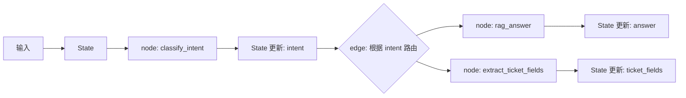

# 阶段 5 第 4 节：State 是什么：Agent 为什么需要状态

## 本节定位

上一节我们学习了：

```text
Agent 流程和状态机基础
```

你已经知道，一个智能工单 Agent 不是简单的：

```text
用户问 -> 模型答
```

而更像：

```text
用户输入
-> 意图识别
-> RAG 或工单路由
-> 字段收集
-> 缺失字段追问
-> 用户确认
-> 调用 Java mock 创建工单
-> 返回结果
```

这条流程里，每一步都需要知道前面发生了什么。

例如：

```text
用户这一轮只说“确认”。
系统必须知道他确认的是哪张工单草稿。
```

又例如：

```text
用户补充“高优先级”。
系统必须知道他是在补充工单字段，而不是随便聊天。
```

这些“前面已经发生的事”和“后面还要用的信息”，就是本节要讲的核心：

```text
State
```

本节不急着写 LangGraph 运行时代码。

本节先把 `State` 的概念讲透：

```text
State 是什么？
它和普通变量有什么区别？
它和 messages 有什么区别？
它应该存什么？
不应该存什么？
智能工单 Agent 的 State 应该怎么设计？
```

## 本节学习目标

学完这一节，你应该能做到：

1. 用自己的话解释 LangGraph 里的 State 是什么。
2. 解释 State 为什么是节点之间的共享数据。
3. 解释 State 和普通局部变量的区别。
4. 解释 State 和 HTTP 请求体、响应体的区别。
5. 解释 State 和聊天历史 messages 的区别。
6. 解释为什么多轮 Agent 不能只靠 messages。
7. 判断哪些数据应该放进 State，哪些不应该放。
8. 解释为什么 State 应该尽量存原始、结构化数据，而不是 prompt 文本。
9. 了解 TypedDict、Pydantic、dataclass 在 State schema 里的区别。
10. 初步设计智能工单 Agent 的 State 字段。
11. 解释 State 设计不好会带来什么工程问题。
12. 为后面学习 Reducer、MessagesState、StateGraph 最小图打基础。

## 本节先不学什么

为了把 State 讲清楚，本节暂时不做这些事：

1. 不安装 `langgraph`。
2. 不修改 `projects/ai-service` 的运行时代码。
3. 不实现 `StateGraph` 最小图。
4. 不深入讲 reducer。
5. 不深入讲 `MessagesState`。
6. 不讲 checkpoint 的具体存储。
7. 不讲 interrupt 的代码写法。
8. 不调用真实模型。
9. 不启动 Qdrant 或 Milvus。

这些后面都会学。

本节只解决一个问题：

```text
Agent 为什么需要一个设计良好的 State？
```

## 一、基础知识铺垫

### 1. 先从普通变量说起

你之前学 Python 时已经见过变量。

例如：

```python
name = "panpan"
age = 18
```

变量就是给一份数据起名字。

函数里也有变量：

```python
def normalize_message(message: str) -> str:
    cleaned = message.strip()
    return cleaned
```

这里的 `cleaned` 是一个局部变量。

它有几个特点：

```text
只在这个函数里使用。
函数执行结束后通常就不再需要。
不会自动传给另一个函数。
不会自动跨请求保存。
```

局部变量适合存临时计算结果。

例如：

```text
去掉字符串两边空格后的结果
临时拼接出来的一句话
一个循环里的计数
某个函数内部的中间值
```

这些东西通常不需要进入 Agent 的 State。

### 2. 什么是跨步骤数据

Agent 流程不是一个函数一步做完。

它会拆成很多步骤：

```text
classify_intent
extract_ticket_fields
check_missing_fields
ask_user_confirmation
create_ticket
```

如果 `classify_intent` 得到了：

```text
intent = "create_ticket"
```

那么后面的路由节点要用它。

如果 `extract_ticket_fields` 得到了：

```text
ticket_fields = {
  "title": "订单未发货",
  "description": "订单 1001 一直未发货",
  "priority": "normal"
}
```

那么后面的确认节点和创建工单节点都要用它。

这些数据不是某个函数内部临时用一下。

它们会跨步骤继续使用。

这类数据就需要进入 State。

### 3. 什么是跨轮数据

跨步骤还不够。

Agent 还有跨轮问题。

例如：

```text
第 1 轮：
用户：订单 1001 一直没发货，帮我处理一下。
AI：可以创建工单，请确认。

第 2 轮：
用户：确认。
```

第二轮用户没有再说：

```text
订单 1001 一直没发货，标题是订单未发货，优先级 normal，请帮我创建工单。
```

他只说了：

```text
确认
```

系统必须记得上一轮：

```text
已经提取了哪些工单字段
当前正在等待用户确认
确认后下一步应该创建工单
这次创建工单对应哪个用户或会话
```

这些就是跨轮数据。

跨轮数据也应该进入 State，或者被 State 关联到持久化存储里。

### 4. State 的直观理解

你可以先把 State 理解成：

```text
Agent 工作时随身携带的一本工作笔记。
```

这本笔记里记录：

```text
用户说了什么
系统判断出的意图是什么
已经查到什么资料
已经提取出哪些字段
还缺哪些字段
现在是否等用户确认
确认后要执行什么动作
创建工单是否成功
出错信息是什么
trace_id 是什么
```

每个节点都会看这本笔记。

每个节点执行完以后，也可能往这本笔记里补充新内容。

这就是 State 的核心：

```text
State 是整个图流程共享的结构化数据。
```

### 5. LangGraph 官方语境里的 State

在 LangGraph 的 Graph API 里，agent workflow 由三个核心部分组成：

```text
State
Nodes
Edges
```

可以先这样理解：

```text
State：当前应用快照，也就是现在已经知道什么。
Node：节点函数，读取 State，执行动作，返回 State 更新。
Edge：决定下一个节点是谁，可以是固定边，也可以是条件边。
```

这三者的关系是：

```text
State 记录数据。
Node 做事情。
Edge 决定下一步。
```

如果没有 State，节点之间就没有稳定的信息传递基础。

### 6. State 不是数据库

初学时容易把 State 理解成数据库。

这不准确。

State 更像：

```text
某一次 Agent 流程当前正在使用的工作数据。
```

数据库更像：

```text
系统长期保存的业务数据。
```

例如：

```text
订单表
工单表
用户表
知识库文档
向量库里的 chunk
```

这些是长期业务数据。

而 State 可能保存：

```text
当前用户这次工单流程的意图
当前工单草稿
当前缺失字段
当前确认状态
当前错误信息
```

State 可以被 checkpoint 保存下来，但它本身的语义仍然是：

```text
当前流程的快照。
```

### 7. State 不是请求体

FastAPI 请求体是用户这一次请求发来的数据。

例如：

```json
{
  "message": "确认"
}
```

请求体只代表当前这一次请求。

但 State 可能包含：

```json
{
  "current_status": "waiting_user_confirmation",
  "ticket_fields": {
    "title": "订单未发货",
    "description": "订单 1001 一直未发货",
    "priority": "normal"
  },
  "confirmation_status": "waiting"
}
```

也就是说：

```text
请求体是本轮输入。
State 是流程上下文。
```

本轮输入通常会写入 State，但 State 不等于请求体。

### 8. State 不是响应体

响应体是服务返回给前端或调用方的数据。

例如：

```json
{
  "answer": "已为你创建工单 T-1001"
}
```

响应体是对外输出。

State 是内部流程数据。

State 可能比响应体丰富很多：

```text
intent
ticket_fields
missing_fields
retrieved_sources
confirmation_status
tool_result
error
trace_id
```

这些不一定都要返回给用户。

所以：

```text
响应体是外部契约。
State 是内部工作区。
```

### 9. State 和 messages 的区别

`messages` 是对话历史。

例如：

```text
user: 订单 1001 没发货
assistant: 我可以帮你创建工单，请确认
user: 确认
```

它很重要，因为模型需要上下文。

但 `messages` 不是全部 State。

结构化 State 可能是：

```json
{
  "intent": "create_ticket",
  "ticket_fields": {
    "title": "订单未发货",
    "description": "订单 1001 一直未发货",
    "priority": "normal"
  },
  "missing_fields": [],
  "confirmation_status": "confirmed"
}
```

这份数据对代码更可靠。

因为代码可以直接判断：

```text
confirmation_status == "confirmed"
missing_fields 为空
```

如果只靠 messages，系统可能要让模型重新读历史并推断：

```text
用户说确认是不是同意创建工单？
确认的是哪张工单？
字段齐不齐？
```

这种方式不够可靠。

所以：

```text
messages 负责对话上下文。
结构化 State 负责流程控制。
```

### 10. State 和缓存的区别

缓存通常是为了减少重复计算或重复请求。

例如：

```text
缓存订单查询结果
缓存 embedding 结果
缓存 RAG 检索结果
```

State 的目标不是单纯提速。

State 的目标是：

```text
让流程能正确推进。
```

当然，State 里可以保存一些昂贵结果。

例如：

```text
retrieved_chunks
order_snapshot
ticket_draft
```

但判断标准不是“能不能缓存”，而是：

```text
后续流程是否需要它？
恢复流程是否需要它？
排查问题是否需要它？
```

### 11. State 和日志的区别

日志是记录已经发生过什么。

State 是当前流程继续运行需要什么。

例如日志里可以写：

```text
node=extract_ticket_fields
missing_fields=["priority"]
```

但 State 里也要有：

```json
{
  "missing_fields": ["priority"]
}
```

因为下一步要根据它追问用户。

日志偏审计和排查。

State 偏运行和恢复。

### 12. 为什么 State 要结构化

结构化数据就是有明确字段的数据。

例如：

```json
{
  "intent": "create_ticket",
  "priority": "high",
  "missing_fields": []
}
```

非结构化数据可能是一段自然语言：

```text
用户想创建一个高优先级工单，目前字段都齐了。
```

自然语言适合人读，也适合模型理解。

但代码需要稳定字段。

例如代码可以写：

```python
if state["missing_fields"]:
    return "ask_missing_fields"
```

如果 State 只是一段话，代码就很难安全判断。

企业 Agent 里，State 应该尽量结构化。

### 13. 为什么 State 要存原始数据

LangGraph 官方文档强调一个重要原则：

```text
State 里存原始数据，不要存格式化后的 prompt 文本。
```

例如不要优先这样存：

```text
prompt = "用户说：订单 1001 没发货。请你提取工单字段..."
```

更好的方式是存：

```json
{
  "user_message": "订单 1001 没发货",
  "order_id": "1001",
  "ticket_fields": {
    "title": "订单未发货"
  }
}
```

需要调用模型时，在节点里临时格式化 prompt。

这样做有几个好处：

1. 同一份原始数据可以给不同节点用不同 prompt。
2. 修改 prompt 模板时，不需要修改 State schema。
3. 调试时能看到真正的数据，而不是一大段拼接文本。
4. checkpoint 保存的数据更稳定。
5. 后续版本升级更容易兼容。

### 14. State 和 checkpoint 的关系

checkpoint 后面会专门学。

这里先知道关系：

```text
checkpoint 保存的是某个 thread 的图状态快照。
```

也就是说，State 设计得好，checkpoint 才有价值。

例如流程停在：

```text
waiting_user_confirmation
```

checkpoint 保存了：

```json
{
  "ticket_fields": {...},
  "confirmation_status": "waiting",
  "messages": [...]
}
```

用户下一轮回来，系统才能恢复。

如果 State 里没有工单草稿，checkpoint 也帮不了你。

checkpoint 不是魔法。

它只是保存你设计好的 State。

### 15. State 和 thread_id 的关系

`thread_id` 可以理解成某条对话或某次 Agent 流程的身份标识。

例如：

```text
thread_id = "user-23985-ticket-20260720-001"
```

当你用 checkpointer 时，通常要通过 `thread_id` 找到对应流程的 State。

它们的关系可以理解成：

```text
thread_id：这是谁的哪条流程
State：这条流程现在的内容
checkpoint：把这条流程的 State 保存下来
```

本节不深入代码。

先记住：

```text
没有 thread_id，跨轮恢复很难知道该找哪份 State。
没有合理 State，找到也没用。
```

## 二、本节主题系统讲解

### 1. LangGraph State 的一句话定义

可以先背下来：

```text
LangGraph 的 State 是所有节点共享的、描述当前 Agent 流程快照的结构化数据。
```

拆开看：

```text
所有节点共享：每个节点都能读取它需要的字段。
当前流程快照：它描述的是这一次流程现在知道什么、走到哪里。
结构化数据：它应该有明确字段，而不是一大段自然语言。
```

### 2. State 在图里的位置

LangGraph 执行时大概是这样：

```text
初始输入
  -> 写入 State
  -> 第一个 node 读取 State
  -> node 返回 State 更新
  -> reducer 合并更新
  -> edge 根据 State 决定下一步
  -> 下一个 node 继续读取 State
  -> ...
  -> END
```

可以画成：



你可以看到：

```text
节点之间不是靠一堆函数参数乱传。
节点之间通过 State 交换信息。
```

### 3. node 为什么返回“更新”而不是完整 State

LangGraph 里，一个节点通常返回它改变的字段。

例如：

```python
def classify_intent(state: TicketAgentState):
    return {"intent": "create_ticket"}
```

这个节点只负责更新 `intent`。

它不需要返回完整的：

```python
{
    "messages": ...,
    "user_message": ...,
    "intent": "create_ticket",
    "ticket_fields": ...,
    "missing_fields": ...,
    "trace_id": ...
}
```

这样做有几个好处：

1. 节点职责更清楚。
2. 不容易误覆盖别的字段。
3. 图运行时可以知道这个节点改了什么。
4. stream updates 时可以只看到本步更新。
5. reducer 可以决定每个字段怎么合并。

后面第 5 节会专门学 reducer。

本节先记住：

```text
节点返回 State 的局部更新。
LangGraph 根据规则把更新合并进整体 State。
```

### 4. State schema 是什么

schema 就是结构定义。

State schema 表示：

```text
这个 State 里有哪些字段？
每个字段是什么类型？
哪些字段可能为空？
哪些字段有固定可选值？
```

例如：

```python
from typing import Literal, TypedDict

class TicketAgentState(TypedDict, total=False):
    user_message: str
    intent: Literal["rag_question", "create_ticket", "unknown"]
    ticket_fields: dict
    missing_fields: list[str]
    confirmation_status: Literal["none", "waiting", "confirmed", "rejected"]
    answer: str
    error: str
    trace_id: str
```

这只是学习示例，不是本节要落地的项目代码。

它表达的是：

```text
智能工单 Agent 大概需要这些共享字段。
```

### 5. 为什么 State schema 很重要

没有 schema 时，State 可能变成一个随便塞东西的字典。

例如：

```python
state["intent_type"] = "create_ticket"
state["intent"] = "ticket"
state["user_want"] = "工单"
```

这会带来问题：

```text
字段重复表达同一件事。
节点之间不知道该读哪个字段。
测试不知道该构造哪个字段。
后续重构很容易出错。
```

schema 的价值是：

```text
统一字段名。
统一类型。
统一含义。
让节点之间有稳定契约。
```

可以把 State schema 理解成：

```text
Agent 节点之间的内部合同。
```

### 6. State 设计第一原则：后续流程需要才存

判断一个数据该不该进入 State，第一原则是：

```text
后续流程是否需要它？
```

例如：

```text
intent：需要，因为后面要路由。
ticket_fields：需要，因为后面要确认和创建工单。
missing_fields：需要，因为后面要追问。
confirmation_status：需要，因为后面决定是否创建工单。
ticket_id：需要，因为创建成功后要返回和记录。
```

不需要的例子：

```text
某个节点内部临时拼出来的一句 prompt。
某个函数内部为了格式化输出创建的字符串。
可以从 ticket_fields 重新计算出来的摘要。
```

状态不是越多越好。

状态越多，维护成本越高。

### 7. State 设计第二原则：跨轮需要才存

有些数据当前节点后面马上用一次，看起来可以局部传。

但如果用户中断或下一轮继续，就必须存。

例如：

```text
ticket_fields
missing_fields
confirmation_status
current_status
```

这些字段很可能跨轮使用。

用户下一轮说：

```text
高优先级
```

系统要知道它是在补 `priority`。

用户下一轮说：

```text
确认
```

系统要知道它是在确认创建工单。

所以跨轮数据要进 State。

### 8. State 设计第三原则：存原始数据，不存 prompt

这是官方文档强调的原则，也非常适合我们的项目。

不要让 State 长这样：

```python
state["ticket_prompt"] = """
你是客服助手，请根据下面用户问题提取工单字段：
用户问题：订单 1001 一直没发货
已知信息：...
"""
```

更好的做法：

```python
state["user_message"] = "订单 1001 一直没发货"
state["order_id"] = "1001"
state["ticket_fields"] = {
    "title": "订单未发货"
}
```

需要 prompt 时，在节点里临时构造：

```python
prompt = build_ticket_extract_prompt(
    user_message=state["user_message"],
    existing_fields=state.get("ticket_fields", {}),
)
```

这样 State 更稳定。

### 9. State 设计第四原则：区分事实、判断和输出

State 里会有不同类型的数据。

第一类是事实：

```text
user_message
order_id
ticket_id
retrieved_sources
```

第二类是模型或代码的判断：

```text
intent
missing_fields
needs_ticket
confirmation_status
```

第三类是输出：

```text
answer
confirmation_message
fallback_message
```

这三类最好不要混在一个大字段里。

例如不要只存：

```text
summary = "用户想创建订单未发货工单，字段齐全，等待确认。"
```

更好的方式是分字段：

```json
{
  "intent": "create_ticket",
  "ticket_fields": {
    "title": "订单未发货"
  },
  "missing_fields": [],
  "confirmation_status": "waiting"
}
```

分字段后，代码能稳定判断。

### 10. State 设计第五原则：副作用结果要保存

如果某个节点调用了外部系统，结果通常应该进入 State。

例如创建工单成功：

```json
{
  "ticket_id": "T-2026-0001",
  "ticket_create_status": "success"
}
```

创建失败：

```json
{
  "error": {
    "code": "JAVA_TICKET_API_TIMEOUT",
    "message": "创建工单超时"
  }
}
```

原因是：

```text
后续回答用户需要它。
日志排查需要它。
错误兜底需要它。
重试和幂等判断可能需要它。
```

### 11. State 设计第六原则：敏感信息不要乱存

State 可能会被 checkpoint 保存。

所以不能随便把敏感信息放进去。

例如：

```text
API Key
数据库密码
用户身份证完整号码
银行卡号
access token
refresh token
```

这些不应该进入 State。

如果业务确实需要身份信息，也要尽量：

```text
脱敏
只保存必要字段
保存引用 ID 而不是原始敏感值
设置保留期限
限制日志输出
```

我们当前学习项目是 mock 服务，但真实工作里这一点很重要。

### 12. State 设计第七原则：字段名字要稳定

字段名不要一会儿叫：

```text
ticket_info
ticket_data
ticket_payload
ticket_fields
```

如果它表示工单草稿字段，就固定叫：

```text
ticket_fields
```

如果它表示缺失字段，就固定叫：

```text
missing_fields
```

稳定命名的好处：

```text
节点之间不容易读错字段。
测试更好写。
后面新对话继续学习也容易理解。
文档和代码能对应。
```

### 13. State 设计第八原则：不要过早设计过大 State

State 太少会导致流程缺信息。

State 太多会导致维护困难。

初版应该只放核心字段：

```text
messages
user_message
intent
ticket_fields
missing_fields
confirmation_status
answer
error
trace_id
```

等后面真的需要时，再加：

```text
retrieved_sources
order_snapshot
ticket_id
idempotency_key
node_history
```

不要一开始就设计几十个字段。

好的 State 是逐步长出来的，但每次新增都要有理由。

### 14. State 设计第九原则：把业务对象和流程控制分开

业务对象：

```text
ticket_fields
order_snapshot
retrieved_sources
```

流程控制：

```text
intent
current_status
missing_fields
confirmation_status
next_action
error
```

两类都可以在 State 里，但含义不同。

如果混在一起，后面会难维护。

例如不要把 `confirmation_status` 放进 `ticket_fields` 里。

因为确认状态不是工单字段。

工单字段是创建工单时要传给 Java API 的业务数据。

确认状态是 Agent 流程控制数据。

### 15. State 设计第十原则：错误也是 State 的一部分

错误不是流程外的东西。

错误会影响后续步骤。

例如：

```text
模型输出结构化解析失败 -> 可能重试或兜底
Java API 超时 -> 可能提示稍后重试
订单不存在 -> 不能继续创建相关工单
权限不足 -> 进入拒绝流程
```

所以 State 里需要一个清晰的错误字段。

例如：

```python
class AgentError(TypedDict, total=False):
    code: str
    message: str
    recoverable: bool
    source: str
```

然后 State 里有：

```python
error: AgentError | None
```

本节不要求写进项目。

但后面第 23 节做错误处理时会用到类似思想。

## 三、State schema 的几种写法

### 1. TypedDict

LangGraph 官方文档里，Graph state 最常见的写法是 `TypedDict`。

`TypedDict` 的作用是：

```text
给字典规定字段名和字段类型。
```

示例：

```python
from typing import Literal, TypedDict

class TicketAgentState(TypedDict, total=False):
    user_message: str
    intent: Literal["rag_question", "create_ticket", "unknown"]
    missing_fields: list[str]
    answer: str
```

这表示：

```text
TicketAgentState 是一个字典。
它可能包含 user_message、intent、missing_fields、answer 等字段。
每个字段有对应类型。
```

`TypedDict` 的优点：

```text
轻量
性能好
适合 LangGraph state
类型检查友好
写法接近普通 dict
```

缺点：

```text
运行时校验能力不如 Pydantic
复杂嵌套校验要自己补
默认值处理不如 dataclass 直观
```

### 2. Pydantic BaseModel

Pydantic 你之前已经学过。

它擅长：

```text
运行时数据校验
默认值
字段约束
嵌套模型
错误提示
```

示例：

```python
from typing import Literal
from pydantic import BaseModel, Field

class TicketAgentStateModel(BaseModel):
    user_message: str = ""
    intent: Literal["rag_question", "create_ticket", "unknown"] = "unknown"
    missing_fields: list[str] = Field(default_factory=list)
    answer: str | None = None
```

优点：

```text
运行时校验强
默认值清楚
复杂结构表达清楚
错误信息友好
```

缺点：

```text
比 TypedDict 重
性能相对低一些
某些高层 agent factory 不支持 Pydantic state schema
```

在我们的学习项目里，后面如果只是写 LangGraph state，优先考虑 `TypedDict`。

如果某些请求或响应要对外暴露，继续用 Pydantic。

### 3. dataclass

`dataclass` 是 Python 标准库提供的类写法。

它适合：

```text
需要默认值
希望字段像对象属性一样访问
不想引入 Pydantic 运行时校验成本
```

示例：

```python
from dataclasses import dataclass, field

@dataclass
class TicketAgentStateData:
    user_message: str = ""
    missing_fields: list[str] = field(default_factory=list)
    answer: str | None = None
```

优点：

```text
标准库自带
默认值方便
比 Pydantic 轻
```

缺点：

```text
和 dict 风格不一样
运行时校验不如 Pydantic
和 LangGraph 常见示例相比学习成本略高
```

### 4. 三者怎么选

可以先用这张表判断：

| 写法 | 更适合什么 | 优点 | 注意点 |
| --- | --- | --- | --- |
| TypedDict | LangGraph 内部 State | 轻量、常见、类型清楚 | 运行时校验弱 |
| Pydantic BaseModel | API 请求响应、复杂校验 | 校验强、错误清楚 | 更重，性能相对低 |
| dataclass | 需要默认值的内部数据 | 标准库、轻量 | 不是当前 LangGraph 学习主线 |

我们后面大概率会采用：

```text
FastAPI 请求 / 响应：Pydantic
LangGraph State：TypedDict
内部业务对象：看情况，Pydantic 或普通 dict
```

### 5. total=False 是什么

`TypedDict` 里经常会看到：

```python
class TicketAgentState(TypedDict, total=False):
    intent: str
    answer: str
```

`total=False` 表示：

```text
这些字段不要求一开始全部存在。
```

这对 Agent 很合理。

因为流程刚开始时，State 可能只有：

```python
{"user_message": "订单 1001 没发货"}
```

执行完意图识别后，才有：

```python
{"intent": "create_ticket"}
```

执行完字段提取后，才有：

```python
{"ticket_fields": {...}}
```

Agent 的 State 是逐步增长和更新的。

所以有些字段一开始不存在是正常的。

### 6. Literal 是什么

`Literal` 表示某个字段只能取固定值。

例如：

```python
from typing import Literal

intent: Literal["rag_question", "create_ticket", "unknown"]
```

这表示 `intent` 只能是这三个字符串之一。

好处是：

```text
减少拼写错误。
让路由条件更清楚。
让测试更稳定。
让编辑器和类型检查更有帮助。
```

例如不要一会儿写：

```text
create_ticket
ticket_create
createTicket
```

固定值能让流程更稳定。

### 7. None 和缺字段的区别

State 里可能出现两种情况：

```text
字段不存在
字段存在但值是 None
```

例如：

```python
{}
```

和：

```python
{"answer": None}
```

语义不同。

字段不存在可能表示：

```text
这个节点还没执行过。
```

字段存在但为 None 可能表示：

```text
执行过，但没有结果。
```

初学阶段不要过度纠结。

但后面设计 State 时，要尽量让语义清楚。

例如：

```text
missing_fields = [] 表示字段齐全。
missing_fields 字段不存在表示还没检查字段。
```

这两种状态不要混淆。

## 四、智能工单 Agent 的 State 设计

### 1. 先从业务问题出发

不要为了写 State 而写 State。

先问业务问题：

```text
智能工单 Agent 后续流程需要知道什么？
```

它需要知道：

```text
用户本轮说了什么
对话历史是什么
用户意图是什么
是否要走 RAG
是否要创建工单
工单字段有哪些
还缺哪些字段
是否等待用户确认
用户是否确认
Java 创建工单结果是什么
要返回给用户什么
出错了吗
trace_id 是什么
```

这些就是 State 字段来源。

### 2. 初版 State 字段分组

可以先分成六组：

```text
输入上下文
模型理解结果
RAG 结果
工单草稿
流程控制
执行结果和错误
```

每组大概包含：

```text
输入上下文：
  messages
  user_message
  trace_id

模型理解结果：
  intent

RAG 结果：
  rag_answer
  retrieved_sources

工单草稿：
  ticket_fields
  missing_fields

流程控制：
  current_status
  confirmation_status
  next_action

执行结果和错误：
  ticket_id
  error
```

这不是最终代码，只是设计草图。

### 3. 学习版 TicketAgentState 示例

下面是一个学习版示例。

注意：

```text
这是为了理解 State 设计，不是本节要落地的项目代码。
```

```python
from typing import Literal, TypedDict

class TicketFields(TypedDict, total=False):
    title: str
    description: str
    priority: Literal["low", "normal", "high"]
    order_id: str

class RetrievedSource(TypedDict, total=False):
    title: str
    source: str
    section: str
    score: float

class AgentError(TypedDict, total=False):
    code: str
    message: str
    recoverable: bool
    source: str

class TicketAgentState(TypedDict, total=False):
    messages: list
    user_message: str
    trace_id: str

    intent: Literal["rag_question", "query_order", "create_ticket", "unknown"]

    rag_answer: str
    retrieved_sources: list[RetrievedSource]

    ticket_fields: TicketFields
    missing_fields: list[str]
    confirmation_status: Literal["none", "waiting", "confirmed", "rejected"]

    ticket_id: str
    final_answer: str
    error: AgentError
```

### 4. 逐段解释这个 State

#### messages

```python
messages: list
```

表示多轮对话消息。

后面第 6 节会专门学 `MessagesState`，所以这里先不深入。

现在先知道：

```text
messages 给模型看。
结构化字段给代码判断。
```

#### user_message

```python
user_message: str
```

表示用户本轮输入。

它通常来自 FastAPI 请求体。

例如：

```text
订单 1001 一直没发货，帮我处理一下。
```

#### trace_id

```python
trace_id: str
```

表示请求追踪 ID。

它能帮助我们把：

```text
FastAPI 请求日志
LangGraph 节点日志
RAG 检索日志
Java API 调用日志
```

串起来。

#### intent

```python
intent: Literal["rag_question", "query_order", "create_ticket", "unknown"]
```

表示模型或代码识别出来的用户意图。

它会影响路由。

例如：

```text
rag_question -> RAG 回答节点
query_order -> 查询订单节点
create_ticket -> 工单字段提取节点
unknown -> fallback 节点
```

#### rag_answer

```python
rag_answer: str
```

表示知识库回答结果。

如果用户只是问政策、规则、FAQ，流程可能生成这个字段后就结束。

#### retrieved_sources

```python
retrieved_sources: list[RetrievedSource]
```

表示 RAG 检索到的来源。

它不只是为了展示引用。

还可以用于：

```text
评估回答是否有依据
日志排查
后续让模型基于来源回答
```

#### ticket_fields

```python
ticket_fields: TicketFields
```

表示工单草稿。

例如：

```json
{
  "title": "订单未发货",
  "description": "订单 1001 一直未发货",
  "priority": "normal",
  "order_id": "1001"
}
```

这是后面创建工单的核心业务数据。

#### missing_fields

```python
missing_fields: list[str]
```

表示还缺哪些工单字段。

例如：

```python
["priority"]
```

如果它不为空，流程应该进入追问。

如果它为空，流程可以进入用户确认。

#### confirmation_status

```python
confirmation_status: Literal["none", "waiting", "confirmed", "rejected"]
```

表示确认状态。

这非常重要。

因为创建工单前必须确认。

不要只靠 messages 里用户说过“确认”。

代码应该能判断：

```text
confirmation_status == "confirmed"
```

#### ticket_id

```python
ticket_id: str
```

表示 Java mock 服务创建成功后的工单 ID。

例如：

```text
T-2026-0001
```

#### final_answer

```python
final_answer: str
```

表示最终要返回给用户的回答。

注意：

```text
不是所有中间提示词都要存。
但最终回答可以存，方便接口返回、日志和测试。
```

#### error

```python
error: AgentError
```

表示流程里的错误。

例如：

```json
{
  "code": "JAVA_TICKET_API_TIMEOUT",
  "message": "创建工单超时",
  "recoverable": true,
  "source": "java_ticket_client"
}
```

错误进入 State 后，后续 fallback 节点可以根据它生成更合理的回答。

### 5. 哪些字段后面可能会调整

这份 State 只是初版。

后面真的写代码时可能调整：

```text
messages 可能使用 LangGraph 的 MessagesState 机制。
ticket_fields 可能改成 Pydantic 模型或 TypedDict。
error 可能拆成 error_code、error_message。
current_status 可能暂时不加，只用图节点位置表达流程。
next_action 可能不需要，因为 conditional edge 可以决定下一步。
retrieved_sources 可能复用现有 RAG schema。
```

这很正常。

架构设计不是一次写死。

关键是每次调整都要知道为什么。

## 五、State 设计常见错误

### 1. 把所有东西都塞进 State

错误做法：

```text
只要节点里出现过的数据，都放进 State。
```

问题：

```text
State 越来越大。
字段含义不清楚。
checkpoint 变重。
测试构造困难。
后续节点不知道哪些字段可信。
```

正确做法：

```text
只有后续流程、跨轮恢复、测试断言、错误兜底、日志排查真正需要的数据，才进入 State。
```

### 2. State 只有 messages

错误做法：

```text
State = {"messages": [...]}
```

问题：

```text
业务流程缺少结构化控制字段。
用户确认、缺失字段、工单草稿都要从历史对话里推断。
模型推断可能不稳定。
测试不容易断言。
```

正确做法：

```text
messages 保存对话上下文。
结构化字段保存业务状态。
```

### 3. State 里存 prompt

错误做法：

```text
state["prompt"] = "你是客服助手，请根据..."
```

问题：

```text
prompt 模板一改，State 兼容性变差。
调试看不到原始数据。
不同节点难以复用同一份数据。
```

正确做法：

```text
State 存 user_message、ticket_fields、retrieved_sources 等原始数据。
节点内部按需构造 prompt。
```

### 4. 字段命名混乱

错误做法：

```text
ticket_info
ticket_data
ticket_fields
ticket_payload
```

如果这些都表示工单草稿，就会让节点之间很难协作。

正确做法：

```text
统一叫 ticket_fields。
如果是发给 Java API 的请求体，再叫 ticket_request 或 java_ticket_payload。
```

### 5. 业务状态和业务对象混在一起

错误做法：

```json
{
  "ticket_fields": {
    "title": "订单未发货",
    "confirmation_status": "confirmed"
  }
}
```

问题：

```text
confirmation_status 不是工单字段。
它是 Agent 流程控制字段。
```

正确做法：

```json
{
  "ticket_fields": {
    "title": "订单未发货"
  },
  "confirmation_status": "confirmed"
}
```

### 6. 忘记错误字段

错误做法：

```text
节点失败就直接 raise，或者直接返回一句中文错误。
```

这会导致后续流程不知道错误来源。

正确做法：

```text
把可处理错误写入 State。
由 fallback 或错误处理节点统一生成用户可理解的回答。
```

### 7. 把敏感信息写进 State

错误做法：

```text
state["api_key"] = "sk-..."
state["access_token"] = "..."
```

这很危险。

State 可能进入 checkpoint、日志、调试输出。

正确做法：

```text
敏感凭据放环境变量或安全配置。
State 只保存必要的业务 ID 或脱敏信息。
```

### 8. 不区分 None、空列表、字段不存在

错误做法：

```text
missing_fields 有时不存在，有时 None，有时 []
但没有约定含义。
```

正确做法：

```text
missing_fields 不存在：还没检查。
missing_fields = []：已检查，字段齐全。
missing_fields = ["priority"]：已检查，缺 priority。
```

这样的约定会让测试和路由更清楚。

## 六、State 和当前项目的关系

### 1. 现有项目里已经有类似 State 的思想

虽然我们还没有写 LangGraph，但前面阶段已经出现过“状态”的影子。

例如：

```text
tool decision 保存模型是否请求工具
工单流程保存待确认字段
RAG 保存检索结果和引用来源
trace_id 串联一次请求
```

这些以前分散在 service、schema、测试里。

进入 LangGraph 后，我们会把一部分变成更明确的 graph State。

### 2. 不会把所有现有数据都搬进 State

LangGraph State 不是垃圾桶。

后面不会把：

```text
所有 Java API 响应原文
所有 prompt
所有日志
所有中间字符串
所有配置
```

都塞进去。

我们会保持边界：

```text
配置仍然在 settings。
业务接口封装仍然在 client/service。
请求响应仍然用 Pydantic。
State 只保存 Agent 流程需要共享和恢复的数据。
```

### 3. 智能工单 Agent 的初版 State 可能如何落地

后续落地时，可能会新增类似文件：

```text
projects/ai-service/app/agents/ticket_agent_state.py
```

里面定义：

```text
TicketAgentState
TicketFields
RetrievedSource
AgentError
```

但现在不写。

原因是后面第 5、6 节还要学 reducer 和 MessagesState。

如果现在急着写，很可能马上要改。

### 4. 本节先形成设计判断

现在你要先能判断：

```text
这个字段应该进 State 吗？
这个字段只是临时变量吗？
这个字段应该放请求体、响应体、数据库，还是 graph State？
这个字段是业务对象，还是流程控制字段？
这个字段如果存进 checkpoint，会不会有安全风险？
```

这些判断比背代码更重要。

## 七、一个完整例子：用户确认创建工单

### 1. 第一轮输入

用户说：

```text
订单 1001 一直没发货，帮我处理一下。
```

初始 State 可能是：

```json
{
  "user_message": "订单 1001 一直没发货，帮我处理一下。",
  "trace_id": "trace-001"
}
```

### 2. 意图识别节点后

`classify_intent` 节点更新：

```json
{
  "intent": "create_ticket"
}
```

整体 State 变成：

```json
{
  "user_message": "订单 1001 一直没发货，帮我处理一下。",
  "trace_id": "trace-001",
  "intent": "create_ticket"
}
```

### 3. 字段提取节点后

`extract_ticket_fields` 节点更新：

```json
{
  "ticket_fields": {
    "title": "订单未发货",
    "description": "订单 1001 一直未发货",
    "priority": "normal",
    "order_id": "1001"
  }
}
```

### 4. 缺失字段检查后

`check_missing_fields` 节点更新：

```json
{
  "missing_fields": []
}
```

这表示字段齐全。

### 5. 请求用户确认后

`ask_user_confirmation` 节点更新：

```json
{
  "confirmation_status": "waiting",
  "final_answer": "我将为订单 1001 创建“订单未发货”工单，优先级 normal。请确认是否创建？"
}
```

此时流程可以暂停。

### 6. 第二轮输入

用户说：

```text
确认
```

系统需要把本轮输入写入同一条 thread 的 State：

```json
{
  "user_message": "确认"
}
```

但它不能丢掉之前的：

```text
ticket_fields
confirmation_status
trace_id
```

### 7. 确认处理后

确认节点判断：

```text
当前 confirmation_status 是 waiting
用户表达 confirmed
ticket_fields 已齐全
```

于是更新：

```json
{
  "confirmation_status": "confirmed"
}
```

然后才允许进入：

```text
create_ticket
```

### 8. 创建工单成功后

`create_ticket` 节点更新：

```json
{
  "ticket_id": "T-2026-0001",
  "final_answer": "已为你创建工单 T-2026-0001。"
}
```

这一整个例子说明：

```text
State 让多轮工单流程有了连续性。
```

如果没有 State，第二轮“确认”就是一句孤立的话。

## 八、本节练习与参考答案

### 练习 1：判断哪些应该进 State

判断下面数据是否应该进入 State：

```text
1. 用户本轮消息 user_message
2. 字符串 strip 后的临时变量 cleaned
3. 用户意图 intent
4. 工单草稿 ticket_fields
5. 完整 prompt 文本
6. 用户确认状态 confirmation_status
7. API Key
8. 创建成功后的 ticket_id
```

参考答案：

```text
1. 应该。后续节点需要知道用户本轮说了什么。
2. 通常不应该。它只是临时计算结果。
3. 应该。它影响后续路由。
4. 应该。确认和创建工单都需要。
5. 通常不应该。State 应存原始数据，prompt 在节点里按需构造。
6. 应该。它决定是否允许进入创建工单。
7. 不应该。敏感凭据不应进入 State。
8. 应该。最终回答、日志和后续查询都可能需要。
```

### 练习 2：解释 State 和 messages 的区别

参考答案：

```text
messages 是对话历史，主要给模型理解上下文；State 是整个 Agent 流程的结构化工作数据，给节点、路由、确认、错误处理、测试和恢复使用。messages 可以是 State 的一部分，但不能替代所有结构化 State。
```

### 练习 3：为什么不能只靠 messages 判断“确认”

参考答案：

```text
因为“确认”必须结合业务状态理解。系统需要知道当前是否处于 waiting_user_confirmation、确认的是哪张工单草稿、字段是否齐全、是否允许执行写操作。这些应该由结构化 State 保存，而不是让模型每次重新读历史推断。
```

### 练习 4：给 State 字段分类

请把下面字段分为输入上下文、流程控制、业务对象、执行结果、错误：

```text
user_message
intent
ticket_fields
confirmation_status
ticket_id
error
trace_id
```

参考答案：

```text
输入上下文：user_message、trace_id
流程控制：intent、confirmation_status
业务对象：ticket_fields
执行结果：ticket_id
错误：error
```

### 练习 5：为什么 State 应该存原始数据

参考答案：

```text
原始数据更稳定，也更容易被多个节点以不同方式使用。prompt、确认文案这类格式化文本可以按需生成。如果把 prompt 存进 State，prompt 模板变化会影响 State schema，调试和恢复也更困难。
```

### 练习 6：TypedDict 和 Pydantic 怎么选

参考答案：

```text
LangGraph 内部 State 可以优先用 TypedDict，因为轻量、常见、适合类型标注。FastAPI 请求响应和需要强运行时校验的外部数据继续用 Pydantic。Pydantic 也能表达 State，但更重，性能相对低，且某些高层 agent factory 不支持 Pydantic state schema。
```

### 练习 7：设计一个最小工单 State

请设计 6 个最核心字段。

参考答案：

```text
user_message
intent
ticket_fields
missing_fields
confirmation_status
final_answer
```

如果考虑排查和真实项目，还可以加：

```text
trace_id
error
ticket_id
messages
```

### 练习 8：解释 `missing_fields` 的三种状态

参考答案：

```text
字段不存在：可能还没执行字段检查。
missing_fields = []：已经检查，字段齐全。
missing_fields = ["priority"]：已经检查，还缺 priority。
```

### 练习 9：为什么错误也应该进入 State

参考答案：

```text
错误会影响后续流程。比如 Java API 超时后，fallback 节点需要知道错误来源和是否可恢复，才能生成合适回复。错误进入 State 后，也便于日志、测试和后续重试设计。
```

### 练习 10：解释 thread_id、State、checkpoint 的关系

参考答案：

```text
thread_id 用来标识某条对话或流程；State 是这条流程当前的工作数据；checkpoint 把某个 thread 的 State 快照保存下来，让流程可以跨轮继续、暂停恢复或故障恢复。
```

## 九、自测题与答案

### 自测 1：LangGraph 的 State 是什么？

答案：

```text
State 是所有节点共享的、描述当前 Agent 流程快照的结构化数据。
```

### 自测 2：State 和局部变量有什么区别？

答案：

```text
局部变量通常只在一个函数内部临时使用，函数结束后不再需要。State 会跨节点、跨步骤，甚至跨轮对话保存，后续流程还要依赖它。
```

### 自测 3：State 和请求体有什么区别？

答案：

```text
请求体是本轮 HTTP 请求传来的输入；State 是 Agent 当前流程的上下文和工作数据，可能包含前几轮已经产生的信息。
```

### 自测 4：State 和响应体有什么区别？

答案：

```text
响应体是返回给外部调用方的数据；State 是内部流程数据，不一定全部返回给用户。
```

### 自测 5：messages 是不是 State？

答案：

```text
messages 可以是 State 的一个字段，但 State 不等于 messages。messages 记录对话历史，结构化 State 还要记录 intent、ticket_fields、missing_fields、confirmation_status 等流程字段。
```

### 自测 6：为什么 State 不应该存 API Key？

答案：

```text
API Key 是敏感凭据，State 可能被 checkpoint、日志或调试工具保存和展示。敏感凭据应该放在安全配置或环境变量里，不应该进入 State。
```

### 自测 7：为什么 State schema 重要？

答案：

```text
State schema 统一字段名、字段类型和字段含义，让节点之间有稳定契约，减少拼写混乱、重复字段和测试困难。
```

### 自测 8：节点为什么通常返回 State 更新，而不是完整 State？

答案：

```text
节点只返回自己改变的字段，可以让职责更清楚，避免误覆盖别的字段，也方便 LangGraph 合并更新、stream updates 和调试。
```

### 自测 9：什么时候一个字段应该进入 State？

答案：

```text
如果它会被后续节点使用、跨轮恢复需要、测试断言需要、错误兜底需要或日志排查需要，就适合进入 State。
```

### 自测 10：TypedDict 适合做什么？

答案：

```text
TypedDict 适合定义 LangGraph 内部 State schema，因为它轻量、类型清楚、接近普通 dict，是官方文档里常见的 State schema 写法。
```

### 自测 11：Pydantic 适合做什么？

答案：

```text
Pydantic 适合 API 请求响应、外部数据校验和复杂运行时校验。它也可以表达 State，但更重，性能相对低，是否使用要看场景。
```

### 自测 12：State 设计不好会发生什么？

答案：

```text
可能导致节点之间字段混乱、流程无法恢复、用户确认不可靠、测试难写、checkpoint 保存无效数据、日志难排查、安全信息泄露等问题。
```

### 自测 13：本节最核心的一句话是什么？

答案：

```text
State 是 Agent 的结构化工作记忆，它让多个节点、多轮对话和可恢复流程拥有可靠的共享上下文。
```

## 十、本节小结

这一节的核心不是背 `TypedDict` 语法，而是理解：

```text
Agent 为什么需要 State。
```

你需要真正掌握这几句话：

```text
State 是所有节点共享的流程快照。
State 不是普通局部变量。
State 不是请求体，也不是响应体。
messages 可以是 State 的一部分，但不能替代结构化 State。
State 应该存后续流程需要的原始、结构化数据。
State 不应该乱存 prompt、临时变量、敏感凭据。
好的 State schema 是节点之间的内部合同。
```

对我们的智能工单 Agent 来说，State 是后面这些能力的基础：

```text
意图路由
RAG 回答
工单字段收集
缺失字段追问
用户确认
Java API 创建工单
错误兜底
checkpoint 恢复
trace_id 可观察性
fake 测试
```

下一节会进入：

```text
阶段 5 第 5 节：Reducer 是什么：状态字段怎么合并
```

那一节会解决：

```text
不同节点都更新 State 时，新旧值到底怎么合并？
messages 为什么不能简单覆盖？
列表字段什么时候追加，什么时候替换？
```

## 参考资料

- [LangGraph Graph API overview](https://docs.langchain.com/oss/python/langgraph/graph-api)
  - 用途：确认 State、StateGraph、schema、TypedDict、Pydantic、dataclass、reducer、messages state 等官方概念边界。

- [LangGraph Thinking in LangGraph](https://docs.langchain.com/oss/python/langgraph/thinking-in-langgraph)
  - 用途：理解 state 是节点共享记忆、应该存跨步骤需要的数据，并且应保存原始数据而不是格式化 prompt。

- [LangGraph Quickstart](https://docs.langchain.com/oss/python/langgraph/quickstart)
  - 用途：观察最小 Agent 示例里如何定义 State、节点如何读取 State 并返回更新、条件边如何根据 State 路由。

- [LangGraph Persistence](https://docs.langchain.com/oss/python/langgraph/persistence)
  - 用途：理解 checkpointer 会保存 thread 的 graph state，thread_id 用于会话连续性、暂停恢复和故障恢复。
