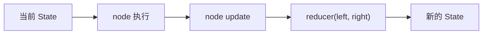

# 阶段 5 第 5 节：Reducer 是什么：状态字段怎么合并

## 本节定位

上一节我们学习了：

```text
State 是什么：Agent 为什么需要状态
```

你已经知道，LangGraph 里的 State 是：

```text
所有节点共享的、描述当前 Agent 流程快照的结构化数据。
```

但是只知道 State 还不够。

因为 Agent 流程会不断更新 State。

例如：

```text
用户输入节点更新 user_message
意图识别节点更新 intent
RAG 节点更新 rag_answer 和 retrieved_sources
字段提取节点更新 ticket_fields
缺失字段检查节点更新 missing_fields
用户确认节点更新 confirmation_status
创建工单节点更新 ticket_id 和 final_answer
```

现在问题来了：

```text
一个节点返回新的 State 更新时，LangGraph 怎么把它合并进旧 State？
```

更具体一点：

```text
旧 intent 是 unknown，新 intent 是 create_ticket，是覆盖还是追加？
旧 messages 有 3 条，新 messages 有 1 条，是覆盖还是追加？
旧 ticket_fields 有 title，新 ticket_fields 有 priority，是覆盖整个字典还是合并字段？
旧 retrieved_sources 有 3 条，新 retrieved_sources 有 2 条，是替换还是追加？
```

这些问题就是本节要学的：

```text
Reducer
```

本节依旧不急着写项目运行时代码。

因为 reducer 是一个非常重要的设计概念。

如果 reducer 设计错，后面 LangGraph 代码会出现这些问题：

```text
聊天历史被覆盖
列表重复追加
字段被误删
并行节点同时更新同一字段时报错
用户确认状态被旧值污染
工单草稿合并不清楚
checkpoint 保存的状态不可靠
```

所以这节先把基础讲透。

## 本节学习目标

学完这一节，你应该能做到：

1. 解释 reducer 是什么。
2. 解释 LangGraph 为什么需要 reducer。
3. 解释默认 reducer 的行为：覆盖旧值。
4. 解释自定义 reducer 的行为：按规则合并旧值和新值。
5. 解释 reducer 的两个参数 `left` 和 `right` 分别是什么。
6. 解释 `Annotated` 在 reducer 里的作用。
7. 解释 `operator.add` 为什么常用于列表追加。
8. 解释为什么 `messages` 不能简单覆盖。
9. 解释为什么 `messages` 后面更适合用 `add_messages`。
10. 判断智能工单 Agent 里哪些字段应该覆盖，哪些字段应该追加，哪些字段可能需要自定义合并。
11. 解释并行节点同时更新同一个字段时为什么需要 reducer。
12. 解释 reducer 设计错误会带来什么问题。

## 本节先不学什么

为了把 reducer 讲清楚，本节暂时不做这些事：

1. 不安装 `langgraph`。
2. 不修改 `projects/ai-service` 的运行时代码。
3. 不实现 `StateGraph` 最小图。
4. 不完整讲 `MessagesState`。
5. 不深入实现 `add_messages`。
6. 不讲 checkpoint 的代码细节。
7. 不讲 parallel fan-out 的完整代码。
8. 不调用真实模型。
9. 不启动 Qdrant 或 Milvus。

这些后面会继续学。

本节只解决一个底层问题：

```text
State 字段被更新时，新值和旧值到底怎么合并？
```

## 一、基础知识铺垫

### 1. 先从“更新一个字典”说起

Python 里最常见的数据结构之一是字典。

例如：

```python
state = {
    "intent": "unknown",
    "messages": ["用户：你好"],
}
```

如果你想更新 `intent`：

```python
state["intent"] = "create_ticket"
```

结果是：

```python
{
    "intent": "create_ticket",
    "messages": ["用户：你好"],
}
```

这个很好理解：

```text
新 intent 覆盖旧 intent。
```

但如果你想更新 `messages` 呢？

```python
state["messages"] = ["AI：你好，有什么可以帮你？"]
```

结果会变成：

```python
{
    "intent": "unknown",
    "messages": ["AI：你好，有什么可以帮你？"],
}
```

旧的用户消息没了。

但聊天历史通常不应该这样。

我们更想要：

```python
{
    "intent": "unknown",
    "messages": [
        "用户：你好",
        "AI：你好，有什么可以帮你？",
    ],
}
```

也就是说：

```text
intent 适合覆盖。
messages 适合追加。
```

这就是 reducer 要解决的第一个直觉问题：

```text
不同字段需要不同的更新规则。
```

### 2. 覆盖和追加是两种不同更新语义

覆盖表示：

```text
新值替代旧值。
```

例如：

```text
intent: unknown -> create_ticket
confirmation_status: waiting -> confirmed
final_answer: 旧回答 -> 新回答
error: None -> {"code": "..."}
```

追加表示：

```text
旧值保留，新值接到后面。
```

例如：

```text
messages: 旧消息列表 + 新消息列表
event_log: 旧事件日志 + 新事件日志
node_history: 旧节点路径 + 新节点路径
```

这两种语义完全不同。

如果该覆盖的字段被追加，会出问题。

如果该追加的字段被覆盖，也会出问题。

### 3. 为什么不能所有字段都覆盖

如果所有字段都覆盖，最明显的问题是聊天历史丢失。

例如：

```python
old_state = {
    "messages": [
        "用户：订单 1001 没发货",
        "AI：我可以帮你创建工单，请确认",
    ]
}

node_update = {
    "messages": ["用户：确认"]
}
```

如果覆盖：

```python
new_state = {
    "messages": ["用户：确认"]
}
```

前面发生的事丢了。

系统就不知道：

```text
用户确认的是哪件事。
```

所以有些字段不能覆盖。

### 4. 为什么不能所有字段都追加

如果所有字段都追加，也会出问题。

例如 `intent`：

```python
old_intent = "unknown"
new_intent = "create_ticket"
```

如果追加，可能变成：

```python
["unknown", "create_ticket"]
```

后续路由节点要判断：

```python
if intent == "create_ticket":
```

现在就判断不了。

再比如 `confirmation_status`：

```text
waiting -> confirmed
```

如果追加成：

```python
["waiting", "confirmed"]
```

后续 create_ticket 节点就会困惑：

```text
现在到底是 waiting 还是 confirmed？
```

所以有些字段必须覆盖。

### 5. 为什么有些字段需要“合并”

除了覆盖和追加，还有一种常见情况：

```text
合并
```

例如工单字段：

第一轮提取：

```json
{
  "title": "订单未发货",
  "order_id": "1001"
}
```

第二轮用户补充：

```json
{
  "priority": "high"
}
```

我们不想把旧字段全丢掉。

也不是简单列表追加。

我们想得到：

```json
{
  "title": "订单未发货",
  "order_id": "1001",
  "priority": "high"
}
```

这就是字典合并。

所以 State 字段的更新规则至少有几类：

```text
覆盖
追加
字典合并
去重追加
按 ID 更新
清空 / 重置
```

reducer 就是这些规则的表达方式。

### 6. reducer 这个词怎么理解

`reducer` 这个词初学时容易抽象。

可以先这样理解：

```text
reducer = 把旧值和新更新合并成最终值的函数。
```

它接收两个东西：

```text
left：旧值，也就是当前 State 里已经有的值
right：新值，也就是节点返回的更新值
```

然后返回：

```text
合并后的新值
```

伪代码：

```python
def reducer(left, right):
    new_value = 合并(left, right)
    return new_value
```

在 LangGraph 里，每个 State 字段都可以有自己的 reducer。

例如：

```text
intent 字段：默认覆盖
messages 字段：追加或 add_messages
ticket_fields 字段：字典合并
node_history 字段：列表追加
error 字段：默认覆盖
```

### 7. reducer 和数组里的 reduce 有关系吗

Python 里也有 `functools.reduce`。

例如：

```python
from functools import reduce

numbers = [1, 2, 3, 4]
total = reduce(lambda left, right: left + right, numbers)
```

执行过程大概是：

```text
1 + 2 = 3
3 + 3 = 6
6 + 4 = 10
```

它也是把多个值逐步合并成一个值。

LangGraph reducer 的思想类似：

```text
旧 State 字段值 + 节点更新值 -> 新 State 字段值
```

但不要把它和大数据里的 MapReduce 混为一谈。

本节说的 reducer，重点是：

```text
State 字段更新规则。
```

### 8. reducer 的两个参数：left 和 right

LangGraph 官方文档里 reducer 是一个二元函数。

也就是两个参数：

```text
left
right
```

可以这样记：

```text
left = 当前 State 里已有的旧值
right = 节点刚返回的新更新
```

例如：

```python
def append_list(left: list[str], right: list[str]) -> list[str]:
    return left + right
```

如果当前 State 是：

```python
{"tags": ["draft"]}
```

节点返回：

```python
{"tags": ["review"]}
```

那么 reducer 调用相当于：

```python
append_list(left=["draft"], right=["review"])
```

返回：

```python
["draft", "review"]
```

### 9. 默认 reducer 是什么

如果你没有给某个字段指定 reducer，LangGraph 默认行为是：

```text
覆盖。
```

也就是：

```python
def default_reducer(left, right):
    return right
```

它忽略旧值，保留新值。

这对很多字段是合理的：

```text
intent
final_answer
confirmation_status
ticket_id
error
current_status
```

因为这些字段通常表示当前最新状态。

### 10. 自定义 reducer 是什么

自定义 reducer 就是你自己定义合并规则。

例如列表追加：

```python
def append_list(left: list[str], right: list[str]) -> list[str]:
    return left + right
```

字典合并：

```python
def merge_dict(left: dict, right: dict) -> dict:
    return {**left, **right}
```

去重追加：

```python
def append_unique(left: list[str], right: list[str]) -> list[str]:
    result = list(left)
    for item in right:
        if item not in result:
            result.append(item)
    return result
```

这些函数都符合 reducer 的形状：

```text
旧值 + 新值 -> 合并后的值
```

### 11. `Annotated` 是什么

`Annotated` 是 Python 类型提示里的一个工具。

它的作用是：

```text
给某个类型额外附加 metadata。
```

例如：

```python
from typing import Annotated

name: Annotated[str, "这是用户名"]
```

对普通 Python 类型检查来说，它还是 `str`。

但额外的 `"这是用户名"` 可以被某些库读取。

LangGraph 就利用这个能力：

```python
messages: Annotated[list[str], append_list]
```

意思是：

```text
messages 的类型是 list[str]。
LangGraph 额外读取 append_list 作为这个字段的 reducer。
```

所以你可以这样理解：

```text
Annotated 不是 reducer。
Annotated 是把 reducer 挂到字段上的方式。
```

### 12. `operator.add` 是什么

`operator.add` 是 Python 标准库 `operator` 模块里的函数。

它大概等价于：

```python
def add(a, b):
    return a + b
```

例如：

```python
operator.add(1, 2)          # 3
operator.add("a", "b")      # "ab"
operator.add([1], [2, 3])   # [1, 2, 3]
```

在 LangGraph 里常见写法：

```python
from operator import add
from typing import Annotated
from typing_extensions import TypedDict

class State(TypedDict):
    messages: Annotated[list[str], add]
```

如果旧 messages 是：

```python
["用户：你好"]
```

节点返回：

```python
["AI：你好"]
```

`add` 会得到：

```python
["用户：你好", "AI：你好"]
```

### 13. `operator.add` 不是永远正确

`operator.add` 很方便，但不能乱用。

它对列表的行为是拼接。

如果节点重复返回同样的列表，结果会重复。

例如：

```python
left = ["a"]
right = ["a"]
left + right
```

结果是：

```python
["a", "a"]
```

这对某些日志字段可能可以接受。

但对需要去重的来源列表就不一定合适。

例如 `retrieved_sources`：

```text
同一个文档来源重复出现，可能不希望重复展示。
```

这时可能要自定义去重 reducer。

所以：

```text
operator.add 适合“允许追加，允许重复”的列表。
不适合所有列表。
```

### 14. 为什么 messages 更特殊

`messages` 看起来像列表，似乎可以用 `operator.add`。

但官方文档提醒，消息列表有额外复杂性：

```text
有时要追加新消息。
有时要更新已有消息。
有时输入可能是 LangChain Message 对象。
有时输入可能是 OpenAI 风格 dict。
需要根据消息 ID 处理更新。
```

所以 LangGraph 提供了预置的：

```python
add_messages
```

以及更方便的：

```python
MessagesState
```

本节先不深入实现。

第 6 节会专门学习：

```text
MessagesState：多轮对话消息怎么保存
```

本节先记住：

```text
messages 不能简单覆盖。
operator.add 可以做简单追加。
真实聊天消息更推荐 add_messages / MessagesState。
```

### 15. 并行节点为什么更需要 reducer

LangGraph 支持图里某些节点并行执行。

例如：

```text
START
  -> retrieve_policy
  -> retrieve_order_doc
```

两个节点都可能返回：

```python
{"retrieved_sources": [...]}
```

如果同一个 super-step 里多个节点同时更新同一个字段，而这个字段没有 reducer，LangGraph 不知道该怎么合并。

它不能随便选一个覆盖另一个。

因为这样会丢数据。

所以并行场景更需要 reducer。

例如：

```python
retrieved_sources: Annotated[list[RetrievedSource], add]
```

或者更严格：

```python
retrieved_sources: Annotated[list[RetrievedSource], merge_sources_by_id]
```

官方错误文档里也提到，如果并行节点更新同一个 state key，需要为相关字段定义 reducer。

## 二、本节主题系统讲解

### 1. LangGraph State 更新的完整过程

LangGraph 的状态更新可以想成四步：

```text
1. 节点读取当前 State。
2. 节点执行自己的动作。
3. 节点返回局部 State 更新。
4. LangGraph 用对应字段的 reducer 把更新合并进 State。
```

画成流程：



具体一点：

```text
当前 State:
  messages = ["用户：你好"]

节点返回:
  messages = ["AI：你好"]

reducer:
  operator.add(left=["用户：你好"], right=["AI：你好"])

新的 State:
  messages = ["用户：你好", "AI：你好"]
```

### 2. Reducer 的官方核心定义

用自己的话总结官方文档：

```text
State 由 schema 和 reducer 函数组成。
schema 定义字段。
reducer 定义字段收到节点更新时怎么应用。
每个 State key 都可以有自己的 reducer。
没有显式 reducer 时，默认覆盖。
```

这说明 reducer 不是可有可无的小功能。

它是 State 设计的一部分。

写 State schema 时，不只是写：

```text
字段名和类型
```

还要考虑：

```text
这个字段怎么更新？
```

### 3. 默认覆盖适合哪些字段

默认覆盖适合表达“当前最新值”的字段。

智能工单 Agent 里这些字段通常适合覆盖：

```text
user_message
intent
current_status
confirmation_status
missing_fields
final_answer
ticket_id
error
```

逐个看。

#### user_message

每轮用户输入都是当前输入。

如果新一轮用户说：

```text
确认
```

`user_message` 就应该从上一轮：

```text
订单 1001 一直没发货
```

覆盖成：

```text
确认
```

历史消息可以在 `messages` 里保存。

`user_message` 表示当前轮输入。

#### intent

`intent` 通常表示当前判断出的意图。

如果新一轮重新识别，应该以最新结果为准。

不要把多个 intent 追加在一起。

#### confirmation_status

确认状态也应该覆盖。

例如：

```text
waiting -> confirmed
```

它表达当前确认状态，不是确认状态历史。

如果需要历史，可以另设 `event_log`。

#### final_answer

最终回答通常是当前要返回给用户的文本。

它应该覆盖旧回答。

否则用户可能收到旧内容混在一起。

### 4. 追加适合哪些字段

追加适合表达“历史轨迹”的字段。

例如：

```text
messages
node_history
event_log
debug_steps
```

#### messages

聊天历史需要保留前后顺序。

所以每次新增消息通常是追加。

但真实 messages 更适合 `add_messages`，下一节细讲。

#### node_history

如果你想记录图走过哪些节点：

```text
["classify_intent", "extract_ticket_fields", "ask_confirmation"]
```

每个节点执行后可以追加自己的名字。

这类字段适合追加。

#### event_log

如果你想记录重要事件：

```text
intent_classified
fields_extracted
user_confirmed
ticket_created
```

也适合追加。

但这类日志字段要注意不要无限增长。

真实生产环境可能更适合写日志系统，而不是全部放进 State。

### 5. 字典合并适合哪些字段

字典合并适合表达“逐步补全”的业务对象。

智能工单里最典型的是：

```text
ticket_fields
```

第一轮：

```json
{
  "title": "订单未发货",
  "order_id": "1001"
}
```

第二轮补充：

```json
{
  "priority": "high"
}
```

希望合并成：

```json
{
  "title": "订单未发货",
  "order_id": "1001",
  "priority": "high"
}
```

学习版 reducer：

```python
def merge_ticket_fields(left: dict, right: dict) -> dict:
    return {**left, **right}
```

这个规则表示：

```text
保留旧字段。
新字段补进来。
如果同名字段出现，以新值为准。
```

### 6. 字典合并也不是永远正确

字典合并看起来很好，但也有风险。

例如旧字段：

```json
{
  "priority": "normal"
}
```

新字段：

```json
{
  "priority": "high"
}
```

合并后是：

```json
{
  "priority": "high"
}
```

这是否正确？

要看业务语义。

如果用户明确说“改成高优先级”，那么正确。

如果模型误提取出 high，就可能覆盖了旧值。

所以复杂业务里可能需要更严格的 reducer：

```text
只有用户明确修改时才覆盖。
字段置信度低时不覆盖。
敏感字段不允许模型自动覆盖。
需要记录字段来源。
```

初学阶段先理解基本合并。

后面做真实工单流程时，再根据需求细化。

### 7. 去重追加适合哪些字段

有些列表需要追加，但不想重复。

例如来源列表：

```text
retrieved_sources
```

RAG 多次检索可能拿到同一文档。

如果直接 `operator.add`：

```python
["refund-policy.md", "refund-policy.md"]
```

用户看到会很怪。

可以设计去重 reducer：

```python
def merge_sources(left: list[dict], right: list[dict]) -> list[dict]:
    seen = set()
    result = []
    for source in left + right:
        key = source.get("chunk_id") or source.get("source")
        if key in seen:
            continue
        seen.add(key)
        result.append(source)
    return result
```

注意这只是学习示例。

真实代码要配合我们已有的 RAG schema。

### 8. 清空和重置怎么办

如果一个字段有 reducer，默认更新可能会被合并。

例如：

```python
messages: Annotated[list[str], add]
```

如果你返回：

```python
{"messages": []}
```

通过 `add` 合并后：

```python
old_messages + []
```

旧消息还在。

这时如果你真的想清空，就需要绕过 reducer。

LangGraph 提供了 `Overwrite`，可以直接替换字段值。

本节不深入代码。

先知道：

```text
有 reducer 的字段，普通更新会走合并规则。
如果要强制重置，要用专门机制。
```

### 9. Reducer 和 node 返回局部更新的关系

上一节我们讲过：

```text
node 通常返回局部 State 更新。
```

例如：

```python
def classify_intent(state):
    return {"intent": "create_ticket"}
```

reducer 就负责把这份局部更新应用到整体 State。

如果节点返回完整 State，可能造成问题：

```python
def bad_node(state):
    state["intent"] = "create_ticket"
    return state
```

这会让 LangGraph 认为你更新了很多字段。

如果有并行节点，还可能造成同一字段冲突。

更好的写法是：

```python
def good_node(state):
    return {"intent": "create_ticket"}
```

本节先记住：

```text
节点返回自己改变的字段。
reducer 负责把这些字段合并进整体 State。
```

### 10. Reducer 和并发冲突

假设两个并行节点都更新：

```python
{"retrieved_sources": [...]}
```

如果没有 reducer，LangGraph 不知道：

```text
保留第一个？
保留第二个？
拼在一起？
去重后合并？
按分数排序？
```

这不是框架能替你猜的。

所以需要你定义：

```text
retrieved_sources 到底怎么合并。
```

这就是 reducer 的工程意义：

```text
把模糊的合并行为变成显式规则。
```

### 11. 智能工单 Agent 字段合并建议表

下面是一张学习阶段的初版建议。

| 字段 | 建议合并方式 | 原因 |
| --- | --- | --- |
| `user_message` | 覆盖 | 表示当前轮用户输入 |
| `messages` | `add_messages` | 多轮消息要保留历史，并支持按 ID 更新 |
| `trace_id` | 覆盖 | 当前请求追踪 ID |
| `intent` | 覆盖 | 当前意图判断以最新为准 |
| `rag_answer` | 覆盖 | 当前 RAG 回答以最新为准 |
| `retrieved_sources` | 去重追加或覆盖 | 如果多路检索可去重合并；单次回答可覆盖 |
| `ticket_fields` | 字典合并 | 工单字段会逐步补全 |
| `missing_fields` | 覆盖 | 每次检查结果以最新为准 |
| `confirmation_status` | 覆盖 | 当前确认状态以最新为准 |
| `ticket_id` | 覆盖 | 创建成功后保存最新工单 ID |
| `final_answer` | 覆盖 | 当前要返回的最终回答 |
| `error` | 覆盖 | 当前错误状态以最新为准 |
| `node_history` | 追加 | 用于记录节点执行轨迹 |

这张表不是最终代码。

它是后面设计 `TicketAgentState` 时的判断依据。

### 12. `messages` 为什么留到下一节细讲

因为 `messages` 是 reducer 学习里最重要也最容易误解的字段。

它不仅是列表。

它还是模型上下文。

它里面可能有：

```text
HumanMessage
AIMessage
SystemMessage
ToolMessage
```

后面工具调用时，消息还可能有：

```text
tool call id
tool result
message id
```

如果只是用 `operator.add`，有些场景会不够。

所以第 6 节会专门讲：

```text
MessagesState：多轮对话消息怎么保存
```

本节先把 reducer 的基础打牢。

## 三、从代码角度理解 reducer

### 1. 默认覆盖示例

学习代码：

```python
from typing_extensions import TypedDict

class State(TypedDict):
    intent: str
    final_answer: str

def classify_node(state: State):
    return {"intent": "create_ticket"}
```

假设旧 State：

```python
{
    "intent": "unknown",
    "final_answer": "",
}
```

节点返回：

```python
{
    "intent": "create_ticket"
}
```

合并后：

```python
{
    "intent": "create_ticket",
    "final_answer": "",
}
```

`intent` 被覆盖。

`final_answer` 没有更新，保留旧值。

### 2. 列表追加示例

学习代码：

```python
from operator import add
from typing import Annotated
from typing_extensions import TypedDict

class State(TypedDict):
    node_history: Annotated[list[str], add]

def node_a(state: State):
    return {"node_history": ["classify_intent"]}

def node_b(state: State):
    return {"node_history": ["extract_ticket_fields"]}
```

如果初始：

```python
{"node_history": []}
```

执行 `node_a` 后：

```python
{"node_history": ["classify_intent"]}
```

执行 `node_b` 后：

```python
{"node_history": ["classify_intent", "extract_ticket_fields"]}
```

这就是 `operator.add` 对列表的效果。

### 3. 字典合并示例

学习代码：

```python
from typing import Annotated
from typing_extensions import TypedDict

def merge_dict(left: dict, right: dict) -> dict:
    return {**left, **right}

class State(TypedDict):
    ticket_fields: Annotated[dict, merge_dict]
```

旧值：

```python
{
    "title": "订单未发货",
    "order_id": "1001",
}
```

新更新：

```python
{
    "priority": "high",
}
```

合并后：

```python
{
    "title": "订单未发货",
    "order_id": "1001",
    "priority": "high",
}
```

### 4. 去重追加示例

学习代码：

```python
from typing import Annotated
from typing_extensions import TypedDict

def append_unique(left: list[str], right: list[str]) -> list[str]:
    result = list(left)
    for item in right:
        if item not in result:
            result.append(item)
    return result

class State(TypedDict):
    source_files: Annotated[list[str], append_unique]
```

旧值：

```python
["refund-policy.md", "shipping-policy.md"]
```

新值：

```python
["refund-policy.md", "account-security-faq.md"]
```

合并后：

```python
[
    "refund-policy.md",
    "shipping-policy.md",
    "account-security-faq.md",
]
```

### 5. Reducer 函数应该保持简单

reducer 最好是简单、确定、可测试的函数。

不要在 reducer 里做这些事情：

```text
调用模型
调用数据库
调用 Java API
写日志副作用
读取环境变量
做复杂业务决策
```

reducer 应该专注于：

```text
合并旧值和新值。
```

复杂业务逻辑应该放在 node 或 service 里。

### 6. Reducer 最好是纯函数

纯函数可以理解为：

```text
同样的输入，总是返回同样的输出。
不修改外部世界。
不依赖隐藏状态。
```

例如：

```python
def merge_dict(left: dict, right: dict) -> dict:
    return {**left, **right}
```

这个很好。

不好的 reducer：

```python
def bad_reducer(left, right):
    save_to_database(right)
    return right
```

这把状态合并和外部副作用混在一起了。

后面调试会很难。

### 7. Reducer 不应该偷偷修改 left

例如：

```python
def bad_append(left: list[str], right: list[str]) -> list[str]:
    left.extend(right)
    return left
```

这会原地修改旧列表。

有时能跑，但不推荐初学时这样写。

更清楚的方式：

```python
def good_append(left: list[str], right: list[str]) -> list[str]:
    return left + right
```

原因是：

```text
返回新值更容易推理。
不容易影响其他引用。
测试更清楚。
```

### 8. reducer 和类型要匹配

如果字段是：

```python
node_history: Annotated[list[str], add]
```

那么节点应该返回：

```python
{"node_history": ["classify_intent"]}
```

不要返回：

```python
{"node_history": "classify_intent"}
```

因为 `list + str` 会报错。

再比如：

```python
ticket_fields: Annotated[dict, merge_dict]
```

节点应该返回字典：

```python
{"ticket_fields": {"priority": "high"}}
```

不要返回：

```python
{"ticket_fields": "priority=high"}
```

reducer 对类型很敏感。

State schema 写清楚，节点返回也要遵守。

## 四、智能工单 Agent 的 reducer 设计草图

### 1. 学习版 State 草图

结合上一节的 State，学习版可以这样看：

```python
from operator import add
from typing import Annotated, Literal
from typing_extensions import TypedDict

def merge_dict(left: dict, right: dict) -> dict:
    return {**left, **right}

def append_unique_strings(left: list[str], right: list[str]) -> list[str]:
    result = list(left)
    for item in right:
        if item not in result:
            result.append(item)
    return result

class TicketAgentState(TypedDict, total=False):
    user_message: str
    trace_id: str

    intent: Literal["rag_question", "query_order", "create_ticket", "unknown"]

    messages: Annotated[list, add]
    node_history: Annotated[list[str], add]
    source_files: Annotated[list[str], append_unique_strings]

    ticket_fields: Annotated[dict, merge_dict]
    missing_fields: list[str]
    confirmation_status: Literal["none", "waiting", "confirmed", "rejected"]

    ticket_id: str
    final_answer: str
    error: dict
```

注意：

```text
这是学习版，不是最终项目代码。
messages 后面更可能改成 add_messages 或 MessagesState。
```

### 2. 为什么 `user_message` 覆盖

`user_message` 表示本轮用户输入。

第一轮：

```text
订单 1001 一直没发货
```

第二轮：

```text
确认
```

第二轮时，`user_message` 应该是：

```text
确认
```

旧输入应该进入 `messages` 历史，而不是继续占据 `user_message`。

### 3. 为什么 `intent` 覆盖

`intent` 是当前路由判断。

每次识别都应该以最新结果为准。

如果你想分析历史意图变化，可以另设：

```text
intent_history
```

但主字段 `intent` 应该表示当前意图。

### 4. 为什么 `ticket_fields` 可能合并

工单字段经常逐步补全。

第一轮用户给了：

```text
订单号和问题描述
```

第二轮用户补：

```text
优先级
```

如果覆盖整个 `ticket_fields`，第一轮字段会丢。

所以它适合字典合并。

但如果后面发现覆盖风险大，可以改成更严格的 merge 规则。

### 5. 为什么 `missing_fields` 覆盖

`missing_fields` 是每次检查后的结果。

例如第一次检查：

```python
["priority"]
```

用户补充后再次检查：

```python
[]
```

这时候应该覆盖。

不要追加成：

```python
["priority"]
```

否则系统会一直以为还缺 priority。

### 6. 为什么 `confirmation_status` 覆盖

确认状态表示当前状态。

```text
none -> waiting -> confirmed
```

它不是历史日志。

所以应该覆盖。

如果要记录用户确认事件，可以追加到 `event_log`。

### 7. 为什么 `node_history` 追加

`node_history` 是轨迹。

每执行一个节点就追加一个名字：

```python
["classify_intent", "extract_ticket_fields", "ask_user_confirmation"]
```

它天然是历史。

所以适合追加。

不过真实项目不一定把完整 node_history 存进 State。

也可以只打日志。

### 8. 为什么 `retrieved_sources` 要谨慎

RAG 来源字段有两种设计。

如果每次回答只关心当前检索结果：

```text
覆盖即可。
```

如果一个流程里有多个检索节点，并且需要汇总来源：

```text
去重追加更合适。
```

所以 `retrieved_sources` 的 reducer 要看业务流程。

不要机械决定。

### 9. 为什么 `error` 覆盖

`error` 通常表示当前错误。

例如创建工单失败：

```json
{
  "code": "JAVA_API_TIMEOUT",
  "message": "创建工单超时"
}
```

它应该覆盖旧错误。

如果你要记录所有错误历史，可以额外设计：

```text
error_history
```

但主 `error` 字段应该表示当前错误。

## 五、Reducer 常见错误

### 1. 忘记给 messages reducer

错误：

```python
class State(TypedDict):
    messages: list
```

问题：

```text
每次节点返回 messages 时，旧消息会被覆盖。
多轮对话上下文丢失。
```

正确方向：

```python
messages: Annotated[list, add]
```

或者更推荐：

```python
messages: Annotated[list[AnyMessage], add_messages]
```

后面第 6 节细讲。

### 2. 对所有列表都用 `operator.add`

错误：

```python
retrieved_sources: Annotated[list, add]
```

不一定错，但可能导致重复来源。

如果来源需要去重，就要自定义 reducer。

### 3. 对当前状态字段用追加

错误：

```python
confirmation_status: Annotated[list[str], add]
```

问题：

```text
当前确认状态变成历史列表。
后续判断变复杂。
```

正确：

```text
confirmation_status 默认覆盖。
```

### 4. reducer 做了太多业务逻辑

错误：

```python
def merge_ticket_fields(left, right):
    if should_call_model_again(left, right):
        ...
```

reducer 不应该负责模型调用或复杂业务决策。

它应该只合并字段。

复杂逻辑放 node 或 service。

### 5. reducer 修改原对象

错误：

```python
def append(left, right):
    left.extend(right)
    return left
```

这会让状态变化更难推理。

学习阶段优先写：

```python
return left + right
```

或者构造新对象。

### 6. 节点返回类型和 reducer 不匹配

错误：

```python
node_history: Annotated[list[str], add]

def node(state):
    return {"node_history": "classify_intent"}
```

`list + str` 不匹配。

正确：

```python
return {"node_history": ["classify_intent"]}
```

### 7. 把 reducer 当成路由逻辑

reducer 不负责决定下一步去哪。

下一步去哪是 edge / conditional edge 的职责。

reducer 只负责：

```text
这个字段的新旧值怎么合并。
```

### 8. 忽略并行节点冲突

如果以后有并行节点同时更新同一个字段，没有 reducer 可能会报错。

例如：

```text
parallel_rag_policy -> retrieved_sources
parallel_rag_order -> retrieved_sources
```

这时必须明确合并规则。

## 六、本节和后续课程的关系

### 1. 第 6 节：MessagesState

这一节只讲了：

```text
messages 不能简单覆盖。
```

下一节会深入：

```text
MessagesState
add_messages
HumanMessage / AIMessage / ToolMessage
为什么消息要按 ID 更新
多轮对话消息怎么保存
```

### 2. 第 7 节：StateGraph 最小图

第 7 节开始会真正写最小图。

那时你会看到：

```python
builder = StateGraph(State)
```

如果 State 里有：

```python
messages: Annotated[list, add]
```

你就知道：

```text
这是给 messages 字段设置 reducer。
```

### 3. 第 8-10 节：node、edge、conditional edge

node 会返回 State 更新。

edge 会决定下一步。

conditional edge 会根据 State 路由。

而 reducer 会决定：

```text
node 返回的更新如何进入 State。
```

这四者要一起理解。

### 4. 第 13 节以后：智能工单业务落地

等到真正做智能工单 Agent 时，reducer 会影响：

```text
工单字段逐步补全
多轮 messages 保存
RAG 来源是否去重
节点执行轨迹是否记录
错误历史是否保存
确认状态是否覆盖
```

如果现在没理解 reducer，后面调试会很痛苦。

## 七、本节练习与参考答案

### 练习 1：判断字段合并方式

请判断下面字段更适合覆盖、追加、字典合并还是去重追加：

```text
1. intent
2. messages
3. ticket_fields
4. missing_fields
5. source_files
6. confirmation_status
7. node_history
8. final_answer
```

参考答案：

```text
1. intent：覆盖
2. messages：add_messages，学习阶段可理解为追加
3. ticket_fields：字典合并
4. missing_fields：覆盖
5. source_files：去重追加
6. confirmation_status：覆盖
7. node_history：追加
8. final_answer：覆盖
```

### 练习 2：解释 reducer 的 left 和 right

参考答案：

```text
left 是当前 State 里已经存在的旧值，right 是节点刚返回的更新值。reducer 接收 left 和 right，返回合并后的新值。
```

### 练习 3：默认 reducer 是什么行为

参考答案：

```text
默认 reducer 是覆盖。也就是忽略旧值 left，直接把 right 作为这个字段的新值。
```

### 练习 4：为什么 messages 不应该默认覆盖

参考答案：

```text
messages 保存多轮对话历史。如果每次节点返回新消息都覆盖旧 messages，前面的用户输入、AI 回复、工具结果都会丢失，模型无法理解上下文，用户下一轮“确认”也无法被正确解释。
```

### 练习 5：写一个字典合并 reducer

参考答案：

```python
def merge_dict(left: dict, right: dict) -> dict:
    return {**left, **right}
```

含义：

```text
保留旧字段，把新字段合并进来；如果同名字段冲突，以新值为准。
```

### 练习 6：写一个去重追加 reducer

参考答案：

```python
def append_unique(left: list[str], right: list[str]) -> list[str]:
    result = list(left)
    for item in right:
        if item not in result:
            result.append(item)
    return result
```

### 练习 7：解释 `Annotated[list[str], add]`

参考答案：

```text
字段的实际类型是 list[str]，LangGraph 会读取 Annotated 里的 add，把它当作这个字段的 reducer。也就是说，这个字段更新时不覆盖，而是用 add 把旧列表和新列表拼接起来。
```

### 练习 8：为什么 `missing_fields` 应该覆盖

参考答案：

```text
missing_fields 表示当前字段检查结果。第一次可能缺 priority，用户补充后再次检查应该变成空列表。如果追加，旧的 priority 会一直留着，流程会误以为字段仍然缺失。
```

### 练习 9：为什么 reducer 不应该调用模型

参考答案：

```text
reducer 只负责合并旧值和新值，应该简单、确定、可测试。调用模型属于复杂业务动作和外部依赖，应该放在 node 或 service 中，而不是放在 reducer 里。
```

### 练习 10：并行节点为什么需要 reducer

参考答案：

```text
如果多个并行节点在同一个执行步骤里更新同一个 State 字段，没有 reducer 时 LangGraph 不知道应该保留哪个值或如何合并，因此可能报并发更新错误。reducer 可以明确告诉 LangGraph 如何把多个更新合并成一个值。
```

## 八、自测题与答案

### 自测 1：Reducer 是什么？

答案：

```text
Reducer 是用于合并 State 字段旧值和节点新更新的函数。它决定某个字段收到更新时是覆盖、追加、合并还是其他规则。
```

### 自测 2：LangGraph 里每个字段都必须写 reducer 吗？

答案：

```text
不必须。没有显式 reducer 时，默认就是覆盖。只有需要追加、合并、去重或并行合并的字段才需要自定义 reducer。
```

### 自测 3：默认 reducer 适合哪些字段？

答案：

```text
适合表示当前最新值的字段，例如 intent、confirmation_status、missing_fields、final_answer、ticket_id、error。
```

### 自测 4：`operator.add` 对列表做什么？

答案：

```text
它相当于使用 + 运算符。对列表来说是拼接，例如 [1] + [2, 3] 得到 [1, 2, 3]。
```

### 自测 5：`Annotated` 在 LangGraph reducer 里有什么作用？

答案：

```text
Annotated 用来给 State 字段附加 metadata。LangGraph 会读取这个 metadata，把其中的函数作为该字段的 reducer。
```

### 自测 6：`Annotated[list[str], add]` 里真正的字段类型是什么？

答案：

```text
真正的字段类型仍然是 list[str]，add 是额外 metadata，LangGraph 用它作为合并规则。
```

### 自测 7：为什么 `ticket_fields` 可能需要字典合并？

答案：

```text
因为工单字段可能多轮逐步补全。第一轮有 title 和 order_id，第二轮补 priority。如果直接覆盖整个字典，旧字段会丢；字典合并可以保留旧字段并加入新字段。
```

### 自测 8：为什么不能所有列表都用 `operator.add`？

答案：

```text
operator.add 会简单拼接列表，可能产生重复项。对于来源列表、引用列表等需要去重或排序的字段，应该考虑自定义 reducer。
```

### 自测 9：`messages` 最终更推荐用什么？

答案：

```text
更推荐用 LangGraph 的 add_messages 或 MessagesState，因为它不仅能追加新消息，还能根据消息 ID 更新已有消息，并处理消息格式反序列化。
```

### 自测 10：Reducer 和 conditional edge 的区别是什么？

答案：

```text
Reducer 负责合并 State 字段的新旧值；conditional edge 负责根据 State 决定下一步走哪个节点。一个管数据合并，一个管流程路由。
```

### 自测 11：Reducer 设计错可能导致什么问题？

答案：

```text
可能导致聊天历史丢失、字段重复、工单草稿被覆盖、确认状态混乱、并行更新报错、checkpoint 保存错误状态、测试难以稳定断言。
```

### 自测 12：本节最核心的一句话是什么？

答案：

```text
Reducer 是 State 字段的合并规则，它决定节点返回的更新如何变成新的 State。
```

## 九、本节小结

这一节的核心不是背 `Annotated` 写法，而是理解：

```text
State 字段不是都用同一种方式更新。
```

你要真正掌握这几句话：

```text
默认 reducer 是覆盖。
自定义 reducer 可以追加、合并、去重。
reducer 接收 left 和 right，返回合并后的新值。
Annotated 是把 reducer 挂到字段上的 Python 类型提示方式。
operator.add 对列表是拼接，但不适合所有列表。
messages 不能简单覆盖，后面要学 add_messages / MessagesState。
ticket_fields 这类逐步补全的数据可能需要字典合并。
confirmation_status、intent、final_answer 这类当前值通常应该覆盖。
```

对智能工单 Agent 来说，reducer 会直接影响：

```text
多轮消息是否保留
工单字段是否逐步补全
缺失字段是否正确刷新
用户确认状态是否可靠
RAG 来源是否重复
节点轨迹是否能记录
并行更新是否安全
```

下一节会进入：

```text
阶段 5 第 6 节：MessagesState：多轮对话消息怎么保存
```

那一节会专门讲：

```text
messages 字段为什么这么特殊。
add_messages 和 operator.add 有什么区别。
多轮对话、工具消息、人工修改消息该怎么保存。
```

## 参考资料

- [LangGraph Graph API overview](https://docs.langchain.com/oss/python/langgraph/graph-api)
  - 用途：确认 State 由 schema 和 reducer 组成、每个 key 有独立 reducer、默认覆盖、自定义 reducer、`add_messages` 和 `MessagesState` 的官方概念。

- [LangGraph Use the Graph API](https://docs.langchain.com/oss/python/langgraph/use-graph-api)
  - 用途：确认节点应返回 State 更新、如何用 reducer 控制状态更新、如何用 `Annotated` 和 `add_messages` 定义消息字段。

- [LangGraph INVALID_CONCURRENT_GRAPH_UPDATE](https://docs.langchain.com/oss/python/langgraph/errors/INVALID_CONCURRENT_GRAPH_UPDATE)
  - 用途：理解并行节点同时更新同一 State key 时，为什么需要定义 reducer 来解决合并不确定性。

- [Python typing.Annotated 官方文档](https://docs.python.org/3/library/typing.html#typing.Annotated)
  - 用途：理解 `Annotated[T, metadata]` 是标准 Python 类型提示能力，metadata 可由框架或工具解释。

- [Python operator 官方文档](https://docs.python.org/3/library/operator.html)
  - 用途：理解 `operator.add(x, y)` 等价于 `x + y`，列表场景下表现为拼接。
