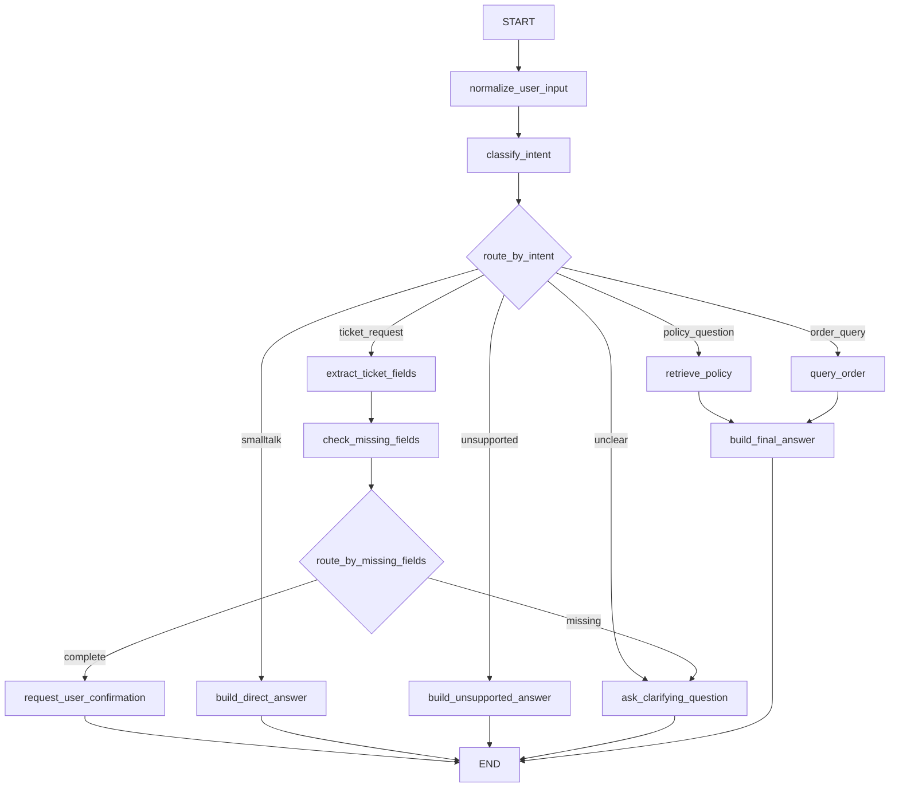
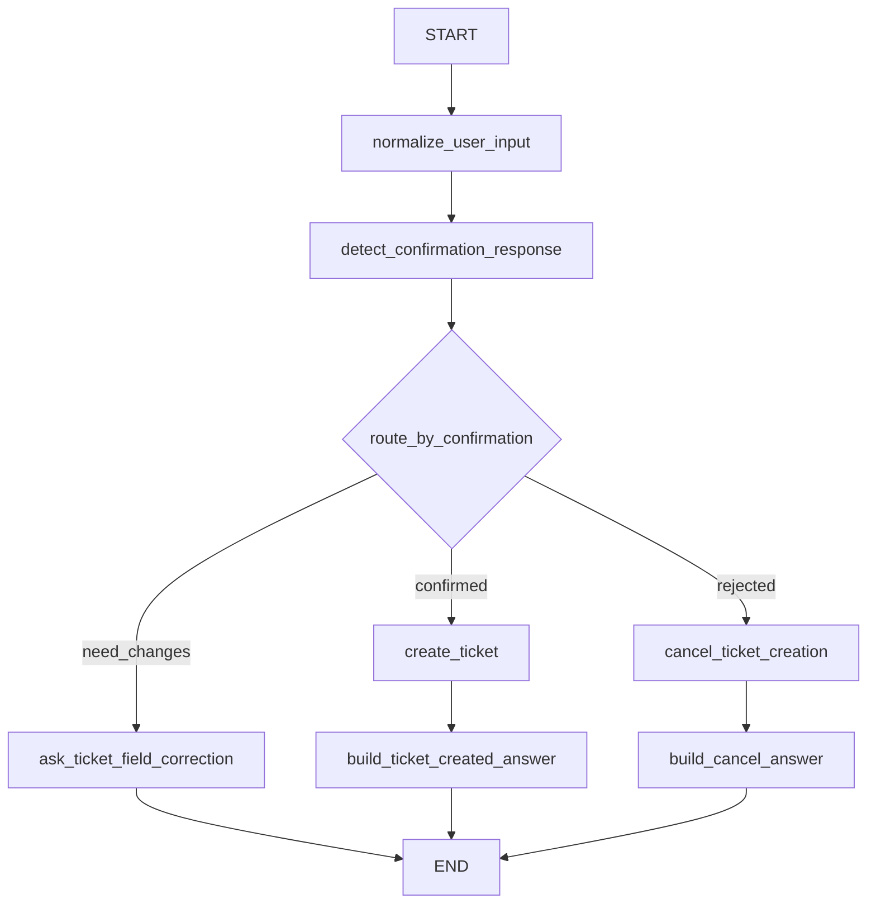

# 阶段 5 第 13 节：智能工单 Agent 总流程设计

## 本节定位

前 12 节我们主要在学 LangGraph 基础。

你已经学过：

```text
State
Reducer
MessagesState
StateGraph
node
edge
conditional edge
START
END
invoke
stream
```

这些知识解决的是：

```text
LangGraph 这套图执行系统怎么工作。
```

从本节开始，我们要把这些基础接到真正的项目主线：

```text
智能工单 Agent v1
```

也就是把你前面已经学过的内容组合起来：

```text
FastAPI AI 服务
+ LLM API
+ Tool Calling
+ Java mock 业务服务
+ 企业知识库 RAG
+ LangGraph
= 智能工单 Agent
```

第 13 节不是急着写代码。

第 13 节的任务是：

```text
先把智能工单 Agent 的业务流程设计清楚。
```

原因很简单：

如果流程没设计清楚，后面写代码会变成：

```text
今天写一个节点
明天加一个 if
后天补一个工具
最后所有东西缠在一起
```

这样的代码能跑一段时间，但很难讲清楚，也很难维护。

你现在的学习目标不是“勉强跑通一个 demo”。

你的目标是：

```text
真正理解一个 AI Agent 项目怎么从业务问题拆成 State、node、edge、tool、RAG、确认机制和测试。
```

所以这一节非常关键。

它是从“学 LangGraph API”切换到“设计一个 Agent 系统”的分界点。

## 本节学习目标

学完本节，你应该能解释清楚：

1. 智能工单 Agent v1 要解决什么业务问题。
2. 什么属于 v1 范围，什么暂时不做。
3. 一个用户问题进入 Agent 后，可能走哪些主路线。
4. 为什么要先识别意图。
5. 哪些问题应该走 RAG。
6. 哪些问题应该走订单查询工具。
7. 哪些问题应该进入工单创建流程。
8. 创建工单为什么必须有人类确认。
9. Agent State 里应该保存哪些字段。
10. 哪些步骤应该拆成 node。
11. 哪些连接应该用普通 edge。
12. 哪些连接应该用 conditional edge。
13. 智能工单 Agent v1 的整体图长什么样。
14. 第 14-22 节会如何按顺序实现这个 Agent。

## 本节先不学什么

本节暂时不做：

1. 不写完整 LangGraph 业务代码。
2. 不接真实大模型调用。
3. 不真实调用 Qdrant / Milvus。
4. 不启动 VMware。
5. 不启动 Java mock 服务。
6. 不实现 checkpoint。
7. 不实现 interrupt。
8. 不实现前端工作台。
9. 不做 LangSmith tracing。
10. 不做 Docker Compose。

这些后面会逐步来。

本节只做一件事：

```text
把智能工单 Agent v1 的业务流程设计清楚。
```

你要先会画图、会讲流程、会解释 State、会说明每个节点的职责。

再写代码才不会乱。

## 一、基础知识铺垫

### 1. 什么是工单

工单可以理解成：

```text
一条需要被客服、售后、运营或技术人员跟进处理的业务记录。
```

比如：

```text
用户投诉商家不发货
用户要求退款
用户反馈商品破损
用户说订单物流异常
用户需要人工客服介入
```

这些问题不是一句话就能完全解决。

它们通常需要记录：

```text
用户是谁
订单号是什么
问题类型是什么
问题描述是什么
严重程度是什么
是否已经确认创建
创建后的工单号是什么
```

所以工单不是普通聊天消息。

它是业务系统里的结构化记录。

### 2. 什么是智能工单 Agent

智能工单 Agent 可以理解成：

```text
一个能理解用户问题，并根据情况查知识库、查订单、追问缺失信息、请求用户确认、创建工单、生成最终回复的多步骤 AI 助手。
```

它不是单纯聊天机器人。

单纯聊天机器人可能是：

```text
用户输入
  -> 调模型
  -> 返回回答
```

智能工单 Agent 更像：

```text
用户输入
  -> 理解问题
  -> 判断意图
  -> 判断要查知识库、查订单、还是创建工单
  -> 必要时调用工具
  -> 必要时追问用户
  -> 写操作前请求确认
  -> 生成最终回复
```

所以它有明显的流程性。

这正是 LangGraph 适合它的原因。

### 3. 为什么不能只用一个大模型回答

如果只用一个大模型直接回答，可能会有这些问题：

```text
模型不知道真实订单状态
模型可能编造退款规则
模型可能没拿到知识库依据
模型可能直接说“已创建工单”但没有真的调用业务系统
模型可能在没有用户确认的情况下执行写操作
模型可能没有记录 trace_id 和中间状态
模型回答错了很难排查是哪一步错
```

智能工单 Agent 的核心价值不是“更会聊天”。

它的核心价值是：

```text
把 AI 能力放进可控的业务流程里。
```

也就是说：

```text
该查知识库时查知识库。
该查订单时查订单。
该创建工单时先确认再创建。
该拒绝或兜底时明确说明。
```

### 4. 智能工单 Agent 和普通客服系统的区别

普通客服系统一般更依赖固定规则。

比如：

```text
用户点“订单问题”
  -> 展示订单问题菜单
用户点“退款规则”
  -> 展示退款规则页面
```

智能工单 Agent 允许用户自然语言输入：

```text
我这个订单 1001 怎么还没到，能不能帮我处理一下？
```

Agent 要从一句话里判断：

```text
用户在问订单物流
用户可能有投诉/处理诉求
订单号是 1001
可能需要先查订单
查完后可能需要判断是否能创建工单
```

这就是自然语言理解 + 业务流程的结合。

### 5. 为什么要先设计流程

Agent 很容易写乱。

尤其是当你同时有：

```text
LLM
RAG
Tool Calling
Java 服务
用户确认
多轮对话
错误处理
```

如果没有流程设计，很容易写出这种代码：

```python
if "订单" in user_message:
    ...
elif "退款" in user_message:
    ...
elif "投诉" in user_message:
    ...
if should_call_tool:
    ...
if should_create_ticket:
    ...
```

短期能跑。

但长期会变成：

```text
分支越来越多
状态越来越乱
测试越来越难
错误越来越难定位
```

LangGraph 的价值就是把流程显式化。

你应该能画出：

```text
哪些节点
哪些边
哪些状态
哪些分支
哪些结束点
```

这就是本节要做的事。

### 6. workflow 和 agent 的区别

官方文档里把 workflow 和 agent 做了一个很重要的区分：

```text
workflow：路线更预先确定，按设计好的顺序执行。
agent：更动态，能自己决定过程和工具使用。
```

我们的智能工单 Agent v1 不会一上来做成完全自由的 Agent。

它会更偏：

```text
可控 workflow + 局部 agent 能力
```

也就是说：

```text
整体主路线由我们设计。
局部意图识别、总结回答、字段抽取可以使用 LLM。
工具调用和写操作由后端严格校验。
```

为什么这样设计？

因为客服和工单是业务系统。

业务系统不能让模型完全自由地乱走。

我们要让它：

```text
能智能判断，但边界可控。
```

### 7. 为什么 Graph API 适合这个项目

官方文档也说明，Graph API 适合：

```text
复杂分支
显式 State 管理
多个节点共享数据
需要可视化和调试的流程
```

智能工单 Agent 正好符合这些特点。

它会有多个分支：

```text
知识库问答
订单查询
工单创建
缺失字段追问
用户确认
错误兜底
```

它需要共享 State：

```text
用户输入
意图
订单号
订单结果
RAG 检索结果
工单字段
缺失字段
确认状态
最终回答
错误信息
trace_id
```

它需要调试：

```text
为什么走了这个分支？
哪个节点写错了字段？
有没有跳过确认？
有没有重复创建工单？
```

所以这个项目选择 LangGraph Graph API 是合理的。

### 8. 智能工单 Agent 的第一原则：读写分离

业务系统里最重要的安全原则之一：

```text
读操作和写操作要分开。
```

读操作：

```text
查订单
查知识库
查政策
查已有信息
```

写操作：

```text
创建工单
修改订单
退款
取消订单
发送通知
```

读操作通常风险较低。

写操作可能产生真实业务后果。

所以 v1 要遵守：

```text
查订单可以由 Agent 自动执行。
创建工单必须先让用户确认。
退款这类敏感操作不在 v1 自动执行。
```

你项目里当前工具注册表已经有类似概念：

```text
query_order：READ
create_ticket：WRITE
refund_order：SENSITIVE
```

第 13 节设计必须尊重这个边界。

### 9. 智能工单 Agent 的第二原则：模型建议，后端校验

模型可以做判断。

比如：

```text
用户意图是什么
应该查知识库还是查订单
工单字段可能是什么
最终回答怎么组织
```

但后端必须校验：

```text
工具名是否合法
工具参数是否合法
写操作是否已确认
订单结果字段是否符合 schema
工单字段是否完整
用户权限是否允许
```

也就是说：

```text
模型不能直接拥有最终执行权。
```

这和你阶段 3 学 Tool Calling 时的安全边界是一致的。

### 10. 智能工单 Agent 的第三原则：流程可以解释

一个真正能讲清楚的 Agent，不应该只说：

```text
我让模型处理了一下。
```

你应该能说：

```text
用户输入先进入 normalize_user_input。
然后 classify_intent 识别意图。
如果是政策问题，进入 RAG。
如果是订单问题，进入 query_order。
如果是创建工单，进入字段抽取。
字段缺失则追问。
字段完整则请求确认。
用户确认后再调用 Java mock 服务创建工单。
最后 build_final_answer 生成用户可读回答。
```

这才是你要达到的水平。

## 二、本节主题系统讲解

### 1. v1 的业务目标

智能工单 Agent v1 的目标是：

```text
做一个面向客服场景的 AI 助手，
它能根据用户自然语言输入，
在知识库问答、订单查询、工单创建之间做可控分流，
并在写操作前要求用户确认。
```

换成更具体的话：

```text
用户问规则 -> 查 RAG 知识库并回答。
用户问订单 -> 查 Java mock 订单服务并回答。
用户要投诉/售后处理 -> 收集工单字段，必要时追问，确认后创建工单。
用户问题不明确 -> 追问。
用户问题不支持 -> 兜底说明。
```

### 2. v1 暂时不做什么

v1 不做：

```text
真实退款
真实取消订单
复杂权限系统
多 Agent 协作
并行工具调用
长期记忆
生产级 LangSmith 监控
前端客服工作台
Docker Compose 一键部署
真实企业账号体系
```

这些不是不重要。

而是现在先做：

```text
一条边界清晰、可测试、能讲清楚的 Agent 主线。
```

如果 v1 做太大，你会同时被太多知识点淹没。

学习上更合理的是：

```text
先做可控 v1。
再逐步升级到生产化。
```

### 3. v1 的输入

最小输入可以是：

```python
{
    "user_message": "我的订单 1001 怎么还没到？",
    "messages": [...],
    "trace_id": "...",
}
```

其中：

```text
user_message：当前用户这一轮输入。
messages：多轮对话历史。
trace_id：链路追踪 ID。
```

后面可以扩展：

```text
user_id
session_id
permission_group
channel
locale
```

但 v1 先不要太复杂。

### 4. v1 的输出

最终输出应该至少包含：

```python
{
    "final_answer": "...",
    "intent": "...",
    "status": "...",
    "trace_id": "...",
}
```

如果涉及订单：

```python
{
    "order_id": "1001",
    "order_result": {...}
}
```

如果涉及工单：

```python
{
    "ticket_fields": {...},
    "missing_fields": [...],
    "confirmation_required": true,
    "ticket_id": "TICKET-..."
}
```

注意：

```text
最终对用户展示的内容是 final_answer。
内部调试和测试可以看更多 State 字段。
```

### 5. v1 的核心意图分类

智能工单 Agent v1 可以先设计这些意图：

```text
policy_question：政策/规则/FAQ 问题
order_query：订单状态/物流/支付问题
ticket_request：用户明确要投诉、售后处理、创建工单
smalltalk：闲聊
unsupported：不支持或无关问题
unclear：问题不明确，需要追问
```

这些意图不是随便起名。

它们对应后续路线：

```text
policy_question -> RAG
order_query -> query_order
ticket_request -> 工单字段抽取
smalltalk -> 直接回答
unsupported -> 兜底
unclear -> 追问
```

### 6. v1 的主流程图

可以先画成这样：



这里先没有把“用户确认后创建工单”画进同一轮。

为什么？

因为确认通常是多轮流程：

```text
本轮：系统展示工单字段，请用户确认。
下一轮：用户说确认，再执行创建工单。
```

后面学 checkpoint / interrupt 时会更完整。

但第 13 节先把主路线设计清楚。

### 7. 用户确认后的创建工单流程

确认后的流程可以单独画：



v1 后续实现时，可以先用简化方式：

```text
先做 request_user_confirmation 节点。
再做 create_ticket 节点。
最后再补 checkpoint / interrupt。
```

### 8. 为什么第 13 节不直接写代码

因为这节的学习重点是：

```text
设计能力。
```

如果现在直接写代码，你很容易把注意力放在：

```text
TypedDict 怎么写
函数怎么命名
测试怎么断言
```

这些当然重要。

但第 13 节更重要的是：

```text
为什么要这些节点？
为什么 State 里要这些字段？
为什么这个分支要走 RAG？
为什么创建工单不能直接执行？
为什么确认后可能是下一轮？
```

这节先把“脑子里的图”建立起来。

第 14 节开始再逐步落代码。

## 三、Agent State 设计

### 1. State 设计原则

官方文档里强调一个原则：

```text
State 是所有节点共享的记忆。
需要跨步骤保留的数据才放进 State。
能临时计算出来的数据，不要乱放。
```

对我们来说，State 不是垃圾桶。

不要什么都放进去。

应该问：

```text
这个字段后续节点需要吗？
这个字段调试需要吗？
这个字段恢复流程需要吗？
这个字段能不能从其他字段重新计算？
这个字段是不是外部调用结果，重新获取成本高不高？
```

### 2. 建议的 v1 State 字段

可以先设计成几组。

第一组：输入和消息。

```text
user_message：当前用户输入
normalized_message：清洗后的输入
messages：多轮消息历史
trace_id：链路 ID
```

第二组：意图和路由。

```text
intent：识别出的意图
intent_confidence：意图置信度，可选
route：当前路线，可选
```

第三组：RAG。

```text
rag_query：用于检索的查询
retrieved_chunks：检索到的知识片段
rag_answer：基于知识库生成的答案
rag_citations：引用来源
```

第四组：订单。

```text
order_id：订单号
order_result：订单查询结果
order_query_status：查询成功/不存在/失败
```

第五组：工单。

```text
ticket_fields：工单字段
missing_fields：缺失字段
confirmation_required：是否需要用户确认
confirmation_status：用户确认状态
ticket_id：创建后的工单 ID
```

第六组：输出和错误。

```text
final_answer：最终给用户的回答
error_code：错误码
error_message：错误信息
node_history：执行过的节点
```

### 3. 哪些不要放进 State

不要把这些随便放进 State：

```text
完整 prompt 模板
临时字符串拼接结果
可以从 order_result 推导出的重复字段
没有后续使用价值的中间变量
真实 API key
数据库连接对象
HTTP client 对象
大模型 client 对象
```

原因：

```text
State 应该是可序列化、可调试、可恢复的业务快照。
```

连接对象和 client 对象应该通过依赖注入或节点内部 service 使用。

不要塞到 State 里。

### 4. State 字段和已有项目模块的关系

你当前项目已经有这些模块：

```text
app.rag.*：RAG 文档、检索、生成、评测、安全、性能等
app.tools.fake_order_tool.query_order：订单查询工具链
app.services.java_order_client.JavaOrderClient：调用 Java mock 订单服务
app.services.java_ticket_client.JavaTicketClient：调用 Java mock 工单服务
app.tools.tool_registry：工具注册和权限级别
app.tools.tool_confirmation：工具确认记录
app.services.tool_decision_service：让模型决定是否调用工具
```

智能工单 Agent 的 State 不是替代这些模块。

它是把这些模块的输入输出串起来。

比如：

```text
query_order 节点调用 query_order 工具。
工具返回 QueryOrderResult。
节点把结果写入 order_result。
后面的 build_final_answer 读取 order_result。
```

### 5. messages 和结构化字段要分工

`messages` 保存对话历史。

结构化字段保存业务状态。

不要把所有东西都只放进 messages。

比如订单号：

```text
可以出现在 messages 里。
但最好也抽到 order_id 字段。
```

为什么？

因为后续节点要调用工具时，不能每次都从自然语言里重新猜。

它应该直接读：

```python
state["order_id"]
```

这就是结构化 State 的价值。

## 四、节点设计

### 1. normalize_user_input

职责：

```text
清洗用户输入。
```

做什么：

```text
去掉前后空格
做基础空输入判断
可以保留原始输入和清洗后输入
```

不做什么：

```text
不调用大模型
不查订单
不查 RAG
不创建工单
```

为什么需要它？

因为所有路线都需要干净输入。

所以它适合放在：

```text
START 后的第一个节点
```

### 2. classify_intent

职责：

```text
识别用户意图。
```

可能输出：

```text
policy_question
order_query
ticket_request
smalltalk
unsupported
unclear
```

它可以用：

```text
规则 + LLM structured output
```

早期实现可以先用规则或 fake。

后面再接真实 LLM。

### 3. route_by_intent

职责：

```text
根据 intent 选择下一步路线。
```

它不是业务节点。

它是 conditional edge 的 routing function。

输入：

```text
State.intent
```

输出：

```text
retrieve_policy
query_order
extract_ticket_fields
build_direct_answer
build_unsupported_answer
ask_clarifying_question
```

### 4. retrieve_policy

职责：

```text
对政策、规则、FAQ 类问题查 RAG 知识库。
```

读取：

```text
normalized_message
permission_group
```

写入：

```text
retrieved_chunks
rag_answer
rag_citations
```

它应该复用阶段 4 的 RAG 能力。

### 5. query_order

职责：

```text
查询订单状态。
```

读取：

```text
order_id
```

调用：

```text
query_order -> JavaOrderClient -> java-mock-service
```

写入：

```text
order_result
order_query_status
```

注意：

```text
query_order 是读操作，可以由 Agent 自动执行。
```

但参数必须校验。

### 6. extract_ticket_fields

职责：

```text
从用户输入和上下文中抽取工单字段。
```

字段可能包括：

```text
order_id
issue_type
description
priority
contact
```

写入：

```text
ticket_fields
```

这里可以用 LLM structured output。

但后端必须用 Pydantic 校验。

### 7. check_missing_fields

职责：

```text
检查工单字段是否完整。
```

读取：

```text
ticket_fields
```

写入：

```text
missing_fields
```

它应该是确定性逻辑。

不要把“字段是否完整”完全交给模型随口判断。

### 8. route_by_missing_fields

职责：

```text
根据 missing_fields 决定追问还是请求确认。
```

如果有缺失字段：

```text
ask_clarifying_question
```

如果字段完整：

```text
request_user_confirmation
```

### 9. ask_clarifying_question

职责：

```text
向用户追问缺失信息。
```

比如：

```text
请提供订单号。
请说明你遇到的具体问题。
请确认联系方式。
```

写入：

```text
final_answer
```

然后：

```text
END
```

为什么 END？

因为本轮已经向用户提问，下一轮等用户回答。

### 10. request_user_confirmation

职责：

```text
在创建工单前，让用户确认结构化工单内容。
```

比如：

```text
请确认是否创建以下工单：
订单号：1001
问题类型：物流异常
问题描述：订单迟迟未送达
确认后我会为你创建工单。
```

写入：

```text
confirmation_required = true
final_answer = "请确认..."
```

然后：

```text
END
```

### 11. create_ticket

职责：

```text
在用户确认后调用 Java mock 服务创建工单。
```

调用：

```text
JavaTicketClient
```

写入：

```text
ticket_id
ticket_create_status
```

注意：

```text
create_ticket 是写操作。
必须确认。
必须考虑幂等。
```

### 12. build_final_answer

职责：

```text
把 RAG、订单、工单等结果转成用户能理解的最终回答。
```

读取：

```text
rag_answer
order_result
ticket_id
error_message
```

写入：

```text
final_answer
```

这个节点可以使用 LLM。

但要注意：

```text
回答必须基于 State 里的真实结果。
不要让模型编造订单状态或工单号。
```

## 五、边和路线设计

### 1. 固定边

固定边适合稳定主干。

比如：

```text
START -> normalize_user_input
normalize_user_input -> classify_intent
retrieve_policy -> build_final_answer
query_order -> build_final_answer
build_final_answer -> END
```

这些步骤在对应路线里是稳定的。

### 2. 条件边

条件边适合分支点。

比如：

```text
classify_intent -> route_by_intent
check_missing_fields -> route_by_missing_fields
detect_confirmation_response -> route_by_confirmation
tool_result_status -> route_by_tool_result
```

只要下一步取决于 State，就应该考虑 conditional edge。

### 3. 不要把多个普通 edge 当成二选一

错误设计：

```text
classify_intent -> retrieve_policy
classify_intent -> query_order
classify_intent -> extract_ticket_fields
```

如果这些都是普通 edge，就不是三选一。

多个目标可能都会执行。

正确设计：

```text
classify_intent -> conditional edge -> 某一个路线
```

### 4. 本轮 END 的设计

这些节点后面可以进入 `END`：

```text
build_final_answer
ask_clarifying_question
request_user_confirmation
build_direct_answer
build_unsupported_answer
build_error_fallback_answer
```

为什么？

因为它们都已经产生本轮要返回给用户的内容。

### 5. 什么时候不能 END

这些情况不能太早 END：

```text
刚识别出 order_query，但还没查订单
刚查到订单，但还没组织最终回答
刚抽取工单字段，但还没检查缺失字段
刚发现字段完整，但还没请求用户确认
用户确认后，还没真正创建工单
```

太早 END 会让流程半截结束。

## 六、v1 主路线详解

### 1. 政策 / FAQ 问答路线

用户输入：

```text
退款规则是什么？
商品破损怎么处理？
多久可以申请售后？
```

路线：

```text
normalize_user_input
  -> classify_intent
  -> retrieve_policy
  -> build_final_answer
  -> END
```

这个路线主要复用阶段 4 RAG。

核心要求：

```text
回答要基于知识库。
如果没有检索到足够资料，要说明无法根据知识库回答。
最好带引用来源。
```

### 2. 订单查询路线

用户输入：

```text
我的订单 1001 到哪了？
订单 1002 支付成功了吗？
```

路线：

```text
normalize_user_input
  -> classify_intent
  -> extract_order_id
  -> query_order
  -> build_final_answer
  -> END
```

这里可以有一个问题：

```text
order_id 缺失怎么办？
```

如果用户说：

```text
我的订单怎么还没到？
```

但没有订单号，就应该：

```text
ask_clarifying_question -> END
```

所以订单路线里也会有缺失字段判断。

### 3. 工单创建路线

用户输入：

```text
我要投诉这个订单，物流一直不动。
帮我创建一个售后工单。
这个商品坏了，我要处理。
```

路线：

```text
normalize_user_input
  -> classify_intent
  -> extract_ticket_fields
  -> check_missing_fields
  -> request_user_confirmation 或 ask_clarifying_question
  -> END
```

确认后下一轮：

```text
detect_confirmation_response
  -> create_ticket
  -> build_final_answer
  -> END
```

### 4. 直接回答路线

用户输入：

```text
你好
你是谁
你能做什么
```

路线：

```text
normalize_user_input
  -> classify_intent
  -> build_direct_answer
  -> END
```

这类不需要查知识库，也不需要查订单。

但回答要保持客服助手身份。

### 5. 不支持路线

用户输入：

```text
帮我写一篇小说
给我黑客攻击脚本
帮我退款到账
```

路线：

```text
normalize_user_input
  -> classify_intent
  -> build_unsupported_answer
  -> END
```

注意：

```text
退款到账属于敏感写操作，不在 v1 自动执行。
```

可以回答：

```text
我可以帮你查询退款规则或创建售后工单，但不能直接执行退款。
```

### 6. 不明确路线

用户输入：

```text
帮我处理一下
这个怎么办
有问题
```

路线：

```text
normalize_user_input
  -> classify_intent
  -> ask_clarifying_question
  -> END
```

追问：

```text
请补充订单号和具体问题，我再帮你继续处理。
```

## 七、已有模块如何接入 Agent

### 1. RAG 模块

阶段 4 已经有：

```text
app.rag.retriever
app.rag.generator
app.rag.filters
app.rag.security
app.rag.evaluation
```

Agent 里不应该重写 RAG。

应该新增一个节点：

```text
retrieve_policy_node
```

它调用已有 RAG service。

写入：

```text
retrieved_chunks
rag_answer
rag_citations
```

### 2. 订单工具

阶段 3 已经有：

```text
query_order
JavaOrderClient
java-mock-service GET /orders/{order_id}
```

Agent 里不应该绕过工具安全边界。

应该通过已封装好的工具链查询订单。

这样能保留：

```text
参数校验
字段白名单映射
Pydantic 结果校验
错误映射
```

### 3. 工单创建

项目里已经有：

```text
JavaTicketClient
ticket_workflow_service
tool_registry 中的 create_ticket
tool_confirmation
```

Agent 的工单创建节点要遵守：

```text
未确认不创建
确认后再调用
写操作要考虑幂等
返回 ticket_id 后再生成最终回答
```

### 4. Tool Registry

工具注册表的意义是：

```text
所有工具必须登记。
工具有权限级别。
模型不能随便调用不存在的工具。
写操作和敏感操作不能混在一起。
```

智能工单 Agent 也要尊重这个注册表。

不要让模型直接自由指定任意函数。

## 八、后续第 14-22 节实现顺序

### 第 14 节：意图识别节点

实现：

```text
classify_intent_node
route_by_intent
Intent 类型
基本测试
```

目标：

```text
先让 Agent 能分清政策问题、订单问题、工单请求、闲聊、不支持、不明确。
```

### 第 15 节：RAG 知识库回答节点

实现：

```text
retrieve_policy_node
build_rag_answer route
fake RAG 测试
```

目标：

```text
让 policy_question 路线能走到知识库回答。
```

### 第 16 节：判断是否需要创建工单

实现：

```text
ticket_request route
maybe_create_ticket 判断
```

目标：

```text
把“用户只是问问题”和“用户要处理/投诉/创建工单”分开。
```

### 第 17 节：工单字段提取节点

实现：

```text
extract_ticket_fields_node
TicketFields schema
结构化输出或 fake extractor
```

目标：

```text
从用户输入里提取创建工单需要的字段。
```

### 第 18 节：缺失字段追问节点

实现：

```text
check_missing_fields_node
route_by_missing_fields
ask_missing_fields_node
```

目标：

```text
字段不完整时不创建工单，而是追问。
```

### 第 19 节：用户确认节点

实现：

```text
request_user_confirmation_node
confirmation payload
确认状态
```

目标：

```text
写操作前让用户看清楚要创建什么。
```

### 第 20 节：调用 Java mock 创建工单节点

实现：

```text
create_ticket_node
JavaTicketClient
fake client 测试
```

目标：

```text
用户确认后真正调用业务服务创建工单。
```

### 第 21 节：checkpoint 和 thread_id

实现：

```text
短期状态保存
多轮继续
thread_id
```

目标：

```text
让“追问用户”和“用户确认后继续”有真实状态承接。
```

### 第 22 节：interrupt / human-in-the-loop

实现：

```text
interrupt 确认流程
resume
人工确认模式
```

目标：

```text
让确认机制更接近真实 LangGraph human-in-the-loop。
```

## 九、测试设计

### 1. 为什么设计阶段也要想测试

Agent 流程如果不提前想测试，后面会很难补。

你应该在设计阶段就问：

```text
每条路线怎么验证？
每个节点怎么单测？
每个条件分支怎么测？
写操作怎么用 fake client？
RAG 怎么用 fake retriever？
LLM 怎么用 fake model？
```

### 2. 单节点测试

每个节点都应该能单独测。

比如：

```text
classify_intent_node 输入订单问题，输出 order_query
check_missing_fields_node 输入缺失 order_id，输出 missing_fields
build_final_answer_node 输入 order_result，输出用户回答
```

### 3. 路由测试

每个 routing function 都应该测。

比如：

```text
intent = policy_question -> retrieve_policy
intent = order_query -> query_order
intent = ticket_request -> extract_ticket_fields
```

### 4. 整图测试

整图测试验证主路线。

比如：

```text
退款规则问题 -> RAG -> final_answer
订单查询问题 -> query_order -> final_answer
创建工单请求但缺字段 -> ask_clarifying_question
创建工单请求字段完整 -> request_user_confirmation
```

### 5. stream 测试

第 12 节已经学过 stream。

后面可以用它验证路线：

```text
updates 里是否出现 query_order
updates 里是否没有 create_ticket
updates 里是否先 request_user_confirmation 再 END
```

这对 Agent 流程非常有用。

### 6. fake 测试原则

自动化测试不要真实调用：

```text
大模型
Qdrant
Milvus
Java 服务
外部网络
```

应该用：

```text
fake LLM
fake RAG
fake Java client
fake tool result
```

这样测试稳定、快速、可重复。

## 十、常见错误

### 1. 一上来就写大节点

错误：

```text
一个 agent_node 里完成所有事情。
```

问题：

```text
流程不可视化。
分支难测试。
State 难排查。
后续难扩展。
```

正确：

```text
按职责拆成多个 node。
```

### 2. 让模型直接决定写操作

错误：

```text
模型说创建工单，就直接创建。
```

正确：

```text
模型可以建议创建。
后端抽取字段、校验字段、请求用户确认。
确认后再执行写操作。
```

### 3. State 里什么都存

错误：

```text
所有 prompt、临时变量、client 对象都放进 State。
```

正确：

```text
State 只保存跨节点需要的业务数据、结果、状态和调试信息。
```

### 4. 不区分 RAG 和工具

RAG 用来回答知识库问题。

工具用来查询或操作业务系统。

不要用 RAG 猜订单状态。

也不要用订单工具回答退款政策。

### 5. 太早接真实服务

学习阶段不要急着所有东西都接真实。

更合理：

```text
先 fake 跑通图。
再替换成真实 service。
```

这样你能分清：

```text
是图设计问题
还是外部服务问题
```

### 6. 没有兜底路线

每个 Agent 都要有兜底。

比如：

```text
意图不明确
工具失败
RAG 没有上下文
字段缺失
用户拒绝确认
```

没有兜底，用户体验会断掉。

### 7. 把“追问”当成失败

追问不是失败。

追问是一种正常流程。

比如缺少订单号时：

```text
请提供订单号。
```

这就是合理结果。

它也可以进入 `END`，等待用户下一轮输入。

### 8. 没有把路线讲给别人听

如果你不能用语言讲清楚这张图，就说明你还没真正理解。

你应该能在面试或交流中说：

```text
这个 Agent 先做意图识别，再根据意图分流。政策问题走 RAG，订单问题走只读工具，工单问题先抽取字段和追问，字段完整后请求确认，确认后才调用 Java 服务创建工单。所有写操作都由后端校验和确认控制，模型不能直接执行写操作。
```

## 十一、本节练习与参考答案

### 练习 1：用自己的话解释智能工单 Agent v1

参考答案：

智能工单 Agent v1 是一个客服场景的 AI 流程系统。它能理解用户问题，根据意图选择查知识库、查订单或进入工单创建流程。对于写操作，它必须先收集字段并请求用户确认，确认后才能调用业务服务创建工单。

### 练习 2：为什么不直接让大模型回答所有问题？

参考答案：

因为模型不知道真实订单状态，可能编造知识库规则，也不能直接执行真实业务写操作。智能工单 Agent 要把模型放进可控流程里，通过 RAG、工具、后端校验和确认机制保证业务安全。

### 练习 3：v1 先设计哪些意图？

参考答案：

可以先设计：

```text
policy_question
order_query
ticket_request
smalltalk
unsupported
unclear
```

### 练习 4：哪些路线适合 RAG？

参考答案：

政策、规则、FAQ、售后说明、退款规则、退货规则、账号安全说明等知识库问题适合 RAG。

### 练习 5：哪些路线适合工具调用？

参考答案：

需要查询真实业务系统的数据时适合工具调用。比如订单状态、物流信息、支付状态、能否创建工单等。

### 练习 6：为什么创建工单前要确认？

参考答案：

创建工单是写操作，会在业务系统中产生真实记录。为了避免模型误判、字段错误或用户未授权，必须先把工单内容展示给用户确认。

### 练习 7：State 里为什么要有 ticket_fields？

参考答案：

因为工单字段会被多个节点使用。字段抽取节点写入它，缺失字段检查节点读取它，确认节点展示它，创建工单节点用它调用业务服务。

### 练习 8：`classify_intent` 后面应该用普通 edge 还是 conditional edge？

参考答案：

应该用 conditional edge。因为不同 intent 要走不同路线，例如 RAG、订单查询、工单创建、直接回答或兜底。

### 练习 9：缺少订单号时应该直接失败吗？

参考答案：

不应该。缺少订单号是正常追问场景。Agent 应该进入 `ask_clarifying_question`，提示用户补充订单号，然后本轮结束等待下一轮。

### 练习 10：第 14-22 节为什么不能乱序实现？

参考答案：

因为后面的节点依赖前面的流程基础。要先有意图识别，才能分流；有分流后才能接 RAG 和工单路线；有字段抽取后才能检查缺失字段；有确认机制后才能安全创建工单；最后再学 checkpoint 和 interrupt 承接多轮确认。

## 十二、自测题与答案

### 自测 1：智能工单 Agent v1 的三条核心业务路线是什么？

答案：

知识库问答路线、订单查询路线、工单创建路线。

### 自测 2：订单状态应该用 RAG 回答吗？

答案：

不应该。订单状态是实时业务数据，应该调用订单查询工具或业务服务。

### 自测 3：退款规则应该用订单工具查询吗？

答案：

不应该。退款规则属于知识库/政策问题，应该走 RAG。

### 自测 4：创建工单是读操作还是写操作？

答案：

写操作。

### 自测 5：写操作前必须有什么？

答案：

必须有后端校验和用户确认。

### 自测 6：State 是用来保存什么的？

答案：

保存跨节点需要共享和持久化的业务状态，例如用户输入、意图、订单结果、RAG 结果、工单字段、缺失字段、确认状态、最终回答和错误信息。

### 自测 7：route_by_intent 是业务节点吗？

答案：

不是。它是 routing function，用于 conditional edge，根据 State 里的 intent 决定下一步走哪条路线。

### 自测 8：追问用户后本轮可以 END 吗？

答案：

可以。因为本轮已经把问题发给用户，下一轮等用户补充信息后再继续。

### 自测 9：为什么要用 fake 测试？

答案：

因为自动化测试要稳定、快速、可重复，不应该依赖真实大模型、向量库、Java 服务或外部网络。

### 自测 10：本节最核心的一句话是什么？

答案：

先把智能工单 Agent 设计成可解释、可测试、可控的业务流程，再逐步把每个节点落到代码。

## 十三、本节小结

本节完成的是：

```text
智能工单 Agent v1 的总流程设计。
```

你现在应该能说清楚：

```text
用户输入进来后，先清洗，再识别意图。
政策问题走 RAG。
订单问题走 query_order。
工单请求走字段抽取、缺失字段检查和用户确认。
确认后才能调用 Java mock 服务创建工单。
闲聊、无关、不明确问题都有对应兜底或追问路线。
```

本节没有急着写业务代码。

这是有意的。

因为真正的 Agent 工程不是把所有代码堆上去，而是先设计：

```text
业务边界
State
node
edge
conditional edge
安全确认
测试路线
```

从下一节开始，我们会进入实际实现：

```text
阶段 5 第 14 节：意图识别节点
```

也就是把本节设计里的第一个关键节点落到代码里。

## 参考资料

- [LangGraph Thinking in LangGraph](https://docs.langchain.com/oss/python/langgraph/thinking-in-langgraph)
  - 用途：参考 Agent 设计时如何先拆步骤、再设计 State、再构建节点，并理解 State 应保存跨步骤需要的原始数据和执行元数据。
- [LangGraph Workflows and agents](https://docs.langchain.com/oss/python/langgraph/workflows-agents)
  - 用途：理解 workflow 和 agent 的区别，以及为什么本项目 v1 采用“可控 workflow + 局部 agent 能力”的路线。
- [LangGraph Choosing between Graph and Functional APIs](https://docs.langchain.com/oss/python/langgraph/choosing-apis)
  - 用途：确认 Graph API 适合复杂分支、显式 State 管理和需要可视化调试的业务流程。
- [LangGraph Test](https://docs.langchain.com/oss/python/langgraph/test)
  - 用途：参考 LangGraph Agent 测试思路，包括单节点测试、整图测试和部分流程测试。
