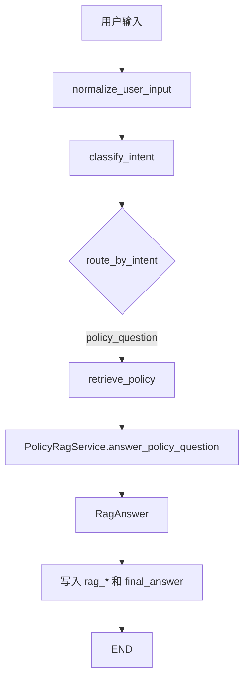

# 阶段 5 第 15 节：RAG 知识库回答节点

## 本节定位

上一节我们完成了智能工单 Agent 的第一个业务节点：

```text
classify_intent
```

它负责把用户输入分成固定意图：

```text
policy_question
order_query
ticket_request
smalltalk
unsupported
unclear
```

上一节的 `policy_question` 路线还只是占位：

```text
用户问政策/规则
-> classify_intent 判断为 policy_question
-> retrieve_policy 占位节点
-> 返回“后续课程会接入 RAG 知识库回答”
```

第 15 节开始把这条路线做实一点。

本节实现：

```text
用户问政策/规则
-> classify_intent 判断为 policy_question
-> retrieve_policy 调用 RAG 知识库回答服务
-> 将回答、引用来源、无资料原因、建议写回 State
-> 返回最终回答
```

注意，本节仍然不接真实 Qdrant、Milvus 或真实大模型。

本节先用 `FakePolicyRagService` 模拟 RAG 服务。

这样做不是偷懒，而是为了把 Agent 节点边界学清楚：

```text
LangGraph 节点怎么接住 RAG 结果。
State 里应该保存哪些 RAG 输出。
有资料和没资料时状态怎么表达。
后续真实 RAG 服务应该替换哪个接口。
```

真实检索、embedding、向量数据库、模型生成这些能力，我们已经在阶段 4 分别学过。

现在阶段 5 的重点不是重新造一遍 RAG，而是：

```text
把已经学过的 RAG 能力接进 Agent 流程。
```

## 本节学习目标

学完本节，你应该能解释清楚：

1. 为什么智能工单 Agent 需要一个独立的 RAG 知识库回答节点。
2. `policy_question` 为什么适合走 RAG，而不是查订单工具或直接创建工单。
3. RAG 节点和意图识别节点的职责有什么区别。
4. RAG 节点和 RAG service 的职责有什么区别。
5. 为什么本节先用 fake RAG service，而不是直接连接 Qdrant / Milvus。
6. `PolicyRagService` 这个接口为什么重要。
7. `retrieve_policy_node` 从 State 读什么、向 State 写什么。
8. `rag_query`、`rag_answer_status`、`rag_citations`、`rag_no_context_reason`、`rag_suggestions` 分别表示什么。
9. 为什么 RAG 回答必须带引用来源。
10. 为什么无资料时不能编造答案。
11. 为什么自动化测试不应该真实调用大模型和向量数据库。
12. 后续要接真实 RAG 服务时，应该替换哪里，而不是重写整个 Agent 图。

## 本节先不学什么

本节暂时不学：

1. 不真实启动 Qdrant。
2. 不真实启动 Milvus。
3. 不真实调用 embedding 模型。
4. 不真实调用大模型生成 RAG 答案。
5. 不做多轮 RAG 查询改写。
6. 不做检索结果 rerank。
7. 不做 RAG 评测。
8. 不做工单创建判断。
9. 不做字段抽取。
10. 不做 checkpoint 和 interrupt。

这些不是不重要。

它们要么已经在阶段 4 学过，要么会在阶段 5 后续节点里逐步接入。

本节只抓住一个核心问题：

```text
一个 LangGraph 节点如何承接 RAG 问答能力，并把结果写入 Agent State。
```

## 一、基础知识铺垫

### 1. 什么是 RAG 知识库回答节点

RAG 知识库回答节点，可以理解成 Agent 里的一个业务步骤。

它专门处理这类问题：

```text
退款规则是什么？
退货怎么申请？
账号安全怎么验证？
售后政策是什么？
```

这些问题的共同特点是：

```text
答案应该来自企业内部知识库，而不是来自模型记忆。
```

也就是说，模型不能凭感觉回答。

它必须根据企业实际文档回答：

```text
退款退货规则
账号安全 FAQ
售后政策
客服处理规范
```

所以 RAG 节点的职责不是“聪明地猜答案”，而是：

```text
拿用户问题去知识库找资料。
把资料交给回答服务。
得到一个有出处、可追踪、可兜底的回答。
```

本节的节点名字叫：

```text
retrieve_policy
```

意思是：

```text
检索政策类知识，并生成政策类回答。
```

### 2. 为什么政策问题适合走 RAG

政策问题和订单问题不一样。

订单问题问的是某一条实时业务数据：

```text
我的订单 1001 到哪了？
订单 1001 支付了吗？
订单 1001 发货了吗？
```

这类问题应该查业务系统。

例如：

```text
JavaOrderClient -> Java mock service -> GET /orders/{order_id}
```

政策问题问的是规则和知识：

```text
退款规则是什么？
多久可以退货？
账号安全验证需要什么？
```

这类问题应该查知识库。

例如：

```text
知识文档 -> chunk -> embedding -> 向量库 -> 检索 -> 回答
```

二者的区别非常重要：

| 问题类型 | 数据来源 | 适合路线 | 为什么 |
| --- | --- | --- | --- |
| 退款规则是什么 | 知识库文档 | RAG | 答案来自政策文档 |
| 订单 1001 到哪了 | 业务数据库 / Java API | Tool Calling | 答案来自实时订单数据 |
| 我要投诉订单 1001 | 用户输入 + 业务动作 | 工单流程 | 需要抽字段、确认、创建工单 |
| 你好 | 无需外部数据 | 直接回答 | 只是问候或能力说明 |

所以意图识别之后必须分流。

不能把所有问题都交给同一个处理方式。

### 3. RAG 节点不是意图识别节点

意图识别节点回答的是：

```text
用户想做什么？
```

RAG 节点回答的是：

```text
如果用户是在问政策，知识库里有没有答案？
如果有，答案是什么，引用来源是什么？
如果没有，怎么兜底？
```

两者输入和输出不同：

| 节点 | 输入 | 输出 | 是否生成最终回答 |
| --- | --- | --- | --- |
| `classify_intent` | `normalized_message` | `intent`、`intent_reason` | 通常不生成最终业务答案 |
| `retrieve_policy` | `normalized_message` | `rag_*` 字段、`final_answer` | 会生成政策问题最终回答 |

这就是 Agent 里的节点分工。

一个节点不要什么都做。

如果 `classify_intent` 既分类、又查知识库、又生成回答，后面会很难测试，也很难替换模型或检索服务。

### 4. RAG 节点也不是 RAG service

这点很关键。

在项目里，RAG 节点和 RAG service 不是同一个东西。

RAG service 更像一个普通业务服务：

```text
输入 query
输出 RagAnswer
```

它关心：

```text
怎么检索
怎么组装上下文
怎么调用模型
怎么生成引用
怎么处理无资料
```

LangGraph 节点关心：

```text
从 Agent State 里取哪个字段作为 query
调用哪个 service
把 service 结果写回哪些 State 字段
本节点执行完后给后续节点留下什么信息
```

换句话说：

```text
RAG service 是能力。
RAG node 是把能力接进流程的步骤。
```

这就像 Java 后端里：

```text
Controller 不应该把所有业务逻辑写死。
Controller 调用 Service。
Service 才真正处理业务。
```

这里也是类似思想：

```text
LangGraph node 不应该变成巨大业务函数。
node 调用 service。
service 负责具体能力。
```

### 5. 为什么本节先用 fake RAG service

你可能会问：

```text
既然阶段 4 已经做过 Qdrant、Milvus、RAG 回答，为什么这里不直接接真实 RAG？
```

原因有三个。

第一，学习目标不同。

阶段 4 学的是：

```text
RAG 本身怎么做。
```

阶段 5 学的是：

```text
Agent 流程怎么编排多个能力。
```

第二，测试应该稳定。

如果本节测试真实调用 Qdrant、Milvus、大模型，那么测试会受到很多外部因素影响：

```text
虚拟机有没有开
Docker 容器有没有启动
向量库数据有没有入库
API key 有没有配置
网络是否正常
模型接口是否限流
```

这些都不是本节要验证的重点。

本节要验证的是：

```text
policy_question 能不能走到 retrieve_policy。
retrieve_policy 能不能把 RAG 结果写进 State。
有资料和没资料时状态是否清楚。
```

第三，fake 能让接口边界先稳定。

只要我们先定义清楚：

```python
class PolicyRagService(Protocol):
    def answer_policy_question(self, query: str) -> RagAnswer:
        ...
```

后面真实服务只要实现同样方法，就可以替换 fake。

Agent 图不用大改。

这就是接口隔离的价值。

### 6. 什么是接口边界

接口边界可以理解成：

```text
A 模块只关心 B 模块承诺提供什么，不关心 B 模块内部怎么做。
```

在本节里，Agent 节点只关心：

```text
我给你一个 query，你返回一个 RagAnswer。
```

它不关心：

```text
你里面是查 Qdrant 还是 Milvus。
你是用真实 embedding 还是 fake embedding。
你是用 Qwen 还是 OpenAI。
你有没有 rerank。
你有没有缓存。
```

这就是边界。

边界清楚后，项目会更容易演进：

```text
学习阶段：FakePolicyRagService
后续接入：QdrantPolicyRagService
后续优化：HybridPolicyRagService
后续生产：带缓存、权限、安全检查、评测日志的 RagService
```

但 Agent 节点可以保持基本不变。

### 7. 什么是 RagAnswer

阶段 4 里我们已经定义过 `RagAnswer`。

它不是一个普通字符串。

它是结构化回答结果。

大致包含：

```text
answer
status
citations
no_context_reason
suggestions
```

为什么不能只返回一个字符串？

因为真实业务系统不只需要“给用户看的答案”。

它还需要知道：

```text
这个答案是不是基于知识库资料生成的？
引用了哪些文档？
没有资料时原因是什么？
要不要提示用户换一种问法？
要不要把这个问题记录为知识库待补充？
```

如果只返回字符串，这些机器可读信息就丢了。

所以本项目里 RAG 回答不是：

```python
"退款需要满足售后规则"
```

而是类似：

```python
RagAnswer(
    answer="根据知识库，退款申请通常需要先核对订单状态和售后条件...",
    status="answered",
    citations=[...],
    no_context_reason=None,
    suggestions=[],
)
```

这对 Agent 特别重要，因为后续节点可能还要根据 `status` 决定：

```text
能不能直接回答。
要不要追问。
要不要转工单。
要不要提示知识库资料不足。
```

### 8. 什么是 citation

`citation` 是引用来源。

也就是：

```text
这个回答依据了哪份资料。
```

它通常包含：

```text
source
title
section
chunk_id
score
```

例如：

```text
source: refund-return-policy.md
title: 退款退货规则
section: 退款申请
chunk_id: refund_return_policy_chunk_0001
score: 0.91
```

引用来源有三个价值。

第一，方便用户信任答案。

用户可以知道答案来自哪份规则文档。

第二，方便开发和运维排查。

如果答案错了，可以追到具体 chunk，判断是：

```text
文档写错了
chunk 切错了
检索召回错了
模型总结错了
```

第三，方便后续做评测。

RAG 不只是看答案像不像，还要看：

```text
有没有找回正确资料。
有没有引用正确来源。
```

### 9. 什么是 no_context

`no_context` 表示：

```text
知识库没有找到足够相关的资料，不能基于知识库回答。
```

这和程序报错不是一回事。

程序报错是：

```text
服务异常、网络异常、向量库异常、模型异常。
```

`no_context` 是业务上的正常情况：

```text
知识库没有覆盖这个问题。
```

比如用户问：

```text
会员等级政策是什么？
```

但当前知识库只有：

```text
退款退货规则
账号安全 FAQ
物流 FAQ
```

那就应该返回：

```text
当前知识库没有找到足够相关的资料，无法根据知识库回答这个问题。
```

不能让模型凭常识编造一个会员等级政策。

这就是 RAG 系统的底线：

```text
没有资料，就不要装作有资料。
```

### 10. RAG 节点写 State 的意义

LangGraph 的核心是 State。

如果 RAG 节点只返回 `final_answer`，后续节点只能看到一段文本。

但如果它写入结构化字段：

```text
rag_query
rag_answer_status
rag_citations
rag_no_context_reason
rag_suggestions
final_answer
node_history
```

后续流程就有判断依据。

比如：

```text
rag_answer_status == "answered"
-> 可以直接把答案展示给用户

rag_answer_status == "no_context"
-> 可以提示资料不足
-> 后续也可以进入“是否创建工单”节点
```

所以 State 不只是保存最终结果。

State 是：

```text
整个 Agent 本轮执行的结构化过程记录。
```

### 11. 本节属于哪种 RAG 架构

官方资料里通常会把 RAG 分成几类，例如固定两步 RAG、Agentic RAG、Hybrid RAG。

本节最接近：

```text
受控工作流里的 RAG 节点。
```

它不是让模型自由决定什么时候查知识库。

我们的流程是：

```text
意图识别判断为 policy_question
-> 固定进入 retrieve_policy
-> RAG 节点负责回答
```

这样更适合当前的智能客服工单 v1。

原因是：

```text
客服系统更重视边界清晰、行为稳定、可测试、可审计。
```

等基础流程稳定后，后续可以再学习更复杂的 Agentic RAG：

```text
模型决定是否检索
模型决定检索哪个知识源
检索后自我检查答案是否充分
不足时改写 query 再检索
```

但这不是本节目标。

## 二、本节主题系统讲解

### 1. 本节的完整执行链路

本节完成后的政策问题链路是：

```text
用户：退款规则是什么？
-> build_ticket_agent_input
-> normalize_user_input
-> classify_intent
-> route_by_intent 返回 policy_question
-> TICKET_AGENT_INTENT_ROUTES 找到 retrieve_policy
-> retrieve_policy_node 调用 PolicyRagService
-> FakePolicyRagService 返回 RagAnswer
-> retrieve_policy_node 把 RAG 结果写回 State
-> END
```

用图表示：



这条链路里，有三层分工：

| 层 | 负责什么 | 本节对应代码 |
| --- | --- | --- |
| 图结构 | 节点怎么连接、如何从意图路由到 RAG 节点 | `build_ticket_agent_graph()`、`TICKET_AGENT_INTENT_ROUTES` |
| 节点 | 从 State 取 query，调用 service，把结果写回 State | `retrieve_policy_node()` |
| 能力服务 | 根据 query 返回 RAG 回答 | `PolicyRagService`、`FakePolicyRagService` |

### 2. 新增 State 字段整体理解

本节给 `TicketAgentState` 增加了 5 个 RAG 相关字段。

它们分别是：

| 字段 | 类型 | 含义 |
| --- | --- | --- |
| `rag_query` | `str` | 实际交给 RAG 服务的问题 |
| `rag_answer_status` | `str` | RAG 回答状态，当前有 `answered` 和 `no_context` |
| `rag_citations` | `list[dict[str, Any]]` | 引用来源列表 |
| `rag_no_context_reason` | `str | None` | 无资料时的机器可读原因 |
| `rag_suggestions` | `list[str]` | 无资料时给用户或后续节点的建议 |

再加上已有字段：

```text
final_answer
node_history
```

就能完整表达本节点结果。

政策问题正常回答时，State 类似：

```python
{
    "rag_query": "退款规则是什么？",
    "rag_answer_status": "answered",
    "rag_citations": [
        {
            "source": "refund-return-policy.md",
            "title": "退款退货规则",
            "section": "退款申请",
            "chunk_id": "refund_return_policy_chunk_0001",
            "score": 0.91,
        }
    ],
    "rag_no_context_reason": None,
    "rag_suggestions": [],
    "final_answer": "根据知识库，退款申请通常需要先核对订单状态和售后条件...",
    "node_history": ["retrieve_policy"],
}
```

无资料时，State 类似：

```python
{
    "rag_query": "会员等级政策是什么？",
    "rag_answer_status": "no_context",
    "rag_citations": [],
    "rag_no_context_reason": "no_retrieved_chunks",
    "rag_suggestions": [
        "换一种更具体的问法，例如补充订单、退款、物流或账号安全等关键词。",
        "确认问题是否属于当前知识库覆盖范围。",
        "如果这是新政策或新问题，可以记录为待补充知识。",
    ],
    "final_answer": "当前知识库没有找到足够相关的资料，无法根据知识库回答这个问题。",
    "node_history": ["retrieve_policy"],
}
```

这比只写一个 `final_answer` 更完整。

### 3. 为什么要保存 rag_query

`rag_query` 看起来和 `normalized_message` 很像。

本节里它确实来自：

```python
state.get("normalized_message", "").strip()
```

那为什么还要单独保存？

因为以后真实系统里，RAG query 不一定等于用户原话。

例如用户说：

```text
这个能退吗？
```

后续可能会结合上下文改写成：

```text
订单商品退款退货规则是什么？
```

再比如用户多轮对话：

```text
用户第一轮：退款规则是什么？
用户第二轮：那超过 7 天呢？
```

第二轮真正检索的 query 可能要改写成：

```text
退款退货规则超过 7 天是否可以退款？
```

所以我们提前保留 `rag_query`，以后可以清楚记录：

```text
用户原始问题是什么。
最终拿去检索的问题是什么。
```

这对调试和评测都很重要。

### 4. 为什么 rag_answer_status 不用布尔值

有些系统会写：

```python
rag_success = True
```

本项目没有这么做，而是写：

```python
rag_answer_status = "answered"
```

或者：

```python
rag_answer_status = "no_context"
```

原因是布尔值表达力太弱。

`False` 到底是什么意思？

```text
没检索到资料？
检索服务挂了？
模型调用失败？
权限过滤后没资料？
资料有但分数太低？
```

这些都可能是 False。

所以更好的方式是状态枚举。

当前阶段只有：

```text
answered
no_context
```

以后可以扩展：

```text
retrieval_error
generation_error
blocked_by_permission
low_confidence
```

状态设计越清楚，后续流程越容易写。

### 5. 为什么 citations 要从 Pydantic 模型转成 dict

`RagAnswer.citations` 里面是 Pydantic 模型对象。

但 `TicketAgentState` 里写的是：

```python
rag_citations: list[dict[str, Any]]
```

所以节点里做了：

```python
[citation.model_dump() for citation in rag_answer.citations]
```

这一步的意思是：

```text
把 Pydantic 对象转成普通 dict，方便 State 序列化、测试、日志记录和接口返回。
```

LangGraph State 最好保持简单、可序列化、可观察。

尤其后面学 checkpoint 时，State 会被保存下来。

如果 State 里塞太多复杂对象，持久化、调试和兼容性都会变差。

### 6. 为什么 no_context 也要有 suggestions

无资料时，不应该只说：

```text
我不知道。
```

更好的系统应该告诉用户下一步怎么做。

本项目里的 `suggestions` 是：

```text
换一种更具体的问法
确认问题是否属于当前知识库覆盖范围
如果是新政策，可以记录为待补充知识
```

这对真实客服系统有价值。

因为无资料并不代表流程结束。

它可能意味着：

```text
需要用户补充信息
需要转人工
需要创建工单
需要更新知识库
```

本节先只把 suggestions 写入 State。

后续第 16 节开始，我们会学习：

```text
如何判断是否需要创建工单。
```

### 7. 为什么本节不让模型自己决定是否查 RAG

阶段 3 学过：

```text
让模型决定是否调用工具。
```

那为什么这里不直接让模型决定是否查 RAG？

因为当前智能工单 Agent v1 先走可控流程：

```text
意图识别 -> 固定路由 -> 业务节点执行
```

优点是：

```text
更容易测试
更容易解释
更适合初版客服系统
更容易控制权限和边界
```

如果所有路线都交给模型自由决定，学习阶段会同时混在一起：

```text
模型判断
检索质量
Prompt
工具调用
状态合并
业务兜底
```

这样你很难知道问题出在哪里。

所以我们先把流程拆开。

这也是工程里常见做法：

```text
先做可控工作流，再逐步引入模型自主决策。
```

### 8. 本节 fake 的边界

`FakePolicyRagService` 不是为了模拟全部 RAG。

它只模拟三种结果：

```text
退款问题 -> 有知识库答案
退货问题 -> 有知识库答案
账号安全问题 -> 有知识库答案
其他政策问题 -> no_context
```

它不做：

```text
embedding
向量检索
score_threshold
payload filter
rerank
真实大模型总结
```

这些能力不是不存在，而是被接口隔离了。

你可以这样理解：

```text
FakePolicyRagService 是一个训练用替身。
它让我们不用启动外部依赖，也能验证 Agent 节点行为。
```

后续真实接入时，我们会把它换成真实实现。

## 三、本节代码讲解

### 1. `PolicyRagService`：定义 Agent 需要的 RAG 能力

文件：

```text
projects/ai-service/app/agents/ticket_agent.py
```

新增：

```python
class PolicyRagService(Protocol):
    def answer_policy_question(self, query: str) -> RagAnswer:
        """Return a grounded policy answer or a no-context fallback."""
```

这里的 `Protocol` 可以先理解成：

```text
只要某个对象有 answer_policy_question(query: str) -> RagAnswer 这个方法，
它就可以当成 PolicyRagService 使用。
```

它不是必须继承某个父类。

这对测试和替换很方便。

本节里：

```text
FakePolicyRagService 符合这个接口。
```

以后真实实现也可以符合这个接口：

```python
class RealPolicyRagService:
    def answer_policy_question(self, query: str) -> RagAnswer:
        ...
```

只要方法签名一样，`retrieve_policy_node` 就不需要大改。

### 2. `TicketAgentState`：增加 RAG 结果字段

新增字段：

```python
rag_query: str
rag_answer_status: str
rag_citations: list[dict[str, Any]]
rag_no_context_reason: str | None
rag_suggestions: list[str]
```

这几个字段让 Agent 能保存 RAG 节点的结构化结果。

它们的关系是：

```text
rag_query：问了什么
rag_answer_status：有没有根据知识库答出来
rag_citations：依据了哪些资料
rag_no_context_reason：没答出来的原因
rag_suggestions：没答出来时可以怎么引导用户
```

这就是本节的核心 State 扩展。

### 3. `FakePolicyRagService`：训练用的假 RAG 服务

核心逻辑：

```python
if "退款" in lowered_query:
    return build_grounded_rag_answer(...)

if "退货" in lowered_query:
    return build_grounded_rag_answer(...)

if "账号安全" in lowered_query:
    return build_grounded_rag_answer(...)

return build_no_context_rag_answer()
```

这段代码不是重点学字符串匹配。

重点是学习 RAG service 的输出形状：

```text
能回答时：RagAnswer(status="answered", citations=[...])
不能回答时：RagAnswer(status="no_context", citations=[], suggestions=[...])
```

也就是说，Agent 节点不需要知道里面怎么检索。

它只要拿到标准的 `RagAnswer`。

### 4. `_make_fake_retrieved_chunk`：模拟检索结果

RAG 的 grounded answer 需要来源。

所以 fake service 也要构造一个假的 `RetrievedChunk`。

这个 chunk 里有：

```text
point_id
chunk_id
content
metadata
score
```

其中 `metadata` 里保存：

```text
source
title
section
doc_type
permission_group
```

这和阶段 4 的知识库设计保持一致。

这样做有两个好处：

第一，测试能检查引用来源。

第二，后续替换成真实向量库返回结果时，结构不会突然变化。

### 5. `retrieve_policy_node`：本节最重要的节点

本节最关键的函数是：

```python
def retrieve_policy_node(
    state: TicketAgentState,
    service: PolicyRagService | None = None,
) -> TicketAgentState:
    rag_query = state.get("normalized_message", "").strip()
    rag_service = service or create_policy_rag_service()
    rag_answer = rag_service.answer_policy_question(rag_query)

    return {
        "rag_query": rag_query,
        "rag_answer_status": rag_answer.status.value,
        "rag_citations": [citation.model_dump() for citation in rag_answer.citations],
        "rag_no_context_reason": (
            rag_answer.no_context_reason.value
            if rag_answer.no_context_reason is not None
            else None
        ),
        "rag_suggestions": list(rag_answer.suggestions),
        "final_answer": rag_answer.answer,
        "node_history": ["retrieve_policy"],
    }
```

按步骤拆开看。

第一步：

```python
rag_query = state.get("normalized_message", "").strip()
```

从 State 里取出用户清洗后的问题。

本节还没有做 query rewrite，所以直接使用 `normalized_message`。

第二步：

```python
rag_service = service or create_policy_rag_service()
```

如果外部传了 service，就用外部传入的。

如果没有传，就创建默认 fake service。

这让测试可以注入 fake，也让图运行时有默认实现。

第三步：

```python
rag_answer = rag_service.answer_policy_question(rag_query)
```

节点把问题交给 RAG 服务。

从这里开始，节点不关心 RAG 内部细节。

第四步：

```python
"rag_answer_status": rag_answer.status.value
```

把枚举值转成字符串写入 State。

第五步：

```python
"rag_citations": [citation.model_dump() for citation in rag_answer.citations]
```

把 Pydantic 引用对象转成普通 dict。

第六步：

```python
"final_answer": rag_answer.answer
```

把给用户看的最终回答写入 State。

第七步：

```python
"node_history": ["retrieve_policy"]
```

记录本节点执行过。

由于 `node_history` 使用了 reducer：

```python
Annotated[list[str], add]
```

所以完整图执行后会得到：

```text
normalize_user_input -> classify_intent -> retrieve_policy
```

这就是我们观察 Agent 执行路线的重要证据。

### 6. `create_policy_rag_service`：默认服务工厂

新增：

```python
def create_policy_rag_service() -> PolicyRagService:
    return FakePolicyRagService()
```

它现在返回 fake。

以后可以改成：

```python
def create_policy_rag_service() -> PolicyRagService:
    return RealPolicyRagService(...)
```

这样节点函数不需要改。

这就是工程里常说的：

```text
调用方依赖接口，不依赖具体实现。
```

### 7. 图结构为什么不用改很多

上一节已经设计了：

```python
TICKET_AGENT_INTENT_ROUTES = {
    "policy_question": "retrieve_policy",
    ...
}
```

所以本节不需要重新设计图。

我们只是把 `retrieve_policy` 从占位节点升级成真实节点。

这说明上一节的设计是有价值的。

如果图结构一开始就设计清楚，后续每一节就可以逐个填节点。

## 四、本节测试讲解

本节新增的测试不是为了测 RAG 算法。

它们重点验证 Agent 行为。

### 1. 测 RAG 节点能返回有依据的答案

测试：

```python
def test_retrieve_policy_node_returns_grounded_rag_answer() -> None:
    update = retrieve_policy_node({"normalized_message": "退款规则是什么？"})
```

它验证：

```text
rag_query 正确
rag_answer_status 是 answered
final_answer 是知识库回答
citations 里有 refund-return-policy.md
node_history 是 retrieve_policy
```

这保证：

```text
政策问题进入 RAG 节点后，不再只是占位回答。
```

### 2. 测无资料兜底

测试：

```python
def test_retrieve_policy_node_returns_no_context_fallback() -> None:
    update = retrieve_policy_node({"normalized_message": "会员等级政策是什么？"})
```

它验证：

```text
status 是 no_context
final_answer 是统一无资料回答
citations 为空
no_context_reason 是 no_retrieved_chunks
suggestions 不为空
```

这保证：

```text
没有资料时不会编造答案。
```

### 3. 测完整图路线

测试：

```python
def test_run_ticket_agent_policy_question_uses_rag_answer_node() -> None:
    result = run_ticket_agent("退款规则是什么？")
```

它验证：

```text
intent 是 policy_question
最终走到了 retrieve_policy
State 中有 rag_answer_status 和 citations
node_history 是 normalize_user_input -> classify_intent -> retrieve_policy
```

这说明：

```text
不是单独函数能跑，而是整个 LangGraph 路线能跑通。
```

### 4. 测 stream 能观察 RAG 节点输出

测试：

```python
def test_stream_ticket_agent_updates_exposes_rag_answer_update() -> None:
    chunks = stream_ticket_agent_updates("账号安全怎么验证？")
```

它验证：

```text
stream 的第三个 chunk 来自 retrieve_policy
里面能看到 rag_answer_status
里面能看到 citation source
```

这对后续前端或日志很重要。

因为实际 Agent 可能不是等所有节点跑完才展示。

有时我们希望边执行边观察：

```text
执行到哪个节点了
当前节点产出了什么
有没有进入兜底
```

## 五、本节真正学到了什么

本节不是学“怎么写一个假的字符串匹配函数”。

本节真正学的是：

```text
如何把一个外部能力接成 LangGraph 的业务节点。
```

这个能力在本节是 RAG。

以后也可以是：

```text
订单查询工具
字段抽取服务
风险判断服务
人工确认服务
Java 工单创建 API
```

你要抓住这个模式：

```text
State 里取输入
-> 调用一个清晰接口的 service
-> service 返回结构化结果
-> 节点把结构化结果写回 State
-> 后续节点基于 State 继续判断
```

这就是 Agent 工程化里最常见的节点写法。

### 1. 从代码角度看

本节完成了：

```text
TicketAgentState 增加 RAG 字段
PolicyRagService 定义 RAG 节点依赖的接口
FakePolicyRagService 提供稳定训练用实现
retrieve_policy_node 将 policy_question 路线升级为 RAG 回答路线
测试覆盖有资料、无资料、完整图、stream 输出
```

### 2. 从架构角度看

本节完成了：

```text
智能工单 Agent 的第一条真实业务分支：政策类问题可以由知识库回答。
```

上一节是：

```text
识别用户想走哪条路。
```

本节是：

```text
把其中一条路真正接上业务能力。
```

### 3. 从学习角度看

你需要重点掌握的不是 fake service 里的关键词判断。

你需要重点掌握：

```text
为什么 RAG 结果要结构化。
为什么引用和无资料状态要进入 State。
为什么节点依赖接口而不是依赖具体实现。
为什么测试要先验证节点边界而不是依赖真实外部服务。
```

## 六、常见误区

### 误区 1：RAG 节点就是检索函数

不准确。

RAG 节点是 Agent 流程里的一个步骤。

检索函数只是 RAG service 内部可能用到的一部分。

节点应该负责流程对接，不应该变成巨大的 RAG 实现。

### 误区 2：有大模型就可以不查知识库

不对。

企业政策、订单规则、客服规范通常不是模型训练数据的一部分。

就算模型知道类似规则，也不能代表你公司当前真实规则。

所以政策问题必须基于知识库回答。

### 误区 3：没资料时让模型自由发挥一下

不对。

RAG 的底线是 grounded。

没有资料时应该明确说资料不足。

编造答案在客服场景风险很高。

### 误区 4：测试一定要接真实 Qdrant 才有价值

不对。

测试分层。

本节是 Agent 节点测试，重点是流程和 State。

真实 Qdrant / Milvus smoke 和 RAG 检索测试已经在阶段 4 学过。

### 误区 5：fake service 以后没用了

不对。

fake service 在工程里长期有价值。

它可以用于：

```text
单元测试
本地开发
CI
演示固定流程
复现特定边界条件
```

真实服务用于集成测试和生产。

两者不是互相替代，而是分层使用。

## 七、和阶段 4 的衔接

阶段 4 我们已经学过：

```text
文档加载
文本清洗
chunk 切分
embedding
Qdrant 入库
Milvus 入库
metadata
filter
score_threshold
引用来源
无资料兜底
RAG 错误处理
RAG 测试
RAG 评测
```

本节复用的是阶段 4 已经沉淀出来的概念和代码：

```text
RetrievedChunk
RagAnswer
build_grounded_rag_answer
build_no_context_rag_answer
citations
no_context
```

所以本节不是重新学 RAG 基础。

它是在回答：

```text
RAG 怎么成为智能工单 Agent 的一个节点？
```

这也是阶段 5 的主线：

```text
把之前学过的能力编排起来。
```

## 八、后续如何替换成真实 RAG

本节默认：

```python
def create_policy_rag_service() -> PolicyRagService:
    return FakePolicyRagService()
```

以后可以替换成真实服务。

真实服务可能长这样：

```python
class RealPolicyRagService:
    def __init__(self, retriever: Any, answer_service: Any) -> None:
        self.retriever = retriever
        self.answer_service = answer_service

    def answer_policy_question(self, query: str) -> RagAnswer:
        chunks = self.retriever.retrieve(query)
        return self.answer_service.generate_answer_with_citations(
            query,
            chunks=chunks,
        )
```

注意，真实替换时 `retrieve_policy_node` 不一定需要改。

因为它只依赖：

```text
answer_policy_question(query: str) -> RagAnswer
```

这就是本节提前定义 `PolicyRagService` 的意义。

## 九、你应该能口述出的版本

如果别人问你：

```text
你这个智能工单 Agent 的 RAG 节点是怎么设计的？
```

你可以这样回答：

```text
我们的智能工单 Agent 先通过意图识别判断用户是不是政策/规则类问题。
如果是 policy_question，就路由到 retrieve_policy 节点。
这个节点不直接写死向量库和模型调用细节，而是依赖一个 PolicyRagService 接口。
节点从 State 中取 normalized_message 作为 rag_query，调用 answer_policy_question，拿到结构化 RagAnswer。
然后把回答状态、引用来源、无资料原因、建议和 final_answer 写回 State。
目前学习阶段用 FakePolicyRagService 保证测试稳定，不依赖外部向量库和大模型。
以后接真实 Qdrant 或 Milvus 时，只需要替换 service 实现，Agent 节点边界可以保持稳定。
```

这个表达已经比较接近面试和项目讲解里的说法。

## 十、本节练习

### 练习 1：解释节点职责

题目：

请用自己的话解释：

```text
retrieve_policy_node 为什么不应该直接写满 Qdrant、embedding、LLM 调用细节？
```

参考答案：

```text
因为 retrieve_policy_node 是 LangGraph 流程节点，它的核心职责是从 State 读取输入、调用 RAG 服务、把结构化结果写回 State。
Qdrant、embedding、LLM 调用属于 RAG service 的内部实现。
如果全部写进节点，节点会变得过大，难测试、难替换、难复用。
通过 PolicyRagService 接口隔离后，学习阶段可以用 fake，生产阶段可以换真实实现，Agent 图不用大改。
```

### 练习 2：判断字段含义

题目：

下面字段分别解决什么问题？

```text
rag_query
rag_answer_status
rag_citations
rag_no_context_reason
rag_suggestions
```

参考答案：

```text
rag_query：记录实际交给 RAG 服务的问题，方便调试和评测。
rag_answer_status：记录 RAG 是否基于知识库答出来，例如 answered 或 no_context。
rag_citations：记录回答依据了哪些文档、section、chunk，方便追溯。
rag_no_context_reason：记录没有资料时的机器可读原因。
rag_suggestions：记录无资料时可以给用户或后续流程的引导建议。
```

### 练习 3：判断路线

题目：

用户输入：

```text
退款规则是什么？
```

请写出当前 Agent 大致会经过哪些节点。

参考答案：

```text
build_ticket_agent_input
-> normalize_user_input
-> classify_intent
-> route_by_intent 判断为 policy_question
-> retrieve_policy
-> END
```

最终 `node_history` 应该包含：

```text
normalize_user_input
classify_intent
retrieve_policy
```

### 练习 4：无资料时能不能编造

题目：

如果用户问：

```text
会员等级政策是什么？
```

但当前知识库没有相关资料，RAG 节点应该怎么做？

参考答案：

```text
应该返回 no_context 状态，final_answer 使用统一的无资料兜底回答，citations 为空，no_context_reason 说明没有检索到资料，并提供 suggestions。
不能让模型凭常识编造会员等级政策。
```

### 练习 5：后续如何接真实服务

题目：

后续如果要从 fake RAG service 换成真实 Qdrant / Milvus RAG service，理想情况下应该主要替换哪里？

参考答案：

```text
主要替换 create_policy_rag_service 返回的具体实现，或者新增一个实现 PolicyRagService 接口的真实服务。
retrieve_policy_node 只依赖 answer_policy_question(query) -> RagAnswer，不应该因为内部从 fake 变成 Qdrant / Milvus 而大改。
```

## 十一、自测问题

### 自测 1

问题：

为什么 `policy_question` 适合走 RAG？

答案：

```text
因为政策/规则类问题的答案应该来自企业知识库文档，而不是来自实时订单数据或模型记忆。
RAG 可以在回答时结合企业内部资料，并返回引用来源。
```

### 自测 2

问题：

`RagAnswer` 为什么比普通字符串更适合 Agent？

答案：

```text
因为 Agent 后续流程不只需要展示答案，还需要知道回答状态、引用来源、无资料原因和建议。
这些结构化字段可以支持后续判断、日志、调试、评测和用户兜底。
```

### 自测 3

问题：

本节为什么不用真实 Qdrant / Milvus？

答案：

```text
因为本节学习重点是 LangGraph 节点如何承接 RAG 结果，而不是验证向量数据库。
使用 fake service 可以让测试稳定、快速、可重复，不依赖虚拟机、Docker、API key 或网络。
```

### 自测 4

问题：

`rag_citations` 的价值是什么？

答案：

```text
它记录回答依据的资料来源，例如 source、title、section、chunk_id 和 score。
这样用户可以信任答案，开发者也能追溯错误来源，并为后续 RAG 评测提供依据。
```

### 自测 5

问题：

`retrieve_policy_node` 做了哪几步？

答案：

```text
从 State 读取 normalized_message 作为 rag_query。
获取 PolicyRagService。
调用 answer_policy_question。
把 RagAnswer 的 status、citations、no_context_reason、suggestions 和 answer 写回 State。
记录 node_history。
```

### 自测 6

问题：

`PolicyRagService` 这个 Protocol 的好处是什么？

答案：

```text
它定义了 Agent 节点需要的最小接口。
节点只依赖 answer_policy_question(query) -> RagAnswer。
这样 fake 服务和真实服务可以替换，节点和图结构不需要因为底层实现变化而大改。
```

### 自测 7

问题：

`no_context` 是错误吗？

答案：

```text
不是。
no_context 表示知识库没有找到足够相关资料，是业务上的正常兜底情况。
它和向量库异常、模型异常、网络异常不同。
```

### 自测 8

问题：

为什么 `node_history` 仍然重要？

答案：

```text
它记录本轮 Agent 实际经过哪些节点。
在测试、调试、日志和后续可观测性里，可以用它确认用户问题是否走到了预期路线。
```

## 十二、本节验收标准

完成本节后，应满足：

```text
1. policy_question 路线不再只是占位回答。
2. retrieve_policy_node 能返回 grounded RAG answer。
3. retrieve_policy_node 能返回 no_context fallback。
4. TicketAgentState 保存 RAG 结构化结果。
5. 完整图运行时，退款规则问题会经过 retrieve_policy。
6. stream 输出里能观察到 retrieve_policy 的增量更新。
7. 自动化测试不依赖真实模型、Qdrant、Milvus 或 VMware。
```

## 十三、本节参考资料

- [LangChain Retrieval](https://docs.langchain.com/oss/python/langchain/retrieval)
  - 用途：理解 RAG 的检索、知识库、retriever、2-step RAG、Agentic RAG 和把外部资料提供给模型回答的整体方向。
- [LangGraph Thinking in LangGraph](https://docs.langchain.com/oss/python/langgraph/thinking-in-langgraph)
  - 用途：理解如何把 Agent 拆成离散节点、设计 State、区分 LLM step、data step、action step 和 user input step。
- [LangGraph Graph API](https://docs.langchain.com/oss/python/langgraph/graph-api)
  - 用途：复习 StateGraph、节点、边、条件边、State 更新和图执行的基础。
- [阶段 4 第 18 节：把检索结果交给模型回答](rag-stage4-18-retrieved-context-to-model-answer.md)
  - 用途：复习 RAG answer service、检索上下文、模型回答的关系。
- [阶段 4 第 19 节：引用来源：回答必须带出处](rag-stage4-19-citations.md)
  - 用途：复习 citation 的业务价值和技术字段。
- [阶段 4 第 20 节：无检索结果时怎么处理](rag-stage4-20-no-context-handling.md)
  - 用途：复习 no_context、拒答和建议。

## 十四、下一节预告

下一节进入：

```text
阶段 5 第 16 节：判断是否需要创建工单
```

为什么要学它？

因为 RAG 回答之后，系统还要判断：

```text
这个问题已经回答完了吗？
用户是否仍然需要人工处理？
没有资料时是否要创建工单？
用户明确投诉时是否要进入工单流程？
```

第 15 节让政策问题能回答。

第 16 节开始让 Agent 学会：

```text
什么时候不能只回答，还要继续推进业务流程。
```
