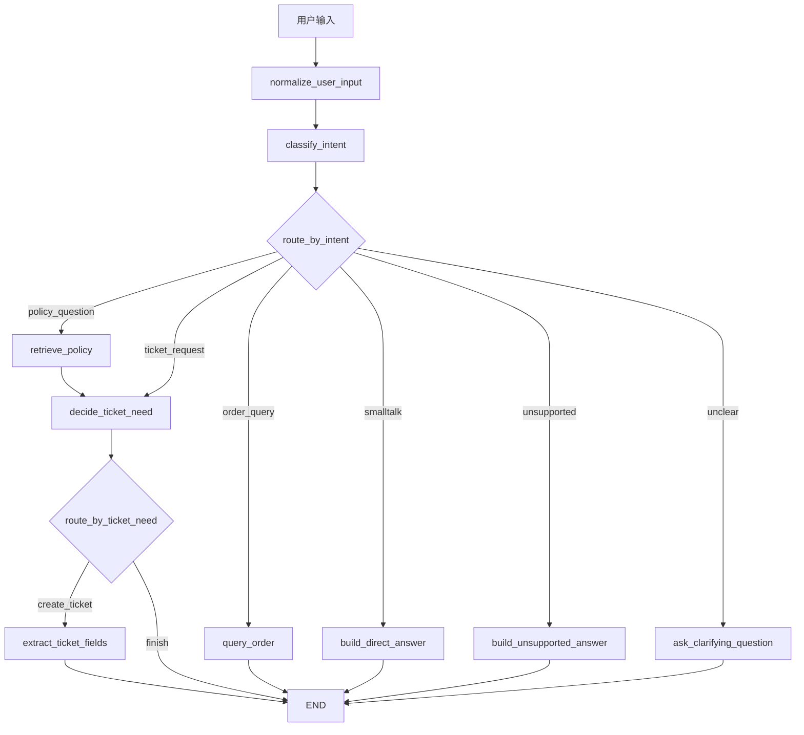

# 阶段 5 第 16 节：判断是否需要创建工单

## 本节定位

上一节我们完成了：

```text
RAG 知识库回答节点
```

也就是：

```text
用户问政策/规则
-> 进入 retrieve_policy
-> RAG 服务返回回答、引用来源、无资料状态和建议
```

但真实客服 Agent 不能只做到“回答一句话”。

它还要继续判断：

```text
这个问题到这里是不是已经解决了？
如果没有解决，要不要进入工单流程？
```

例如：

```text
用户：退款规则是什么？
```

如果知识库已经给出明确回答，那本轮可以结束。

再比如：

```text
用户：会员等级政策是什么？
```

如果当前知识库没有资料，系统不能编造答案。

这时可能要进入工单流程，把问题记录下来，交给后续人工或业务侧处理。

再比如：

```text
用户：我要投诉订单 1001，物流一直不动。
```

用户已经明确表达投诉/售后处理诉求。

这种情况不应该只回复一句“我理解你的问题”，而应该进入工单流程。

所以第 16 节要实现一个新节点：

```text
decide_ticket_need
```

它的作用是：

```text
判断当前这轮对话是否需要创建工单。
```

本节仍然不会真正创建工单。

真正创建工单要到后面的：

```text
字段提取
缺失字段追问
用户确认
调用 Java mock 创建工单
```

本节只做判断：

```text
要不要进入工单流程？
```

这一步看起来小，但非常重要。

因为它是从“问答机器人”走向“业务 Agent”的关键分界点。

## 本节学习目标

学完本节，你应该能解释清楚：

1. 什么是工单。
2. 什么是“需要创建工单”的业务判断。
3. 为什么 RAG 回答后还要判断是否需要工单。
4. 为什么用户明确投诉时要进入工单流程。
5. 为什么知识库 `no_context` 时可能要进入工单流程。
6. 为什么知识库 `answered` 时通常不需要创建工单。
7. 意图识别、RAG 回答、工单判断三者有什么区别。
8. `needs_ticket`、`ticket_need_reason`、`ticket_need_source` 分别表示什么。
9. 为什么判断结果不应该只保存一个布尔值。
10. `decide_ticket_need` 纯函数和 `decide_ticket_need_node` 节点函数有什么区别。
11. `route_by_ticket_need` 为什么只负责路由，不负责业务判断。
12. 为什么 `decide_ticket_need` 后面要用 conditional edge。
13. 为什么本节不直接调用 Java 创建工单。
14. 如何测试“需要工单”和“不需要工单”的路线。

## 本节先不学什么

本节暂时不学：

1. 不抽取工单字段。
2. 不追问缺失字段。
3. 不让用户确认工单内容。
4. 不调用 Java mock 创建工单。
5. 不接真实 LLM 判断是否建工单。
6. 不做多轮 checkpoint。
7. 不做 interrupt / human-in-the-loop。
8. 不做工单状态机。
9. 不做前端工单工作台。

这些不是不学。

它们会在第 17 节到第 22 节逐步展开。

本节只聚焦一个最小但完整的问题：

```text
当前 Agent State 里已有意图和 RAG 结果时，如何判断下一步是否进入工单流程？
```

## 一、基础知识铺垫

### 1. 什么是工单

工单可以理解成：

```text
把用户的问题变成一条可追踪、可处理、可分派、可闭环的业务记录。
```

普通聊天消息通常只是：

```text
用户问一句，系统答一句。
```

工单更像：

```text
问题记录
处理任务
责任分派
状态流转
处理结果
回访或关闭
```

例如用户说：

```text
我要投诉订单 1001，物流一直不动。
```

客服系统可能需要生成一条工单：

```text
工单类型：物流投诉
订单号：1001
问题描述：物流一直不动
用户诉求：投诉/处理
优先级：普通或较高
状态：待处理
```

这条记录后续可以被客服人员看到、处理、备注、关闭。

所以工单不是一句自然语言回答。

工单是业务系统里的结构化处理对象。

### 2. 什么是“需要创建工单”

“需要创建工单”不是说：

```text
所有用户问题都创建工单。
```

它指的是：

```text
这个问题不能仅靠当前自动问答完成，需要进入后续人工或业务处理流程。
```

常见情况包括：

```text
用户明确要求投诉、售后处理、人工处理。
知识库没有资料，系统无法给出可靠回答。
用户的问题涉及异常、损失、纠纷、复杂业务判断。
工具查询结果显示异常，需要后续处理。
用户已经提供了明确订单号和诉求。
```

不需要创建工单的情况包括：

```text
用户只是问候。
知识库已经回答了规则问题。
订单查询只是返回正常状态。
用户问题还不清楚，需要先追问，不适合马上建工单。
用户请求不支持或有安全风险，应该拒绝或说明边界。
```

所以“是否创建工单”是一个业务判断。

它不是简单的技术判断。

### 3. 为什么不能所有问题都创建工单

如果所有问题都创建工单，会带来很多问题。

第一，工单量会爆炸。

用户只是问：

```text
退款规则是什么？
```

如果知识库已经能回答，还建一条工单，会浪费人工处理资源。

第二，工单质量会很差。

例如：

```text
用户：这个怎么办？
```

这句话太模糊。

马上建工单会缺少：

```text
订单号
问题类型
具体描述
用户诉求
联系方式或用户身份
```

第三，用户体验变差。

有些问题自动回答即可。

如果每次都提示创建工单，用户会觉得系统反应重、慢、复杂。

所以工单判断的核心不是“能不能建”，而是：

```text
该不该建。
```

### 4. 为什么不能从不创建工单

反过来也不行。

如果 Agent 只会回答，不会进入工单流程，那么它只能算问答机器人。

真实客服场景里，很多问题必须进入业务处理：

```text
订单异常
物流长期不动
商品破损
用户投诉
退款纠纷
知识库没有覆盖的新政策问题
```

如果这些问题都只回复：

```text
请稍后再试。
建议你联系客服。
```

那 Agent 没有真正接入业务闭环。

所以智能工单 Agent 要具备两种能力：

```text
能回答的，直接回答。
不能只回答的，进入工单流程。
```

第 16 节就是实现这个分界点。

### 5. 意图识别不是工单判断

上一节之前我们做过意图识别。

意图识别回答的是：

```text
用户这句话属于哪一类？
```

例如：

```text
退款规则是什么？ -> policy_question
我的订单 1001 到哪了？ -> order_query
我要投诉订单 1001 -> ticket_request
你好 -> smalltalk
```

但工单判断回答的是：

```text
当前流程是否需要进入工单创建？
```

二者不是一回事。

例如：

```text
policy_question
```

有两种可能：

```text
知识库 answered -> 不需要工单
知识库 no_context -> 可能需要工单
```

再比如：

```text
ticket_request
```

通常表示：

```text
用户明确要求处理，应该进入工单流程。
```

所以同一个 intent 后续也可能因为状态不同而走不同路线。

这就是为什么我们需要独立的 `decide_ticket_need` 节点。

### 6. RAG 回答不是工单判断

RAG 节点回答的是：

```text
知识库能不能回答这个政策问题？
```

它输出：

```text
rag_answer_status
rag_citations
rag_no_context_reason
rag_suggestions
final_answer
```

但 RAG 节点不应该顺手判断全部工单逻辑。

因为工单判断可能依赖：

```text
用户意图
RAG 状态
订单查询结果
工具错误
用户是否明确要求人工
是否有必要字段
权限和安全策略
```

如果把所有判断写进 RAG 节点，RAG 节点会变得职责混乱。

所以更好的拆法是：

```text
retrieve_policy：回答知识库问题
decide_ticket_need：判断是否进入工单流程
```

这就是节点单一职责。

### 7. 什么情况下不需要工单

本节里最典型的不需要工单场景是：

```text
用户问政策问题，RAG 已经回答。
```

例如：

```text
用户：退款规则是什么？
RAG：根据知识库，退款申请通常需要先核对订单状态和售后条件...
```

这种情况：

```text
rag_answer_status = "answered"
needs_ticket = False
```

原因是：

```text
用户只是问规则。
系统已经基于知识库给出了可引用回答。
本轮没有继续处理的必要。
```

当然，真实业务里用户可能继续追问：

```text
那帮我处理一下订单 1001。
```

那是下一轮对话，再重新进入流程。

本节先处理单轮判断。

### 8. 什么情况下需要工单

本节实现两个需要工单的场景。

第一种：

```text
用户明确表达投诉、售后处理、人工处理或创建工单诉求。
```

例如：

```text
我要投诉订单 1001。
商品破损，帮我处理。
我要创建工单。
```

这种情况：

```text
intent = "ticket_request"
needs_ticket = True
ticket_need_source = "explicit_user_request"
```

第二种：

```text
政策问题进入 RAG，但知识库没有资料。
```

例如：

```text
会员等级政策是什么？
```

如果当前知识库没有相关资料：

```text
rag_answer_status = "no_context"
needs_ticket = True
ticket_need_source = "rag_no_context"
```

为什么 no_context 要进工单？

因为这可能代表：

```text
知识库缺资料
用户问题需要人工解释
需要业务侧确认新政策
需要记录待补充知识
```

所以本节把它导向后续工单流程。

### 9. 为什么不能只保存 needs_ticket

最直观的做法是只保存：

```python
needs_ticket = True
```

但这不够。

因为后续你会想知道：

```text
为什么要创建工单？
是用户明确要求？
是 RAG 没资料？
是订单异常？
是工具调用失败？
是人工审核策略要求？
```

如果只保存布尔值，就丢掉了原因。

所以本节保存三个字段：

```text
needs_ticket
ticket_need_reason
ticket_need_source
```

其中：

```text
needs_ticket：机器判断结果，后续条件边用它路由。
ticket_need_reason：给开发者、日志、用户解释看的原因。
ticket_need_source：机器可读的来源类型，后续统计和测试更方便。
```

这就是结构化 State 的价值。

### 10. 什么是 ticket_need_source

`ticket_need_source` 表示：

```text
这个判断是从哪里来的。
```

本节定义了四类：

```text
explicit_user_request
rag_no_context
rag_answered
not_applicable
```

分别表示：

| source | 含义 |
| --- | --- |
| `explicit_user_request` | 用户明确要求投诉、售后处理或创建工单 |
| `rag_no_context` | 知识库没有资料，无法回答，转入工单 |
| `rag_answered` | 知识库已经回答，不需要工单 |
| `not_applicable` | 当前路线暂时不适用工单判断 |

以后可以扩展：

```text
order_exception
tool_timeout
user_escalation
low_confidence
permission_blocked
```

现在先保持少而清楚。

### 11. 判断节点和条件边的关系

`decide_ticket_need_node` 负责写入判断结果：

```text
needs_ticket
ticket_need_reason
ticket_need_source
```

`route_by_ticket_need` 负责根据结果选择下一步：

```text
needs_ticket = True -> extract_ticket_fields
needs_ticket = False -> END
```

这两个要分开。

原因是：

```text
节点负责更新 State。
路由函数负责选择下一条边。
```

如果把判断、写 State、路由全部混在一起，初学时会更难理解。

LangGraph 里可以用 `Command` 同时更新 State 和跳转，但本节我们暂时不用。

因为现阶段更适合先看清楚：

```text
node update
conditional edge
routing function
route map
```

这几个基础部件各自做什么。

### 12. 为什么 `finish` 可以直接到 END

工单判断有两种结果：

```text
需要工单 -> 进入 extract_ticket_fields
不需要工单 -> 本轮结束
```

`END` 表示：

```text
LangGraph 本轮执行结束。
```

注意：

```text
END 不代表用户问题一定永久解决。
```

它只代表：

```text
当前这一次 invoke / stream 的流程结束。
```

用户后面还可以继续发消息。

例如：

```text
第一轮：退款规则是什么？ -> RAG answered -> needs_ticket False -> END
第二轮：那帮我处理订单 1001 -> 重新进入图 -> 可能进入工单流程
```

这点要分清。

### 13. 为什么本节不直接创建工单

创建工单属于真实业务动作。

它至少需要：

```text
问题类型
订单号
问题描述
用户诉求
用户确认
幂等性
权限
Java API 调用
错误处理
```

如果第 16 节一判断 `needs_ticket=True` 就直接创建工单，会跳过很多必要步骤。

正确流程应该是：

```text
判断需要工单
-> 抽取字段
-> 检查缺失字段
-> 追问用户
-> 用户确认
-> 调 Java API 创建工单
```

这就是后续第 17-20 节要做的事。

本节只做第一步：

```text
把需要进入工单流程的请求导向后续节点。
```

## 二、本节主题系统讲解

### 1. 本节前后的流程变化

第 15 节后，政策问题流程是：

```text
用户问题
-> normalize_user_input
-> classify_intent
-> retrieve_policy
-> END
```

第 16 节后，政策问题流程变成：

```text
用户问题
-> normalize_user_input
-> classify_intent
-> retrieve_policy
-> decide_ticket_need
-> 根据 needs_ticket 分支
```

分支如下：

```text
RAG answered
-> needs_ticket = False
-> END

RAG no_context
-> needs_ticket = True
-> extract_ticket_fields
```

明确工单诉求流程变成：

```text
用户：我要投诉订单 1001
-> normalize_user_input
-> classify_intent
-> decide_ticket_need
-> needs_ticket = True
-> extract_ticket_fields
```

用图表示：



这个图的关键是：

```text
decide_ticket_need 不是入口节点。
它是在 Agent 已经有了一些上下文后做业务判断。
```

这些上下文可能来自：

```text
intent
rag_answer_status
后续订单查询结果
后续工具错误
```

### 2. 新增类型：TicketNeedRoute

代码新增：

```python
TicketNeedRoute = Literal["create_ticket", "finish"]
```

它表示工单判断后的路线。

当前只有两条：

```text
create_ticket：进入工单流程
finish：结束本轮流程
```

为什么不直接让 `route_by_ticket_need` 返回节点名？

也可以。

但本项目保持一个习惯：

```text
路由函数返回业务语义。
route map 再把业务语义映射成具体节点。
```

也就是：

```python
TICKET_AGENT_TICKET_NEED_ROUTES = {
    "create_ticket": "extract_ticket_fields",
    "finish": END,
}
```

这样更容易读：

```text
create_ticket 是业务决策。
extract_ticket_fields 是当前实现里的下一个节点。
```

以后如果流程改成：

```text
create_ticket -> check_ticket_permission
```

只需要改映射关系，业务语义仍然清楚。

### 3. 新增类型：TicketNeedSource

代码新增：

```python
TicketNeedSource = Literal[
    "explicit_user_request",
    "rag_no_context",
    "rag_answered",
    "not_applicable",
]
```

它是工单判断的来源。

这比只写 reason 文本更适合程序使用。

例如后续可以统计：

```text
今天有多少工单是用户明确要求创建的？
今天有多少工单是因为知识库 no_context 触发的？
哪些知识库缺口最容易引发工单？
```

如果只有自然语言 reason，统计就不稳定。

机器更适合读枚举。

人更适合读 reason。

所以本节两个都保存。

### 4. 新增类型：TicketNeedDecision

代码新增：

```python
class TicketNeedDecision(TypedDict):
    needs_ticket: bool
    reason: str
    source: TicketNeedSource
```

它是纯业务判断结果。

注意它不是完整 State。

它只表示：

```text
判断结果是什么。
为什么这么判断。
判断来源是什么。
```

这让 `decide_ticket_need` 这个纯函数可以被单独测试。

纯函数的好处是：

```text
输入明确
输出明确
不依赖 LangGraph
不调用外部服务
测试简单
```

### 5. State 新增字段

`TicketAgentState` 新增：

```python
needs_ticket: bool
ticket_need_reason: str
ticket_need_source: TicketNeedSource
```

这三个字段的作用：

| 字段 | 给谁用 | 含义 |
| --- | --- | --- |
| `needs_ticket` | 路由函数、后续节点 | 是否需要进入工单流程 |
| `ticket_need_reason` | 日志、调试、用户说明、学习理解 | 为什么需要或不需要工单 |
| `ticket_need_source` | 程序、统计、测试、后续策略 | 判断来源类型 |

后续第 17 节字段抽取、第 18 节缺失字段追问、第 19 节确认，都可以读取这些字段。

例如：

```text
如果 ticket_need_source 是 rag_no_context，
工单字段里的问题描述可以带上“知识库未覆盖该问题”。
```

本节还不做这个扩展。

但 State 已经为后续留下了位置。

### 6. `decide_ticket_need`：纯业务判断函数

本节核心业务判断函数是：

```python
def decide_ticket_need(state: TicketAgentState) -> TicketNeedDecision:
    intent = state.get("intent")
    rag_answer_status = state.get("rag_answer_status")

    if intent == "ticket_request":
        return {
            "needs_ticket": True,
            "reason": "用户明确表达了投诉、售后处理或创建工单诉求，需要进入工单流程。",
            "source": "explicit_user_request",
        }

    if intent == "policy_question" and rag_answer_status == "no_context":
        return {
            "needs_ticket": True,
            "reason": "知识库没有找到足够资料，需要进入工单流程记录问题或交给人工处理。",
            "source": "rag_no_context",
        }

    if intent == "policy_question" and rag_answer_status == "answered":
        return {
            "needs_ticket": False,
            "reason": "知识库已给出可引用回答，当前不需要创建工单。",
            "source": "rag_answered",
        }

    return {
        "needs_ticket": False,
        "reason": "当前路线暂不需要创建工单。",
        "source": "not_applicable",
    }
```

按规则拆开：

第一条：

```text
ticket_request -> needs_ticket True
```

因为用户明确说要投诉、人工处理或创建工单。

第二条：

```text
policy_question + no_context -> needs_ticket True
```

因为知识库没有资料，自动问答无法闭环。

第三条：

```text
policy_question + answered -> needs_ticket False
```

因为知识库已经回答，当前不需要工单。

第四条：

```text
其他路线 -> needs_ticket False
```

这是保守默认。

注意“保守”不等于永远不创建。

它表示：

```text
本节还没有足够依据把其他路线转成工单。
```

订单查询路线后面接入真实订单结果后，还会继续扩展。

### 7. 为什么默认值是不创建工单

默认不创建工单，是为了避免误触发业务流程。

工单创建属于真实业务动作的前置流程。

如果判断不清楚就默认创建，会造成：

```text
无效工单
人工负担
误导用户
业务系统脏数据
```

所以当前默认：

```text
没有明确证据，就先不进入工单流程。
```

有明确证据时再进入：

```text
用户明确诉求
RAG no_context
后续订单异常
后续工具错误
```

### 8. `decide_ticket_need_node`：把判断写回 State

节点函数是：

```python
def decide_ticket_need_node(state: TicketAgentState) -> TicketAgentState:
    decision = decide_ticket_need(state)

    return {
        "needs_ticket": decision["needs_ticket"],
        "ticket_need_reason": decision["reason"],
        "ticket_need_source": decision["source"],
        "node_history": ["decide_ticket_need"],
    }
```

它做两件事。

第一：

```text
调用纯函数拿到判断结果。
```

第二：

```text
把判断结果转换成 Agent State 更新。
```

这个设计让业务判断和 LangGraph 节点包装分开。

以后如果想把判断逻辑改成 LLM structured output，也可以先保留节点外壳：

```text
decide_ticket_need_node 仍然写 needs_ticket / reason / source
内部判断方式从规则换成模型
```

### 9. `route_by_ticket_need`：只做路由

代码是：

```python
def route_by_ticket_need(state: TicketAgentState) -> TicketNeedRoute:
    if state.get("needs_ticket") is True:
        return "create_ticket"
    return "finish"
```

它只看一个字段：

```text
needs_ticket
```

如果是 True：

```text
create_ticket
```

否则：

```text
finish
```

这里不要再重复写复杂业务判断。

复杂判断已经在 `decide_ticket_need` 里完成了。

路由函数越简单，图越容易理解。

### 10. `TICKET_AGENT_TICKET_NEED_ROUTES`：业务路线到节点名的映射

代码是：

```python
TICKET_AGENT_TICKET_NEED_ROUTES = {
    "create_ticket": "extract_ticket_fields",
    "finish": END,
}
```

它把业务路线映射成 LangGraph 节点。

当前：

```text
create_ticket -> extract_ticket_fields
finish -> END
```

为什么 `create_ticket` 不是直接到 `create_ticket` 节点？

因为创建工单还不能马上做。

必须先抽字段。

所以本节先进入：

```text
extract_ticket_fields
```

这个节点目前仍然是占位。

第 17 节会真正实现它。

### 11. 图结构怎么改

第 16 节改了两处重要路线。

第一处：

```python
("retrieve_policy", "decide_ticket_need")
```

这表示：

```text
政策问题 RAG 回答之后，不直接 END，而是先判断是否需要工单。
```

第二处：

```python
"ticket_request": "decide_ticket_need"
```

这表示：

```text
用户明确提出工单/投诉诉求后，也先进入工单判断节点。
```

然后新增条件边：

```python
builder.add_conditional_edges(
    "decide_ticket_need",
    route_by_ticket_need,
    TICKET_AGENT_TICKET_NEED_ROUTES,
)
```

这表示：

```text
decide_ticket_need 执行完后，根据 State 中的 needs_ticket 决定下一步。
```

如果需要工单：

```text
extract_ticket_fields
```

如果不需要：

```text
END
```

### 12. 为什么 `retrieve_policy` 用普通边接判断节点

`retrieve_policy` 现在固定接：

```text
decide_ticket_need
```

原因是：

```text
政策问题无论 RAG answered 还是 no_context，都应该统一经过工单判断。
```

也就是说：

```text
retrieve_policy 不自己决定结束还是建工单。
decide_ticket_need 决定。
```

这能保持职责清晰。

### 13. 为什么 `decide_ticket_need` 用条件边

`decide_ticket_need` 后面有两种可能：

```text
需要工单
不需要工单
```

这就是条件边适合处理的场景。

普通边适合：

```text
每次都去同一个下一节点。
```

条件边适合：

```text
根据当前 State 决定下一节点。
```

本节里：

```text
needs_ticket=True -> extract_ticket_fields
needs_ticket=False -> END
```

这正是条件边。

### 14. 三条核心执行路线

本节完成后，你至少要能说清楚下面三条路线。

#### 路线 1：RAG 已回答，不创建工单

输入：

```text
退款规则是什么？
```

执行：

```text
normalize_user_input
-> classify_intent
-> retrieve_policy
-> decide_ticket_need
-> END
```

关键 State：

```text
intent = policy_question
rag_answer_status = answered
needs_ticket = False
ticket_need_source = rag_answered
```

#### 路线 2：RAG 没资料，进入工单流程

输入：

```text
会员等级政策是什么？
```

执行：

```text
normalize_user_input
-> classify_intent
-> retrieve_policy
-> decide_ticket_need
-> extract_ticket_fields
-> END
```

关键 State：

```text
intent = policy_question
rag_answer_status = no_context
needs_ticket = True
ticket_need_source = rag_no_context
```

#### 路线 3：用户明确投诉，进入工单流程

输入：

```text
我要投诉订单 1001
```

执行：

```text
normalize_user_input
-> classify_intent
-> decide_ticket_need
-> extract_ticket_fields
-> END
```

关键 State：

```text
intent = ticket_request
needs_ticket = True
ticket_need_source = explicit_user_request
```

### 15. 这节和后续几节的关系

第 16 节只判断：

```text
要不要进入工单流程。
```

第 17 节会处理：

```text
进入工单流程后，怎么从用户输入中抽取字段。
```

第 18 节会处理：

```text
字段缺失时怎么追问。
```

第 19 节会处理：

```text
创建前为什么必须让用户确认。
```

第 20 节会处理：

```text
确认后怎么调用 Java mock API 创建工单。
```

所以这节是工单流程的入口判断。

它不负责后面的所有事。

## 三、本节代码讲解

### 1. 新增判断相关类型

文件：

```text
projects/ai-service/app/agents/ticket_agent.py
```

新增：

```python
TicketNeedRoute = Literal["create_ticket", "finish"]
TicketNeedSource = Literal[
    "explicit_user_request",
    "rag_no_context",
    "rag_answered",
    "not_applicable",
]
```

这里学两个点。

第一，`TicketNeedRoute` 表示后续路线。

第二，`TicketNeedSource` 表示判断来源。

这两个都用 `Literal` 限定字符串范围。

好处是：

```text
代码阅读更清楚
测试更稳定
编辑器和类型检查更容易发现拼写错误
后续新增来源时更容易统一管理
```

### 2. 新增 route map

新增：

```python
TICKET_AGENT_TICKET_NEED_ROUTES = {
    "create_ticket": "extract_ticket_fields",
    "finish": END,
}
```

这张表表达：

```text
判断结果 create_ticket 时去字段抽取节点。
判断结果 finish 时结束本轮流程。
```

它和上一节的：

```python
TICKET_AGENT_INTENT_ROUTES
```

是同一种思想。

只是一个用于意图分流，一个用于工单判断分流。

### 3. 新增 TicketNeedDecision

新增：

```python
class TicketNeedDecision(TypedDict):
    needs_ticket: bool
    reason: str
    source: TicketNeedSource
```

这个类型让 `decide_ticket_need` 的返回结构固定。

也就是：

```text
不能只返回 True / False。
必须返回判断、原因和来源。
```

这比裸布尔值更适合业务系统。

### 4. State 新增字段

新增：

```python
needs_ticket: bool
ticket_need_reason: str
ticket_need_source: TicketNeedSource
```

这些字段会留在最终 State 里。

例如 RAG 已回答时：

```python
{
    "needs_ticket": False,
    "ticket_need_reason": "知识库已给出可引用回答，当前不需要创建工单。",
    "ticket_need_source": "rag_answered",
}
```

RAG 没资料时：

```python
{
    "needs_ticket": True,
    "ticket_need_reason": "知识库没有找到足够资料，需要进入工单流程记录问题或交给人工处理。",
    "ticket_need_source": "rag_no_context",
}
```

用户明确投诉时：

```python
{
    "needs_ticket": True,
    "ticket_need_reason": "用户明确表达了投诉、售后处理或创建工单诉求，需要进入工单流程。",
    "ticket_need_source": "explicit_user_request",
}
```

### 5. `decide_ticket_need`

这个函数是本节核心业务规则。

它读取：

```text
intent
rag_answer_status
```

输出：

```text
needs_ticket
reason
source
```

它没有调用模型。

它没有调用数据库。

它没有调用 Java API。

这让它非常容易测试。

### 6. `decide_ticket_need_node`

节点函数把纯判断结果写回 State：

```python
def decide_ticket_need_node(state: TicketAgentState) -> TicketAgentState:
    decision = decide_ticket_need(state)

    return {
        "needs_ticket": decision["needs_ticket"],
        "ticket_need_reason": decision["reason"],
        "ticket_need_source": decision["source"],
        "node_history": ["decide_ticket_need"],
    }
```

它没有改 `final_answer`。

这点很重要。

如果 RAG 已经回答且不需要工单，`final_answer` 会保留 RAG 的回答。

如果需要工单，后续 `extract_ticket_fields` 节点会更新 `final_answer`。

### 7. `route_by_ticket_need`

路由函数：

```python
def route_by_ticket_need(state: TicketAgentState) -> TicketNeedRoute:
    if state.get("needs_ticket") is True:
        return "create_ticket"
    return "finish"
```

它的职责只有一个：

```text
根据 State 选择下一条路线。
```

它不负责解释原因。

原因已经在 `ticket_need_reason` 里。

### 8. `extract_ticket_fields_node` 文案调整

原来占位文案是：

```text
已识别为工单创建诉求，后续课程会抽取工单字段并请求确认。
```

现在改成：

```text
已判断需要进入工单流程，后续课程会抽取工单字段并请求确认。
```

为什么要改？

因为进入 `extract_ticket_fields` 的原因不止一种。

可能是：

```text
用户明确要投诉
RAG 没资料
后续订单异常
```

所以“已判断需要进入工单流程”比“已识别为工单创建诉求”更准确。

### 9. 图里新增节点

新增：

```python
builder.add_node("decide_ticket_need", decide_ticket_need_node)
```

这让 LangGraph 知道：

```text
decide_ticket_need 是一个可以执行的节点。
```

### 10. 图里新增条件边

新增：

```python
builder.add_conditional_edges(
    "decide_ticket_need",
    route_by_ticket_need,
    TICKET_AGENT_TICKET_NEED_ROUTES,
)
```

执行含义是：

```text
decide_ticket_need 节点执行完后
-> 调用 route_by_ticket_need
-> route_by_ticket_need 返回 create_ticket 或 finish
-> 根据 TICKET_AGENT_TICKET_NEED_ROUTES 找到真正下一节点
```

这就是本节 LangGraph 层面的核心知识。

## 四、本节测试讲解

本节测试主要分四层。

### 1. 测静态路由表

测试：

```python
def test_ticket_agent_ticket_need_routes_map_decision_to_next_node() -> None:
    assert TICKET_AGENT_TICKET_NEED_ROUTES == {
        "create_ticket": "extract_ticket_fields",
        "finish": END,
    }
```

它验证：

```text
create_ticket 会进入字段抽取。
finish 会结束流程。
```

### 2. 测纯业务判断函数

测试了三种情况：

```text
ticket_request -> needs_ticket True
policy_question + answered -> needs_ticket False
policy_question + no_context -> needs_ticket True
```

这层测试不需要 LangGraph。

它只验证业务规则。

### 3. 测节点写 State

测试：

```python
def test_decide_ticket_need_node_writes_decision_to_state() -> None:
    ...
```

它验证：

```text
节点会把 needs_ticket、ticket_need_reason、ticket_need_source 和 node_history 写回 State。
```

### 4. 测完整图路线

完整图测试覆盖：

```text
退款规则是什么 -> RAG answered -> decide_ticket_need -> END
会员等级政策是什么 -> RAG no_context -> decide_ticket_need -> extract_ticket_fields
我要投诉订单 1001 -> decide_ticket_need -> extract_ticket_fields
```

这说明：

```text
单个函数不是孤立可用，而是已经接进 LangGraph 执行链路。
```

### 5. 测 stream 输出

新增 stream 测试：

```python
def test_stream_ticket_agent_updates_exposes_ticket_need_decision() -> None:
    chunks = stream_ticket_agent_updates("退款规则是什么？")
```

它验证：

```text
stream 的增量输出中可以看到 decide_ticket_need 节点产出的判断结果。
```

这对后续可观测性很重要。

真实系统里，我们希望能看到：

```text
Agent 为什么停在这里
为什么进入工单
为什么没有进入工单
```

## 五、本节真正学到了什么

本节不是学“多写一个 if else”。

本节真正学的是：

```text
如何把业务决策变成 LangGraph 里的可观察、可测试、可路由节点。
```

你要记住这个模式：

```text
前置节点产出结构化 State
-> 判断节点读取 State 做业务判断
-> 判断节点把结果写回 State
-> 路由函数根据判断结果选择下一步
-> 条件边连接不同业务流程
```

这是一种非常常见的 Agent 工程模式。

以后很多节点都会类似：

```text
判断字段是否完整
判断是否需要用户确认
判断工具结果是否成功
判断是否需要人工介入
判断是否可以结束流程
```

第 16 节就是这个模式的第一次业务化落地。

## 六、常见误区

### 误区 1：工单判断就是意图识别

不对。

意图识别是判断用户问题类型。

工单判断是判断当前流程是否要进入业务处理。

一个是分类。

一个是流程决策。

### 误区 2：RAG no_context 就直接结束

不一定。

如果知识库没资料，直接结束可能会让用户卡住。

在客服场景里，no_context 很可能意味着：

```text
需要记录问题
需要人工处理
需要补充知识库
```

所以本节把它导向工单流程。

### 误区 3：needs_ticket=True 就应该马上创建工单

不对。

创建工单前还要抽字段、补字段、让用户确认。

`needs_ticket=True` 只表示：

```text
进入工单流程。
```

不是：

```text
立刻调用 Java API 创建工单。
```

### 误区 4：只要一个布尔值就够了

不够。

真实业务系统需要知道：

```text
为什么进入工单？
从哪个证据判断的？
后续要怎么统计？
测试怎么验证？
日志怎么解释？
```

所以本节保存了 reason 和 source。

### 误区 5：条件边里再写完整判断逻辑

不建议。

条件边的 routing function 应尽量简单。

复杂业务判断放在节点或独立函数里。

这样更容易测试和维护。

## 七、和前面课程的衔接

### 1. 和第 14 节的关系

第 14 节实现：

```text
classify_intent
```

它判断：

```text
用户输入属于哪类意图。
```

第 16 节使用它的结果：

```text
如果 intent 是 ticket_request，就进入工单流程。
```

### 2. 和第 15 节的关系

第 15 节实现：

```text
retrieve_policy
```

它产出：

```text
rag_answer_status
```

第 16 节使用它：

```text
answered -> 不建工单
no_context -> 进入工单流程
```

### 3. 和第 17 节的关系

第 16 节决定：

```text
要不要进入工单流程。
```

第 17 节会继续：

```text
进入工单流程后，要抽取哪些字段？
```

这就是：

```text
decide_ticket_need -> extract_ticket_fields
```

### 4. 和阶段 3 的关系

阶段 3 学过：

```text
创建工单流程：提取字段、确认、调用 Java API
```

阶段 5 不是重新学一遍工具调用。

它是在学习：

```text
如何用 LangGraph 把这些步骤编排成可恢复、可观察、可分支的 Agent 流程。
```

## 八、你应该能口述出的版本

如果别人问：

```text
你的智能工单 Agent 怎么判断要不要创建工单？
```

你可以这样回答：

```text
我们没有把所有问题都直接创建工单，而是在意图识别和 RAG 回答之后增加了一个 decide_ticket_need 节点。
这个节点读取 Agent State 里的 intent 和 rag_answer_status，输出 needs_ticket、ticket_need_reason 和 ticket_need_source。
如果用户明确表达投诉、售后处理或创建工单诉求，就进入工单流程。
如果用户问政策问题且 RAG 已经 answered，就结束本轮，不创建工单。
如果政策问题 RAG no_context，说明知识库无法可靠回答，就进入工单流程记录问题或交给人工处理。
节点只负责写判断结果，真正的路线由 route_by_ticket_need 和 conditional edge 决定。
当前 needs_ticket=True 会进入 extract_ticket_fields，后续再做字段抽取、缺失字段追问、用户确认和调用 Java API 创建工单。
```

## 九、本节练习

### 练习 1：解释工单判断

题目：

请解释：

```text
为什么智能客服 Agent 不能所有问题都创建工单，也不能所有问题都只回答？
```

参考答案：

```text
所有问题都创建工单会产生大量无效工单，浪费人工资源，也会让用户体验变重。
所有问题都只回答又无法处理投诉、异常、纠纷和知识库没有覆盖的问题。
所以 Agent 需要判断：能自动闭环的问题直接回答；不能闭环或用户明确要求处理的问题进入工单流程。
```

### 练习 2：区分三个节点

题目：

请区分：

```text
classify_intent
retrieve_policy
decide_ticket_need
```

参考答案：

```text
classify_intent 判断用户输入属于哪类意图。
retrieve_policy 在政策问题路线中调用 RAG，返回知识库回答、引用来源和无资料状态。
decide_ticket_need 根据 intent、rag_answer_status 等 State 判断是否需要进入工单流程。
```

### 练习 3：判断路线

题目：

用户输入：

```text
退款规则是什么？
```

RAG 返回：

```text
rag_answer_status = answered
```

请写出 `needs_ticket` 和路线。

参考答案：

```text
needs_ticket = False
ticket_need_source = rag_answered
路线：normalize_user_input -> classify_intent -> retrieve_policy -> decide_ticket_need -> END
```

### 练习 4：判断 no_context 路线

题目：

用户输入：

```text
会员等级政策是什么？
```

RAG 返回：

```text
rag_answer_status = no_context
```

请写出 `needs_ticket` 和路线。

参考答案：

```text
needs_ticket = True
ticket_need_source = rag_no_context
路线：normalize_user_input -> classify_intent -> retrieve_policy -> decide_ticket_need -> extract_ticket_fields -> END
```

### 练习 5：解释为什么不马上创建工单

题目：

`needs_ticket=True` 后，为什么本节不直接调用 Java API 创建工单？

参考答案：

```text
因为创建工单前还需要抽取工单字段、检查缺失字段、向用户追问、让用户确认，并处理幂等性、权限和 Java API 错误。
needs_ticket=True 只表示进入工单流程，不表示马上执行创建动作。
```

### 练习 6：设计一个新增 source

题目：

后续订单查询工具返回“物流异常”时也需要工单。你会给 `ticket_need_source` 新增什么值？

参考答案：

```text
可以新增 order_exception。
含义是：订单或物流查询结果显示异常，需要进入工单流程。
后续 decide_ticket_need 可以根据 order_status 或 tool result 判断这个 source。
```

## 十、自测问题

### 自测 1

问题：

什么是工单？

答案：

```text
工单是把用户问题变成可追踪、可处理、可分派、可闭环的业务记录。
它不是一句回答，而是后续人工或系统处理的结构化对象。
```

### 自测 2

问题：

`needs_ticket` 表示什么？

答案：

```text
它表示当前 Agent 流程是否需要进入工单处理流程。
True 表示进入后续字段抽取等工单流程；False 表示当前本轮可以结束或暂不进入工单。
```

### 自测 3

问题：

为什么 `ticket_need_reason` 也要保存？

答案：

```text
因为布尔值只能告诉我们要不要建工单，不能说明为什么。
reason 方便调试、日志、用户解释和学习理解。
```

### 自测 4

问题：

`ticket_need_source` 和 `ticket_need_reason` 有什么区别？

答案：

```text
ticket_need_source 是机器可读的来源类型，例如 rag_no_context。
ticket_need_reason 是人类可读的解释文本，例如“知识库没有找到足够资料，需要进入工单流程记录问题或交给人工处理”。
```

### 自测 5

问题：

为什么 `policy_question + answered` 通常不需要创建工单？

答案：

```text
因为用户只是问政策规则，而知识库已经给出了可引用回答，本轮可以自动闭环。
除非用户后续继续表达处理诉求，否则当前不需要工单。
```

### 自测 6

问题：

为什么 `policy_question + no_context` 要进入工单流程？

答案：

```text
因为知识库没有资料时系统不能编造答案。
进入工单流程可以记录问题、交给人工处理，或者作为知识库待补充线索。
```

### 自测 7

问题：

`route_by_ticket_need` 为什么不写复杂业务判断？

答案：

```text
因为复杂业务判断已经由 decide_ticket_need 完成。
route_by_ticket_need 只负责根据 needs_ticket 选择 create_ticket 或 finish，保持路由函数简单清楚。
```

### 自测 8

问题：

为什么 `create_ticket` 现在映射到 `extract_ticket_fields`？

答案：

```text
因为真正创建工单前必须先抽取工单字段。
当前 create_ticket 是业务路线名，实际下一步是进入字段抽取节点，后续再追问、确认、调用 Java API。
```

### 自测 9

问题：

本节为什么不需要打开 VMware、Qdrant、Milvus 或真实模型？

答案：

```text
因为本节学习的是 Agent 的业务判断节点和条件路由，不是测试真实 RAG、向量库或模型调用。
所有判断都基于本地 State 和 fake RAG 结果，单元测试可以稳定运行。
```

### 自测 10

问题：

第 16 节在整个阶段 5 里的作用是什么？

答案：

```text
它把智能工单 Agent 从“能分类、能回答”推进到“能判断是否进入业务处理流程”。
这是后续字段抽取、用户确认和调用 Java 创建工单的入口。
```

## 十一、本节验收标准

完成本节后，应满足：

```text
1. State 中有 needs_ticket、ticket_need_reason、ticket_need_source。
2. ticket_request 会先进入 decide_ticket_need，再进入 extract_ticket_fields。
3. policy_question 会先 retrieve_policy，再 decide_ticket_need。
4. RAG answered 时 needs_ticket=False，并结束本轮。
5. RAG no_context 时 needs_ticket=True，并进入 extract_ticket_fields。
6. route_by_ticket_need 通过 conditional edge 控制 create_ticket / finish。
7. 测试覆盖纯判断函数、节点更新、路由函数、完整图和 stream 输出。
8. 本节不依赖真实模型、Qdrant、Milvus、VMware 或 Java 服务。
```

## 十二、本节参考资料

- [LangGraph Thinking in LangGraph](https://docs.langchain.com/oss/python/langgraph/thinking-in-langgraph)
  - 用途：理解如何把客服 Agent 拆成离散节点，并让不同节点通过共享 State 协作。
- [LangGraph Graph API](https://docs.langchain.com/oss/python/langgraph/graph-api)
  - 用途：复习 StateGraph、普通边、条件边、routing function、route map 和 `END`。
- [LangGraph Workflows and agents](https://docs.langchain.com/oss/python/langgraph/workflows-agents)
  - 用途：理解固定 workflow、动态分支和 evaluator/optimizer 这类“生成后判断再分流”的设计思想。
- [阶段 5 第 14 节：意图识别节点](langgraph-stage5-14-intent-classification-node.md)
  - 用途：复习 `intent` 是工单判断的重要输入。
- [阶段 5 第 15 节：RAG 知识库回答节点](langgraph-stage5-15-rag-policy-node.md)
  - 用途：复习 `rag_answer_status`、`no_context` 和引用来源如何写入 State。
- [阶段 3 第 15 节：创建工单流程](tool-calling-stage3-15-ticket-creation-workflow.md)
  - 用途：复习真正创建工单前为什么需要字段抽取、确认和 Java API 调用。

## 十三、下一节预告

下一节进入：

```text
阶段 5 第 17 节：工单字段提取节点
```

本节我们已经能判断：

```text
需要进入工单流程。
```

但进入工单流程后，系统还不知道工单内容有哪些字段：

```text
订单号是什么？
问题类型是什么？
问题描述是什么？
用户诉求是什么？
哪些字段缺失？
```

第 17 节要解决：

```text
如何从用户输入和当前 State 中抽取一份初步工单字段。
```

这会正式把占位的 `extract_ticket_fields` 节点做实。
