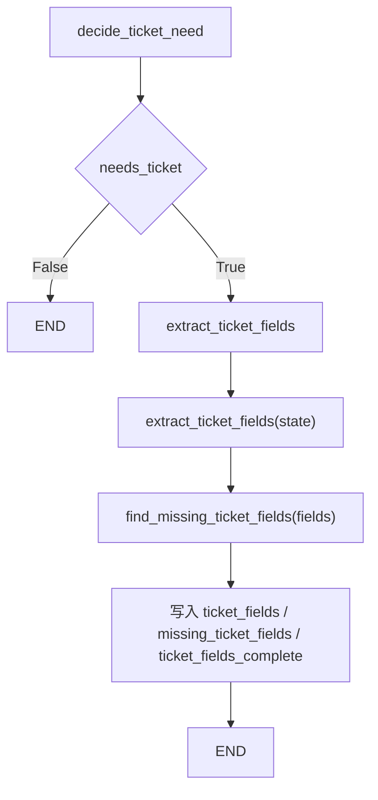

# 阶段 5 第 17 节：工单字段提取节点

## 本节定位

第 16 节我们完成了：

```text
判断是否需要创建工单
```

也就是：

```text
用户明确投诉 / 要处理
-> needs_ticket = True
-> 进入工单流程

RAG no_context
-> needs_ticket = True
-> 进入工单流程

RAG answered
-> needs_ticket = False
-> 本轮结束
```

但上一节进入工单流程后，`extract_ticket_fields` 仍然只是占位节点。

它只会说：

```text
已判断需要进入工单流程，后续课程会抽取工单字段并请求确认。
```

第 17 节就把这个占位节点做实。

本节实现：

```text
进入工单流程
-> extract_ticket_fields
-> 从用户输入和当前 State 中抽取初步工单字段
-> 判断哪些字段缺失
-> 把字段和缺失情况写回 State
```

注意，本节仍然不会真正创建工单。

本节也不会让用户确认。

本节只做：

```text
把自然语言问题变成一份初步结构化工单字段。
```

这一步非常关键。

因为后面的：

```text
缺失字段追问
用户确认
调用 Java API 创建工单
```

都依赖这一步的结构化结果。

## 本节学习目标

学完本节，你应该能解释清楚：

1. 什么是工单字段。
2. 为什么创建工单前必须抽取字段。
3. 为什么不能把用户原话直接丢给 Java 创建工单。
4. 最小客服工单需要哪些字段。
5. `issue_type`、`order_id`、`description`、`user_request`、`urgency`、`need_human_review` 分别表示什么。
6. 为什么字段抽取结果要写入 Agent State。
7. 为什么字段抽取不等于字段完整。
8. 为什么订单相关问题通常需要 `order_id`。
9. 为什么知识库缺口类工单可以不需要 `order_id`。
10. 为什么本节先用规则抽取，不直接用真实大模型。
11. 规则抽取和 LLM structured output 的区别。
12. `ticket_fields`、`missing_ticket_fields`、`ticket_fields_complete` 分别解决什么问题。
13. `extract_ticket_fields_node` 和 `find_missing_ticket_fields` 的职责区别。
14. 如何测试字段完整和字段缺失两类情况。

## 本节先不学什么

本节暂时不学：

1. 不接真实大模型抽字段。
2. 不写复杂 Prompt。
3. 不做多轮追问。
4. 不把缺失字段问题发给用户。
5. 不让用户确认工单。
6. 不调用 Java mock 创建工单。
7. 不做权限校验。
8. 不做工单幂等性。
9. 不做 checkpoint 恢复。

这些会在后面继续推进。

本节只解决一个问题：

```text
当 Agent 已经判断需要进入工单流程时，如何从当前 State 中抽取一份初步工单字段。
```

## 一、基础知识铺垫

### 1. 什么是字段

字段可以理解成：

```text
一条结构化数据里的一个信息项。
```

比如一个用户对象可能有字段：

```text
user_id
name
phone
created_at
```

一个订单对象可能有字段：

```text
order_id
status
amount
paid_at
shipping_status
```

一个工单对象也有字段。

例如：

```text
issue_type
order_id
description
user_request
urgency
need_human_review
```

字段的作用是：

```text
让系统可以稳定读取、校验、保存、查询和流转业务数据。
```

自然语言适合人读。

字段适合程序处理。

### 2. 什么是工单字段

工单字段就是创建和处理工单所需要的结构化信息。

用户原话可能是：

```text
我要投诉订单 1001，物流一直不动。
```

系统不能只保存一句原话就结束。

它需要拆出：

```text
issue_type: complaint
order_id: 1001
description: 我要投诉订单 1001，物流一直不动
user_request: 投诉处理
urgency: high
need_human_review: true
```

这些字段后续会用于：

```text
判断是否缺信息
给用户确认
映射成 Java API 参数
决定优先级
分派给对应客服队列
统计问题类型
排查流程
```

所以字段不是“多余格式”。

字段是业务系统能工作的基础。

### 3. 为什么不能直接把用户原话给 Java 创建工单

假设直接把下面一句话传给 Java：

```text
商品破损，帮我处理。
```

Java 服务会遇到问题：

```text
工单类型是什么？
订单号是什么？
标题怎么写？
优先级是什么？
是否需要人工审核？
```

如果 Java 服务自己去猜，就会把 AI 逻辑扩散到业务系统里。

这不是好设计。

AI 服务应该在自己这一层完成：

```text
理解自然语言
抽取初步结构化字段
判断缺失
交给用户确认
再调用 Java API
```

Java 服务更适合负责：

```text
校验创建工单命令
写数据库
生成工单编号
保证权限和事务
返回创建结果
```

所以 Python AI 服务和 Java 业务服务要分工。

本节就是 Python AI 服务这边的字段抽取入口。

### 4. 字段抽取是什么

字段抽取就是：

```text
从自然语言、上下文或已有 State 中提取结构化字段。
```

例如：

```text
用户：订单 A1001 已付款一周仍未发货，请帮我处理。
```

字段抽取结果可能是：

```python
{
    "issue_type": "logistics",
    "order_id": "A1001",
    "description": "订单 A1001 已付款一周仍未发货，请帮我处理。",
    "user_request": "人工处理",
    "urgency": "high",
    "need_human_review": True,
}
```

这里面既有直接从文本里拿到的字段：

```text
order_id = A1001
description = 原始问题
```

也有根据规则推断出来的字段：

```text
issue_type = logistics
urgency = high
need_human_review = True
```

字段抽取不是简单复制文本。

它包含：

```text
识别
归类
提取
补充默认值
判断缺失
```

### 5. 字段抽取和结构化输出的关系

阶段 2 我们学过：

```text
结构化输出
```

也就是让模型按照固定 JSON / Pydantic schema 输出。

字段抽取通常就是结构化输出的一个典型应用。

真实生产里，工单字段抽取很可能用：

```text
LLM structured output
Pydantic schema
JSON Schema
校验失败重试
人工兜底
```

但本节先不直接用真实模型。

原因是本节要先讲清楚：

```text
字段应该长什么样
State 应该怎么保存
缺失字段怎么表达
图里的节点边界是什么
```

当这些边界清楚后，再把规则抽取换成 LLM structured output 就容易很多。

### 6. 为什么本节先用规则抽取

本节使用规则抽取，而不是直接调用模型。

原因有四个。

第一，稳定。

规则抽取的输出固定，测试不会因为模型随机性变化。

第二，便宜。

不用消耗 token，不需要 API key。

第三，边界清楚。

你可以看清楚：

```text
节点读什么 State
返回什么字段
缺失字段如何判断
后续节点如何使用
```

第四，方便教学。

如果一开始就接真实模型，问题会混在一起：

```text
Prompt 写得好不好
模型理解准不准
JSON 是否合规
Pydantic 校验是否失败
节点状态是否写对
图路由是否正确
```

本节先把非模型部分讲透。

后面再加模型时，你才能判断：

```text
问题到底出在模型抽取，还是出在 Agent 流程。
```

### 7. 字段抽取不等于字段完整

这点很重要。

字段抽取只能说：

```text
我从现有信息里尽量提取了字段。
```

它不能保证：

```text
所有创建工单需要的信息都齐了。
```

例如用户说：

```text
商品破损，帮我处理。
```

可以抽出：

```text
issue_type = complaint
description = 商品破损，帮我处理
user_request = 人工处理
urgency = high
need_human_review = true
```

但缺少：

```text
order_id
```

订单相关问题没有订单号，后续 Java 服务很难定位订单。

所以还必须有：

```text
missing_ticket_fields
```

字段抽取和缺失判断要一起做。

### 8. 哪些字段是本节最小工单字段

本节定义的最小字段是：

```text
issue_type
order_id
description
user_request
urgency
need_human_review
```

它们的含义：

| 字段 | 含义 | 例子 |
| --- | --- | --- |
| `issue_type` | 问题类型 | `complaint`、`logistics`、`refund`、`policy_gap` |
| `order_id` | 用户提到的订单号 | `1001`、`A1001` |
| `description` | 问题描述 | `我要投诉订单 1001，物流一直不动` |
| `user_request` | 用户诉求 | `投诉处理`、`人工处理`、`创建工单` |
| `urgency` | 紧急程度 | `normal`、`high` |
| `need_human_review` | 是否需要人工审核 | `true` / `false` |

为什么没有一次性加入更多字段？

比如：

```text
phone
email
attachments
refund_amount
product_id
address
```

因为本阶段是智能工单 Agent v1。

我们先做最小可运行流程。

字段太多会导致：

```text
抽取难度上升
缺失字段追问复杂
确认内容冗长
测试组合爆炸
```

所以本节保持字段少而关键。

### 9. issue_type 是什么

`issue_type` 表示问题类型。

本节支持：

```text
refund
logistics
complaint
policy_gap
unknown
```

含义：

| 类型 | 适用场景 |
| --- | --- |
| `refund` | 退款、退货、售后相关 |
| `logistics` | 物流、快递、发货、未发货相关 |
| `complaint` | 投诉、商品破损、要求处理相关 |
| `policy_gap` | 用户问政策，但知识库没有资料 |
| `unknown` | 当前规则无法判断类型 |

`unknown` 很重要。

它表示：

```text
系统不知道问题类型，不能乱猜。
```

后续第 18 节可以根据 `unknown` 追问：

```text
请说明这是退款、物流、投诉还是其他问题？
```

### 10. order_id 为什么有时必填，有时不必填

不是所有工单都必须有订单号。

订单相关问题通常需要订单号：

```text
refund
logistics
complaint
```

因为这些问题通常要定位具体订单。

比如：

```text
商品破损
物流一直不动
退款不到账
```

没有订单号，客服很难处理。

但 `policy_gap` 不一定需要订单号。

例如：

```text
会员等级政策是什么？
```

知识库没有资料，这更像一个知识库缺口或政策咨询问题。

它可以记录为：

```text
知识库未覆盖的问题
```

不一定需要订单号。

所以本节缺失字段判断不是死板地要求所有工单都有 `order_id`。

而是：

```text
订单相关 issue_type 需要 order_id。
policy_gap 暂时不要求 order_id。
```

### 11. description 和 user_request 的区别

这两个字段很容易混。

`description` 是：

```text
发生了什么问题。
```

`user_request` 是：

```text
用户希望系统做什么。
```

例子：

```text
用户：我要投诉订单 1001，物流一直不动。
```

可以拆成：

```text
description = 我要投诉订单 1001，物流一直不动
user_request = 投诉处理
```

再比如：

```text
用户：商品破损，帮我处理。
```

可以拆成：

```text
description = 商品破损，帮我处理
user_request = 人工处理
```

为什么要分开？

因为后续创建工单时：

```text
description 可以作为工单详细描述
user_request 可以帮助选择处理动作或客服队列
```

### 12. urgency 是什么

`urgency` 是紧急程度。

本节先支持：

```text
low
normal
high
```

当前规则里，出现下面词时会标为 `high`：

```text
投诉
破损
坏了
一直不动
一周
加急
立刻
马上
```

为什么要有紧急程度？

因为真实客服系统会根据紧急程度做：

```text
排队优先级
提醒
升级
统计
SLA 管理
```

本节只是做最简单的规则推断。

### 13. need_human_review 是什么

`need_human_review` 表示：

```text
这条工单是否需要人工查看。
```

本节只要进入工单流程，大多数情况下都会需要人工。

尤其是：

```text
用户明确投诉
RAG no_context
紧急程度 high
```

都应该：

```text
need_human_review = True
```

后续创建工单前，我们还会让用户确认。

人工审核和用户确认不是一回事。

用户确认是：

```text
创建前让用户确认工单内容。
```

人工审核是：

```text
工单创建后是否需要客服人员处理。
```

### 14. 字段抽取结果为什么写入 State

LangGraph 的后续节点不能靠猜。

第 18 节要追问缺失字段，它需要知道：

```text
缺了哪些字段。
```

第 19 节要让用户确认，它需要知道：

```text
当前已抽取字段是什么。
```

第 20 节要调用 Java API，它需要知道：

```text
哪些字段可以映射成 CreateTicketArgs。
```

所以第 17 节必须把字段写入 State：

```text
ticket_fields
missing_ticket_fields
ticket_fields_complete
ticket_field_extraction_source
```

如果只在函数内部算完就丢掉，后续节点就无法继续。

### 15. 为什么 State 里保存普通 dict

项目里已有 Pydantic 模型：

```text
TicketExtraction
CreateTicketArgs
```

那为什么本节 Agent State 里没有直接保存 Pydantic 对象？

原因是：

```text
LangGraph State 后续可能会被序列化、checkpoint、日志记录和传给前端。
```

普通 dict 更容易观察和保存。

Pydantic 模型适合：

```text
接口请求响应
模型输出校验
Java API 参数校验
```

State 适合：

```text
保存流程中间状态。
```

所以本节先在 State 中保存普通结构：

```python
ticket_fields = {
    "issue_type": "complaint",
    "order_id": "1001",
    "description": "...",
    "user_request": "投诉处理",
    "urgency": "high",
    "need_human_review": True,
}
```

后续真正调用 Java API 前，再转换成后端拥有的 Pydantic 命令模型。

## 二、本节主题系统讲解

### 1. 本节完成后的工单流程

第 16 节后：

```text
decide_ticket_need
-> needs_ticket=True
-> extract_ticket_fields
-> END
```

但 `extract_ticket_fields` 只是占位。

第 17 节后：

```text
decide_ticket_need
-> needs_ticket=True
-> extract_ticket_fields
-> 写入 ticket_fields
-> 写入 missing_ticket_fields
-> 写入 ticket_fields_complete
-> END
```

用图表示：



本节仍然没有把 `extract_ticket_fields` 后面接到追问节点。

因为追问缺失字段是第 18 节。

现在先让 State 里有足够信息。

### 2. 新增类型：TicketIssueType

代码新增：

```python
TicketIssueType = Literal["refund", "logistics", "complaint", "policy_gap", "unknown"]
```

这限定了问题类型的取值范围。

为什么不用随便字符串？

因为工单类型是业务字段。

如果随便字符串，可能出现：

```text
refund
Refund
refund_issue
退款
售后退款
```

后续统计和映射都会混乱。

用固定枚举值可以让系统稳定。

### 3. 新增类型：TicketUrgencyLevel

代码新增：

```python
TicketUrgencyLevel = Literal["low", "normal", "high"]
```

它表示紧急程度。

本节实际用到：

```text
normal
high
```

保留 `low` 是为了未来扩展。

### 4. 新增类型：TicketFields

代码新增：

```python
class TicketFields(TypedDict):
    issue_type: TicketIssueType
    order_id: str | None
    description: str
    user_request: str
    urgency: TicketUrgencyLevel
    need_human_review: bool
```

这就是本节的核心字段结构。

它描述：

```text
一份初步工单字段应该包含哪些键。
```

注意：

```text
order_id 可以是 None。
```

因为有些输入没有订单号。

没有订单号不代表程序报错。

它代表：

```text
字段缺失，需要后续追问。
```

### 5. State 新增字段

`TicketAgentState` 新增：

```python
ticket_fields: TicketFields
missing_ticket_fields: list[str]
ticket_fields_complete: bool
ticket_field_extraction_source: TicketFieldExtractionSource
```

含义：

| 字段 | 含义 |
| --- | --- |
| `ticket_fields` | 当前抽取出的工单字段 |
| `missing_ticket_fields` | 当前仍缺少的字段名 |
| `ticket_fields_complete` | 字段是否已经满足当前最小创建条件 |
| `ticket_field_extraction_source` | 字段抽取来源，本节是 `rule_based` |

这四个字段一起表达：

```text
抽到了什么
缺了什么
够不够继续
这些字段从哪里来的
```

### 6. `extract_ticket_fields`：纯字段抽取函数

本节核心函数：

```python
def extract_ticket_fields(state: TicketAgentState) -> TicketFields:
    ...
```

它从 State 里读取：

```text
normalized_message
ticket_need_source
rag_answer_status
```

然后输出：

```text
TicketFields
```

为什么需要 `ticket_need_source`？

因为同一句话在不同来源下含义可能不同。

例如：

```text
会员等级政策是什么？
```

如果这是普通 `policy_question` 且 RAG 已回答，不会进工单。

如果它是：

```text
ticket_need_source = rag_no_context
```

那说明：

```text
这是知识库没有覆盖的问题。
```

字段抽取就应该生成：

```text
issue_type = policy_gap
user_request = 补充或人工解释知识库未覆盖问题
```

所以字段抽取不只看用户原话，也要看流程上下文。

### 7. 订单号怎么抽取

本节用两条规则抽订单号。

第一条：

```text
优先匹配“订单 / 订单号 / order”后面的编号。
```

例如：

```text
订单 1001
订单号：A1001
order A1001
```

第二条：

```text
如果没有明确“订单”字样，再尝试匹配明显像订单号的编号。
```

例如：

```text
A1001
1001
```

这只是学习版规则。

真实系统里订单号格式应该由业务系统定义。

例如：

```text
必须是 A 开头加 4 位数字
必须是 18 位数字
必须来自登录用户订单列表
```

本节先不做这么复杂。

### 8. issue_type 怎么推断

本节使用关键词推断。

优先级是：

```text
complaint
logistics
refund
policy_gap
unknown
```

为什么 `complaint` 优先？

例如：

```text
我要投诉订单 1001，物流一直不动。
```

这句话既有：

```text
投诉
物流
一直不动
```

如果先判断物流，可能会得到：

```text
issue_type = logistics
```

但用户明确说“投诉”，业务上更应该归到投诉处理。

所以本节让投诉优先。

### 9. policy_gap 怎么来

`policy_gap` 不是从用户关键词直接来的。

它来自流程上下文：

```text
ticket_need_source = rag_no_context
```

或者：

```text
rag_answer_status = no_context
```

这说明：

```text
用户问的是政策/知识问题，但知识库没有资料。
```

这种工单的目的不是处理订单，而是：

```text
记录知识库缺口
让人工或业务侧补充说明
后续补充知识文档
```

所以不要求订单号。

### 10. 缺失字段怎么判断

函数：

```python
find_missing_ticket_fields(fields)
```

当前规则：

```text
issue_type == unknown -> 缺 issue_type
description 为空 -> 缺 description
user_request 为空 -> 缺 user_request
issue_type 是 refund/logistics/complaint 且 order_id 为空 -> 缺 order_id
```

这几条规则体现一个原则：

```text
不是所有字段都一刀切必填。
```

字段是否必填，要看业务类型。

订单相关问题需要订单号。

知识库缺口问题可以先不需要订单号。

### 11. 字段完整后为什么也不创建工单

即使：

```text
ticket_fields_complete = True
```

本节仍然不调用 Java 创建工单。

因为还缺：

```text
用户确认
权限校验
幂等性
Java API 调用
错误处理
```

字段完整只表示：

```text
已经具备进入确认环节的基础信息。
```

不是：

```text
可以直接创建。
```

这就是阶段 5 的顺序：

```text
第 17 节：抽字段
第 18 节：缺失字段追问
第 19 节：用户确认
第 20 节：调用 Java API 创建工单
```

### 12. 本节和已有 TicketExtraction 的关系

项目里已经有：

```text
app.schemas.structured.TicketExtraction
```

那它和本节的 `TicketFields` 有什么关系？

`TicketExtraction` 是阶段 2/3 用来学习结构化输出和工单 workflow 的 Pydantic 模型。

它适合：

```text
模型输出校验
接口响应
转换成 CreateTicketArgs
```

本节的 `TicketFields` 是 LangGraph Agent 流程里的中间 State。

它适合：

```text
保存当前节点抽出的字段
保存缺失字段
供后续追问和确认节点使用
```

以后可以把两者打通：

```text
TicketFields -> TicketExtraction -> CreateTicketArgs
```

但本节先保持简单。

## 三、本节代码讲解

### 1. 新增字段类型

新增：

```python
TicketIssueType = Literal["refund", "logistics", "complaint", "policy_gap", "unknown"]
TicketUrgencyLevel = Literal["low", "normal", "high"]
TicketFieldExtractionSource = Literal["rule_based"]
```

这几个类型的学习重点不是语法本身。

重点是：

```text
业务字段要有稳定取值范围。
```

### 2. 新增 TicketFields

新增：

```python
class TicketFields(TypedDict):
    issue_type: TicketIssueType
    order_id: str | None
    description: str
    user_request: str
    urgency: TicketUrgencyLevel
    need_human_review: bool
```

它让我们明确：

```text
工单字段抽取节点到底要产出什么。
```

### 3. 新增 State 字段

新增：

```python
ticket_fields: TicketFields
missing_ticket_fields: list[str]
ticket_fields_complete: bool
ticket_field_extraction_source: TicketFieldExtractionSource
```

这让后续节点可以直接读取：

```text
当前字段是什么
缺什么
是否可以进入确认
字段来源是不是规则抽取
```

### 4. `extract_ticket_fields`

核心逻辑：

```python
def extract_ticket_fields(state: TicketAgentState) -> TicketFields:
    normalized_message = state.get("normalized_message", "").strip()
    lowered_message = normalized_message.casefold()
    ticket_need_source = state.get("ticket_need_source")
    rag_answer_status = state.get("rag_answer_status")
    issue_type = _infer_ticket_issue_type(...)
    urgency = _infer_ticket_urgency(...)

    return {
        "issue_type": issue_type,
        "order_id": _extract_order_id(normalized_message),
        "description": _build_ticket_description(...),
        "user_request": _infer_ticket_user_request(...),
        "urgency": urgency,
        "need_human_review": ...,
    }
```

按职责看：

```text
读取 State
调用小函数推断字段
返回统一字段结构
```

这个函数没有写 LangGraph 节点逻辑。

它是纯字段抽取能力。

### 5. `find_missing_ticket_fields`

这个函数只负责判断缺失。

它不抽字段。

它不改 State。

它只回答：

```text
当前这份 fields 还缺哪些字段？
```

这种拆分让测试更简单。

你可以单独测试：

```text
抽取是否正确
缺失判断是否正确
节点是否写回 State
```

### 6. `extract_ticket_fields_node`

节点函数：

```python
def extract_ticket_fields_node(state: TicketAgentState) -> TicketAgentState:
    fields = extract_ticket_fields(state)
    missing_fields = find_missing_ticket_fields(fields)

    return {
        "ticket_fields": fields,
        "missing_ticket_fields": missing_fields,
        "ticket_fields_complete": not missing_fields,
        "ticket_field_extraction_source": "rule_based",
        "final_answer": _build_ticket_fields_extraction_answer(missing_fields),
        "node_history": ["extract_ticket_fields"],
    }
```

这个节点真正做的是：

```text
把字段抽取能力接入 LangGraph State。
```

它的输出不是只给用户看的文本。

更重要的是 State：

```text
ticket_fields
missing_ticket_fields
ticket_fields_complete
```

### 7. final_answer 为什么只是临时说明

本节的 `final_answer` 是：

```text
已进入工单流程，并抽取了初步工单字段...
```

或者：

```text
已进入工单流程，并抽取了部分工单字段；仍缺少 order_id...
```

它只是学习阶段的临时说明。

真实系统里，第 18 节之后可能会变成：

```text
为了创建工单，请补充订单号。
```

第 19 节之后可能会变成：

```text
请确认是否创建以下工单...
```

所以本节 `final_answer` 不要看得太重。

重点是结构化字段已经写入 State。

## 四、本节测试讲解

### 1. 测完整字段抽取

测试输入：

```text
我要投诉订单 1001，物流一直不动
```

期望抽出：

```text
issue_type = complaint
order_id = 1001
description = 原始问题
user_request = 投诉处理
urgency = high
need_human_review = True
```

这验证：

```text
明确投诉 + 订单号 + 高紧急词 能被规则识别。
```

### 2. 测缺失订单号

测试输入：

```text
商品破损，帮我处理
```

可以抽出问题类型和诉求。

但缺少订单号。

期望：

```text
missing_ticket_fields = ["order_id"]
ticket_fields_complete = False
```

这为第 18 节追问做准备。

### 3. 测 policy_gap

测试输入：

```text
会员等级政策是什么？
```

在 `rag_no_context` 语境下，期望：

```text
issue_type = policy_gap
order_id = None
missing_ticket_fields = []
```

这验证：

```text
知识库缺口类工单不强制要求订单号。
```

### 4. 测节点写 State

`extract_ticket_fields_node` 测试验证：

```text
ticket_fields
missing_ticket_fields
ticket_fields_complete
ticket_field_extraction_source
node_history
```

都被写入 State。

### 5. 测完整图

完整图测试验证：

```text
会员等级政策是什么？
-> policy_question
-> retrieve_policy
-> no_context
-> decide_ticket_need
-> extract_ticket_fields
-> ticket_fields.issue_type = policy_gap
```

这说明：

```text
字段抽取节点不是孤立函数，而是真的接进 Agent 流程。
```

### 6. 测 stream 输出

stream 测试验证：

```text
我要投诉订单 1001，物流一直不动
```

执行到 `extract_ticket_fields` 时，增量输出里能看到：

```text
ticket_fields
missing_ticket_fields
ticket_fields_complete
```

这对后续可观测性和前端展示有价值。

## 五、本节真正学到了什么

本节不是学复杂正则，也不是学几个关键词判断。

本节真正学的是：

```text
如何把自然语言业务诉求变成 Agent 可继续处理的结构化 State。
```

你要抓住这个模式：

```text
用户自然语言
-> 规则或模型抽字段
-> 结构化字段
-> 缺失字段列表
-> 写入 State
-> 后续节点继续处理
```

这就是 AI 应用工程和普通聊天机器人的区别。

普通聊天机器人只生成一句回复。

业务 Agent 要把对话推进成：

```text
可验证
可追问
可确认
可执行
可审计
```

### 1. 从代码角度看

本节完成了：

```text
TicketFields 类型
字段抽取规则
订单号提取
问题类型推断
紧急程度推断
人工审核判断
缺失字段判断
extract_ticket_fields_node 写 State
完整图和 stream 测试
```

### 2. 从架构角度看

本节完成了：

```text
工单流程的第一份结构化数据。
```

第 16 节只是知道：

```text
要进入工单流程。
```

第 17 节开始知道：

```text
这个工单大概是什么类型、关联哪个订单、用户想要什么、是否缺字段。
```

### 3. 从学习角度看

你需要重点掌握：

```text
字段抽取和字段完整是两件事。
字段抽取结果必须结构化。
缺失字段要显式写入 State。
规则抽取是训练阶段的稳定替身。
后续真实 LLM 抽取也应该遵守同一份字段契约。
```

## 六、常见误区

### 误区 1：用户说得挺清楚，就不用抽字段

不对。

用户说得清楚，只是人能看懂。

程序还需要结构化字段才能继续处理。

### 误区 2：抽出字段就能创建工单

不一定。

还要看字段是否完整。

即使完整，也需要用户确认和权限校验。

### 误区 3：没有订单号就是程序错误

不对。

没有订单号可能只是用户没提供。

这是一种正常业务状态，应该写入 `missing_ticket_fields`。

### 误区 4：所有工单都必须有订单号

不对。

订单相关问题通常需要订单号。

但知识库缺口类问题不一定需要订单号。

字段是否必填要结合业务类型。

### 误区 5：规则抽取太简单，所以没有学习价值

不对。

本节重点不是规则本身。

重点是字段契约、State 设计和节点边界。

后续把规则换成模型时，这些边界仍然有效。

## 七、和前面课程的衔接

### 1. 和第 16 节的关系

第 16 节决定：

```text
needs_ticket = True
```

第 17 节接着做：

```text
extract_ticket_fields
```

也就是：

```text
既然需要工单，那先把工单字段抽出来。
```

### 2. 和第 18 节的关系

第 17 节产出：

```text
missing_ticket_fields
ticket_fields_complete
```

第 18 节会使用它们：

```text
如果缺字段，向用户追问。
如果不缺字段，进入确认。
```

### 3. 和阶段 2 的关系

阶段 2 学过：

```text
结构化输出
Pydantic 约束
TicketExtraction
```

本节是它在 LangGraph Agent 中的业务落点。

以后我们可以把规则抽取替换成：

```text
LLM structured output -> Pydantic 校验 -> 写入 State
```

### 4. 和阶段 3 的关系

阶段 3 学过：

```text
创建工单流程
用户确认
调用 Java API
```

第 17 节为后续调用 Java API 准备字段。

但不会跳过确认。

## 八、你应该能口述出的版本

如果别人问：

```text
你的 Agent 进入工单流程后怎么抽字段？
```

你可以这样回答：

```text
当前面 decide_ticket_need 判断 needs_ticket=True 后，图会进入 extract_ticket_fields 节点。
这个节点从 State 中读取 normalized_message、ticket_need_source 和 rag_answer_status，先用规则抽取一份初步工单字段，包括 issue_type、order_id、description、user_request、urgency 和 need_human_review。
然后它会调用缺失字段判断函数，生成 missing_ticket_fields 和 ticket_fields_complete。
如果是投诉、退款、物流这类订单相关问题，order_id 缺失会被标记出来；如果是 RAG no_context 触发的 policy_gap，则不强制要求订单号。
本节先用规则抽取保证测试稳定，后续可以替换成 LLM structured output，但 State 字段契约保持一致。
```

## 九、本节练习

### 练习 1：解释字段抽取

题目：

请解释：

```text
为什么创建工单前必须先抽字段？
```

参考答案：

```text
因为 Java 业务服务不能只接收一段自然语言原话，它需要稳定的结构化参数，例如问题类型、订单号、描述、优先级等。
字段抽取可以把用户自然语言转成后续追问、确认和创建工单都能使用的结构化 State。
```

### 练习 2：判断字段

题目：

用户输入：

```text
我要投诉订单 1001，物流一直不动。
```

请写出本节可能抽出的字段。

参考答案：

```text
issue_type = complaint
order_id = 1001
description = 我要投诉订单 1001，物流一直不动。
user_request = 投诉处理
urgency = high
need_human_review = True
```

### 练习 3：判断缺失字段

题目：

用户输入：

```text
商品破损，帮我处理。
```

本节为什么会把 `order_id` 放入 `missing_ticket_fields`？

参考答案：

```text
因为商品破损属于订单相关的投诉类问题，后续处理通常需要定位具体订单。
用户没有提供订单号，所以 order_id 缺失，需要第 18 节追问用户补充。
```

### 练习 4：判断 policy_gap

题目：

用户问：

```text
会员等级政策是什么？
```

RAG 返回 `no_context` 后，本节为什么把 `issue_type` 设为 `policy_gap`？

参考答案：

```text
因为这不是订单投诉，也不是退款或物流，而是知识库没有覆盖的政策问题。
policy_gap 表示知识库缺口或需要人工解释的问题，后续可以记录为待补充知识或人工处理。
```

### 练习 5：解释 ticket_fields_complete

题目：

`ticket_fields_complete=True` 是否代表可以马上调用 Java API 创建工单？

参考答案：

```text
不代表。
它只表示当前最小字段已经齐了，可以进入后续确认环节。
真正创建工单前还需要用户确认、权限校验、幂等性和 Java API 调用。
```

### 练习 6：思考真实 LLM 替换

题目：

后续如果用真实大模型抽字段，哪些字段契约应该保持不变？

参考答案：

```text
至少应该保持 ticket_fields 的字段结构不变，包括 issue_type、order_id、description、user_request、urgency、need_human_review。
同时仍然要保留 missing_ticket_fields 和 ticket_fields_complete，因为模型抽取也可能缺字段或抽错字段。
```

## 十、自测问题

### 自测 1

问题：

字段抽取和最终创建工单有什么区别？

答案：

```text
字段抽取只是从当前输入中整理出结构化信息。
最终创建工单是确认后调用业务系统写入工单记录。
字段抽取是前置步骤，不等于执行创建动作。
```

### 自测 2

问题：

`ticket_fields` 里保存什么？

答案：

```text
保存初步抽取出的工单字段，包括 issue_type、order_id、description、user_request、urgency 和 need_human_review。
```

### 自测 3

问题：

为什么 `missing_ticket_fields` 是列表？

答案：

```text
因为一次可能缺多个字段。
用列表可以清楚告诉后续节点要追问哪些字段，也方便测试和前端展示。
```

### 自测 4

问题：

为什么本节用 `rule_based` 作为 `ticket_field_extraction_source`？

答案：

```text
因为本节字段抽取来自规则，不是真实模型。
记录来源可以帮助调试，也为后续切换到 llm_structured_output 留出位置。
```

### 自测 5

问题：

为什么 `policy_gap` 不强制要求订单号？

答案：

```text
因为 policy_gap 表示知识库没有覆盖的政策或规则问题，它不一定关联具体订单。
订单号是否必填要看问题类型，不能一刀切。
```

### 自测 6

问题：

为什么 `complaint` 优先于 `logistics`？

答案：

```text
因为用户明确说“投诉”时，业务上更应该进入投诉处理，即使句子里同时出现物流问题。
投诉代表更强的处理诉求。
```

### 自测 7

问题：

第 18 节会使用第 17 节的哪些字段？

答案：

```text
主要会使用 missing_ticket_fields 和 ticket_fields_complete。
如果缺字段，就追问用户补充；如果字段完整，就可以进入确认流程。
```

### 自测 8

问题：

本节为什么不需要打开 VMware、Qdrant、Milvus 或真实模型？

答案：

```text
因为本节只做本地规则字段抽取和 State 更新，不依赖向量数据库、Docker、Java 服务或模型 API。
```

### 自测 9

问题：

为什么字段抽取节点要写 `node_history`？

答案：

```text
node_history 可以证明 Agent 本轮确实经过了 extract_ticket_fields，方便测试、调试和后续可观测性。
```

### 自测 10

问题：

如果用户只说“帮我处理一下”，本节可能会遇到什么问题？

答案：

```text
这句话太模糊，可能无法确定 issue_type，也没有 order_id。
本节会把能抽到的字段写入 State，并把缺失字段留给第 18 节追问。
```

## 十一、本节验收标准

完成本节后，应满足：

```text
1. extract_ticket_fields 不再只是占位节点。
2. State 中有 ticket_fields、missing_ticket_fields、ticket_fields_complete。
3. 能从“我要投诉订单 1001，物流一直不动”抽出 complaint、1001、high。
4. 能从“商品破损，帮我处理”识别缺少 order_id。
5. 能从 RAG no_context 场景生成 policy_gap 字段。
6. ticket_fields_complete 能区分字段完整和缺失。
7. stream 输出能看到 extract_ticket_fields 的增量结果。
8. 测试不依赖真实模型、Qdrant、Milvus、VMware、Docker 或 Java 服务。
```

## 十二、本节参考资料

- [Pydantic Models](https://docs.pydantic.dev/latest/concepts/models/)
  - 用途：复习结构化数据模型、字段约束和后续把抽取结果接入 Pydantic 校验的方向。
- [LangGraph Thinking in LangGraph](https://docs.langchain.com/oss/python/langgraph/thinking-in-langgraph)
  - 用途：理解如何把 Agent 拆成独立节点，每个节点读 State、写 State，并让后续节点继续处理。
- [LangGraph Graph API](https://docs.langchain.com/oss/python/langgraph/graph-api)
  - 用途：复习 StateGraph、节点更新、条件边和图执行。
- [阶段 2 第 16 节：Pydantic 约束结构化输出](llm-api-stage2-16-pydantic-structured-output.md)
  - 用途：复习 `TicketExtraction`、结构化输出和 Pydantic 校验。
- [阶段 3 第 15 节：创建工单流程](tool-calling-stage3-15-ticket-creation-workflow.md)
  - 用途：复习创建工单前为什么需要字段抽取、用户确认和 Java API。
- [阶段 5 第 16 节：判断是否需要创建工单](langgraph-stage5-16-decide-ticket-need.md)
  - 用途：复习 `needs_ticket=True` 如何进入字段抽取节点。

## 十三、下一节预告

下一节进入：

```text
阶段 5 第 18 节：缺失字段追问节点
```

第 17 节已经能判断：

```text
哪些字段缺失。
```

第 18 节要做：

```text
如果缺字段，Agent 应该怎么问用户补充？
```

例如：

```text
missing_ticket_fields = ["order_id"]
```

下一节就要生成类似：

```text
为了继续创建工单，请补充相关订单号。
```

这样 Agent 才能从单轮处理逐步走向多轮工单流程。
