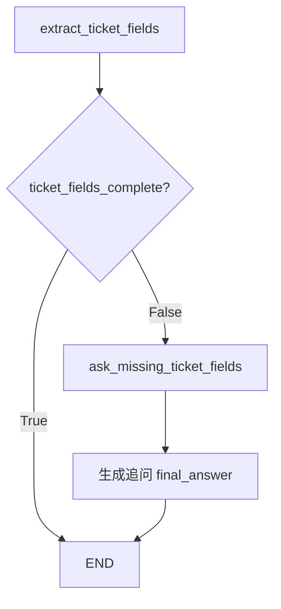

# 阶段 5 第 18 节：缺失字段追问节点

## 本节定位

第 17 节我们完成了：

```text
工单字段提取节点
```

也就是：

```text
needs_ticket = True
-> extract_ticket_fields
-> 抽取 ticket_fields
-> 计算 missing_ticket_fields
-> 写入 ticket_fields_complete
```

现在 Agent 已经知道：

```text
字段完整不完整。
如果不完整，到底缺哪些字段。
```

例如：

```text
用户：商品破损，帮我处理。
```

第 17 节可以抽出：

```text
issue_type = complaint
description = 商品破损，帮我处理
user_request = 人工处理
urgency = high
need_human_review = True
```

但也会发现：

```text
missing_ticket_fields = ["order_id"]
ticket_fields_complete = False
```

第 17 节到这里就结束了。

它不会真正问用户：

```text
请补充订单号。
```

第 18 节要做的就是补上这个能力：

```text
字段缺失
-> 进入 ask_missing_ticket_fields 节点
-> 生成清楚的追问问题
-> 写回 State
-> 把追问作为 final_answer 返回给用户
```

本节仍然不做真正的多轮恢复。

也就是说，本节先完成：

```text
生成追问。
```

后续 checkpoint / thread_id / interrupt 学完后，才会继续处理：

```text
用户回答追问后，如何恢复上一次工单流程并补字段。
```

所以第 18 节是多轮工单流程的前置基础。

## 本节学习目标

学完本节，你应该能解释清楚：

1. 什么是缺失字段追问。
2. 为什么字段缺失时不能直接进入用户确认或创建工单。
3. 为什么字段完整时不应该进入追问节点。
4. `missing_ticket_fields` 和追问问题之间是什么关系。
5. 为什么追问问题也要写入 State。
6. `missing_ticket_field_question` 和 `final_answer` 的区别。
7. `route_by_ticket_fields_complete` 为什么要放在 `extract_ticket_fields` 后面。
8. `TICKET_AGENT_FIELD_COMPLETION_ROUTES` 解决什么问题。
9. 单字段缺失和多字段缺失的追问有什么区别。
10. 为什么本节用规则追问，不调用真实大模型。
11. 为什么追问问题要尽量具体、少问、可回答。
12. 本节如何为第 21 节 checkpoint 和第 22 节 interrupt 铺垫。
13. 如何测试字段完整、字段缺失、stream 输出三类情况。

## 本节先不学什么

本节暂时不学：

1. 不保存多轮对话到数据库。
2. 不接 checkpoint。
3. 不接 thread_id。
4. 不实现用户回复追问后的字段合并。
5. 不做 interrupt / human-in-the-loop。
6. 不让用户确认工单。
7. 不调用 Java API 创建工单。
8. 不用真实大模型生成追问。

这些会在后面继续推进。

本节只解决一个问题：

```text
字段缺失时，Agent 如何生成一条明确追问，并把它接进 LangGraph 流程。
```

## 一、基础知识铺垫

### 1. 什么是缺失字段

缺失字段就是：

```text
创建或推进业务流程所需要的信息，目前 State 里还没有。
```

在工单场景里，用户可能只说：

```text
商品破损，帮我处理。
```

这句话能表达问题。

但它没有告诉系统：

```text
是哪一个订单的商品破损？
```

所以对于订单相关工单来说：

```text
order_id 缺失。
```

第 17 节已经把这种情况写成：

```python
missing_ticket_fields = ["order_id"]
ticket_fields_complete = False
```

这不是程序异常。

这是正常业务状态：

```text
用户还没有提供足够信息。
```

### 2. 什么是追问

追问就是：

```text
Agent 根据当前缺失信息，向用户要下一步必须补充的内容。
```

比如：

```text
请补充相关订单号（例如 1001 或 A1001），这样我才能继续为你整理工单。
```

追问不是闲聊。

追问是流程推进的一部分。

它的目标是：

```text
让 State 从不完整变完整。
```

也就是从：

```text
missing_ticket_fields = ["order_id"]
```

变成后续某一轮：

```text
order_id = "1001"
missing_ticket_fields = []
ticket_fields_complete = True
```

本节先生成追问。

真正把用户回复合并回 State，是后续多轮和 checkpoint 的内容。

### 3. 为什么字段缺失时不能继续创建工单

如果字段缺失还继续创建工单，会有风险。

例如：

```text
商品破损，帮我处理。
```

没有订单号却直接创建工单，后续客服会看到：

```text
问题：商品破损
订单号：空
```

客服无法定位订单，只能再去问用户。

这会造成：

```text
工单质量低
处理效率低
用户重复沟通
系统数据不完整
后续自动化无法继续
```

所以字段缺失时，正确路线是：

```text
先追问缺失字段。
```

不是：

```text
直接创建工单。
```

### 4. 为什么字段完整时不应该追问

如果字段已经完整，却还问用户补充，会让用户觉得系统不聪明。

例如用户说：

```text
我要投诉订单 1001，物流一直不动。
```

系统已经抽到：

```text
issue_type = complaint
order_id = 1001
description = 我要投诉订单 1001，物流一直不动
user_request = 投诉处理
urgency = high
need_human_review = True
ticket_fields_complete = True
```

这时不应该问：

```text
请补充订单号。
```

因为订单号已经有了。

正确路线应该是：

```text
字段完整
-> 不进入追问节点
-> 后续进入用户确认节点
```

本节还没有确认节点。

所以字段完整时先进入 `END`，等待后续第 19 节再接确认。

### 5. 追问不是普通兜底

普通兜底回答可能是：

```text
我还不能确定你的问题，请补充更多信息。
```

这种回答太宽泛。

缺失字段追问应该更具体：

```text
请补充相关订单号。
请说明这是退款、物流、投诉，还是其他需要人工处理的问题。
请补充问题的具体描述。
请说明你希望客服帮你处理什么。
```

区别在于：

```text
普通兜底不知道缺什么。
缺失字段追问知道缺什么。
```

这就是结构化 State 的价值。

第 17 节已经把缺失字段放进 State。

第 18 节就可以根据它生成具体问题。

### 6. 为什么不要一次乱问很多问题

如果 Agent 一次问太多，用户负担会很重。

比如：

```text
请补充订单号、问题类型、具体描述、诉求、联系方式、购买时间、商品编号、收货地址、支付方式。
```

这会让用户不想继续。

更好的做法是：

```text
只问当前流程真正需要的缺失字段。
```

本节的追问来源于：

```text
missing_ticket_fields
```

也就是说：

```text
缺什么问什么。
```

如果只缺 `order_id`，就只问订单号。

如果缺多个字段，才组合多个问题。

### 7. 为什么追问要和字段名绑定

本节不是随便生成一句话。

它有一张映射：

```text
order_id -> 请补充相关订单号...
issue_type -> 请说明这是退款、物流、投诉...
description -> 请补充问题的具体描述...
user_request -> 请说明你希望客服帮你处理什么...
```

这张映射的价值是：

```text
每个字段都有稳定追问方式。
测试可以验证。
用户更容易回答。
后续多轮合并时也知道用户这次回答是为了补哪个字段。
```

所以本节 State 里除了保存问题文本，还保存：

```text
missing_ticket_field_question_fields
```

它告诉后续流程：

```text
这次追问是针对哪些字段发出的。
```

### 8. 为什么追问问题也要写入 State

追问问题不只是给用户看的文本。

它也是 Agent 流程的一部分。

写入 State 后，后续可以做很多事：

```text
日志记录：Agent 当时问了什么？
前端展示：显示当前追问内容。
多轮恢复：用户回复的是哪个问题？
测试断言：是否问了正确字段？
审计排查：为什么流程停住？
```

所以本节新增：

```text
missing_ticket_field_question
missing_ticket_field_question_fields
```

同时把：

```text
final_answer
```

设置成追问问题。

因为在当前这一轮，用户看到的最终输出就是这条追问。

### 9. missing_ticket_field_question 和 final_answer 的区别

这两个字段值可能一样，但意义不同。

`missing_ticket_field_question` 是：

```text
结构化流程字段，表示缺失字段追问节点生成的问题。
```

`final_answer` 是：

```text
本轮返回给用户看的最终文本。
```

本节中，追问节点会让它们相同。

但后续可能不一样。

例如前端可能展示：

```text
final_answer
```

同时日志或多轮恢复使用：

```text
missing_ticket_field_question
missing_ticket_field_question_fields
```

所以不要只依赖 `final_answer` 来保存结构化流程信息。

### 10. 追问节点为什么接在字段抽取之后

追问节点必须知道缺什么。

缺什么来自：

```text
missing_ticket_fields
```

而 `missing_ticket_fields` 是 `extract_ticket_fields` 产出的。

所以顺序必须是：

```text
extract_ticket_fields
-> 判断 ticket_fields_complete
-> 如果 False
-> ask_missing_ticket_fields
```

不能反过来。

也不能直接在 `decide_ticket_need` 后追问。

因为那时还没有抽字段，不知道缺什么。

### 11. 为什么本节新增条件边

第 17 节后：

```text
extract_ticket_fields -> END
```

这是固定边。

第 18 节要改成：

```text
extract_ticket_fields
-> 如果 ticket_fields_complete=False，进入 ask_missing_ticket_fields
-> 如果 ticket_fields_complete=True，进入 END
```

这就是条件分支。

所以需要新增：

```text
route_by_ticket_fields_complete
```

和：

```text
TICKET_AGENT_FIELD_COMPLETION_ROUTES
```

### 12. 为什么本节不用真实大模型生成追问

真实系统可以让大模型生成更自然的追问。

但本节先用规则。

原因是：

```text
字段缺失追问的核心不是文采，而是准确。
```

如果缺 `order_id`，追问必须要订单号。

不能问成：

```text
请补充一下你的问题。
```

规则追问稳定、可测试、成本低。

后续如果换成大模型，也应该遵守：

```text
输入 missing_ticket_fields
输出针对这些字段的追问
不能要求无关信息
不能编造字段
```

## 二、本节主题系统讲解

### 1. 本节完成后的流程

第 17 节流程：

```text
extract_ticket_fields
-> END
```

第 18 节流程：

```text
extract_ticket_fields
-> route_by_ticket_fields_complete
-> 字段完整：END
-> 字段缺失：ask_missing_ticket_fields
-> END
```

用图表示：



字段完整例子：

```text
我要投诉订单 1001，物流一直不动
-> ticket_fields_complete=True
-> 不追问
-> END
```

字段缺失例子：

```text
商品破损，帮我处理
-> missing_ticket_fields=["order_id"]
-> ticket_fields_complete=False
-> ask_missing_ticket_fields
-> 请补充相关订单号...
```

### 2. 新增 TicketFieldCompletionRoute

代码新增：

```python
TicketFieldCompletionRoute = Literal["ask_missing_fields", "finish"]
```

它表示字段抽取后的两条业务路线：

```text
ask_missing_fields：字段不完整，需要追问
finish：字段完整，本节先结束
```

为什么叫 `finish`，不叫 `confirm`？

因为本节还没有实现用户确认节点。

等第 19 节实现确认节点后，这里可能会改成：

```text
complete -> request_ticket_confirmation
```

但本节先保持：

```text
字段完整就结束本轮。
```

### 3. 新增 TICKET_AGENT_FIELD_COMPLETION_ROUTES

代码新增：

```python
TICKET_AGENT_FIELD_COMPLETION_ROUTES = {
    "ask_missing_fields": "ask_missing_ticket_fields",
    "finish": END,
}
```

它把业务路线映射成图里的实际下一步。

这和前面两张 route map 是同一思想：

```text
intent route map：意图 -> 节点
ticket need route map：是否需要工单 -> 节点
field completion route map：字段是否完整 -> 节点
```

阶段 5 你要逐渐熟悉这种结构。

Agent 不是一条直线。

它是很多小判断组合起来的状态机。

### 4. 固定边发生了什么变化

第 17 节里固定边有：

```python
("extract_ticket_fields", END)
```

第 18 节把它去掉了。

因为 `extract_ticket_fields` 后面不再永远结束。

它后面需要条件判断。

新增固定边是：

```python
("ask_missing_ticket_fields", END)
```

意思是：

```text
追问节点生成问题后，本轮结束，等待用户补充。
```

这是合理的。

因为当前这一轮已经把问题问出去了。

下一轮用户回复时，再继续处理。

### 5. route_by_ticket_fields_complete

代码：

```python
def route_by_ticket_fields_complete(state: TicketAgentState) -> TicketFieldCompletionRoute:
    if state.get("ticket_fields_complete") is False:
        return "ask_missing_fields"
    return "finish"
```

这个函数只看：

```text
ticket_fields_complete
```

如果明确是 `False`：

```text
ask_missing_fields
```

其他情况：

```text
finish
```

为什么默认 finish？

因为：

```text
只有明确缺字段时才追问。
```

不要在 State 不完整或字段缺失信息不存在时乱问。

这是一种保守策略。

### 6. build_missing_ticket_fields_question

这个函数负责把字段名变成用户能听懂的问题。

输入：

```python
["order_id"]
```

输出：

```text
请补充相关订单号（例如 1001 或 A1001），这样我才能继续为你整理工单。
```

输入：

```python
["issue_type", "order_id"]
```

输出大意：

```text
为了继续创建工单，请补充以下信息：请说明这是退款、物流、投诉，还是其他需要人工处理的问题；请补充相关订单号...
```

它做了三件事：

```text
没有缺字段 -> 返回字段完整说明
缺一个字段 -> 返回单个字段追问
缺多个字段 -> 合并成一个多字段追问
```

### 7. ask_missing_ticket_fields_node

节点代码：

```python
def ask_missing_ticket_fields_node(state: TicketAgentState) -> TicketAgentState:
    missing_fields = list(state.get("missing_ticket_fields", []))
    question = build_missing_ticket_fields_question(missing_fields)

    return {
        "missing_ticket_field_question": question,
        "missing_ticket_field_question_fields": missing_fields,
        "final_answer": question,
        "node_history": ["ask_missing_ticket_fields"],
    }
```

它做的事情很清楚：

```text
读取 missing_ticket_fields
生成追问问题
写入结构化追问字段
把追问作为 final_answer
记录 node_history
```

它不重新抽字段。

它不判断字段是否完整。

它不创建工单。

它只做追问。

### 8. 为什么追问节点后接 END

追问节点执行后，本轮流程应该结束。

因为 Agent 已经问了用户：

```text
请补充订单号。
```

系统不能在用户还没回答时继续往后创建工单。

所以：

```text
ask_missing_ticket_fields -> END
```

这是本轮对话结束。

不是整个工单流程永久结束。

后续 checkpoint 学完后，用户补充订单号时可以恢复流程。

### 9. 字段完整路线为什么暂时 END

字段完整时，目前路线是：

```text
extract_ticket_fields -> END
```

这不是最终设计。

最终应该是：

```text
extract_ticket_fields
-> 字段完整
-> 用户确认节点
-> 用户确认后
-> 调 Java API 创建工单
```

但第 19 节才学用户确认。

所以第 18 节先让字段完整路线 END。

这是阶段性实现。

### 10. 三条核心路线

#### 路线 1：字段完整，不追问

输入：

```text
我要投诉订单 1001，物流一直不动
```

路线：

```text
normalize_user_input
-> classify_intent
-> decide_ticket_need
-> extract_ticket_fields
-> END
```

关键 State：

```text
missing_ticket_fields = []
ticket_fields_complete = True
```

#### 路线 2：字段缺订单号，追问订单号

输入：

```text
商品破损，帮我处理
```

路线：

```text
normalize_user_input
-> classify_intent
-> decide_ticket_need
-> extract_ticket_fields
-> ask_missing_ticket_fields
-> END
```

关键 State：

```text
missing_ticket_fields = ["order_id"]
ticket_fields_complete = False
missing_ticket_field_question = 请补充相关订单号...
```

#### 路线 3：policy_gap 字段完整，不追问

输入：

```text
会员等级政策是什么？
```

如果 RAG no_context：

```text
issue_type = policy_gap
order_id = None
missing_ticket_fields = []
ticket_fields_complete = True
```

路线：

```text
retrieve_policy
-> decide_ticket_need
-> extract_ticket_fields
-> END
```

因为 policy_gap 不强制需要订单号。

## 三、本节代码讲解

### 1. 新增字段完成路线

新增：

```python
TicketFieldCompletionRoute = Literal["ask_missing_fields", "finish"]
```

它只表达两种状态：

```text
字段不完整：追问
字段完整：结束本轮
```

### 2. 新增追问 State 字段

新增：

```python
missing_ticket_field_question: str
missing_ticket_field_question_fields: list[str]
```

这两个字段分别表示：

```text
这次追问用户的话是什么
这次追问针对哪些缺失字段
```

后续多轮恢复时，这两个字段很有用。

### 3. 新增追问文案映射

新增：

```python
MISSING_TICKET_FIELD_QUESTIONS = {
    "order_id": "...",
    "issue_type": "...",
    "description": "...",
    "user_request": "...",
}
```

这让追问文案和字段名绑定。

如果将来新增字段：

```text
contact_phone
refund_amount
product_name
```

也可以给它们补对应追问。

### 4. 修改固定边

第 18 节把：

```python
("extract_ticket_fields", END)
```

改成：

```python
("ask_missing_ticket_fields", END)
```

因为 `extract_ticket_fields` 后面要走条件边，不再固定结束。

追问节点生成问题后才固定结束。

### 5. 新增 route_by_ticket_fields_complete

这个函数只做路由判断：

```python
if state.get("ticket_fields_complete") is False:
    return "ask_missing_fields"
return "finish"
```

它不生成问题。

它不关心缺哪个字段。

它只决定：

```text
要不要进入追问节点。
```

### 6. 新增 build_missing_ticket_fields_question

这个函数把：

```text
missing_ticket_fields
```

转换成：

```text
用户能理解的追问。
```

它是纯函数，容易测试。

这也说明一个设计原则：

```text
文案生成逻辑可以先从节点里拆出去。
```

节点负责接 State。

函数负责生成文案。

### 7. 新增 ask_missing_ticket_fields_node

这个节点是本节核心节点。

它返回：

```python
{
    "missing_ticket_field_question": question,
    "missing_ticket_field_question_fields": missing_fields,
    "final_answer": question,
    "node_history": ["ask_missing_ticket_fields"],
}
```

重点是：

```text
final_answer 是用户看到的问题。
missing_ticket_field_question 是流程记录。
missing_ticket_field_question_fields 是结构化追问目标。
```

### 8. 新增条件边

新增：

```python
builder.add_conditional_edges(
    "extract_ticket_fields",
    route_by_ticket_fields_complete,
    TICKET_AGENT_FIELD_COMPLETION_ROUTES,
)
```

含义：

```text
extract_ticket_fields 执行完
-> 看 ticket_fields_complete
-> False 去 ask_missing_ticket_fields
-> True 去 END
```

这就是本节 LangGraph 层面的重点。

## 四、本节测试讲解

本节新增测试覆盖四层。

### 1. 路由表测试

测试：

```python
TICKET_AGENT_FIELD_COMPLETION_ROUTES
```

确保：

```text
ask_missing_fields -> ask_missing_ticket_fields
finish -> END
```

### 2. 路由函数测试

测试：

```python
route_by_ticket_fields_complete({"ticket_fields_complete": False})
```

应返回：

```text
ask_missing_fields
```

字段完整或缺省时返回：

```text
finish
```

### 3. 追问文案测试

测试：

```text
单字段缺失
多字段缺失
无字段缺失
```

这保证追问文案稳定。

### 4. 节点测试

测试：

```python
ask_missing_ticket_fields_node({"missing_ticket_fields": ["order_id"]})
```

验证它写入：

```text
missing_ticket_field_question
missing_ticket_field_question_fields
final_answer
node_history
```

### 5. 完整图测试

测试输入：

```text
商品破损，帮我处理
```

验证完整路线：

```text
normalize_user_input
-> classify_intent
-> decide_ticket_need
-> extract_ticket_fields
-> ask_missing_ticket_fields
```

并且最终回答是订单号追问。

### 6. stream 测试

stream 测试验证：

```text
ask_missing_ticket_fields
```

这个节点的增量输出可以被观察到。

这对后续前端和日志都很重要。

## 五、本节真正学到了什么

本节不是学怎么拼一句中文。

本节真正学的是：

```text
如何让 Agent 在字段不完整时停下来，向用户要下一步必要信息。
```

你要掌握这个模式：

```text
节点 A 产出结构化结果
-> 判断结构是否完整
-> 不完整进入追问节点
-> 追问节点把问题写入 State 和 final_answer
-> 本轮 END，等待用户补充
```

这就是多轮业务 Agent 的基本形态。

普通聊天机器人只是回答。

业务 Agent 要能：

```text
知道缺什么
问用户要什么
等用户补充
再继续流程
```

第 18 节完成的是：

```text
问用户要什么。
```

后续 checkpoint 和多轮恢复会完成：

```text
用户补充后如何继续。
```

## 六、常见误区

### 误区 1：缺字段时直接创建工单

不对。

缺关键字段会导致工单无法处理。

应该先追问。

### 误区 2：字段完整也追问

不对。

字段完整时追问会浪费用户时间。

后续应该进入确认，不是追问。

### 误区 3：追问越多越好

不对。

追问应该只问当前缺失字段。

问太多会增加用户负担。

### 误区 4：只把追问放进 final_answer 就够了

不够。

`final_answer` 是用户看到的文本。

结构化流程还需要：

```text
missing_ticket_field_question
missing_ticket_field_question_fields
```

用于后续恢复、日志和测试。

### 误区 5：追问必须用大模型生成才高级

不对。

缺字段追问更重视准确。

规则文案稳定、可测试，适合当前阶段。

## 七、和前后课程的衔接

### 1. 和第 17 节的关系

第 17 节产出：

```text
missing_ticket_fields
ticket_fields_complete
```

第 18 节使用它们：

```text
缺字段 -> 追问
不缺字段 -> 不追问
```

### 2. 和第 19 节的关系

第 19 节要学：

```text
用户确认节点
```

字段完整时，下一步应该是确认。

本节先把字段完整路线暂时接到 END。

第 19 节会继续改图。

### 3. 和第 21 节 checkpoint 的关系

本节追问后会 END。

真正业务里，用户下一轮会补充：

```text
订单号是 1001。
```

要把这句话和上一轮 State 接起来，就需要：

```text
thread_id
checkpoint
状态恢复
字段合并
```

这些会在后面学。

### 4. 和第 22 节 interrupt 的关系

追问用户其实就是一种人工输入点。

后续学习 interrupt 时，会看到更正式的：

```text
流程暂停
等待用户输入
恢复执行
```

本节先用普通节点和 END 模拟这个行为。

## 八、你应该能口述出的版本

如果别人问：

```text
你的 Agent 字段缺失时怎么处理？
```

你可以这样回答：

```text
工单字段提取节点会把抽出的字段和 missing_ticket_fields 写入 State。
然后图不会直接结束，而是通过 route_by_ticket_fields_complete 检查 ticket_fields_complete。
如果字段完整，本节先结束，后续会进入用户确认节点。
如果字段不完整，就进入 ask_missing_ticket_fields 节点。
这个节点根据 missing_ticket_fields 生成明确追问，比如缺 order_id 就问用户补充订单号，同时把追问文本和追问字段列表写入 State。
这样后续做 checkpoint 和多轮恢复时，就能知道上一轮到底问了什么、用户下一轮是在补哪个字段。
```

## 九、本节练习

### 练习 1：解释缺失字段追问

题目：

为什么字段缺失时不能直接创建工单？

参考答案：

```text
因为缺失关键字段会导致工单无法处理，例如商品破损但没有订单号，客服无法定位订单。
正确做法是先追问缺失字段，等信息补齐后再进入确认和创建流程。
```

### 练习 2：判断路线

题目：

用户输入：

```text
商品破损，帮我处理
```

第 17 节抽取出：

```text
missing_ticket_fields = ["order_id"]
ticket_fields_complete = False
```

第 18 节路线是什么？

参考答案：

```text
normalize_user_input
-> classify_intent
-> decide_ticket_need
-> extract_ticket_fields
-> ask_missing_ticket_fields
-> END
```

最终应该追问订单号。

### 练习 3：判断字段完整路线

题目：

用户输入：

```text
我要投诉订单 1001，物流一直不动
```

字段完整时，应不应该进入追问节点？

参考答案：

```text
不应该。
字段完整时 ticket_fields_complete=True，route_by_ticket_fields_complete 应返回 finish，本节先进入 END，后续第 19 节会接用户确认节点。
```

### 练习 4：设计追问文案

题目：

如果缺失字段是：

```text
issue_type
```

你应该怎么问？

参考答案：

```text
请说明这是退款、物流、投诉，还是其他需要人工处理的问题。
```

### 练习 5：解释为什么保存 question_fields

题目：

为什么除了保存 `missing_ticket_field_question`，还要保存 `missing_ticket_field_question_fields`？

参考答案：

```text
因为后续多轮恢复时，需要知道这次追问是针对哪些字段。
用户下一轮补充内容时，系统可以根据 question_fields 判断应该把回复合并到哪个字段。
```

## 十、自测问题

### 自测 1

问题：

缺失字段追问节点的输入主要来自哪个 State 字段？

答案：

```text
主要来自 missing_ticket_fields。
```

### 自测 2

问题：

`ticket_fields_complete=False` 时下一步走哪里？

答案：

```text
走 ask_missing_ticket_fields 节点。
```

### 自测 3

问题：

字段完整时本节为什么先 END？

答案：

```text
因为用户确认节点还没实现。
字段完整时不应该追问，本节先结束，下一节会把字段完整路线接到用户确认节点。
```

### 自测 4

问题：

追问节点为什么要把问题写入 `final_answer`？

答案：

```text
因为当前这一轮返回给用户看的最终内容就是追问问题。
```

### 自测 5

问题：

追问节点为什么还要写 `missing_ticket_field_question`？

答案：

```text
因为 final_answer 是展示文本，而 missing_ticket_field_question 是结构化流程记录，后续日志、恢复和测试都可以使用。
```

### 自测 6

问题：

本节为什么不调用大模型生成追问？

答案：

```text
因为缺失字段追问重视准确和稳定。
规则追问可以直接根据字段名生成明确问题，测试稳定，也不依赖 API key 和网络。
```

### 自测 7

问题：

`ask_missing_ticket_fields -> END` 是否代表工单流程结束？

答案：

```text
不代表。
它只代表本轮执行结束，等待用户补充缺失字段。
后续 checkpoint 和多轮恢复会继续处理用户补充后的流程。
```

### 自测 8

问题：

为什么不要追问无关字段？

答案：

```text
因为追问越多用户负担越重。
Agent 应该根据 missing_ticket_fields 只问当前必须补充的信息。
```

## 十一、本节验收标准

完成本节后，应满足：

```text
1. extract_ticket_fields 后不再固定 END。
2. 新增 route_by_ticket_fields_complete 条件分支。
3. ticket_fields_complete=False 时进入 ask_missing_ticket_fields。
4. ticket_fields_complete=True 时不进入追问节点。
5. 缺 order_id 时能生成订单号追问。
6. 追问节点会写 missing_ticket_field_question 和 missing_ticket_field_question_fields。
7. 完整图能从“商品破损，帮我处理”走到追问节点。
8. stream 输出能观察到 ask_missing_ticket_fields 节点更新。
9. 测试不依赖真实模型、Qdrant、Milvus、VMware、Docker 或 Java 服务。
```

## 十二、本节参考资料

- [LangGraph Graph API](https://docs.langchain.com/oss/python/langgraph/graph-api)
  - 用途：复习 StateGraph、节点、条件边、route map 和 `END`。
- [LangGraph Thinking in LangGraph](https://docs.langchain.com/oss/python/langgraph/thinking-in-langgraph)
  - 用途：理解如何把 Agent 拆成离散节点，并在需要用户输入时让流程停下来。
- [阶段 5 第 17 节：工单字段提取节点](langgraph-stage5-17-ticket-field-extraction-node.md)
  - 用途：复习 `missing_ticket_fields` 和 `ticket_fields_complete` 的来源。
- [阶段 5 第 16 节：判断是否需要创建工单](langgraph-stage5-16-decide-ticket-need.md)
  - 用途：复习为什么只有 `needs_ticket=True` 的路线才会进入字段抽取和缺失字段追问。

## 十三、下一节预告

下一节进入：

```text
阶段 5 第 19 节：用户确认节点
```

第 18 节解决的是：

```text
字段缺失时要追问。
```

第 19 节要解决的是：

```text
字段完整时，为什么不能直接创建工单，而必须让用户确认。
```

下一节会把字段完整路线从：

```text
extract_ticket_fields -> END
```

改成：

```text
extract_ticket_fields
-> request_ticket_confirmation
-> END
```

这样工单流程会更接近真实业务系统。
