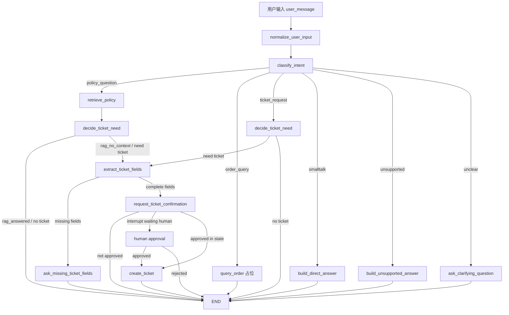

# 阶段 5 第 26 节：阶段 5 项目整理和面试表达

## 本节定位

这一节是阶段 5 的收尾。

阶段 5 的主题是：

```text
LangGraph 智能工单 Agent
```

它不是只学一个库。

它真正训练的是：

```text
怎样把一个 AI 对话能力组织成可控、可恢复、可人工确认、可测试、可排查的业务流程。
```

到第 25 节为止，我们已经做完了：

```text
LangGraph 基础概念
StateGraph 最小图
node / edge / conditional edge
START / END
invoke / stream
智能工单 Agent 总流程设计
意图识别节点
RAG 知识库回答节点
判断是否需要工单
工单字段提取
缺字段追问
用户确认
Java mock 创建工单
checkpoint / thread_id
interrupt / human-in-the-loop
节点错误处理 / fallback
logging / trace_id / 可观测性
fake LLM / fake RAG / fake Java client 测试
```

现在要做的不是继续堆功能，而是把这些内容整理成一个完整知识体系。

因为你最终的目标不是：

```text
我跟着写过一些代码。
```

而是：

```text
我能解释为什么这样设计。
我能看懂每个模块的职责。
我能说清楚这条 Agent 链路怎么跑。
我能说清楚它哪里安全、哪里可恢复、哪里可测试。
我能告诉别人 v1 还差什么，后续怎么生产化。
```

这就是本节的意义。

## 本节学习目标

学完本节，你应该能讲清楚：

1. 阶段 5 的 26 节是怎么组织起来的。

   答案：第 1-12 节学 LangGraph 基础，第 13-22 节接入智能工单业务主链路，第 23-26 节补错误处理、可观测性、测试和项目复盘。

2. 当前智能工单 Agent v1 的核心目标是什么。

   答案：把用户问题分流到规则回答、RAG 回答、订单查询占位、工单创建流程，并在创建工单前进行字段提取、缺字段追问、用户确认和 Java 服务调用。

3. 为什么这个 Agent 需要 LangGraph，而不是只用普通函数。

   答案：因为它有多节点、多分支、状态保存、可恢复、人工确认和中断恢复等流程编排需求，普通函数虽然能写，但会越来越难维护和测试。

4. 当前 Agent v1 的完整执行链路是什么。

   答案：用户输入进入 State，先 normalize，再 classify，然后根据 intent 分支到 RAG、订单查询、工单流程、闲聊、拒绝或追问；工单流程中会判断是否需要工单、提取字段、追问缺字段、请求确认、确认后创建工单。

5. `TicketAgentState` 在当前项目中承担什么角色。

   答案：它是整条 Agent 流程的结构化流程快照，保存用户输入、中间判断、RAG 结果、工单字段、确认状态、创建结果、错误状态、最终回答和节点历史。

6. 为什么用户确认是写操作前的安全边界。

   答案：创建工单是写操作，会影响业务系统，字段提取正确不等于用户授权，必须让用户确认后才能执行。

7. checkpoint 和 thread_id 解决了什么问题。

   答案：它们让多轮流程可以保存状态，后续按同一个 thread_id 继续恢复，避免用户确认、补充信息等流程丢失上下文。

8. interrupt / human-in-the-loop 比普通“返回确认消息”多解决了什么问题。

   答案：interrupt 是 LangGraph 正式的暂停机制，可以把图停在某个节点，等待人类输入后用 `Command(resume=...)` 从保存点继续。

9. fallback 和 logging 为什么是 Agent 工程化能力。

   答案：fallback 让异常不直接暴露给用户，logging 让开发者能根据 trace_id、thread_id、last_node、error_type 等信息定位问题。

10. 当前 Agent v1 的测试体系怎么分层。

    答案：纯函数测试、节点测试、路由测试、整图路径测试、checkpoint 测试、interrupt/resume 测试、fallback 测试、日志测试、fake 依赖测试。

11. 当前项目距离生产级 Agent 还差什么。

    答案：真实模型节点、更完善的订单查询工具链路、真实权限系统、持久化 checkpoint、生产级日志追踪、评测集、限流重试、部署编排、前端工作台等。

12. 面试或讲项目时应该怎么表达。

    答案：先讲业务目标，再讲架构分层，再讲 Agent 流程，再讲安全边界、可恢复、测试、可观测性，最后讲当前 v1 的限制和下一步计划。

## 本节先不学什么

本节不做这些事：

1. 不新增真实大模型调用。
2. 不新增真实 embedding。
3. 不启动 Qdrant。
4. 不启动 Milvus。
5. 不启动 Java mock service。
6. 不新增 FastAPI 接口。
7. 不改数据库。
8. 不做 Docker Compose。
9. 不接 LangSmith。
10. 不做前端工作台。

原因：

```text
这一节的目标是阶段复盘和表达训练。
如果复盘没做好，继续加功能会让你只记得“做过很多东西”，但讲不清“它们为什么存在、怎么组合、边界在哪里”。
```

## 一、基础知识铺垫

### 1. 为什么阶段收尾课很重要

很多人学习技术时会出现一个问题：

```text
学的时候觉得懂。
过几天再问，讲不出来。
别人追问设计原因，也答不上来。
```

这通常不是因为没写代码。

而是因为没有做三件事：

```text
归纳
抽象
表达
```

归纳是：

```text
把很多分散知识点收拢成一个结构。
```

抽象是：

```text
看出这些知识点背后共同解决的问题。
```

表达是：

```text
能用清晰顺序把它讲给别人听。
```

阶段 5 的内容非常多。

如果不整理，它在脑子里可能是一堆名词：

```text
StateGraph
node
edge
interrupt
checkpoint
thread_id
fallback
caplog
fake RAG
FakeTicketCreator
```

但整理后，它应该变成一条主线：

```text
我们用 LangGraph 把智能工单处理拆成多个节点，
用 State 保存流程中间结果，
用 conditional edge 做业务分流，
用 checkpoint 和 thread_id 支持恢复，
用 interrupt 做人类确认，
用 Java client 执行业务写操作，
用 fallback 保证错误可控，
用 logging 和 trace_id 保证可排查，
用 fake 依赖保证自动化测试稳定。
```

这就是从“知识点堆积”变成“工程理解”。

### 2. 项目复盘不是流水账

流水账是：

```text
我先写了 A，又写了 B，然后写了 C。
```

项目复盘应该是：

```text
我为什么要做 A？
A 解决什么问题？
A 和 B 的边界是什么？
B 为什么不能替代 C？
这一套组合起来达到什么工程效果？
还有什么不足？
```

比如不要只说：

```text
我用了 interrupt。
```

要说：

```text
创建工单属于写操作，必须先让用户确认。
普通返回确认消息只能让接口结束，不能表达图级暂停。
所以我用 LangGraph interrupt 把流程停在用户确认节点，等用户确认后用 Command(resume=...) 从 checkpoint 恢复，再执行 create_ticket 节点。
```

这才是有技术含量的表达。

### 3. 面试表达不是背稿

面试表达不是把笔记全文背下来。

好的表达有层次：

```text
一句话版本
一分钟版本
三分钟版本
深入追问版本
```

一句话版本回答：

```text
你做了什么？
```

一分钟版本回答：

```text
项目解决什么问题，核心链路是什么，用了哪些技术。
```

三分钟版本回答：

```text
为什么这样设计，关键模块如何协作，安全、恢复、测试和可观测性怎么处理。
```

深入追问版本回答：

```text
某个技术点的边界、替代方案、失败处理、后续改进。
```

本节会给你这些表达模板。

### 4. 什么是“能讲清楚架构”

能讲清楚架构，不是画一张很复杂的图。

而是能回答：

```text
系统分成哪几层？
每层负责什么？
数据怎么流动？
哪里调用外部依赖？
哪里有安全边界？
哪里保存状态？
哪里处理失败？
哪里做测试替换？
```

当前项目的核心分层是：

```text
FastAPI 接口层
应用服务层
LangGraph Agent 编排层
RAG 知识库层
Tool/Java client 层
Schema 契约层
Core 基础设施层
Tests 测试层
Notes/Docs 学习文档层
```

这比单纯说“我用了 FastAPI、LangGraph、RAG”更专业。

### 5. 什么是 Agent v1

Agent v1 的意思是：

```text
第一版可运行、可解释、可测试的 Agent。
```

它不等于生产最终版。

当前 Agent v1 已经具备：

```text
固定业务边界
多节点流程
条件分支
RAG 回答
工单字段提取
用户确认
Java 创建工单
checkpoint
interrupt
fallback
logging
fake 测试
```

但它还不是完整生产级系统。

它还缺：

```text
真实 LLM 意图识别和字段提取
真实订单查询工具执行
持久化 checkpoint
真实权限和用户身份系统
生产级 tracing
质量评测集
限流和熔断
部署编排
前端工单工作台
```

你必须能区分：

```text
已经完成的 v1 能力
未来要做的生产化能力
```

这会让你的项目表达更诚实，也更可信。

### 6. 为什么要强调边界

AI 应用最容易出现的问题是：

```text
什么都让模型决定。
什么都让 Agent 自动执行。
```

企业业务里这是危险的。

所以当前项目一直强调边界：

```text
模型可以辅助判断，但不能直接操作业务系统。
RAG 可以回答政策，但不能伪造出处。
字段提取可以生成候选工单，但不能替代用户确认。
用户确认后才执行写操作。
Java 服务调用结果要结构化校验。
日志要可排查，但不能泄露敏感原文。
测试可以 fake 外部依赖，但不能假装已经完成生产级集成。
```

你以后讲项目时，边界意识很重要。

因为企业更关心：

```text
这个 AI 系统怎么不乱来？
出了问题怎么追？
失败了怎么兜？
怎么证明它可测试？
```

### 7. 阶段复盘要同时看“学习价值”和“工程价值”

学习价值是：

```text
你学会了哪些概念。
```

工程价值是：

```text
这些概念在项目里解决了什么问题。
```

比如：

```text
概念：State
工程价值：把用户输入、RAG 结果、工单字段、确认状态、错误状态都放进结构化流程快照，方便节点共享和测试断言。
```

再比如：

```text
概念：conditional edge
工程价值：根据 intent、needs_ticket、ticket_fields_complete、ticket_confirmation_approved 让流程进入不同节点。
```

再比如：

```text
概念：fake
工程价值：测试时不用真实调用模型、向量库或 Java 服务，保证测试快、稳定、可重复。
```

这就是本节会反复训练的表达方式。

## 二、本节主题系统讲解

### 1. 阶段 5 的整体结构

阶段 5 可以分成三大段。

第一段：LangGraph 基础，第 1-12 节。

```text
1. LangGraph 是什么
2. LangGraph 和 LangChain / 普通函数流程的区别
3. Agent 流程和状态机基础
4. State 是什么
5. Reducer 是什么
6. MessagesState
7. StateGraph 最小图
8. node 节点
9. edge 边
10. conditional edge
11. START / END
12. invoke / stream
```

这部分的目标是：

```text
先理解 LangGraph 的基础语言。
```

如果没有这部分，后面智能工单 Agent 会变成“照着代码写”，但不理解图为什么这样跑。

第二段：智能工单业务主链路，第 13-22 节。

```text
13. 智能工单 Agent 总流程设计
14. 意图识别节点
15. RAG 知识库回答节点
16. 判断是否需要创建工单
17. 工单字段提取节点
18. 缺失字段追问节点
19. 用户确认节点
20. 调用 Java mock 创建工单节点
21. checkpoint 和 thread_id
22. interrupt / human-in-the-loop
```

这部分的目标是：

```text
把 LangGraph 基础能力应用到一个真实业务流程。
```

第三段：工程化补齐，第 23-26 节。

```text
23. 节点错误处理、fallback 和流程兜底
24. LangGraph 日志、trace_id 和可观测性
25. LangGraph 测试：fake LLM / fake RAG / fake Java client
26. 阶段 5 项目整理和面试表达
```

这部分的目标是：

```text
让 Agent 不只是能跑，还要可控、可排查、可测试、能讲清楚。
```

这三个部分合起来就是：

```text
基础语言 -> 业务流程 -> 工程化能力
```

### 2. 当前智能工单 Agent v1 的一句话总结

可以这样说：

```text
我基于 FastAPI + LangGraph 做了一个智能工单 Agent v1，它能识别用户问题类型，把政策类问题交给 RAG 知识库回答，把需要人工处理的问题整理成结构化工单，在创建工单前要求用户确认，并通过 checkpoint、interrupt、fallback、trace_id 和 fake 测试保证流程可恢复、可控、可排查、可测试。
```

这句话里包含了几个关键词：

```text
FastAPI
LangGraph
智能工单 Agent
RAG
结构化工单
用户确认
checkpoint
interrupt
fallback
trace_id
fake 测试
```

如果别人只给你 30 秒，你可以讲这句。

### 3. 当前 Agent 的完整主链路

当前主链路可以这样看：

```text
user_message
-> normalize_user_input
-> classify_intent
-> conditional route by intent
```

然后根据 intent 分流。

政策问题：

```text
policy_question
-> retrieve_policy
-> decide_ticket_need
-> 如果 RAG answered：END
-> 如果 RAG no_context：进入工单流程
```

订单查询：

```text
order_query
-> query_order
-> END
```

当前 `query_order` 还是占位节点，后续可接真实工具链路。

工单请求：

```text
ticket_request
-> decide_ticket_need
-> extract_ticket_fields
-> 如果缺字段：ask_missing_ticket_fields -> END
-> 如果字段完整：request_ticket_confirmation
-> 如果未确认：END 或 interrupt 暂停
-> 如果确认：create_ticket -> END
```

闲聊：

```text
smalltalk
-> build_direct_answer
-> END
```

不支持请求：

```text
unsupported
-> build_unsupported_answer
-> END
```

不清楚请求：

```text
unclear
-> ask_clarifying_question
-> END
```

这就是当前 Agent v1 的业务路线图。

### 4. Mermaid 总图



这张图不是为了好看。

它帮助你说明：

```text
Agent 不是一轮聊天。
它是一个有状态、有分支、有确认、有恢复、有安全边界的业务流程。
```

### 5. State 是当前 Agent 的中心

当前 `TicketAgentState` 里有很多字段。

不要死记字段。

要按职责分组理解。

输入和追踪：

```text
user_message
agent_trace_id
normalized_message
node_history
```

意图识别：

```text
intent
intent_reason
```

RAG：

```text
rag_query
rag_answer_status
rag_citations
rag_no_context_reason
rag_suggestions
```

是否需要工单：

```text
needs_ticket
ticket_need_reason
ticket_need_source
```

工单字段：

```text
ticket_fields
missing_ticket_fields
ticket_fields_complete
ticket_field_extraction_source
```

缺字段追问：

```text
missing_ticket_field_question
missing_ticket_field_question_fields
```

用户确认：

```text
ticket_confirmation_required
ticket_confirmation_approved
ticket_confirmation_message
pending_ticket_confirmation
ticket_actor_id
```

创建工单：

```text
ticket_creation_args
ticket_creation_status
ticket_creation_error_code
ticket_creation_error_message
created_ticket
```

错误和兜底：

```text
agent_error_code
agent_error_message
agent_error_node
fallback_used
```

最终回答：

```text
final_answer
```

这样分组后，你会发现 State 不是乱放字段。

它是在保存：

```text
这条 Agent 流程到目前为止发生了什么。
```

### 6. 当前核心文件职责

阶段 5 最核心的文件是：

```text
projects/ai-service/app/agents/ticket_agent.py
```

它负责：

```text
定义 TicketAgentState
定义节点函数
定义路由函数
定义图构建函数
定义 checkpoint 图
定义 interrupt 图
定义运行入口
定义 fallback
定义日志元数据
```

最小 LangGraph 学习文件：

```text
projects/ai-service/app/agents/minimal_graph.py
```

它负责：

```text
帮助你理解 StateGraph、node、edge、conditional edge、START、END、invoke、stream。
```

测试文件：

```text
projects/ai-service/tests/test_ticket_agent_intent.py
```

它负责：

```text
测试智能工单 Agent 的纯函数、节点、路由、整图、checkpoint、interrupt、fallback、logging。
```

测试替身：

```text
projects/ai-service/tests/tool_fakes.py
```

它负责：

```text
提供 FakeOrderLookupClient、FakeTicketExtractor、FakePolicyRagService、FakeNoContextPolicyRagService、FakeTicketCreator。
```

测试替身自身测试：

```text
projects/ai-service/tests/test_tool_fakes.py
```

它负责：

```text
确认 fake 能固定返回、记录调用、模拟异常。
```

Java mock 工单接口相关：

```text
projects/java-mock-service/app/schemas/ticket.py
projects/java-mock-service/tests/test_tickets_api.py
```

它们负责：

```text
模拟 Java 业务服务的创建工单契约。
```

Schema：

```text
projects/ai-service/app/schemas/ticket.py
```

它负责：

```text
定义 Python AI 服务调用创建工单时使用的请求和响应结构。
```

### 7. 节点职责总表

| 节点 | 职责 | 输入关键字段 | 输出关键字段 |
| --- | --- | --- | --- |
| `normalize_user_input` | 清理用户输入 | `user_message` | `normalized_message` |
| `classify_intent` | 判断用户意图 | `normalized_message` | `intent`, `intent_reason` |
| `retrieve_policy` | RAG 政策问答 | `normalized_message` | `rag_answer_status`, `rag_citations`, `final_answer` |
| `decide_ticket_need` | 判断是否进入工单流程 | `intent`, `rag_answer_status` | `needs_ticket`, `ticket_need_source` |
| `query_order` | 订单查询占位 | `intent` | `final_answer` |
| `extract_ticket_fields` | 提取工单字段 | `normalized_message`, `ticket_need_source` | `ticket_fields`, `missing_ticket_fields`, `ticket_fields_complete` |
| `ask_missing_ticket_fields` | 缺字段追问 | `missing_ticket_fields` | `missing_ticket_field_question`, `final_answer` |
| `request_ticket_confirmation` | 请求用户确认 | `ticket_fields` | `pending_ticket_confirmation`, `ticket_confirmation_required` |
| `create_ticket` | 调用 Java 创建工单 | `ticket_fields`, `ticket_confirmation_approved` | `created_ticket`, `ticket_creation_status` |
| `build_direct_answer` | 闲聊回答 | `intent` | `final_answer` |
| `build_unsupported_answer` | 不支持请求回答 | `intent` | `final_answer` |
| `ask_clarifying_question` | 不清楚时追问 | `intent` | `final_answer` |

这张表是复习阶段 5 很重要的材料。

你看到任意一个节点，都应该能说：

```text
它拿什么字段？
它写什么字段？
它后面可能去哪里？
它有没有副作用？
它怎么测试？
```

### 8. 条件边职责总表

`route_by_intent`：

```text
根据 intent 决定去 RAG、订单查询、工单流程、闲聊、不支持或追问。
```

`route_by_ticket_need`：

```text
根据 needs_ticket 决定是否进入工单字段提取。
```

`route_by_ticket_fields_complete`：

```text
根据 ticket_fields_complete 决定追问缺字段还是请求确认。
```

`route_by_ticket_confirmation`：

```text
根据 ticket_confirmation_approved 决定是否真正创建工单。
```

条件边让业务流程清晰。

没有条件边，你可能会写出一大段：

```python
if ...
elif ...
else ...
```

这些逻辑会混在一个函数里。

LangGraph 的价值是把它们拆成：

```text
节点负责处理
路由函数负责决策
图结构负责连接
State 负责传递结果
```

### 9. RAG 在 Agent 里的位置

RAG 不是整个 Agent。

RAG 是 Agent 的一个能力节点。

它负责：

```text
当用户问政策、规则、FAQ 时，从知识库里找答案，并返回带 citation 的回答。
```

Agent 负责：

```text
决定什么时候调用 RAG。
决定 RAG answered 后是否结束。
决定 RAG no_context 后是否进入工单流程。
把 RAG 结果写入 State。
```

这点很重要。

不要把 RAG 和 Agent 混为一谈。

可以这样表达：

```text
RAG 解决知识问答的依据问题，LangGraph Agent 解决多步骤业务流程编排问题。
RAG 是 Agent 里的一个节点，而不是 Agent 的全部。
```

### 10. Tool Calling / Java 服务在 Agent 里的位置

创建工单不是模型自己做。

模型或规则只能生成：

```text
候选工单字段
```

真正写入业务系统必须通过：

```text
后端服务
Java client
Java mock service
```

并且必须满足：

```text
字段完整
用户确认
幂等键
错误处理
结构化响应
```

这体现了阶段 3 学过的原则：

```text
AI 不能直接操作业务系统。
后端必须掌握工具执行权。
```

阶段 5 把这个原则放进 LangGraph 流程中。

### 11. 用户确认是安全边界

当前流程中，字段提取之后不会直接创建工单。

它会先进入：

```text
request_ticket_confirmation
```

原因：

```text
字段提取可能错。
用户原话可能模糊。
创建工单是写操作。
写操作会影响业务系统。
用户必须知道即将创建什么。
```

所以流程是：

```text
提取字段
-> 生成待确认内容
-> 用户确认
-> 执行 create_ticket
```

这就是 human-in-the-loop 的业务价值。

### 12. checkpoint 和 thread_id 的价值

没有 checkpoint 时：

```text
一次请求结束，内存里的流程状态就没了。
```

有 checkpoint 后：

```text
流程中间状态可以保存。
下次可以按 thread_id 找回来。
```

`thread_id` 可以理解成：

```text
某条 Agent 对话/流程的身份标识。
```

它解决的问题是：

```text
用户确认不是总在同一个瞬间完成。
用户可能稍后继续。
系统需要知道继续的是哪一条流程。
```

所以 checkpoint 和 thread_id 是多轮 Agent 的基础能力。

### 13. interrupt 的价值

普通确认节点可以做到：

```text
返回一段确认消息。
```

但 interrupt 可以做到：

```text
图正式暂停。
保存当前状态。
等待人类输入。
收到 resume 命令后从暂停点继续。
```

在当前项目里，interrupt 用于：

```text
创建工单前等待用户确认。
```

它比普通返回更适合表达：

```text
这个流程还没结束，只是在等待人类。
```

### 14. fallback 的价值

Agent 流程会失败。

可能失败的地方：

```text
RAG 失败
Java 服务失败
checkpoint 读取失败
resume 参数错误
未知程序异常
```

fallback 的目标是：

```text
不要把内部异常直接暴露给用户。
给用户安全、稳定、可理解的回答。
同时在 State 和日志里保留排查线索。
```

当前项目里有：

```text
agent_error_code
agent_error_message
agent_error_node
fallback_used
```

这些字段就是为了错误可控。

### 15. logging / trace_id 的价值

只会返回结果还不够。

生产环境会遇到：

```text
用户说工单没创建
Java 服务偶发失败
某条流程卡在确认
某个节点耗时异常
日志里需要查一条请求
```

这时需要：

```text
trace_id
thread_id
operation
last_node
fallback_used
ticket_creation_status
error_type
elapsed_ms
```

这些信息让你能排查：

```text
哪次请求
哪条线程
执行到哪个节点
是否 fallback
是否 interrupt
是否创建工单
错误类型是什么
耗时多少
```

同时日志不能泄露：

```text
完整用户原文
API key
敏感身份信息
完整异常堆栈给用户
```

### 16. 测试体系的价值

当前测试体系不是只测最终回答。

它覆盖：

```text
纯函数
节点
路由
整图路径
checkpoint
interrupt / resume
fallback
logging
fake 依赖
```

为什么要这样分？

因为 Agent 太复杂。

如果所有测试都跑完整图：

```text
慢
重复
失败难定位
```

如果只测小函数：

```text
不能证明图结构和流程组合正确
```

所以要分层。

可以这样表达：

```text
我用纯函数和节点测试保证局部逻辑正确，用路由测试保证条件边正确，用整图测试覆盖关键业务路径，用 checkpoint 和 interrupt 测试保证可恢复流程，用 fake 依赖隔离模型、RAG 和 Java 服务，用 caplog 测试日志安全。
```

这句话非常适合面试。

### 17. 当前阶段的验收清单

阶段 5 完成后，你应该能做到：

```text
能解释 LangGraph 为什么适合有状态 Agent
能写 StateGraph 最小图
能定义 State
能写 node
能写固定 edge
能写 conditional edge
能解释 START 和 END
能使用 graph.invoke
能使用 graph.stream
能设计智能工单 Agent 流程
能实现意图分流
能接入 RAG 节点
能根据 RAG 结果决定是否创建工单
能提取工单字段
能追问缺失字段
能生成用户确认
能在确认后调用 Java client
能使用 checkpoint 和 thread_id 保存状态
能使用 interrupt 做 human-in-the-loop
能处理节点错误和图级 fallback
能用 trace_id 和 logging 排查流程
能用 fake LLM / fake RAG / fake Java client 测试
能讲清楚 Agent v1 的架构、链路、边界和不足
```

如果这些你能讲清楚，阶段 5 就算真正完成。

## 三、面试表达训练

### 1. 30 秒版本

可以这样说：

```text
我做了一个基于 FastAPI + LangGraph 的智能工单 Agent v1。它会先识别用户问题类型，政策类问题走 RAG 知识库回答，需要人工处理的问题会提取工单字段，缺字段时追问，字段完整后让用户确认，确认后再调用 Java mock 服务创建工单。这个流程支持 checkpoint、thread_id、interrupt 人工确认、fallback 兜底、trace_id 日志追踪，并用 fake RAG 和 fake Java client 做自动化测试。
```

这个版本适合：

```text
面试开场
项目简介
简历项目口头介绍
```

### 2. 1 分钟版本

可以这样说：

```text
这个项目的背景是企业客服场景，用户可能问政策规则，也可能查询订单，或者希望创建售后工单。我把它拆成一个 LangGraph 多节点流程：先规范化用户输入，再做意图识别，根据 intent 走不同分支。政策问题会调用 RAG 节点返回带引用的知识库回答；如果 RAG 没有资料，就进入工单流程，把它当作知识缺口或人工处理需求。工单流程会判断是否需要创建工单，提取 issue_type、order_id、description、urgency 等字段，缺字段时追问，字段完整时生成待确认工单。创建工单属于写操作，所以必须用户确认后才调用 Java mock 服务。为了支持多轮和人工确认，我接入了 checkpoint、thread_id 和 interrupt；为了工程可控，我补了 fallback、trace_id 日志和 fake 依赖测试。
```

这个版本适合：

```text
面试官问“讲一下你的项目”
你需要比一句话讲得更完整
```

### 3. 3 分钟版本结构

如果有 3 分钟，你可以按这个顺序讲：

```text
1. 业务目标
2. 技术架构
3. Agent 主流程
4. 安全边界
5. 可恢复能力
6. 错误处理和可观测性
7. 测试体系
8. 当前 v1 的不足和下一步
```

示例：

```text
这个项目是一个 Java 后端 + Python AI 服务的学习型企业客服系统，阶段 5 重点做智能工单 Agent。业务目标是让 AI 不只是聊天，而是能把用户问题分流到政策问答、订单查询和工单创建流程。

架构上，FastAPI 负责 API 服务，RAG 模块负责知识库问答，Java mock service 模拟业务系统，LangGraph 负责编排多节点、有状态、可恢复的 Agent 流程。Agent 的核心状态是 TicketAgentState，里面保存用户输入、意图、RAG 结果、工单字段、确认状态、创建结果、错误状态和 node_history。

主流程是：用户输入先 normalize，再 classify_intent，然后根据 intent 走条件分支。政策类问题进入 retrieve_policy，通过 RAG 返回带出处的回答；如果 no_context，则进入工单流程。工单流程会判断是否需要工单，提取字段，字段缺失就追问，字段完整就进入用户确认。确认通过后才执行 create_ticket，调用 Java mock 服务创建工单。

安全上，我没有让模型直接操作业务系统。创建工单是写操作，必须经过用户确认，并且用幂等键避免重复提交。错误处理上，Java 调用失败或未知异常不会直接暴露给用户，而是写入 fallback State，并返回安全提示。

为了支持多轮和人工确认，我使用 checkpoint 和 thread_id 保存流程状态，用 interrupt 正式暂停图，等用户确认后通过 resume 继续执行。为了排查问题，我加入 trace_id、thread_id、operation、last_node、fallback_used 等日志字段，并避免记录完整用户原文。

测试方面，我按纯函数、节点、路由、整图、checkpoint、interrupt、fallback、日志分层测试。外部依赖用 fake LLM、fake RAG、fake Java client 替代，保证测试不依赖真实模型、向量库和 Java 服务。

当前 v1 主要完成了 Agent 流程骨架和工程边界，后续还需要接入真实模型节点、真实订单查询工具、持久化 checkpoint、生产级 tracing、评测集、限流重试和部署编排。
```

这个版本可以作为你以后复习和面试的核心讲稿。

### 4. 常见追问：为什么用 LangGraph

问题：

```text
为什么这个项目要用 LangGraph，不用普通函数或者 LangChain Agent？
```

参考回答：

```text
普通函数当然也能写流程，但当流程包含多节点、多分支、状态保存、人工确认、中断恢复和失败兜底时，普通函数会越来越难维护。LangGraph 更适合把流程拆成明确节点，用 State 在节点之间传递结构化数据，用 conditional edge 表达业务分支，用 checkpoint 和 thread_id 支持恢复，用 interrupt 支持 human-in-the-loop。LangChain 更偏向模型、工具、结构化输出等组件封装，LangGraph 更偏向有状态流程编排，所以这个工单 Agent 更适合用 LangGraph。
```

### 5. 常见追问：为什么不能让模型直接创建工单

问题：

```text
为什么不让大模型直接调用创建工单接口？
```

参考回答：

```text
创建工单是写操作，会影响业务系统。模型可以辅助识别意图和提取字段，但不能拥有最终执行权。后端必须校验字段、检查权限、生成幂等键，并且让用户确认后才执行。这样可以避免模型误判、prompt injection 或用户表达不清导致错误创建工单。
```

### 6. 常见追问：RAG 在这个 Agent 中解决什么

问题：

```text
RAG 在智能工单 Agent 里有什么作用？
```

参考回答：

```text
RAG 负责回答企业知识库覆盖的政策类问题，例如退款规则、退货流程、账号安全等。Agent 负责判断什么时候调用 RAG，并根据 RAG 结果决定后续流程。如果 RAG 返回 answered，就直接给出带出处的回答，不创建工单；如果 RAG 返回 no_context，就说明知识库没有足够资料，Agent 可以进入工单流程，把它作为知识缺口或人工处理需求。
```

### 7. 常见追问：checkpoint 和 interrupt 的区别

问题：

```text
checkpoint 和 interrupt 有什么区别？
```

参考回答：

```text
checkpoint 是状态保存机制，它负责把某个 thread_id 对应的流程状态保存下来，后续可以恢复。interrupt 是流程暂停机制，它在某个节点里主动暂停图，等待人类输入。interrupt 通常依赖 checkpoint，因为暂停后要能从保存的状态继续。可以理解为 checkpoint 解决“状态怎么保存”，interrupt 解决“流程在哪里停下来等人”。
```

### 8. 常见追问：如何测试这种 Agent

问题：

```text
这种多节点 Agent 怎么测试？
```

参考回答：

```text
我没有只做端到端测试，而是分层测试。纯函数测试覆盖分类、字段提取和构造消息；节点测试覆盖单个节点的 State 更新；路由测试覆盖 conditional edge 的分支选择；整图测试覆盖政策问答、无资料进入工单、完整工单确认等关键路径；checkpoint 和 interrupt 测试覆盖状态保存、暂停和恢复；fallback 测试覆盖 Java 服务失败和未知异常；日志测试用 caplog 验证关键事件和敏感信息不泄露。外部依赖用 fake LLM、fake RAG 和 fake Java client 替代，保证测试稳定。
```

### 9. 常见追问：你这个项目有什么不足

问题：

```text
当前项目还有哪些不足？
```

参考回答：

```text
当前阶段是 Agent v1，重点是流程骨架和工程边界。还没有把意图识别和字段提取完全替换成真实大模型节点，订单查询节点仍是占位，checkpoint 还是内存版，权限系统和用户身份还比较简化，日志还没有接 LangSmith 或 OpenTelemetry，RAG 和 Agent 也还没有统一评测集。后续我会进入生产化与评测阶段，补真实模型链路、持久化状态、评测、监控、限流、重试和部署编排。
```

这个回答很重要。

它体现你知道：

```text
当前做到了哪里。
哪里还没做到。
下一步怎么做。
```

不要假装 v1 是完美生产系统。

诚实的边界比夸大更专业。

### 10. 简历项目描述版本

可以写成：

```text
基于 FastAPI + LangGraph 构建智能客服工单 Agent v1，支持用户意图识别、RAG 知识库政策问答、工单字段提取、缺字段追问、用户确认、Java mock 服务创建工单、checkpoint 状态恢复、interrupt human-in-the-loop、fallback 错误兜底、trace_id 日志追踪和 fake 依赖分层测试。
```

如果想更工程化：

```text
设计并实现多节点 LangGraph 智能工单流程，将政策问答、工单创建、人工确认和 Java 业务服务调用编排为可恢复、可测试、可排查的 Agent v1；通过 State/conditional edge 管理业务分支，通过 checkpoint/thread_id 和 interrupt 支持中断恢复，通过 fake RAG/fake Java client 构建稳定自动化测试。
```

注意：

```text
简历里不要写“生产级”或“大规模上线”，除非你真的做了。
```

当前更准确的表达是：

```text
Agent v1
学习项目
可运行 demo
工程化基础
```

## 四、当前项目验收

### 1. 功能验收

当前 Agent v1 已完成：

```text
用户输入规范化
意图识别
政策问题 RAG 回答
RAG 无资料进入工单流程
显式工单请求进入工单流程
缺少 order_id 时追问
字段完整时请求用户确认
普通确认模式
interrupt 确认模式
确认后创建工单
拒绝后不创建工单
Java 创建失败兜底
图级异常兜底
运行日志和 trace_id
fake 依赖测试
```

### 2. 工程验收

当前工程上具备：

```text
结构化 State
明确节点职责
明确条件边
类型提示
Pydantic 契约
Java client 协议
fake 测试替身
pytest 自动化测试
日志安全边界
错误码和 fallback State
学习笔记索引
进度文档
```

### 3. 测试验收

阶段 5 测试重点包括：

```text
test_langgraph_minimal_graph.py
test_ticket_agent_intent.py
test_tool_fakes.py
test_java_ticket_client.py
test_tickets_api.py
```

其中 `test_ticket_agent_intent.py` 是阶段 5 的主测试文件。

它覆盖：

```text
节点
路由
整图
checkpoint
interrupt
resume
fallback
logging
stream
fake RAG
fake Java client
```

### 4. 文档验收

阶段 5 有 26 篇笔记。

它们应该让你能：

```text
从 LangGraph 是什么讲到智能工单 Agent v1。
从基础概念讲到完整业务流程。
从代码实现讲到测试、错误、日志和面试表达。
```

这一点很重要。

因为你的学习要求不是“能跑就行”，而是：

```text
真正懂，能开发，能工作，能给别人讲清楚。
```

## 五、当前 v1 的限制和下一阶段方向

### 1. 当前 v1 限制

限制 1：意图识别主要是规则版。

```text
规则版适合学习流程，但真实项目里会遇到更多复杂表达。
后续可以接真实 LLM 分类器，同时保留 Pydantic 校验和 fake LLM 测试。
```

限制 2：字段提取主要是规则版。

```text
规则能提取简单 order_id 和问题类型，但复杂自然语言需要模型结构化输出。
```

限制 3：订单查询节点还是占位。

```text
阶段 3 已经做过 query_order 工具链路，后续可以把它接入 LangGraph 的 query_order 节点。
```

限制 4：checkpoint 是内存版。

```text
MemorySaver 适合学习和测试。
生产环境需要数据库或持久化 checkpoint。
```

限制 5：缺少真实身份和权限系统。

```text
目前 actor_id 比较简化。
真实系统要接用户身份、角色、权限、数据隔离。
```

限制 6：可观测性还是本地 logging。

```text
后续可以接 LangSmith、OpenTelemetry 或日志平台。
```

限制 7：还没有 Agent 质量评测集。

```text
后续要用固定测试样本评估意图识别、字段提取、RAG 回答、工具调用是否正确。
```

限制 8：还没有部署编排。

```text
后续需要 Docker Compose 把 FastAPI、Java mock、Qdrant/Milvus 等服务组织起来。
```

### 2. 下一阶段应该学什么

阶段 5 完成后，下一阶段应该进入：

```text
生产化与评测
```

建议方向：

```text
1. Agent 评测基础
2. 构造 Agent 测试集
3. 意图识别评测
4. 工单字段提取评测
5. RAG + Agent 组合评测
6. 真实模型节点接入
7. 真实 query_order 工具接入 LangGraph
8. 持久化 checkpoint
9. LangSmith tracing 或 OpenTelemetry 基础
10. 限流、重试、超时、熔断
11. Docker Compose 本地编排
12. 项目演示脚本和 README 展示整理
```

这些内容比继续堆节点更重要。

因为 Agent v1 已经能表达核心流程。

下一步要让它更像真实工程系统。

## 六、学习复盘方法

### 1. 以后复习阶段 5 的顺序

不要从第 1 节逐字重读。

建议这样复习：

```text
第一遍：读第 26 节总复盘，建立全图。
第二遍：读第 13 节总流程设计，看 Agent 为什么这么拆。
第三遍：读第 14-20 节，复习业务主链路。
第四遍：读第 21-22 节，复习 checkpoint 和 interrupt。
第五遍：读第 23-25 节，复习错误、日志、测试。
第六遍：回头读第 1-12 节，补 LangGraph 基础概念。
```

这样效率更高。

### 2. 看代码的顺序

建议这样看：

```text
1. README 阶段 5 索引
2. notes/langgraph-stage5-26-project-summary-interview.md
3. projects/ai-service/app/agents/ticket_agent.py
4. projects/ai-service/tests/test_ticket_agent_intent.py
5. projects/ai-service/tests/tool_fakes.py
6. projects/ai-service/app/agents/minimal_graph.py
```

看 `ticket_agent.py` 时，不要从头到尾硬读。

按这个顺序：

```text
1. 看 TicketAgentState
2. 看常量和路由表
3. 看节点函数
4. 看路由函数
5. 看 build_ticket_agent_graph
6. 看 checkpoint / interrupt 构建函数
7. 看运行入口
8. 看 fallback 和 logging
```

这样更容易理解。

## 七、本节练习

### 练习 1：用一句话介绍阶段 5

问题：

```text
请用一句话介绍阶段 5 学了什么。
```

参考答案：

```text
阶段 5 学的是如何用 LangGraph 把智能客服工单流程拆成可控、可恢复、可人工确认、可测试、可排查的多节点 Agent，并把 RAG、Java 工具调用、checkpoint、interrupt、fallback、logging 和 fake 测试整合起来。
```

### 练习 2：解释 Agent v1 主流程

问题：

```text
请按顺序讲出当前智能工单 Agent v1 的主流程。
```

参考答案：

```text
用户输入先进入 normalize_user_input 清理文本，再进入 classify_intent 判断意图。政策问题进入 retrieve_policy 做 RAG 回答，再由 decide_ticket_need 判断是否需要工单；订单查询进入 query_order 占位节点；明确工单请求进入 decide_ticket_need。需要工单时进入 extract_ticket_fields，缺字段就 ask_missing_ticket_fields 追问，字段完整就 request_ticket_confirmation 请求用户确认，用户确认后 create_ticket 调用 Java mock 服务创建工单。
```

### 练习 3：解释为什么要用户确认

问题：

```text
为什么字段完整后不能直接创建工单？
```

参考答案：

```text
因为创建工单是写操作，会影响业务系统。字段完整只说明系统整理出了候选工单，不等于用户授权执行。模型或规则可能提取错字段，用户也可能表达不清，所以必须先展示待确认工单，让用户确认后才能执行 create_ticket。
```

### 练习 4：解释 checkpoint 和 interrupt

问题：

```text
checkpoint 和 interrupt 在当前 Agent 里分别解决什么问题？
```

参考答案：

```text
checkpoint 负责保存某个 thread_id 对应的 Agent State，让流程可以跨请求恢复。interrupt 负责在用户确认节点正式暂停图，等待人类输入。用户确认后，系统可以用 Command(resume=...) 从保存状态继续执行，最终进入 create_ticket 或结束流程。
```

### 练习 5：解释测试体系

问题：

```text
你会怎么测试这个 LangGraph Agent？
```

参考答案：

```text
我会分层测试：纯函数测试分类、字段提取和消息构造；节点测试单个节点的 State 更新；路由测试 conditional edge 的分支；整图测试关键路径；checkpoint 测试状态保存和隔离；interrupt/resume 测试暂停和恢复；fallback 测试失败兜底；日志测试 trace_id 和敏感信息边界。外部依赖用 fake LLM、fake RAG 和 fake Java client 替代，避免单元测试依赖真实模型、向量库和 Java 服务。
```

### 练习 6：解释当前 v1 的不足

问题：

```text
当前 Agent v1 还不够生产化的地方有哪些？
```

参考答案：

```text
意图识别和字段提取主要还是规则版，订单查询节点还是占位，checkpoint 还是内存版，缺少真实用户身份和权限系统，可观测性还只是本地 logging，没有接 LangSmith 或 OpenTelemetry，也还没有系统化 Agent 评测集、限流、熔断和 Docker Compose 部署编排。
```

### 练习 7：写一个简历描述

问题：

```text
请写一条适合简历的阶段 5 项目描述。
```

参考答案：

```text
基于 FastAPI + LangGraph 构建智能客服工单 Agent v1，支持意图识别、RAG 知识库回答、工单字段提取、缺字段追问、用户确认、Java mock 服务创建工单、checkpoint 状态恢复、interrupt human-in-the-loop、fallback 错误兜底、trace_id 日志追踪和 fake 依赖分层测试。
```

### 练习 8：解释为什么用 fake 测试

问题：

```text
为什么 Agent 测试里要用 fake RAG 和 fake Java client？
```

参考答案：

```text
因为单元测试要稳定、快速、可重复。真实 RAG 依赖 embedding、向量库和知识库数据，真实 Java 服务依赖网络、端口和服务状态。fake RAG 可以稳定返回 answered 或 no_context，fake Java client 可以记录调用参数和模拟失败，让测试专注验证 Agent 流程和边界，而不是受外部环境影响。
```

## 八、自测题

### 自测 1：阶段 5 的三段结构是什么

问题：

```text
阶段 5 可以分成哪三段？
```

参考答案：

```text
第 1-12 节是 LangGraph 基础，第 13-22 节是智能工单业务主链路，第 23-26 节是错误处理、可观测性、测试和项目复盘。
```

### 自测 2：LangGraph 在项目里的核心价值是什么

问题：

```text
LangGraph 在当前项目里主要解决什么问题？
```

参考答案：

```text
它主要解决多步骤、有状态、可分支、可恢复、可人工确认的 Agent 流程编排问题。通过 State、node、edge、conditional edge、checkpoint 和 interrupt，把智能工单流程组织成清晰可控的图。
```

### 自测 3：`TicketAgentState` 是什么

问题：

```text
`TicketAgentState` 可以怎么理解？
```

参考答案：

```text
它是智能工单 Agent 的结构化流程快照，保存用户输入、意图、RAG 结果、工单字段、确认状态、创建结果、错误状态、最终回答和 node_history，让各个节点能共享和更新流程状态。
```

### 自测 4：RAG 和 Agent 的关系是什么

问题：

```text
RAG 是不是 Agent 的全部？
```

参考答案：

```text
不是。RAG 是 Agent 里的一个能力节点，负责政策类知识问答和引用来源。Agent 负责决定什么时候调用 RAG，以及根据 RAG answered 或 no_context 决定是否结束或进入工单流程。
```

### 自测 5：为什么 `node_history` 很重要

问题：

```text
为什么当前项目要记录 node_history？
```

参考答案：

```text
node_history 可以记录 Agent 实际经过了哪些节点，方便测试断言业务路径，也方便排查流程是否走错。只看 final_answer 不一定能发现条件边或节点顺序错误。
```

### 自测 6：fallback 的目标是什么

问题：

```text
fallback 是为了吞掉错误吗？
```

参考答案：

```text
不是。fallback 的目标是把错误变成用户安全可理解的结果，同时在 State 和日志里保留错误码、错误节点、fallback_used 等排查信息。它不是掩盖问题，而是让问题可控。
```

### 自测 7：生产化下一步是什么

问题：

```text
阶段 5 后下一阶段应该重点补什么？
```

参考答案：

```text
下一阶段应该补生产化与评测，包括真实模型节点、真实 query_order 工具接入、持久化 checkpoint、Agent 评测集、LangSmith 或 OpenTelemetry tracing、限流重试熔断、Docker Compose 编排和项目演示整理。
```

### 自测 8：怎么判断自己真的学会阶段 5

问题：

```text
怎样判断自己不是只跟着写完，而是真的学会阶段 5？
```

参考答案：

```text
如果你能不看代码讲清楚 Agent v1 的业务目标、架构分层、State 字段分组、节点职责、条件分支、用户确认、checkpoint、interrupt、fallback、logging、测试体系、当前限制和下一步计划，就说明你不是只会运行代码，而是真正理解了阶段 5。
```

## 九、本节小结

阶段 5 到这里就完整收尾了。

你现在应该建立起一个清晰认知：

```text
LangGraph 不是为了炫技。
它是为了把复杂 AI 业务流程拆成可控节点。
State 不是普通字典。
它是流程快照。
conditional edge 不是普通 if。
它是图里的业务分支。
checkpoint 不是缓存。
它是可恢复流程状态。
interrupt 不是简单返回确认文本。
它是正式暂停等待人类输入。
fallback 不是吞错。
它是用户安全和工程排查的边界。
fake 测试不是偷懒。
它是让 Agent 自动化测试稳定可重复。
```

当前阶段你完成的是：

```text
智能工单 Agent v1 的学习版工程闭环。
```

下一阶段要做的是：

```text
把这个 v1 往生产化、评测、部署、演示方向推进。
```

这就是后续学习的方向。

## 十、复习资料

- `notes/langgraph-stage5-01-what-is-langgraph.md`
- `notes/langgraph-stage5-13-ticket-agent-overall-design.md`
- `notes/langgraph-stage5-21-checkpoint-thread-id.md`
- `notes/langgraph-stage5-22-interrupt-human-in-the-loop.md`
- `notes/langgraph-stage5-23-node-error-fallback.md`
- `notes/langgraph-stage5-24-observability-trace-logging.md`
- `notes/langgraph-stage5-25-agent-testing-fakes.md`
- `projects/ai-service/app/agents/ticket_agent.py`
- `projects/ai-service/tests/test_ticket_agent_intent.py`
- `projects/ai-service/tests/tool_fakes.py`
