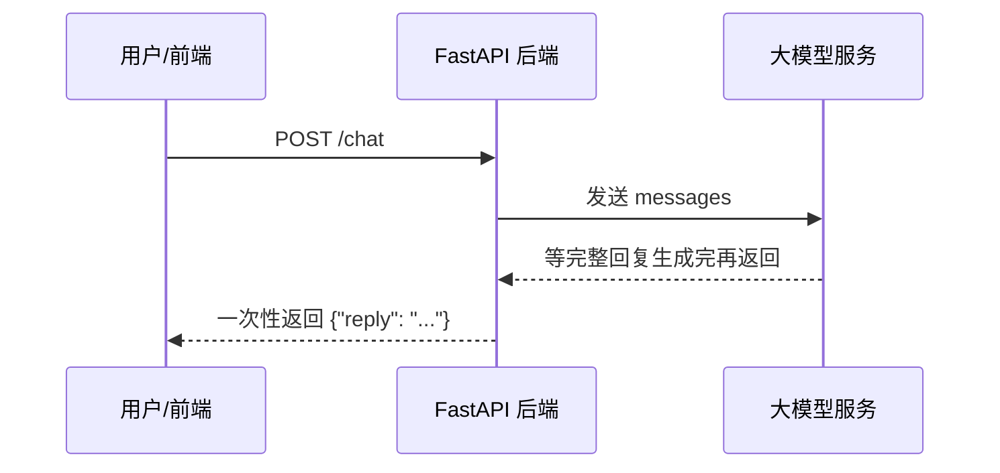
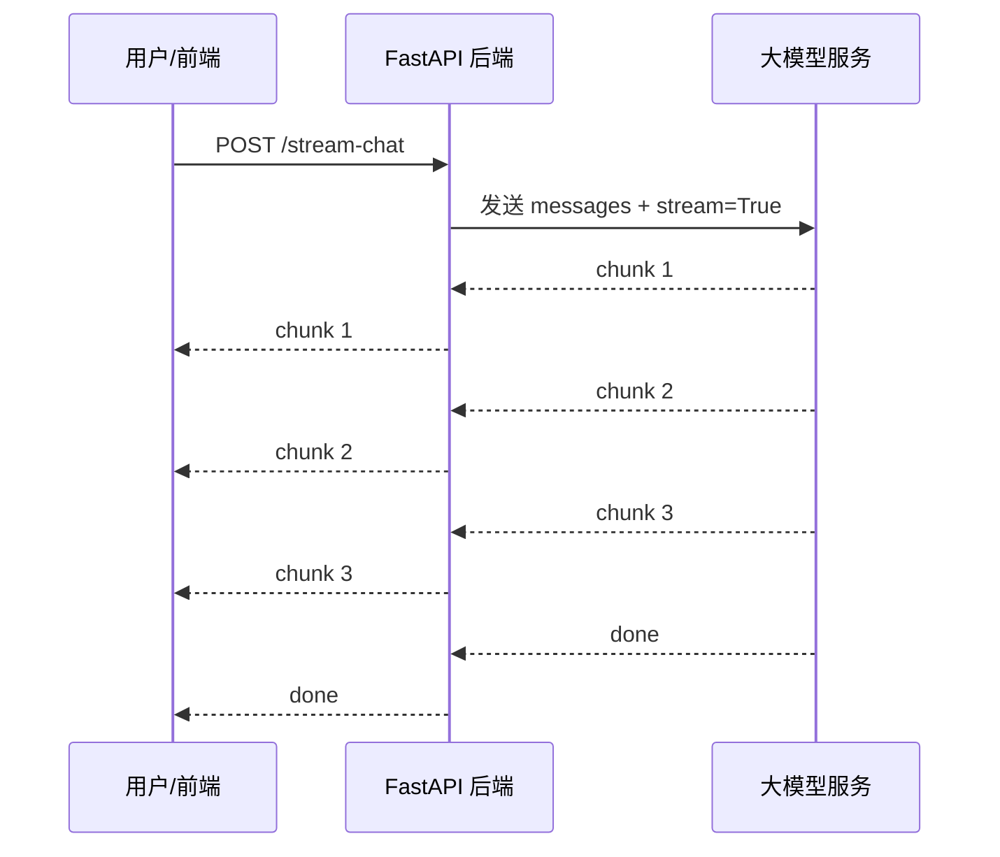

# 阶段 2 第 13 节：streaming 流式输出是什么

## 1. 这一节学什么

这一节先不写 `/stream-chat`。

先把概念讲透：

```text
什么是普通响应
什么是流式响应
为什么 ChatGPT 能边生成边显示
LLM streaming 和 HTTP streaming 是什么关系
chunk 是什么
SSE 是什么
FastAPI StreamingResponse 是什么
stream=True 是什么
为什么 streaming 能改善体感速度
streaming 有哪些坑
为什么下一节才真正实现 /stream-chat
```

你要先理解“数据是怎么一点一点从模型出来，再一点一点从后端返回给前端”的。

不然直接写代码，会变成只会复制 `StreamingResponse`。

## 2. 先用人话理解 streaming

普通响应像这样：

```text
你问问题
后端等模型全部生成完
后端一次性把完整答案返回给前端
前端一次性显示答案
```

流式响应像这样：

```text
你问问题
模型生成一点
后端就转发一点
前端就显示一点
模型继续生成
后端继续转发
前端继续显示
直到结束
```

你平时看到 ChatGPT 一段话逐渐出现，就是这种体验。

它不是模型一开始就把完整答案给前端。

而是边生成、边发送、边显示。

## 3. 普通响应的流程

普通 `/chat` 现在大概是：

```text
浏览器
  -> POST /chat
FastAPI
  -> 调用模型
模型
  -> 生成完整回复
FastAPI
  -> 返回完整 JSON
浏览器
  -> 一次性显示
```

画成流程：



优点：

```text
实现简单
测试简单
错误处理简单
前端接收简单
```

缺点：

```text
用户必须一直等
长答案可能等很多秒
中间没有任何可见反馈
容易让用户以为页面卡住
长输出更容易碰到超时
```

## 4. 流式响应的流程

流式 `/stream-chat` 以后会像这样：

```text
浏览器
  -> POST /stream-chat
FastAPI
  -> 调用模型，开启 stream=True
模型
  -> 返回第 1 个 chunk
FastAPI
  -> 转发第 1 个 chunk
浏览器
  -> 显示第 1 小段文字
模型
  -> 返回第 2 个 chunk
FastAPI
  -> 转发第 2 个 chunk
浏览器
  -> 追加显示
...
```

画成流程：



核心变化是：

```text
不是等完整答案
而是有一段发一段
```

## 5. 什么是 chunk

`chunk` 可以理解成“一小块数据”。

普通响应返回的是完整答案：

```text
FastAPI 是一个用于构建 API 的 Python Web 框架。
```

流式输出可能拆成几块：

```text
FastAPI
 是一个
 用于构建 API 的
 Python Web 框架。
```

每一块就是一个 chunk。

真实模型返回的 chunk 不一定按词、句子或标点拆。

它可能是：

```text
一个字
几个字
一个词
一小段
一个事件
空内容但带控制信息
最后一个 usage 信息块
```

所以前端不能假设每个 chunk 都是完整句子。

它应该做的是：

```text
收到一块
追加一块
直到结束
```

## 6. 为什么流式输出能变快

严格说，streaming 不一定让模型“实际生成更快”。

它主要改善的是：

```text
体感等待时间
```

普通响应：

```text
模型 5 秒生成完
用户等 5 秒
第 5 秒才看到完整结果
```

流式响应：

```text
模型 5 秒生成完
用户第 0.8 秒看到第一段
第 1.2 秒看到第二段
第 5 秒看到完整结果
```

总生成时间可能还是 5 秒。

但用户不是空等 5 秒。

这就是“体感更快”。

## 7. streaming 解决的是哪类问题

streaming 特别适合：

```text
长回答
总结文档
生成文章
生成代码
多步骤解释
客服长回复
AI 助手聊天界面
```

因为用户可以先看到开头，知道系统还在工作。

streaming 不一定适合：

```text
非常短的结果
必须一次性校验完整 JSON 的结构化输出
需要强事务一致性的业务接口
只给机器消费、不展示过程的内部接口
```

所以不要见到模型调用就一定 streaming。

要看场景。

## 8. LLM streaming 和 HTTP streaming 的关系

这两个概念要分清楚。

LLM streaming 是：

```text
模型服务把生成结果一块一块返回给你的后端
```

HTTP streaming 是：

```text
你的后端把响应内容一块一块返回给前端
```

完整链路是：

```text
模型服务 --LLM streaming--> FastAPI --HTTP streaming--> 浏览器
```

如果只有模型到后端是流式，但后端最后攒完整再返回前端，那用户还是看不到流式效果。

如果后端想让前端看到流式，就必须把模型 chunk 继续转发出去。

## 9. OpenAI-compatible 里的 stream=True

OpenAI Chat Completions 风格接口通常通过：

```python
stream=True
```

开启流式。

概念代码类似：

```python
stream = client.chat.completions.create(
    model="qwen3.7-plus",
    messages=[
        {"role": "user", "content": "解释 FastAPI 是什么"}
    ],
    stream=True,
)

for chunk in stream:
    ...
```

注意：这是概念代码。

下一节我们才会放进项目。

## 10. 非流式和流式返回结构不一样

非流式通常像这样取完整回复：

```python
completion.choices[0].message.content
```

流式时，不是这样取。

流式时要从每个 chunk 的增量字段里拿内容。

Chat Completions 风格常见是：

```python
chunk.choices[0].delta.content
```

也就是说：

```text
非流式：message.content
流式：delta.content
```

这是非常重要的区别。

## 11. delta 是什么意思

`delta` 可以理解成“这次新增的内容”。

例如完整答案是：

```text
FastAPI 是一个 Python Web 框架。
```

流式 chunk 可能是：

```text
delta.content = "FastAPI"
delta.content = " 是一个"
delta.content = " Python"
delta.content = " Web 框架。"
```

每个 `delta.content` 都不是完整答案。

你要把它们拼起来。

## 12. done 是什么

流式响应需要一个结束信号。

不然前端不知道：

```text
模型还在生成
网络卡住了
已经结束了
```

不同接口的结束表示略有不同。

常见情况包括：

```text
服务端发送特殊 done 标记
chunk 里出现 finish_reason
SSE 事件结束
连接关闭
Responses API 里出现 completed 类型事件
```

下一节实现时，我们会明确设计自己的输出协议。

## 13. SSE 是什么

SSE 全称是：

```text
Server-Sent Events
```

中文可以理解成：

```text
服务器发送事件
```

它是一种浏览器和服务器之间的流式通信方式。

特点是：

```text
客户端发起连接
服务器保持连接
服务器可以不断往客户端推送文本事件
通常使用 text/event-stream
适合服务端向浏览器持续推消息
```

很多大模型 streaming 接口都使用 SSE 或类似事件流的形式。

## 14. SSE 长什么样

SSE 本质上是一种文本格式。

一个最简单的事件可能像这样：

```text
data: hello

```

注意最后有一个空行。

多个事件可能像这样：

```text
data: FastAPI

data: 是一个

data: Python Web 框架

```

浏览器或客户端会一块一块读。

## 15. 为什么不是普通 JSON

普通 JSON 要求整个响应是一个完整 JSON：

```json
{
  "reply": "完整回答"
}
```

但 streaming 是一点一点返回。

如果你只返回半个 JSON：

```json
{"reply": "Fast
```

这不是合法 JSON。

所以流式接口通常会用：

```text
SSE
JSON Lines
纯文本流
自定义 chunk 协议
```

下一节我们会选择适合当前项目的简单协议。

## 16. FastAPI StreamingResponse 是什么

FastAPI 里有一个响应类型：

```python
StreamingResponse
```

它的作用是：

```text
把一个生成器或迭代器产生的数据，一块一块写到 HTTP 响应里
```

概念代码类似：

```python
from fastapi.responses import StreamingResponse


def generate():
    yield "第一块"
    yield "第二块"
    yield "第三块"


@router.post("/stream-chat")
def stream_chat():
    return StreamingResponse(generate(), media_type="text/event-stream")
```

`yield` 一次，就有机会发出一个 chunk。

## 17. yield 是什么

`yield` 是 Python 生成器里的关键字。

普通函数是：

```python
def get_text():
    return "完整结果"
```

生成器函数是：

```python
def get_chunks():
    yield "第一块"
    yield "第二块"
    yield "第三块"
```

普通函数一次性返回。

生成器可以分多次产出。

这正好适合 streaming。

## 18. 后端为什么不能先 list 再返回

错误写法：

```python
chunks = []
for chunk in model_stream:
    chunks.append(chunk)

return StreamingResponse(chunks)
```

这样做的问题是：

```text
你已经把模型输出全部攒完了
再交给 StreamingResponse
前端还是要等很久
```

正确思路是：

```python
def generate():
    for chunk in model_stream:
        yield chunk
```

一边读模型，一边 `yield` 给前端。

## 19. 前端怎么接收 streaming

前端常见接收方式有几种：

```text
EventSource
fetch + ReadableStream
WebSocket
第三方 SDK
```

SSE 常见用：

```javascript
const eventSource = new EventSource("/stream-chat")

eventSource.onmessage = (event) => {
  console.log(event.data)
}
```

不过 `EventSource` 默认是 GET 请求。

如果我们要 POST JSON 请求，前端可能更适合用：

```text
fetch + ReadableStream
```

下一节我们先把后端协议设计清楚。

前端接入后面再逐步做。

## 20. streaming 和 WebSocket 是一回事吗

不是。

SSE / HTTP streaming 更像：

```text
客户端发请求
服务端持续返回
主要是服务端 -> 客户端
```

WebSocket 更像：

```text
双方建立长连接
客户端和服务端都可以随时发消息
双向通信
```

聊天 UI 里显示模型输出，很多时候 SSE 或 HTTP streaming 就够了。

如果要做多人协作、实时游戏、复杂双向控制，再考虑 WebSocket。

## 21. streaming 和 async 是一回事吗

不是。

`async` 是 Python 处理并发 I/O 的编程方式。

`streaming` 是响应数据一块一块返回的传输方式。

它们可以一起用：

```text
async generator + StreamingResponse
```

也可以不完全一起用：

```text
普通 generator + StreamingResponse
```

你可以先记住：

```text
async 解决“等待时不阻塞”
streaming 解决“结果分块返回”
```

## 22. streaming 和后台任务也不是一回事

后台任务是：

```text
请求先返回
任务在后面继续跑
用户稍后查结果
```

streaming 是：

```text
请求保持连接
服务端不断把当前生成结果发回来
```

所以：

```text
后台任务适合耗时任务异步处理
streaming 适合边生成边展示
```

## 23. token usage 在 streaming 里怎么处理

非流式时，通常可以从完整响应里拿：

```python
completion.usage
```

流式时，usage 不一定每个 chunk 都有。

OpenAI-compatible 接口常见做法是：

```python
stream_options={"include_usage": True}
```

然后最后一个 chunk 才可能包含 usage。

所以 streaming 的 token 统计要注意：

```text
不是每块都有 usage
通常最后才有 usage
中途断开可能拿不到完整 usage
日志要兼容 usage 缺失
```

这也解释了为什么上一节我们让 `LLMTokenUsage` 支持 `None`。

## 24. streaming 中途失败怎么办

普通响应失败时很好处理：

```json
{
  "code": "LLM_TIMEOUT",
  "message": "模型调用超时",
  "trace_id": "..."
}
```

但 streaming 可能已经发出一半内容了。

例如前端已经收到：

```text
FastAPI 是一个
```

然后模型失败了。

这时后端不能再像普通 JSON 那样重新返回一个完整错误响应。

因为响应头和一部分响应体已经发出去了。

所以 streaming 的错误处理要单独设计：

```text
流开始前失败：可以返回普通错误响应
流开始后失败：通过流事件发送 error chunk，或者关闭连接并记录日志
```

下一节实现时，我们会先做简单版本。

## 25. streaming 怎么记录日志

流式调用也要记录日志。

但是它比普通调用更麻烦。

至少要考虑：

```text
流什么时候开始
第一块什么时候返回
完整流什么时候结束
总耗时是多少
是否中途失败
输出了多少 chunk
有没有拿到 usage
客户端是否提前断开
```

当前阶段不用一下子做全。

下一节我们先保证：

```text
开始能调用
chunk 能返回
错误能被处理
基本测试能覆盖
```

以后再升级日志和监控。

## 26. streaming 会不会省钱

通常不会因为“使用 streaming”本身就省钱。

模型费用主要还是看：

```text
输入 token
输出 token
模型单价
```

同样的 prompt，同样的完整输出，流式和非流式的 token 成本通常差不多。

streaming 的主要价值是：

```text
改善用户体验
降低长时间无响应导致的焦虑
部分场景减少超时风险
允许用户中途停止生成
```

如果用户中途停止，输出 token 可能减少，成本才可能减少。

## 27. streaming 和 timeout 的关系

普通响应长时间没有返回，容易触发超时。

streaming 会持续返回数据块。

这可能降低一些“长时间没有任何响应”的问题。

但它不等于没有 timeout。

仍然可能遇到：

```text
模型首块返回太慢
中间长时间没有 chunk
网络断开
客户端取消
服务端超时
代理或网关超时
```

所以 streaming 不能代替 timeout。

它们是两类能力。

## 28. streaming 和 retry 的关系

streaming 中途失败后，不能简单自动 retry。

原因是前端可能已经看到一半内容了。

如果后端自动重新调用模型，可能出现：

```text
前半段来自第一次调用
后半段来自第二次调用
内容重复
上下文不一致
成本增加
用户体验混乱
```

所以 streaming 的 retry 要谨慎。

当前阶段先不做自动流式重试。

## 29. streaming 和结构化输出的关系

结构化输出通常希望拿到完整 JSON：

```json
{
  "intent": "refund",
  "order_id": "123"
}
```

如果流式返回，前面几块可能只是：

```text
{
  "intent"
```

这在 JSON 解析上是不完整的。

所以对于结构化输出，常见做法是：

```text
后端内部可以 streaming，也可以不 streaming
给机器消费时通常等完整结构出来再解析
给用户展示自然语言时更适合 streaming
```

这也是为什么我们先学 streaming，再学结构化输出。

## 30. streaming 的核心难点

你现在要知道 streaming 难点主要在：

```text
返回协议设计
chunk 解析
错误处理
前端接收
取消连接
日志和 usage 统计
测试
代理和部署环境
```

真正难的不是写：

```python
StreamingResponse(...)
```

真正难的是把整个链路设计清楚。

## 31. 以后 `/stream-chat` 会怎么设计

下一节会把当前链路：

```text
POST /chat
-> LLMChatService.generate_reply()
-> client.chat.completions.create(..., stream=False)
-> 返回完整 reply
```

扩展成：

```text
POST /stream-chat
-> LLMChatService.stream_reply()
-> client.chat.completions.create(..., stream=True)
-> 逐个读取 chunk
-> 逐个 yield 给 StreamingResponse
```

也就是：

```text
普通方法：generate_reply -> str
流式方法：stream_reply -> Iterator[str]
```

## 32. 先不写代码的原因

因为你现在需要先分清：

```text
模型流式
后端流式
前端流式
SSE 协议
chunk 解析
usage 统计
中途错误
```

这些概念如果没分清，代码看起来能跑，但以后排查问题会很难。

学习不是赶进度。

这节目标是：

```text
你能把 streaming 的链路讲清楚
```

下一节目标才是：

```text
你能把 /stream-chat 写出来并测住
```

## 33. 你现在应该能解释什么

学完这一节，你应该能解释：

```text
普通响应和流式响应的区别
chunk 是什么
为什么流式输出改善体感速度
LLM streaming 和 HTTP streaming 的区别
SSE 是什么
FastAPI StreamingResponse 是什么
为什么流式输出不能直接按普通 JSON 响应处理
为什么流式中途失败更难处理
为什么流式 token usage 通常最后才拿到
为什么下一节要新增 /stream-chat
```

如果你能讲清楚这些，再写代码就不会虚。

## 34. 本节产出

本节主要产出：

```text
notes/llm-api-stage2-13-streaming-concept.md
```

本节不改业务代码。

原因是：

```text
第 13 节是概念课
第 14 节才是实现 /stream-chat
```

## 35. 本节练习

### 练习 1

题目：

请用自己的话解释普通响应和流式响应的区别。

参考答案：

普通响应是后端等完整结果生成完，再一次性返回给前端。

流式响应是后端拿到一小块结果就返回一小块，前端边接收边显示。

### 练习 2

题目：

为什么 streaming 不一定让模型实际生成速度变快，但用户感觉更快？

参考答案：

因为用户不需要等完整答案生成完才看到内容。

模型可能仍然花 5 秒生成完整答案，但用户可能第 1 秒就看到第一段，所以体感等待时间更短。

### 练习 3

题目：

chunk 是什么？

参考答案：

chunk 是流式输出里的一小块数据。

它可能是一个字、几个字、一段文本、一个事件，或者最后的 usage 信息。前端要逐块接收并追加，而不能假设每个 chunk 都是完整句子。

### 练习 4

题目：

LLM streaming 和 HTTP streaming 有什么区别？

参考答案：

LLM streaming 是模型服务把结果一块一块返回给后端。

HTTP streaming 是后端把结果一块一块返回给前端。

完整链路需要两段都打通，用户才能看到真正的流式效果。

### 练习 5

题目：

非流式 Chat Completions 常见从哪里拿完整回复？流式时常见从哪里拿增量内容？

参考答案：

非流式常见从：

```python
completion.choices[0].message.content
```

流式常见从：

```python
chunk.choices[0].delta.content
```

### 练习 6

题目：

SSE 是什么？

参考答案：

SSE 是 Server-Sent Events，服务器发送事件。

它让服务器可以通过一个保持打开的 HTTP 连接，不断向浏览器推送文本事件，常见媒体类型是 `text/event-stream`。

### 练习 7

题目：

FastAPI 的 `StreamingResponse` 做什么？

参考答案：

`StreamingResponse` 可以把生成器或迭代器产生的数据一块一块写入 HTTP 响应。

它适合实现服务端流式返回。

### 练习 8

题目：

为什么 streaming 中途失败比普通响应失败更麻烦？

参考答案：

因为普通响应失败时还没返回内容，可以直接返回统一错误 JSON。

streaming 中途失败时，前端可能已经收到一半内容，响应头和部分响应体也已经发出，不能再改成完整错误 JSON，只能通过 error chunk、关闭连接和日志处理。

### 练习 9

题目：

流式 token usage 通常怎么拿？

参考答案：

OpenAI-compatible 接口常见做法是开启：

```python
stream_options={"include_usage": True}
```

usage 通常出现在最后一个 chunk，不是每个 chunk 都有。

### 练习 10

题目：

为什么第 13 节不直接实现 `/stream-chat`？

参考答案：

因为需要先理解普通响应、流式响应、chunk、SSE、`StreamingResponse`、usage、中途错误等概念。

这些概念分清后，第 14 节实现 `/stream-chat` 才能知道每一行代码在解决什么问题。

## 36. 本节自测

### 自测 1

题目：

开启 OpenAI-compatible Chat Completions 流式输出通常设置哪个参数？

参考答案：

```python
stream=True
```

### 自测 2

题目：

普通 `/chat` 返回的是完整结果还是分块结果？

参考答案：

完整结果。

当前 `/chat` 会等模型完整回复生成后，再返回完整 JSON。

### 自测 3

题目：

未来 `/stream-chat` 应该返回完整 JSON 吗？

参考答案：

不应该直接按普通完整 JSON 返回。

它应该逐块返回文本事件或数据块。

### 自测 4

题目：

`message.content` 和 `delta.content` 的区别是什么？

参考答案：

`message.content` 通常是非流式响应里的完整消息内容。

`delta.content` 通常是流式响应里当前 chunk 新增的内容。

### 自测 5

题目：

SSE 常见的媒体类型是什么？

参考答案：

```text
text/event-stream
```

### 自测 6

题目：

`yield` 在流式响应里有什么作用？

参考答案：

`yield` 可以让生成器分多次产出数据。

`StreamingResponse` 可以把这些产出的数据逐块发送给客户端。

### 自测 7

题目：

streaming 会天然节省模型费用吗？

参考答案：

不会。

模型费用主要看输入 token、输出 token 和模型单价。streaming 主要改善用户体验。

### 自测 8

题目：

为什么流式接口不适合简单自动 retry？

参考答案：

因为前端可能已经收到一半内容。自动 retry 可能导致内容重复、上下文不一致、费用增加和体验混乱。

### 自测 9

题目：

只开启模型端 `stream=True`，但后端攒完整后再返回，前端能看到真正流式效果吗？

参考答案：

不能。

前端要看到流式效果，后端也必须把模型 chunk 继续逐块返回给前端。

### 自测 10

题目：

下一节学习什么？

参考答案：

下一节学习用 FastAPI `StreamingResponse` 实现 `/stream-chat`。

## 37. 本节小结

这一节完成了：

```text
理解普通响应和流式响应的区别
理解 chunk
理解体感速度
理解 LLM streaming 和 HTTP streaming 的两段链路
理解 OpenAI-compatible 的 stream=True
理解非流式 message.content 和流式 delta.content
理解 SSE 和 text/event-stream
理解 FastAPI StreamingResponse
理解 streaming 的错误处理、usage、日志、timeout 和 retry 难点
```

现在你应该能把 streaming 讲给别人听。

下一节进入：

```text
FastAPI StreamingResponse 实现 /stream-chat
```

## 38. 参考资料

- [OpenAI：Streaming API responses](https://developers.openai.com/api/docs/guides/streaming-responses)
- [OpenAI API Reference：Create chat completion](https://developers.openai.com/api/reference/python/resources/chat/subresources/completions/methods/create/)
- [OpenAI：Migrate to the Responses API](https://developers.openai.com/api/docs/guides/migrate-to-responses)
- [阿里云百炼：流式输出](https://help.aliyun.com/zh/model-studio/stream)
- [阿里云百炼：OpenAI兼容-Chat](https://help.aliyun.com/zh/model-studio/qwen-api-via-openai-chat-completions)
- [FastAPI：StreamingResponse](https://fastapi.tiangolo.com/advanced/custom-response/)
- [FastAPI：Stream Data](https://fastapi.tiangolo.com/advanced/stream-data/)
- [MDN：Using server-sent events](https://developer.mozilla.org/en-US/docs/Web/API/Server-sent_events/Using_server-sent_events)
- [MDN：EventSource](https://developer.mozilla.org/en-US/docs/Web/API/EventSource)
