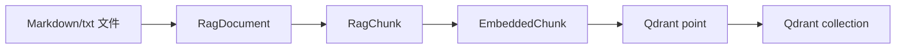
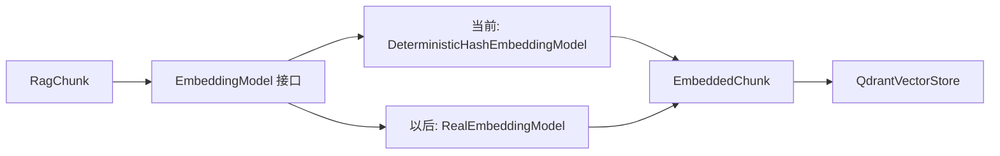

# 阶段 4 第 13 节：生成 embedding 并写入 Qdrant

## 本节状态说明

本节已完成。

本节对应代码：

- `projects/ai-service/app/rag/embeddings.py`
- `projects/ai-service/app/rag/vector_store.py`
- `projects/ai-service/app/rag/ingestion.py`
- `projects/ai-service/scripts/rag_ingest_smoke.py`
- `projects/ai-service/tests/test_rag_embeddings.py`
- `projects/ai-service/tests/test_rag_vector_store.py`
- `projects/ai-service/tests/test_rag_ingestion.py`

本节接在第 11、12 节之后：

```text
第 11 节：文件 -> RagDocument
第 12 节：RagDocument -> RagChunk
第 13 节：RagChunk -> EmbeddedChunk -> Qdrant point -> Qdrant collection
```

## 本节一句话定位

本节解决的问题是：**已经切好的 chunk，怎样变成向量，并以 Qdrant 能理解的 point 形式写入向量数据库。**

更直白地说，前两节我们只是把文档整理成了“适合检索的小段文本”。这一节开始把这些小段真正放进向量数据库，后续才能做 top_k 检索、权限过滤、引用来源和 RAG 问答。

## 本节学习目标

学完本节，你应该能说清楚：

1. embedding 在代码里到底是什么。
2. 为什么每个 chunk 都要生成一个 vector。
3. 为什么同一个 collection 里的 vector 维度必须一致。
4. Qdrant 的 point 由哪几部分组成。
5. 为什么不能直接把项目里的普通字符串 `chunk_id` 当作 Qdrant point id。
6. 为什么 payload 里要保存 `content` 和 metadata。
7. upsert 和普通 insert 有什么区别。
8. 为什么测试里先用 fake embedding，而不直接真实调用 embedding API。
9. 一个最小 RAG 入库流程应该拆成哪些步骤。
10. 如何手动验证本地 Qdrant 是否真的写入成功。

## 本节暂时不学什么

本节暂时不做这些事：

- 不接真实 embedding 模型 API。
- 不做 query embedding。
- 不做 top_k 检索。
- 不把检索结果交给大模型回答。
- 不做 payload filter 权限过滤。
- 不做 Milvus。
- 不使用 LangChain 的 vector store 封装。

这些不是不重要，而是学习顺序上应该先把“入库”这条链路看清楚。否则你会同时面对模型调用、向量维度、Qdrant 写入、检索参数、prompt 拼接，知识点会混在一起。

## 基础知识铺垫：embedding 在代码里是什么

前面我们已经学过 embedding 的概念：把文本变成向量。

现在把它落到代码里，embedding 通常就是：

```python
[0.12, 0.83, 0.04, 0.56, ...]
```

也就是一个 `list[float]`。

一个 chunk 进入 RAG 入库流程后，会形成这样的关系：

```text
chunk.content
-> embedding model
-> vector: list[float]
```

例如：

```text
content = "订单付款后 24 小时内发货"
vector = [0.18, 0.72, 0.09, 0.44, ...]
```

注意：真实 embedding 模型生成的向量不是给人看的。你不需要从 `[0.18, 0.72, ...]` 里看出“发货”的含义。它的意义在于：语义相近的文本，向量距离也更近。

## vector 维度是什么

向量维度就是这个向量里有多少个数字。

例如：

```text
[0.1, 0.2, 0.3]
```

这是 3 维向量。

```text
[0.1, 0.2, 0.3, 0.4, 0.5]
```

这是 5 维向量。

真实 embedding 模型的维度由模型决定。例如某个模型可能输出 1024 维，另一个模型可能输出 1536 维。向量数据库创建 collection 时必须知道这个维度，因为它要提前知道每个点的 vector 长什么样。

所以在 Qdrant 里创建 collection 时会有类似配置：

```json
{
  "vectors": {
    "size": 1024,
    "distance": "Cosine"
  }
}
```

这里的 `size` 就是向量维度。

## 为什么同一个 collection 的维度必须一致

向量相似度计算要求两个向量长度一样。

比如：

```text
A = [0.1, 0.2, 0.3]
B = [0.8, 0.1, 0.4]
```

这两个都是 3 维，可以计算相似度。

但是：

```text
A = [0.1, 0.2, 0.3]
B = [0.8, 0.1, 0.4, 0.6]
```

一个 3 维，一个 4 维，就没法直接计算。

这就是为什么本节代码要做两层检查：

1. embedding 模型声明自己的 `dimension`。
2. 写入 Qdrant 前检查所有 vector 长度一致，并且 collection 的向量维度匹配。

如果这个检查不做，问题可能会推迟到 Qdrant 写入时报错；更糟的是，你可能之后换了 embedding 模型，却仍然写入旧 collection，导致入库流程混乱。

## 为什么本节先用 fake embedding

本节用的是 `DeterministicHashEmbeddingModel`，也就是一个确定性的假 embedding 模型。

它有几个特点：

- 输入同一段文本，每次输出同一个向量。
- 不需要 API key。
- 不产生费用。
- 不依赖网络。
- 适合自动化测试。

但它也有一个非常重要的限制：

**它不理解语义。**

也就是说，真实 embedding 模型知道“发货”和“物流”可能相关；fake embedding 不知道，它只是用哈希算法稳定地产生一组数字。

为什么还要用它？

因为本节的重点不是“语义效果”，而是“入库流程”：

```text
chunk 数量是否正确
vector 数量是否正确
vector 维度是否正确
payload 是否完整
Qdrant point 是否正确
collection 是否存在
upsert 请求是否正确
```

这些都不需要真实 embedding 才能学会。

等这条链路稳定之后，后面再把 fake embedding 换成真实 embedding API，你就能清楚知道：我们只是替换“生成 vector 的那一层”，不是重新理解整个 RAG 入库系统。

## 基础知识铺垫：Qdrant point 是什么

Qdrant 里的核心数据单位叫 point。

一个 point 通常长这样：

```json
{
  "id": "5c56c793-69f3-4fbf-87e6-c4bf54c28c26",
  "vector": [0.9, 0.1, 0.1],
  "payload": {
    "source": "order-shipping-policy.md",
    "title": "订单发货规则",
    "content": "订单付款成功后，仓库会在 24 小时内处理发货。"
  }
}
```

它可以拆成三部分：

| 部分 | 作用 |
| --- | --- |
| `id` | 这个 point 的唯一标识 |
| `vector` | 用来做相似度检索 |
| `payload` | 保存业务信息、原文、来源、权限、标题等 |

你可以把 Qdrant point 理解成：

```text
一个可检索的知识片段 = 唯一 ID + 向量 + 原文和附加信息
```

## chunk、embedding、point 的关系

在我们的项目里，关系是：

```text
RagChunk
  chunk_id
  content
  metadata

-> EmbeddedChunk
  chunk_id
  content
  metadata
  vector

-> Qdrant point
  id
  vector
  payload
```

也就是说：

- `RagChunk` 是切分后的文本块。
- `EmbeddedChunk` 是已经有向量的文本块。
- Qdrant point 是向量数据库真正保存的数据格式。

## 为什么 payload 里必须保存 content

很多初学者会误以为：既然已经有 vector 了，那就不用保存原文了。

这是错误的。

vector 的作用是“找相似内容”，不是“还原原文”。模型最后回答用户时，需要看到原始文本内容，而不是一堆数字。

完整 RAG 问答流程是：

```text
用户问题
-> 生成 query vector
-> Qdrant 找相似 point
-> 取出 point.payload.content
-> 把 content 作为上下文交给大模型
-> 大模型生成回答
```

如果 payload 里没有 `content`，后续检索出来的只有 vector 和 metadata，大模型没有上下文可读，RAG 就无法回答。

## 为什么 payload 里还要保存 metadata

metadata 不是装饰，它会影响后续很多能力：

- 展示引用来源：`source`、`title`、`section`
- 权限过滤：`permission_group`
- 文档类型过滤：`doc_type`
- 业务域过滤：`business_domain`
- 调试检索效果：`chunk_index`、`chunk_count`
- 删除和重新入库：`source`、`chunk_id`

如果入库时不保存 metadata，后面做检索、过滤、引用、排查问题都会非常困难。

## 为什么不能直接用普通 chunk_id 当 Qdrant point id

我们项目里的 `chunk_id` 长这样：

```text
order_shipping_policy_chunk_0001
```

它适合人看，也适合项目内部追踪。

但是 Qdrant 的 point id 有自己的规则。根据 Qdrant 官方文档，point id 支持 64 位无符号整数或 UUID。也就是说，普通字符串不是合法 point id。

所以本节代码做了一个设计：

```text
项目 chunk_id
-> 稳定转换成 UUID
-> 作为 Qdrant point id
```

同时，原始 `chunk_id` 仍然保存在 payload 里。

这样做有两个好处：

1. Qdrant 的 `id` 符合数据库规则。
2. 项目内部仍然能用 `chunk_id` 追踪原始 chunk。

## 为什么要用稳定 UUID

稳定 UUID 的意思是：同一个 `chunk_id` 每次转换出来的 UUID 都一样。

这很重要，因为 RAG 入库不是只做一次。以后你可能会：

- 重新清洗文档
- 重新切分文档
- 重新生成 embedding
- 重新写入 Qdrant

如果每次 point id 都随机生成，那同一个 chunk 会不断新增重复 point。

如果 point id 稳定，那么同一个 chunk 再次写入时会覆盖旧 point。这正好配合 upsert。

## upsert 是什么

upsert 可以拆成：

```text
update + insert = upsert
```

意思是：

- 如果 point 不存在，就插入。
- 如果 point 已存在，就更新/覆盖。

对于 RAG 入库来说，upsert 很常用，因为知识库经常需要重复构建。

例如你修改了 `order-shipping-policy.md`，重新入库后，旧的 chunk point 应该被更新，而不是无限追加重复数据。

## collection 是什么

collection 是一组 point 的集合。

你可以把它粗略理解成传统数据库里的“表”，但它存的是向量和 payload。

在本项目里，我们默认 collection 名叫：

```text
learning_rag_chunks
```

collection 里保存的是所有知识库 chunk 对应的 Qdrant point。

创建 collection 时至少要考虑两个核心配置：

| 配置 | 作用 |
| --- | --- |
| `size` | vector 维度 |
| `distance` | 相似度计算方式 |

本节默认使用：

```text
size = 8
distance = Cosine
```

这里的 `size=8` 是因为我们当前 fake embedding 默认输出 8 维向量。等后续接真实 embedding 模型时，这个值必须改成真实模型的输出维度。

## distance 为什么先用 Cosine

`distance` 决定 Qdrant 怎么判断两个向量像不像。

常见方式有：

- `Cosine`
- `Dot`
- `Euclid`
- `Manhattan`

RAG 文本检索里常见选择是 `Cosine`，也就是余弦相似度。它更关注两个向量的方向是否接近，而不是单纯看向量长度。

这不代表 `Cosine` 永远最好。真正选什么要看 embedding 模型的训练方式和官方建议。但在初学阶段，用 `Cosine` 是一个合理默认值。

## 本节完整入库链路

本节新增的最小完整链路是：

```text
data/knowledge_base
-> load_documents_from_directory()
-> list[RagDocument]
-> split_documents_into_chunks()
-> list[RagChunk]
-> embed_chunks()
-> list[EmbeddedChunk]
-> QdrantVectorStore.ensure_collection()
-> QdrantVectorStore.upsert_embedded_chunks()
-> Qdrant collection: learning_rag_chunks
```

用 Mermaid 图表示：



## Qdrant 里最终会看到什么数据

这一节很容易只记住“写入 Qdrant”这句话，但真正要理解的是：**Qdrant 里最终保存的不是文档文件，也不是 RagChunk 对象，而是 point。**

一个真实写入 Qdrant 的 point，大致会是这种形态：

```json
{
  "id": "由 chunk_id 稳定转换出来的 UUID",
  "vector": [0.123456, 0.234567, 0.345678, 0.456789],
  "payload": {
    "source": "order-shipping-policy.md",
    "title": "订单发货规则",
    "file_name": "order-shipping-policy.md",
    "file_extension": ".md",
    "doc_type": "policy",
    "business_domain": "order",
    "permission_group": "customer_service",
    "chunk_id": "order_shipping_policy_chunk_0001",
    "chunk_index": 1,
    "chunk_count": 3,
    "chunk_size_chars": 180,
    "section": "发货时效",
    "content": "这里是真正会交给大模型阅读的 chunk 原文..."
  }
}
```

这个结构要牢牢记住：

- `id` 是数据库层面的唯一标识。
- `vector` 是检索用的，不是给人看的。
- `payload.content` 是后续大模型回答问题时真正要读的内容。
- `payload.source/title/section` 是后续引用来源需要的信息。
- `payload.permission_group/doc_type/business_domain` 是后续过滤需要的信息。

如果把这件事讲给别人听，可以这样说：

```text
RAG 入库不是把文件直接扔进向量数据库，而是把文件拆成 chunk，
给每个 chunk 生成一个向量，再把“向量 + 原文 + metadata”组成 point 写入 Qdrant。
```

## fake embedding 以后怎么换成真实 embedding

本节先用 fake embedding，但项目结构已经为“以后替换真实 embedding”留好了位置。

现在的结构是：

```text
ingestion.py
  调用 embedding_model.embed_texts(...)

DeterministicHashEmbeddingModel
  当前 fake 实现
```

以后接真实 embedding 时，变化点应该是：

```text
RealEmbeddingModel
  读取 API key
  调用真实 embedding API
  返回 list[list[float]]
```

而入库主流程不应该大改：

```text
load -> split -> embed -> ensure collection -> upsert
```

换句话说，后续替换的是这一个位置：



这也是为什么本节要定义 `EmbeddingModel` 这个协议。它不是为了炫技，而是为了让 fake 和真实模型都遵守同一套输入输出：

```text
输入：list[str]
输出：list[list[float]]
额外约束：每个 vector 的长度必须等于 dimension
```

以后你判断一个真实 embedding 接入是否合格，就看它有没有满足这三个条件：

1. 输入多少段文本，就返回多少个 vector。
2. 每个 vector 的维度一致。
3. 维度和 Qdrant collection 的 `size` 一致。

## 为什么本节不做检索

本节已经把数据写进 Qdrant，按直觉似乎下一步应该马上查一下。

但我没有在本节引入 top_k 检索，原因是：**入库和检索是两条方向相反的链路，初学时要分开学。**

入库链路是：

```text
文档 -> chunk -> chunk vector -> Qdrant point
```

检索链路是：

```text
用户问题 -> query vector -> Qdrant search -> 命中的 chunk payload
```

两条链路都会用 embedding，但它们的输入不同：

- 入库时，embedding 的输入是知识库 chunk。
- 检索时，embedding 的输入是用户问题。

如果本节同时学写入和检索，会多出这些新知识：

- query embedding
- top_k
- score
- score_threshold
- payload 返回字段
- 检索结果排序
- 检索无结果处理

这些会把本节核心目标冲淡。所以本节只负责把“知识能不能正确入库”学扎实。下一步再学 metadata 设计和基础 top_k 检索会更清楚。

## 本节主题系统讲解：新增 embeddings.py

`embeddings.py` 负责把 chunk 文本变成 vector。

核心对象有三个：

| 名称 | 作用 |
| --- | --- |
| `EmbeddingModel` | 定义 embedding 模型应该具备什么能力 |
| `DeterministicHashEmbeddingModel` | 当前阶段使用的 fake embedding 模型 |
| `EmbeddedChunk` | 已经带上 vector 的 chunk |

### EmbeddingModel 是什么

`EmbeddingModel` 是一个协议。

你可以把它理解成一种约定：

```text
只要一个对象有 dimension 属性，并且能 embed_texts(texts)，它就可以被当作 embedding 模型使用。
```

这样设计的好处是：以后换真实 embedding API 时，不需要重写整个入库流程。只要新的模型类也满足这个约定，就能替换 fake 模型。

### DeterministicHashEmbeddingModel 为什么叫 deterministic

`deterministic` 的意思是“确定性的”。

同样输入：

```text
"Orders ship within 24 hours."
```

每次都会得到同样的向量。

这对测试很重要，因为测试不能今天过、明天不过。

但你必须记住：这个 fake 模型只是为了学习和测试，它不具备真实语义能力。

### EmbeddedChunk 为什么需要单独存在

第 12 节的 `RagChunk` 是：

```text
chunk_id + content + metadata
```

本节的 `EmbeddedChunk` 是：

```text
chunk_id + content + metadata + vector
```

单独建 `EmbeddedChunk` 是为了让数据状态更清楚：

- 没有 vector 的 chunk，不能写入向量数据库。
- 有 vector 的 chunk，才可以变成 Qdrant point。

这种设计能减少混乱。否则你看到一个 `RagChunk`，很难知道它有没有完成 embedding。

## 本节主题系统讲解：新增 vector_store.py

`vector_store.py` 负责和 Qdrant 交互。

它做了几件事：

1. 把 `chunk_id` 转成 Qdrant 合法 UUID。
2. 把 `EmbeddedChunk` 组装成 Qdrant point。
3. 确认 collection 存在。
4. 检查 collection 的 vector 维度和距离配置。
5. 执行 upsert，把 point 写入 Qdrant。

### build_qdrant_point_id()

这个函数做的是：

```text
项目 chunk_id -> Qdrant UUID point id
```

为什么不是直接用 `chunk_id`？

因为 Qdrant point id 支持的是整数或 UUID，不是任意字符串。

为什么不是随机 UUID？

因为重复入库时需要覆盖同一个 point。

### build_qdrant_point()

这个函数把 `EmbeddedChunk` 变成 Qdrant point。

结构是：

```text
id      = 稳定 UUID
vector  = embedding 向量
payload = content + metadata + chunk_id
```

这里最关键的是：`content` 被放进 payload。

后续检索时，Qdrant 负责找到相似 point；大模型负责阅读 `payload.content` 并生成回答。

### ensure_collection()

这个方法负责保证 collection 可用。

它的逻辑是：

```text
GET /collections/{collection_name}

如果 404：
    创建 collection

如果 200：
    检查已有 collection 的 size 和 distance 是否匹配

如果其他错误：
    抛出 QdrantVectorStoreError
```

为什么已有 collection 也要检查？

因为你可能以前用 8 维 fake embedding 建过 collection，后面换成 1024 维真实 embedding。如果不检查，写入时会出错，或者你会把不同模型的向量混在同一个 collection 里。

### upsert_embedded_chunks()

这个方法负责真正写入 Qdrant。

它会：

1. 检查有没有 chunk 要写。
2. 检查所有 vector 维度是否一致。
3. 把每个 `EmbeddedChunk` 转成 point。
4. 请求 Qdrant：

```text
PUT /collections/{collection_name}/points?wait=true
```

`wait=true` 表示希望 Qdrant 等待写入操作处理后再返回。学习阶段这样更直观；生产场景是否使用要看吞吐量和一致性要求。

## 本节主题系统讲解：新增 ingestion.py

`ingestion.py` 负责把前面几个模块串起来。

它不是做复杂业务，而是让入库流程有一个清楚入口：

```python
ingest_directory_to_vector_store(...)
```

内部顺序是：

```text
load
split
embed
ensure collection
upsert
return result
```

返回值 `RagIngestionResult` 会告诉你：

- 读取了多少个 document
- 切出了多少个 chunk
- 写入了多少个 vector
- vector 是多少维
- 写入哪个 collection

这对调试很有用。以后如果你发现“文档明明有 4 个，最后只入库 0 个”，可以沿着这个结果往前排查。

## 本节主题系统讲解：配置项

本节新增了 Qdrant 配置：

```env
QDRANT_BASE_URL="http://127.0.0.1:6333"
QDRANT_COLLECTION_NAME="learning_rag_chunks"
QDRANT_TIMEOUT_SECONDS=5
QDRANT_VECTOR_SIZE=8
QDRANT_API_KEY=""
```

每个配置的含义：

| 配置 | 作用 |
| --- | --- |
| `QDRANT_BASE_URL` | Qdrant HTTP 地址 |
| `QDRANT_COLLECTION_NAME` | 写入哪个 collection |
| `QDRANT_TIMEOUT_SECONDS` | 请求 Qdrant 的超时时间 |
| `QDRANT_VECTOR_SIZE` | 当前 embedding 模型输出维度 |
| `QDRANT_API_KEY` | Qdrant Cloud 或开启鉴权时使用，本地 Docker 通常为空 |

如果你的 Qdrant 在 VMware Ubuntu 里，而 Python 项目在 Windows 上运行，`QDRANT_BASE_URL` 不能写 `127.0.0.1`，应该写 Ubuntu 虚拟机 IP，例如：

```env
QDRANT_BASE_URL="http://192.168.88.10:6333"
```

你的虚拟机 IP 可能会变。Ubuntu 里可以用：

```bash
hostname -I
```

查看当前 IP。

## 为什么本节用 REST API 而不是 qdrant-client

Qdrant 有官方 Python 客户端，后面可以学。

但本节先用 HTTP REST API，原因是：

1. 你能直接看见 Qdrant 的请求结构。
2. 不需要额外引入新依赖。
3. 更容易理解 collection 和 point 的真实 JSON 形态。
4. 学清楚 REST 后，再学客户端封装会更轻松。

这不是说 REST 永远比客户端好。生产项目里，用官方客户端通常更省事。但作为学习阶段，先看清底层请求很值得。

## 手动实机验证：写入 VMware Ubuntu 里的 Qdrant

如果你要手动跑真实 Qdrant，需要先打开 VMware Ubuntu，并确认 Qdrant 容器在运行。

在 Ubuntu 里执行：

```bash
docker ps --filter name=qdrant
curl http://localhost:6333
hostname -I
```

如果 Windows 浏览器可以打开：

```text
http://虚拟机IP:6333
```

说明 Windows 能访问 Ubuntu 里的 Qdrant。

然后在 `projects/ai-service/.env` 里确认：

```env
QDRANT_BASE_URL="http://虚拟机IP:6333"
QDRANT_COLLECTION_NAME="learning_rag_chunks"
QDRANT_VECTOR_SIZE=8
```

在 Windows PowerShell 进入项目：

```powershell
cd D:\wendang\java+python+ai\projects\ai-service
uv run python scripts/rag_ingest_smoke.py
```

成功时会看到类似：

```text
RAG ingestion smoke test finished
documents: 4
chunks: ...
vectors: ...
dimension: 8
collection: learning_rag_chunks
```

注意：本节的自动化测试不依赖真实 Qdrant。真实 Qdrant 只用于你手动实机验证。

## 手动实机验证：如何确认 Qdrant 真有数据

跑完 `rag_ingest_smoke.py` 后，不能只看脚本打印成功。你还应该学会从 Qdrant 侧确认数据真的存在。

### 1. 查看 collection 是否存在

在 Windows PowerShell 里执行：

```powershell
curl http://虚拟机IP:6333/collections
```

如果你看到 `learning_rag_chunks`，说明 collection 已经创建。

也可以查看单个 collection：

```powershell
curl http://虚拟机IP:6333/collections/learning_rag_chunks
```

重点看：

- `vectors.size` 是否是 `8`
- `vectors.distance` 是否是 `Cosine`
- `points_count` 是否大于 0

注意：Qdrant 的一些 count 字段可能不是严格实时的，特别是数据量大或后台优化时。学习阶段数据少，通常能直接看到变化。

### 2. 用 scroll 看 point payload

Qdrant 的 scroll 可以按条件或顺序浏览 point。我们现在还没正式学检索，所以先用 scroll 看“库里有没有数据”。

PowerShell 里可以执行：

```powershell
curl -X POST "http://虚拟机IP:6333/collections/learning_rag_chunks/points/scroll" `
  -H "Content-Type: application/json" `
  -d "{\"limit\": 3, \"with_payload\": true, \"with_vector\": false}"
```

如果成功，你应该能看到类似信息：

```json
{
  "result": {
    "points": [
      {
        "id": "...",
        "payload": {
          "chunk_id": "...",
          "source": "...",
          "content": "..."
        }
      }
    ]
  }
}
```

这里建议先 `with_vector=false`，因为 vector 是一串数字，显示出来很长，对初学者排查帮助不大。

### 3. 为什么暂时不用 search 验证

因为 search 需要 query vector。

如果我们随便手写一个 vector 去搜，结果没有语义意义；如果用真实 query embedding，又会提前进入下一节之后的内容。所以本节用 collection 查看和 scroll 验证即可。

## 本节常见排错表

| 现象 | 最可能原因 | 处理方式 |
| --- | --- | --- |
| `failed to connect to Qdrant` | Qdrant 容器没启动，或 Windows 访问不到 Ubuntu | 在 Ubuntu 里执行 `docker ps --filter name=qdrant`，再用 Windows 浏览器访问 `http://虚拟机IP:6333` |
| Windows 能访问 `127.0.0.1:6333` 失败 | Qdrant 跑在 VMware Ubuntu，不在 Windows 本机 | `.env` 里把 `QDRANT_BASE_URL` 改成 `http://虚拟机IP:6333` |
| 昨天能连，今天不能连 | VMware Ubuntu IP 变了，或虚拟机关了 | Ubuntu 执行 `hostname -I` 重新确认 IP |
| collection vector config does not match | 已有 collection 的维度或 distance 和当前配置不一致 | 学习阶段可换一个新的 `QDRANT_COLLECTION_NAME`，或删除旧 collection 后重建 |
| upsert 返回 400 | point 格式不符合 Qdrant 要求，常见是 vector 维度不对 | 检查 `QDRANT_VECTOR_SIZE`、fake embedding 维度、collection size |
| scroll 看不到数据 | 脚本没跑成功、写入到另一个 collection、访问了另一个 Qdrant 实例 | 核对脚本输出的 collection、`.env`、Qdrant 地址 |
| PowerShell 显示中文乱码 | 终端输出编码问题，不一定是文件或 Qdrant 数据坏了 | 优先怀疑 PowerShell 显示 UTF-8 的问题，不要急着改文件内容 |
| `ModuleNotFoundError: No module named 'app'` | 直接运行 `python scripts/xxx.py` 时，Python 只把 `scripts` 目录放进导入路径，没有找到项目根目录下的 `app` 包 | 本项目的 `rag_ingest_smoke.py` 已在脚本开头把项目根目录加入 `sys.path`；如果其他脚本遇到类似问题，要检查运行方式或导入路径 |

## 删除或重建学习 collection

学习阶段如果你把 collection 配错了，比如一开始用 8 维，后来想重新测试，可以删除 collection 后重建。

PowerShell 示例：

```powershell
curl -X DELETE "http://虚拟机IP:6333/collections/learning_rag_chunks"
```

然后重新运行：

```powershell
uv run python scripts/rag_ingest_smoke.py
```

注意：删除 collection 会删掉里面所有 point。真实项目里不能随便这么做，生产环境通常要有备份、迁移、别名切换或重建策略。

## 本节新增测试重点

本节测试分三层：

### 1. embedding 测试

验证：

- 同一文本生成稳定向量。
- 维度正确。
- 空文本会报错。
- `RagChunk` 能变成 `EmbeddedChunk`。
- vector 数量必须和 chunk 数量一致。

### 2. vector_store 测试

验证：

- `chunk_id` 能稳定转换成 UUID。
- Qdrant point 里包含 vector、content、metadata。
- collection 不存在时会创建。
- collection 已存在时会检查维度和 distance。
- upsert 请求格式正确。
- Qdrant HTTP 错误会被转换成项目内部错误。

### 3. ingestion 测试

验证：

```text
load -> split -> embed -> store
```

这条链路能完整跑通。

测试里使用 `FakeVectorStore`，不会真实请求 Qdrant。

## 常见错误

### 错误 1：以为 vector 里保存了原文

vector 只是数字，不能还原成原文。

所以 payload 必须保存 `content`。

### 错误 2：把普通字符串当成 Qdrant point id

Qdrant point id 不是随便什么字符串都可以。本项目把 `chunk_id` 稳定转换成 UUID，同时把原始 `chunk_id` 放进 payload。

### 错误 3：换 embedding 模型后继续写旧 collection

不同 embedding 模型可能输出不同维度。换模型时要检查 collection 的 vector size，不匹配就应该新建 collection 或迁移数据。

### 错误 4：测试里真实调用 embedding API

这会导致测试慢、不稳定、花钱、依赖网络，还可能泄露密钥。

自动化测试应该用 fake embedding。

### 错误 5：只存 metadata，不存 content

后续 RAG 问答需要把原文片段交给大模型。如果不存 content，检索出来也没法生成可靠回答。

### 错误 6：以为 upsert 永远安全

upsert 会覆盖相同 id 的旧 point。这个特性适合重复入库，但如果 id 设计错误，也可能误覆盖别的数据。

### 错误 7：入库成功就等于 RAG 成功

入库成功只说明数据进了向量库，不代表后续检索一定准，更不代表大模型回答一定好。

完整 RAG 还需要继续验证：

- query embedding 是否正确
- top_k 是否合适
- score_threshold 是否合理
- payload filter 是否正确
- prompt 是否正确引用检索结果
- 模型是否遵守“根据资料回答”

### 错误 8：把 fake embedding 的检索效果当真

fake embedding 不理解语义。它只能验证流程，不能验证检索质量。

如果你用 fake embedding 做 search，返回结果没有真实语义参考价值。

### 错误 9：看到 Qdrant 有 vector 就忽略 payload

RAG 最终回答靠的是 payload 里的原文和 metadata。vector 只是用来找相似 point，不能替代原文。

## 本节练习

### 练习 1：解释 Qdrant point 的三部分

请用自己的话解释 `id`、`vector`、`payload` 分别负责什么。

参考答案：

`id` 负责唯一标识 point；`vector` 负责相似度检索；`payload` 保存原文、来源、标题、权限、chunk_id 等业务信息，后续检索结果展示和大模型回答都要依赖 payload。

### 练习 2：为什么本节不用真实 embedding

请解释为什么自动化测试里不用真实 embedding API。

参考答案：

因为本节要测试的是入库流程，不是语义质量。真实 embedding API 会依赖网络、API key、费用和模型稳定性，会让测试变慢且不可靠。fake embedding 可以稳定地产生固定维度的向量，适合测试 load、split、embed、upsert 这些流程边界。

### 练习 3：判断下面的设计是否合理

设计：Qdrant point 的 payload 只保存 `source` 和 `title`，不保存 `content`。

参考答案：

不合理。检索时 Qdrant 根据 vector 找到相似 point，但大模型最终需要阅读原文内容。如果 payload 不保存 `content`，后续即使检索到 point，也没有文本上下文交给模型。

### 练习 4：为什么要检查 collection 维度

假设旧 collection 是 8 维，新 embedding 模型输出 1024 维，如果不检查会发生什么？

参考答案：

写入时 Qdrant 可能直接报错，因为 point vector 维度和 collection 配置不一致。即使系统没有提前报错，混用不同模型的向量也会破坏检索质量。正确做法是检查维度，不匹配时新建 collection 或做迁移。

### 练习 5：解释 upsert 的好处和风险

参考答案：

好处是重复入库时同一个 point id 会被覆盖，不会无限新增重复数据。风险是如果 point id 设计不稳定或冲突，可能覆盖错误的数据。因此要用稳定且能唯一对应 chunk 的 id。

### 练习 6：画出本节入库流程

请画出从文件到 Qdrant 的流程。

参考答案：

```text
Markdown/txt 文件
-> load_documents_from_directory()
-> RagDocument
-> split_documents_into_chunks()
-> RagChunk
-> embed_chunks()
-> EmbeddedChunk
-> build_qdrant_point()
-> Qdrant point
-> upsert_embedded_chunks()
-> Qdrant collection
```

### 练习 7：判断排错方向

现象：你在 Windows 里运行脚本，报错 `failed to connect to Qdrant`。但你记得之前在 Ubuntu 里 `curl http://localhost:6333` 是成功的。

你应该优先检查什么？

参考答案：

优先检查 Windows 是否能访问 Ubuntu 里的 Qdrant，而不是只看 Ubuntu 自己能不能访问。Ubuntu 里的 `localhost` 指 Ubuntu 自己；Windows 里的 `localhost` 指 Windows 自己。应该确认 Ubuntu 虚拟机 IP，例如 `hostname -I`，然后在 Windows 浏览器或 PowerShell 访问 `http://虚拟机IP:6333`，并检查 `.env` 的 `QDRANT_BASE_URL`。

### 练习 8：设计 fake 到真实 embedding 的替换点

如果以后要接真实 embedding API，你觉得应该改哪一层？不应该改哪几层？

参考答案：

应该新增或替换一个满足 `EmbeddingModel` 协议的真实 embedding 类，让它实现 `dimension` 和 `embed_texts()`。不应该大改 loader、splitter、vector_store 和 ingestion 主流程，因为这些模块只依赖“输入文本、输出向量”的抽象，不应该关心具体向量来自哈希、OpenAI、阿里云还是本地模型。

### 练习 9：解释为什么本节不用 search 验证

参考答案：

search 需要 query vector，而 query vector 应该由用户问题生成。如果本节为了验证写入而随便手写 query vector，结果没有语义意义；如果接真实 query embedding，又提前进入检索和真实模型调用。为了学习边界清晰，本节只验证 collection 和 point 是否写入，search 放到后续 top_k 检索小节。

## 自测题

### 自测 1：`RagChunk` 和 `EmbeddedChunk` 的区别是什么？

答案：

`RagChunk` 是切分后的文本块，包含 `chunk_id`、`content`、`metadata`。`EmbeddedChunk` 在这些字段基础上增加了 `vector`，表示这个 chunk 已经完成 embedding，可以写入向量数据库。

### 自测 2：为什么 Qdrant point 的 payload 里要放 `chunk_id`？

答案：

因为 Qdrant 的 point id 使用稳定 UUID，原始项目内的 `chunk_id` 需要继续保存在 payload 里，方便调试、引用、删除、更新和追踪来源。

### 自测 3：collection 的 `size` 是什么？

答案：

`size` 是向量维度，也就是每个 vector 里有多少个 float 数字。同一个 collection 内的 vector 维度必须一致。

### 自测 4：本节 fake embedding 的最大限制是什么？

答案：

它不理解语义，只能稳定地产生一组数字。因此它适合测试入库流程，不适合评估真实检索效果。

### 自测 5：为什么换真实 embedding 模型时可能需要新 collection？

答案：

因为不同模型可能输出不同维度，或者使用不同的相似度推荐配置。如果新模型的维度和旧 collection 不一致，就必须新建 collection 或迁移数据。

### 自测 6：`wait=true` 的作用是什么？

答案：

`wait=true` 表示 upsert 请求希望等待写入操作处理后再返回。学习阶段这样更容易验证结果；生产场景要根据性能和一致性需求决定。

### 自测 7：如果 Qdrant 在 VMware Ubuntu 里，Windows 上的 `.env` 应该怎么写？

答案：

应该把 `QDRANT_BASE_URL` 写成 Ubuntu 虚拟机的 IP，例如 `http://192.168.88.10:6333`，而不是 `http://127.0.0.1:6333`。因为 Windows 的 `127.0.0.1` 指的是 Windows 自己，不是 Ubuntu 虚拟机。

### 自测 8：为什么 `with_vector=false` 也能验证 point 是否写入？

答案：

因为本节重点是确认 point 和 payload 是否存在。vector 是一串数字，显示出来不利于阅读。只要 scroll 能看到 point id 和 payload，说明 point 已经写入；后续检索质量再单独验证。

### 自测 9：如果 collection 已经存在但 vector size 不匹配，为什么不应该直接继续写？

答案：

因为向量维度不匹配会导致 Qdrant 写入失败，或者说明当前 embedding 模型和 collection 不是一套配置。正确做法是停止写入，换新 collection、删除重建或做正式迁移。

### 自测 10：为什么 `EmbeddingModel` 协议能降低后续接真实模型的难度？

答案：

因为入库流程只依赖 `dimension` 和 `embed_texts()`，不关心具体实现。fake embedding 和真实 embedding 只要满足同一协议，就可以在不大改 ingestion、vector_store、loader、splitter 的情况下替换。

## 讲给别人听的口述版

如果别人问你“你们这个 RAG 入库是怎么做的”，你可以这样回答：

```text
我们先把 Markdown/txt 知识文档加载成 RagDocument，再按段落和标题切成 RagChunk。
每个 RagChunk 会交给 embedding 模型生成一个固定维度的向量，形成 EmbeddedChunk。
然后我们把 EmbeddedChunk 组装成 Qdrant point：id 使用稳定 UUID，vector 用来检索，payload 保存原文 content 和 source、title、section、权限等 metadata。
写入前会确认 Qdrant collection 是否存在，并检查 collection 的 vector size 和 distance 是否和当前 embedding 配置一致。
最后用 upsert 写入，这样重复入库时同一个 chunk 会覆盖旧 point，不会无限产生重复数据。
这一节为了先学清楚入库流程，使用 deterministic fake embedding，不真实调用 embedding API；真实 embedding 会在后面替换 EmbeddingModel 这一层。
```

这段话能讲清楚，说明你已经抓住本节主线。

## 本节复盘

本节完成了 RAG 入库链路的关键一步：

```text
chunk -> vector -> point -> Qdrant
```

你现在应该理解：

- embedding 在代码里就是 `list[float]`。
- vector 维度必须稳定且和 collection 配置一致。
- Qdrant point 由 `id`、`vector`、`payload` 组成。
- payload 必须保存原文 content 和 metadata。
- 项目内部 `chunk_id` 不等于 Qdrant point id。
- 稳定 UUID 能让重复入库配合 upsert 使用。
- fake embedding 适合学习和测试流程，不适合真实语义检索。
- 最小入库流程应该被拆成 loader、splitter、embedding、vector_store、ingestion 几层。
- 实机验证不只看脚本输出，还要能查看 collection 和 scroll point。
- 当前入库成功不等于检索质量好，检索要在后续小节单独学习。

## 参考资料

- Qdrant Collections: https://qdrant.tech/documentation/manage-data/collections/
- Qdrant Points: https://qdrant.tech/documentation/manage-data/points/
- Qdrant Create Collection API: https://api.qdrant.tech/api-reference/collections/create-collection
- Qdrant Upsert Points API: https://api.qdrant.tech/api-reference/points/upsert-points
