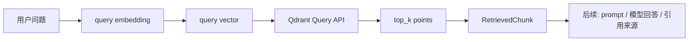

# 阶段 4 第 15 节：基础 top_k 检索

## 本节状态说明

本节已完成。

本节对应代码：

- `projects/ai-service/app/rag/documents.py`
- `projects/ai-service/app/rag/vector_store.py`
- `projects/ai-service/app/rag/retriever.py`
- `projects/ai-service/scripts/rag_retrieve_smoke.py`
- `projects/ai-service/tests/test_rag_documents.py`
- `projects/ai-service/tests/test_rag_vector_store.py`
- `projects/ai-service/tests/test_rag_retriever.py`

本节接在第 13、14 节后面：

```text
第 13 节：把 chunk + vector + payload 写进 Qdrant
第 14 节：设计 payload 里的 metadata
第 15 节：根据用户问题，从 Qdrant 找回最相似的 chunk
```

## 本节一句话定位

本节解决的问题是：**用户提出一个问题后，系统怎样从向量数据库里找出最相关的前几条知识片段。**

这一步叫 retrieval，也就是“检索”。

第 13 节完成的是入库：

```text
知识 chunk -> chunk vector -> Qdrant
```

第 15 节完成的是查询：

```text
用户问题 -> query vector -> Qdrant top_k -> RetrievedChunk
```

## 本节学习目标

学完本节，你应该能说清楚：

1. retrieval 是什么。
2. query embedding 是什么。
3. top_k 是什么。
4. score 是什么，为什么它不是最终答案。
5. 为什么检索结果不是 RAG 最终回答。
6. Qdrant Query API 的请求体长什么样。
7. Qdrant 返回的 point 要怎样变成项目里的 `RetrievedChunk`。
8. 为什么本节仍然使用 fake embedding。
9. 为什么自动化测试不能依赖真实 Qdrant。
10. 本节新增的 `retriever.py` 和 `vector_store.py` 各自负责什么。

## 本节暂时不学什么

本节暂时不做：

- 不做 payload filter。
- 不做 score_threshold。
- 不把检索结果交给大模型回答。
- 不做引用来源格式化给用户看。
- 不做真实 embedding API。
- 不做 hybrid search。
- 不做 rerank。

原因是：本节先把“按向量相似度取回 top_k chunk”这个最基础动作学扎实。

## 基础知识铺垫：什么是 retrieval

retrieval 就是“检索”。

在 RAG 里，retrieval 指的是：

```text
根据用户问题，从知识库里找出可能相关的内容片段。
```

用户问：

```text
订单超过 72 小时还没发货怎么办？
```

系统应该从知识库里找出类似：

```text
订单超过 72 小时未发货时，客服可以核查仓库状态，并创建异常工单。
```

注意：retrieval 不负责生成自然语言答案。

retrieval 只负责找资料。

生成答案是后面的 generation 负责。

完整 RAG 是：

```text
Retrieve：找资料
Augment：把资料放进 prompt
Generate：让模型根据资料回答
```

本节只学 Retrieve。

## 为什么检索是 RAG 的关键

如果检索错了，后面模型再强也很难回答对。

例如用户问：

```text
订单多久发货？
```

如果检索命中的是：

```text
账号忘记密码怎么办？
```

那模型得到的上下文就是错的。

后面可能出现两种情况：

1. 模型老实说资料不相关，回答不了。
2. 模型硬编一个看似合理但没有依据的答案。

所以 RAG 的质量不是只看大模型，也要看检索质量。

可以把 RAG 理解成：

```text
检索决定模型看什么资料
模型决定如何表达答案
```

## query embedding 是什么

第 13 节我们给 chunk 生成过 embedding：

```text
chunk.content -> chunk vector
```

本节要给用户问题生成 embedding：

```text
user query -> query vector
```

例如：

```text
用户问题：订单超过 72 小时没有发货怎么办？
query vector: [0.18, 0.72, 0.09, ...]
```

然后 Qdrant 会拿这个 query vector 去和库里的 chunk vector 比较，找出最相似的点。

所以检索链路是：

```text
用户问题
-> query embedding
-> query vector
-> Qdrant 相似度搜索
-> top_k points
-> payload.content
```

## chunk embedding 和 query embedding 的区别

这两个 embedding 很像，但输入不同。

| 类型 | 输入 | 什么时候生成 | 存不存进 Qdrant |
| --- | --- | --- | --- |
| chunk embedding | 知识库 chunk | 入库时 | 存 |
| query embedding | 用户问题 | 用户查询时 | 通常不存 |

chunk embedding 是为了让知识库可搜索。

query embedding 是为了把用户问题变成同一个向量空间里的查询条件。

关键点：**chunk 和 query 必须使用同一个 embedding 模型或兼容模型。**

如果入库时用模型 A，查询时用模型 B，而且两个模型向量空间不兼容，检索结果会很差。

本项目现在入库和查询都使用 `DeterministicHashEmbeddingModel`，是为了让流程能跑通。后续接真实 embedding 时，也必须保证入库和查询使用同一套 embedding 配置。

## 入库链路和查询链路对照

第 15 节是一个转折点：前面主要在学“怎么把知识放进去”，现在开始学“怎么把知识查出来”。

这两条链路方向相反，但使用同一套向量空间。

| 对比项 | 入库链路 | 查询链路 |
| --- | --- | --- |
| 输入 | 知识库文档 | 用户问题 |
| 文本单位 | chunk content | query text |
| embedding 类型 | chunk embedding | query embedding |
| vector 用途 | 存入 Qdrant，等待以后被搜索 | 作为搜索条件，去 Qdrant 找相似 point |
| Qdrant 操作 | upsert points | query points |
| 输出 | Qdrant collection 里的 point | top_k RetrievedChunk |
| 发生频率 | 文档新增/更新时 | 用户每次提问时 |
| 是否保存 vector | 保存 chunk vector | 通常不保存 query vector |

用流程图看：

```text
入库：
文档 -> chunk -> chunk vector -> Qdrant point

查询：
用户问题 -> query vector -> Qdrant query -> top_k point -> RetrievedChunk
```

这张对照表很重要，因为很多初学者会把 `chunk embedding` 和 `query embedding` 混在一起。

最关键的一句话是：

```text
入库时给知识生成向量，查询时给问题生成向量。
```

两者必须在同一个向量空间里，Qdrant 才能比较“问题”和“知识片段”的相似度。

## top_k 是什么

`top_k` 表示“取最相似的前 k 条”。

例如：

```text
top_k = 3
```

意思是：

```text
请从向量库里找出最相似的 3 个 chunk。
```

Qdrant 返回的结果通常会按 score 排序。

比如：

```text
第 1 条 score=0.91
第 2 条 score=0.84
第 3 条 score=0.76
```

top_k 太小可能漏掉重要资料。

top_k 太大可能带来噪音，也会让后面 prompt 变长。

所以 top_k 是 RAG 里非常重要的调参项。

## top_k 不是越大越好

如果 `top_k=1`：

- 优点：上下文短，噪音少。
- 缺点：如果第一条没命中，答案容易错。

如果 `top_k=20`：

- 优点：召回更多资料。
- 缺点：上下文太长，噪音变多，成本变高，模型可能被无关内容干扰。

实际项目常见做法是先从小值开始：

```text
top_k = 3 或 5
```

然后根据检索效果调优。

本节默认演示 `top_k=3` 或 `top_k=5`。

## top_k 调参思路

top_k 是一个看似简单、实际很重要的参数。

不同取值适合不同情况：

| top_k | 特点 | 适合场景 | 风险 |
| --- | --- | --- | --- |
| 1 | 只取最像的一条 | 文档非常标准、问题非常明确、只想看第一命中 | 一旦第一条错了，后面没有补救 |
| 3 | 小而稳，便于调试 | 初学、demo、小知识库、客服问答起步 | 可能漏掉补充信息 |
| 5 | 召回更宽一点 | 常见 RAG 起始值，兼顾召回和噪音 | prompt 会变长 |
| 10 | 召回更多 | 文档分散、问题复杂，需要多段资料 | 无关内容更多，模型更容易被干扰 |
| 20+ | 很宽的召回 | 通常配合 rerank 或后处理 | 不适合直接全塞给模型 |

一个比较稳的调参方法：

1. 先用 `top_k=3` 跑通流程。
2. 看命中文档和章节是否合理。
3. 如果经常漏资料，尝试 `top_k=5`。
4. 如果无关内容很多，先不要盲目调大，应该考虑 metadata filter 或更好的 embedding。
5. 如果必须召回很多，再考虑 rerank，而不是直接把所有内容塞给模型。

本阶段的学习顺序也是这个逻辑：

```text
第 15 节：先学 top_k
第 16 节：再学 payload filter，减少错误业务域
第 17 节：再学 score_threshold，处理低相关结果
后续：再学 rerank、hybrid search 等增强方法
```

## score 是什么

score 是向量数据库返回的相似度分数。

它表示：

```text
这个 point 和 query vector 有多相似。
```

在本项目使用 `Cosine` 距离配置时，你可以先粗略理解为：

```text
score 越高，越相似。
```

但要注意：

1. score 的具体含义和 distance metric 有关。
2. 不同 embedding 模型的 score 分布可能不一样。
3. score 高不等于答案一定正确。
4. score 低不等于内容完全没用。

score 是检索阶段的信号，不是最终判断。

后面第 17 节会学 `score_threshold`，也就是“分数低于某个阈值就不要回答”。

## score 的常见误解

score 很有用，但也很容易被误解。

### 误解 1：score 可以跨模型比较

不建议这样做。

不同 embedding 模型的向量分布不同，score 范围和分布也可能不同。

例如：

```text
模型 A 下 score=0.82 可能很好
模型 B 下 score=0.82 可能一般
```

所以换 embedding 模型后，原来的 score_threshold 不一定还能用。

### 误解 2：score 可以跨 distance metric 比较

也不建议。

Qdrant 支持 Cosine、Dot、Euclid 等距离方式。不同 distance 的 score 含义不同。

本项目现在使用 `Cosine`，你可以先理解为越高越相似。

但如果以后换成别的 distance，score 解释方式要重新确认。

### 误解 3：score 高就一定能回答

不一定。

一个 chunk 可能和问题语义接近，但并不包含完整答案。

例如用户问：

```text
订单超过 72 小时没发货，客服能不能赔偿？
```

命中的 chunk 可能只说：

```text
超过 72 小时可以创建工单。
```

它很相关，但不能回答“能不能赔偿”。

所以 score 只能说明“像不像”，不能说明“够不够回答”。

### 误解 4：score 低就一定没用

也不一定。

有些问题需要多个片段拼起来回答，某些补充片段 score 可能不高，但对完整答案有帮助。

所以第 17 节学 score_threshold 时，不能机械地只看一个固定数字，要结合业务样例评估。

## 检索结果不是最终答案

本节非常重要的一点：

```text
检索结果不是最终答案。
```

检索结果通常是：

```text
RetrievedChunk(
  content="订单超过 72 小时未发货...",
  metadata={...},
  score=0.87
)
```

它只是资料。

最终答案还需要后续流程：

```text
检索结果
-> 组装 prompt
-> 交给大模型
-> 大模型根据资料生成中文回答
-> 带出处返回用户
```

所以本节不会把结果交给模型。

现在提前接模型，反而会让你分不清“检索质量”和“模型表达质量”。

## 本节完整数据流

本节数据流是：

```text
用户问题
-> retrieve_top_k()
-> embedding_model.embed_texts([query])
-> query vector
-> QdrantVectorStore.query_similar()
-> POST /collections/{collection}/points/query
-> Qdrant points
-> RetrievedChunk[]
```

用图表示：



## Qdrant Query API 是什么

Qdrant 官方文档里，当前推荐使用 Query API 做统一查询。

本节使用的接口是：

```text
POST /collections/{collection_name}/points/query
```

请求体核心字段：

```json
{
  "query": [0.2, 0.1, 0.9, 0.7],
  "limit": 3,
  "with_payload": true,
  "with_vector": false
}
```

字段含义：

| 字段 | 作用 |
| --- | --- |
| `query` | 查询向量，也就是 query embedding 的结果 |
| `limit` | 返回几条，等价于本节说的 top_k |
| `with_payload` | 是否返回 payload |
| `with_vector` | 是否返回 vector |

为什么 `with_payload=true`？

因为我们需要拿到 `payload.content` 和 metadata。

为什么 `with_vector=false`？

因为后续回答问题不需要再看那串数字。返回 vector 会让响应更大，也不利于阅读。

## Qdrant 返回结果怎么看

Qdrant Query API 返回的 point 里，关键字段是：

```json
{
  "id": "point-id",
  "score": 0.87,
  "payload": {
    "chunk_id": "order_shipping_policy_chunk_0001",
    "content": "订单付款后 24 小时内发货。",
    "source": "order-shipping-policy.md",
    "section": "正常发货时效"
  }
}
```

我们关心：

- `id`：Qdrant point id。
- `score`：相似度分数。
- `payload.chunk_id`：项目内部 chunk id。
- `payload.content`：后续交给模型的原文。
- `payload.source/title/section`：后续引用来源和调试用。

本节会把这些字段转换成项目内部模型 `RetrievedChunk`。

## RetrievedChunk 是什么

本节在 `documents.py` 里新增：

```text
RetrievedChunk
```

它表示“已经从向量库检索回来的 chunk”。

字段是：

| 字段 | 含义 |
| --- | --- |
| `point_id` | Qdrant point id |
| `chunk_id` | 项目内部 chunk id |
| `content` | 检索回来的原文片段 |
| `metadata` | payload 里的 metadata |
| `score` | 相似度分数 |

为什么不直接返回 Qdrant 原始 JSON？

因为项目内部最好使用稳定的数据模型。

Qdrant 返回格式属于外部接口，后续如果外部格式有细节变化，我们只需要在 `vector_store.py` 里适配，业务层仍然用 `RetrievedChunk`。

## 本节主题系统讲解：vector_store.py 的变化

第 13 节 `vector_store.py` 已经负责：

```text
ensure_collection()
upsert_embedded_chunks()
```

本节新增：

```text
query_similar()
```

它负责：

1. 校验 query vector。
2. 校验 top_k。
3. 调用 Qdrant Query API。
4. 解析 Qdrant 返回的 points。
5. 把每个 point 转成 `RetrievedChunk`。

### 为什么 query_similar() 放在 vector_store.py

因为它是 Qdrant 交互细节。

调用路径、请求体、响应格式、HTTP 错误处理，都属于向量库适配层。

retriever 不应该知道：

- Qdrant URL 是什么。
- Qdrant endpoint 是什么。
- Qdrant 返回 result 是 dict 还是 list。
- Qdrant HTTP 失败怎么处理。

这些都应该被 `QdrantVectorStore` 包起来。

## query_similar() 的请求边界

`query_similar()` 接收：

```text
query_vector
top_k
with_payload
with_vector
```

本节默认：

```text
with_payload=True
with_vector=False
```

它会请求：

```text
POST /collections/{collection_name}/points/query
```

并发送：

```json
{
  "query": [0.1, 0.2, 0.3],
  "limit": 3,
  "with_payload": true,
  "with_vector": false
}
```

这里的 `limit` 就是 top_k。

## query_similar() 的结果解析

Qdrant 当前 Query API 典型返回：

```json
{
  "status": "ok",
  "result": {
    "points": [
      {
        "id": "...",
        "score": 0.87,
        "payload": {...}
      }
    ]
  }
}
```

本节代码也兼容旧一点的列表形态：

```json
{
  "status": "ok",
  "result": [
    {
      "id": "...",
      "score": 0.87,
      "payload": {...}
    }
  ]
}
```

这不是为了复杂，而是为了让教学代码对 Qdrant 返回形态有一点容错能力。

## 为什么必须检查 payload.content

检索结果如果没有 `payload.content`，后续就没有原文能交给模型。

所以本节解析 Qdrant point 时会检查：

```text
payload 必须存在
payload.content 必须是非空字符串
payload.chunk_id 必须是非空字符串
score 必须是数字
id 必须存在
```

如果这些字段缺失，说明入库数据不符合第 13、14 节的规则，不能继续当作有效检索结果。

## 本节主题系统讲解：新增 retriever.py

`retriever.py` 是本节新增的检索编排层。

它不关心 Qdrant HTTP 细节，只关心 RAG 检索流程：

```text
query -> query embedding -> vector store top_k -> RetrievedChunk[]
```

核心函数：

```text
retrieve_top_k()
```

职责是：

1. 检查用户问题不能为空。
2. 检查 top_k 必须大于 0。
3. 用 embedding model 把 query 变成 vector。
4. 检查 query vector 数量和维度。
5. 调用 vector_store.query_similar()。
6. 返回 `list[RetrievedChunk]`。

## 为什么要有 retriever.py

你可能会问：既然 `QdrantVectorStore` 已经能查询，为什么还要 `retriever.py`？

因为两者职责不同。

`QdrantVectorStore` 负责：

```text
给我一个 vector，我去 Qdrant 查。
```

`retriever.py` 负责：

```text
给我一个用户问题，我先转成 vector，再去查。
```

一个偏底层适配，一个偏 RAG 业务流程。

这种拆分后，后续换向量库、换 embedding 模型、加 filter、加 score_threshold 都更容易。

## VectorStoreReader 协议

`retriever.py` 定义了 `VectorStoreReader` 协议。

它的意思是：

```text
只要一个对象有 query_similar() 方法，就可以作为 retriever 的 vector_store。
```

这样测试时可以用 fake vector store。

真实运行时可以用 Qdrant vector store。

这和前面 `EmbeddingModel` 协议思想一致：

```text
用抽象边界隔离外部依赖。
```

## format_retrieved_chunks_for_debug()

本节还加了一个小工具：

```text
format_retrieved_chunks_for_debug()
```

它把检索结果格式化成便于看的调试行：

```text
1. score=0.9123 source=order-shipping-policy.md section=正常发货时效 chunk_id=...
```

它不是核心 RAG 功能，但对学习很有用。

因为刚开始学检索时，你需要快速看懂：

- 命中了哪个文档？
- 命中了哪个章节？
- 分数是多少？
- chunk_id 是什么？

## 本节为什么继续使用 fake embedding

本节仍然使用 `DeterministicHashEmbeddingModel`。

原因是：本节学习目标是“检索流程”，不是“真实语义效果”。

fake embedding 能验证：

- query 会被转成 vector。
- vector 会被传给 Qdrant。
- top_k 会被传给 Qdrant。
- Qdrant 返回结果能被解析。
- RetrievedChunk 数据结构正确。

fake embedding 不能验证：

- 用户问题和文档是否真的语义相似。
- top_k 返回结果是否真的符合业务问题。
- score 是否有真实语义参考价值。

所以你如果手动运行 `rag_retrieve_smoke.py`，看到的结果只能说明流程通了，不能说明检索质量好。

真实检索质量要等接入真实 embedding 模型后再评估。

## 本次实机烟测为什么看起来不准

本节我实际跑过一次 `rag_retrieve_smoke.py`，问题是：

```text
订单超过 72 小时没有发货怎么办？
```

Qdrant 返回的前三条大致是：

```text
1. refund-return-policy.md / 退款到账时间
2. account-security-faq.md / 敏感操作限制
3. order-shipping-policy.md / 不能直接承诺的内容
```

从人的角度看，订单问题应该优先命中订单发货规则，但 fake embedding 让退款、账号排在前面。

这不是 Qdrant 坏了，也不是 top_k 代码错了。

真正原因是：

```text
DeterministicHashEmbeddingModel 不理解语义。
```

它只是用哈希算法稳定地产生向量。稳定不等于语义正确。

这个实机结果反而很适合作为学习案例：

| 现象 | 说明 |
| --- | --- |
| 能返回 3 条结果 | 查询流程通了 |
| 有 score/source/section/chunk_id | payload 解析通了 |
| 结果业务域不准 | fake embedding 没有语义能力 |
| 订单文档排到第 3 | top_k 能召回，但排序质量不可靠 |

所以本节实机验证的结论应该是：

```text
流程验证通过，语义质量暂不评价。
```

后面接入真实 embedding 后，再重新评估：

- 订单问题是否优先命中 order 文档。
- 退款问题是否优先命中 refund 文档。
- 账号问题是否优先命中 account 文档。
- score 分布是否适合设置 threshold。

## 为什么下一节要学 payload filter

这次 fake embedding 的实机结果还有另一个启发：

```text
用户问订单问题，却命中了退款和账号文档。
```

在真实系统里，即使使用真实 embedding，也可能出现跨业务域命中。

这时候就需要第 14 节设计的 metadata：

```text
business_domain = order
permission_group = customer_service
doc_type = policy
```

下一节 payload filter 会解决的问题是：

```text
不只是“找相似”，还要“在指定范围内找相似”。
```

比如：

```text
只在 customer_service 有权限的内容里找
只在 order 业务域里找
只在 policy 文档里找
```

所以第 15 节和第 16 节的关系是：

```text
第 15 节：先学全库 top_k 相似度检索
第 16 节：再学带 metadata 条件的受控检索
```

## 手动实机验证：查询 Qdrant

如果你想实机验证，需要打开 VMware Ubuntu，并确认 Qdrant 正在运行。

因为第 13 节你已经写入过 `learning_rag_chunks`，这节可以直接查询。

在 Windows PowerShell 进入项目：

```powershell
cd D:\wendang\java+python+ai\projects\ai-service
uv run python scripts/rag_retrieve_smoke.py
```

成功时会看到类似：

```text
query: 订单超过 72 小时没有发货怎么办？
retrieved chunks:
1. score=... source=... section=... chunk_id=...
2. score=... source=... section=... chunk_id=...
3. score=... source=... section=... chunk_id=...
```

如果结果看起来“不像语义最相关”，不要急。

当前 fake embedding 不理解语义，它只能验证流程。

## 手动 curl 验证 Query API

如果你想直接看 Qdrant Query API，可以先准备一个 8 维向量。

PowerShell 推荐用 `Invoke-RestMethod` 生成 JSON，少踩引号坑：

```powershell
$body = @{
  query = @(0.1, 0.2, 0.3, 0.4, 0.5, 0.6, 0.7, 0.8)
  limit = 3
  with_payload = $true
  with_vector = $false
} | ConvertTo-Json -Compress

Invoke-RestMethod `
  -Uri "http://192.168.88.10:6333/collections/learning_rag_chunks/points/query" `
  -Method Post `
  -ContentType "application/json" `
  -Body $body
```

注意：这里手写向量没有语义意义，只是验证 API 能返回 point。

真实 query vector 应该由 embedding 模型根据用户问题生成。

## 本节新增测试重点

本节测试分两层。

### vector_store 测试

验证：

- `query_similar()` 请求的是 `/points/query`。
- 请求体包含 `query`、`limit`、`with_payload`、`with_vector`。
- Qdrant 返回结果能解析成 `RetrievedChunk`。
- result 为 dict points 或 list 时都能解析。
- 空 query vector 会被拒绝。
- 无效 top_k 会被拒绝。
- payload 缺 content 会报错。

### retriever 测试

验证：

- 用户问题会先进入 embedding model。
- query vector 会传给 vector store。
- top_k 会传给 vector store。
- 默认要求返回 payload，不返回 vector。
- 空 query 会报错。
- 无效 top_k 会报错。
- query embedding 数量和维度异常会报错。

## 常见错误

### 错误 1：把检索结果当成最终答案

检索结果只是资料，不是最终回答。

最终回答需要后续把资料交给模型生成。

### 错误 2：以为 top_k 越大越好

top_k 过大可能带来无关内容，增加 prompt 噪音和 token 成本。

### 错误 3：以为 score 高就一定正确

score 是相似度信号，不是事实验证。

### 错误 4：query embedding 和 chunk embedding 使用不同模型

如果向量空间不一致，检索结果会很差。

### 错误 5：测试里依赖真实 Qdrant

自动化测试应该稳定、快速、不依赖外部服务。真实 Qdrant 适合手动 smoke test。

### 错误 6：返回 vector 而不是 payload

后续大模型需要读的是 `payload.content`，不是 vector 数字。

### 错误 7：忘记处理空检索结果

本节只做基础 top_k。后面还要学“没有检索结果时怎么处理”和 score_threshold。

### 错误 8：看到实机检索不准就怀疑 Qdrant 坏了

如果当前使用 fake embedding，检索不准是正常的。应该区分“流程是否通”和“语义质量是否好”。

### 错误 9：只靠调大 top_k 解决命中错误

top_k 变大只会返回更多结果，不一定让排序更准。业务域跑偏时，应该考虑 payload filter；排序不准时，应该考虑真实 embedding、rerank 或 hybrid search。

## 本节练习

### 练习 1：解释 retrieval

请用自己的话解释 RAG 里的 retrieval 是什么。

参考答案：

retrieval 是根据用户问题，从知识库或向量数据库中找出可能相关的知识片段。它只负责找资料，不负责生成最终自然语言答案。

### 练习 2：解释 query embedding

query embedding 和 chunk embedding 有什么区别？

参考答案：

chunk embedding 的输入是知识库 chunk，通常在入库时生成并存进 Qdrant。query embedding 的输入是用户问题，通常在用户查询时临时生成，用来和库里的 chunk vector 做相似度搜索。

### 练习 3：top_k 取 3 和取 20 有什么区别？

参考答案：

top_k=3 返回内容少，噪音少，但可能漏掉资料。top_k=20 召回更多，但容易引入无关内容，增加 token 成本，并干扰模型回答。

### 练习 4：为什么 `with_vector=false`

参考答案：

后续回答问题需要的是 `payload.content` 和 metadata，不需要再看 vector 数字。返回 vector 会增加响应体大小，也不利于调试阅读。

### 练习 5：为什么检索结果不是最终答案？

参考答案：

检索结果只是从知识库取回的资料片段。最终答案还需要把这些资料整理进 prompt，再让大模型根据资料生成自然语言回答。

### 练习 6：解释 score 的边界

参考答案：

score 表示 query vector 和 point vector 的相似度，通常用于排序。但 score 不是事实正确性的保证，也不等同于业务答案。后续还需要 score_threshold、上下文拼接和模型回答约束。

### 练习 7：画出本节检索流程

参考答案：

```text
用户问题
-> embedding_model.embed_texts([query])
-> query vector
-> vector_store.query_similar(query_vector, top_k)
-> Qdrant Query API
-> points
-> RetrievedChunk[]
```

### 练习 8：为什么自动化测试不用真实 Qdrant

参考答案：

真实 Qdrant 依赖外部服务、Docker、网络和本机环境，会让测试不稳定。自动化测试应该用 fake 或 MockTransport 验证请求、解析和编排逻辑。真实 Qdrant 留给手动 smoke test。

### 练习 9：分析一次 fake embedding 检索结果

用户问：“订单超过 72 小时没有发货怎么办？”

结果前三条是退款、账号、订单文档。这个结果说明什么？不说明什么？

参考答案：

说明 Qdrant 查询流程通了，能返回 top_k，payload 和 score 能被解析。不说明语义检索质量好，因为当前 fake embedding 不理解语义。这个结果不能用来判断真实 RAG 效果，只能证明第 15 节流程打通。

### 练习 10：选择合适的 top_k

如果知识库很小，只有 16 个 chunk，初学阶段你会先用 `top_k=3`、`top_k=5` 还是 `top_k=20`？为什么？

参考答案：

建议先用 `top_k=3` 或 `top_k=5`。这样便于观察命中文档、score 和 section，也不容易被大量无关结果干扰。`top_k=20` 会返回过多内容，对学习检索排序和调试不友好。

## 自测题

### 自测 1：retrieval 在 RAG 中负责什么？

答案：

负责根据用户问题找回相关资料，不负责生成最终答案。

### 自测 2：top_k 的 k 是什么意思？

答案：

k 表示返回最相似的前几条结果，例如 top_k=3 就返回最相似的 3 个 chunk。

### 自测 3：Qdrant Query API 的 endpoint 是什么？

答案：

本节使用 `POST /collections/{collection_name}/points/query`。

### 自测 4：为什么查询时需要 query embedding？

答案：

因为 Qdrant 是按向量相似度搜索的，用户问题必须先变成 query vector，才能和库里的 chunk vector 比较。

### 自测 5：RetrievedChunk 里为什么要有 score？

答案：

score 表示检索结果和 query 的相似度，后续可用于排序、调试和 score_threshold。

### 自测 6：RetrievedChunk 里为什么要有 metadata？

答案：

metadata 用于展示来源、章节、业务域、权限信息，也用于后续引用来源和调试。

### 自测 7：为什么 fake embedding 不能验证检索质量？

答案：

因为 fake embedding 不理解语义，它只能稳定产生数字，适合验证流程，不适合判断“问题和文档是否语义相关”。

### 自测 8：vector_store.py 和 retriever.py 的职责有什么区别？

答案：

vector_store.py 负责和 Qdrant 交互，接收 query vector 并返回 RetrievedChunk。retriever.py 负责 RAG 检索编排，接收用户问题，先生成 query vector，再调用 vector store。

### 自测 9：为什么 score 高不等于答案一定正确？

答案：

score 只表示向量相似度，不保证内容能够完整回答用户问题，也不验证事实正确性。最终还需要模型根据检索资料生成答案，并可能需要阈值、过滤和引用约束。

### 自测 10：本节为什么还不做 payload filter？

答案：

payload filter 是下一步在检索时按 metadata 限制结果。本节先学最基础的 top_k 检索，避免把向量检索、权限过滤和业务过滤混在一起。

### 自测 11：为什么入库和查询要使用同一个 embedding 模型？

答案：

因为 Qdrant 比较的是 query vector 和 chunk vector 的相似度。如果两者来自不兼容的 embedding 模型，它们不在同一个向量空间里，相似度就没有可靠意义。

### 自测 12：实机烟测结果业务域跑偏时，下一步应该学什么？

答案：

应该学习 payload filter，用 `business_domain`、`permission_group`、`doc_type` 等 metadata 把检索范围限制在更合适的内容里。

## 讲给别人听的口述版

如果别人问你“RAG 怎么从知识库找资料”，你可以这样回答：

```text
RAG 检索阶段会先把用户问题转成 query embedding，也就是一个 query vector。
入库时每个知识 chunk 已经有自己的 chunk vector，并存到了 Qdrant。
查询时，我们把 query vector 发给 Qdrant 的 Query API，并设置 top_k，比如取最相似的 3 条。
Qdrant 会返回带 score 的 points，里面的 payload 保存了 content 和 metadata。
项目里会把这些 point 转成 RetrievedChunk，包含 content、score、source、section、chunk_id 等信息。
这些 RetrievedChunk 还不是最终答案，只是后续交给大模型生成答案的依据。
当前我们用 fake embedding 验证流程，真实语义检索效果要等后面接真实 embedding 模型再评估。
```

这段能讲清楚，说明你抓住了本节主线。

## 本节复盘

本节完成了 RAG 查询链路的第一步：

```text
query -> query vector -> Qdrant top_k -> RetrievedChunk
```

你现在应该理解：

- retrieval 只负责找资料。
- query embedding 是把用户问题变成向量。
- top_k 是取最相似的前 k 条。
- score 是相似度信号，不是最终答案。
- Qdrant Query API 使用 `/points/query`。
- 检索时需要 `payload.content`，通常不需要返回 vector。
- `RetrievedChunk` 是项目内部稳定的检索结果模型。
- `vector_store.py` 负责 Qdrant 细节。
- `retriever.py` 负责 RAG 检索编排。
- fake embedding 只能验证流程，不能验证真实语义质量。
- 入库链路和查询链路方向相反，但必须使用兼容的 embedding 空间。
- top_k 需要根据召回、噪音、成本和后续 prompt 长度调参。
- score 不能跨模型、跨 distance 方式随意比较。
- 当前实机烟测结果业务域不准，是 fake embedding 的正常限制。
- 下一节 payload filter 会让检索从“全库相似”走向“带条件的受控相似”。

下一节可以进入：**payload filter：按文档类型、权限、来源过滤**。

到那时，第 14 节设计的 `doc_type`、`business_domain`、`permission_group` 会正式参与检索。

## 参考资料

- Qdrant Query Points API: https://api.qdrant.tech/api-reference/search/query-points
- Qdrant Similarity Search: https://qdrant.tech/documentation/search/search/
- Qdrant Points: https://qdrant.tech/documentation/manage-data/points/
